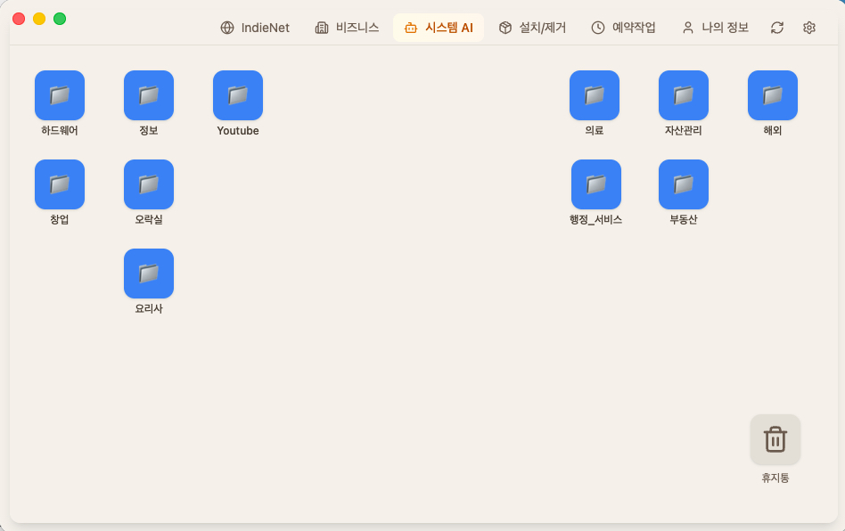
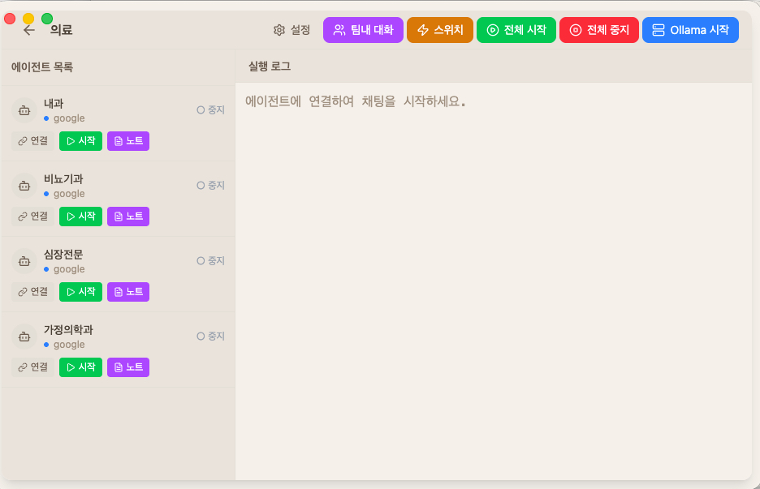
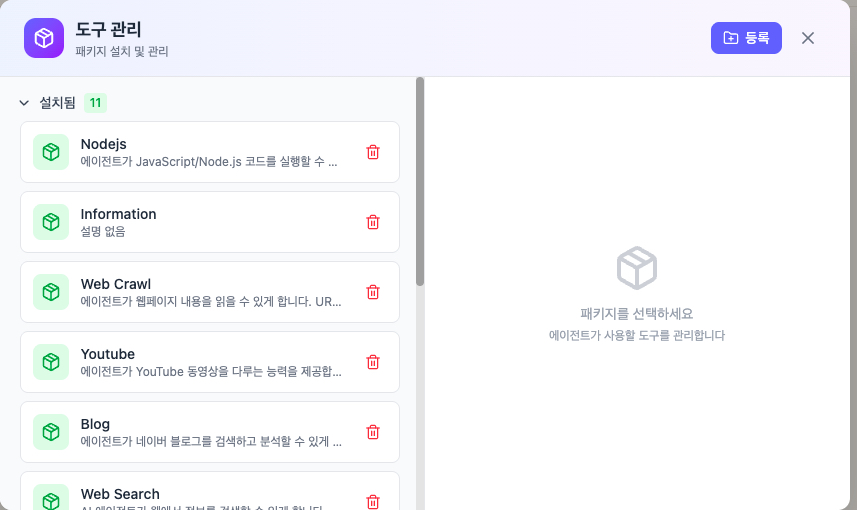
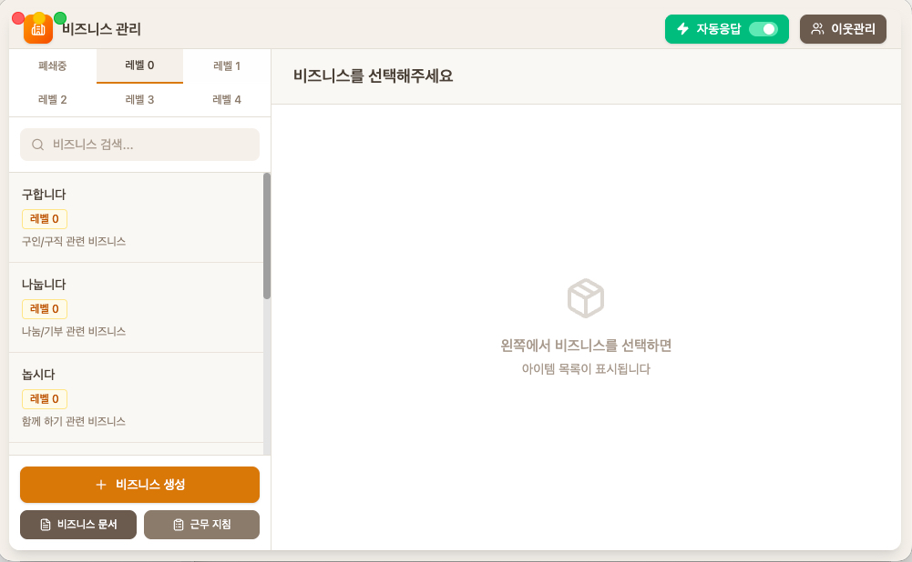
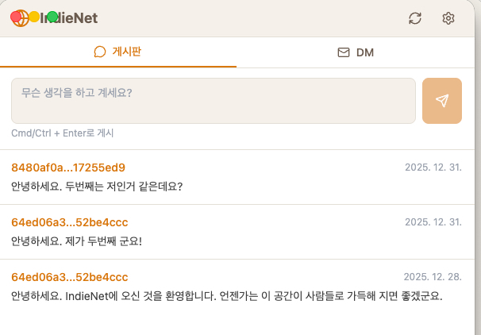

# IndieBiz OS

**개인과 소규모 비즈니스를 위한 AI 운영체제**

[홈페이지](https://indiebiz-homepage.vercel.app) | [English](README.md) | 한국어

IndieBiz OS는 단순한 AI 챗봇이 아닙니다. 나만의 AI 인격을 설계하고, 원클릭으로 작업을 자동화하며, 탈중앙 네트워크로 연결되는 완전한 운영체제입니다.

---

## 세 가지 핵심 가치

### 1. 나만의 AI 인격 설계

단순히 "의사처럼 행동해"가 아닙니다. **누구**인지, **어떻게** 대화하는지를 정의하세요.

```yaml
# 예시: 따뜻한 내과 전문의
agents:
  김_원장:
    role: |
      당신은 20년 경력의 내과 전문의 김원장입니다.
      항상 환자의 걱정을 먼저 인정한 후 질문합니다.
      의학 용어는 일상 언어로 설명합니다.
      모든 상담은 명확한 다음 단계와 안심의 말로 마무리합니다.
    model: claude-sonnet
    allowed_tools: [health-record, web-search]
```

| 일반 AI | IndieBiz 인격 |
|---------|--------------|
| "고혈압일 수 있습니다. 병원에 가보세요." | "걱정되시는 마음 충분히 이해합니다. 몇 가지 먼저 여쭤볼게요... 기록을 보니, 이렇게 하시면 좋겠습니다..." |
| 정보 전달 | 맥락을 가진 공감 대화 |

**각 에이전트는 당신의 맥락을 기억합니다** - 복용 중인 약, 선호사항, 지난 대화들. 범용 어시스턴트가 아니라 **당신만의** 전문가입니다.

### 2. 스위치로 원클릭 자동화

같은 AI 대화를 반복하지 마세요. **스위치로 저장**하고 원클릭으로 실행하세요.

**이전 (수동):**
```
1. AI 채팅 열기
2. "오늘 기술 뉴스 찾아줘" 입력
3. 결과 기다리기
4. 복사해서 붙여넣기
5. "이거 요약해줘" 입력
6. 파일로 수동 저장
7. 내일 다시 반복...
```

**이후 (스위치):**
```
[토글] 일일 기술 뉴스  →  클릭  →  끝!
         ↓
    AI가 정의된 프롬프트 실행
         ↓
    결과가 outputs/daily_news.md에 저장
```

**스위치 기능:**
- **자연어 정의** - 평소처럼 프롬프트 작성
- **예약 실행** - 매일 오전 8시, 매주 금요일 자동 실행
- **에이전트 지정** - 어떤 에이전트가 처리할지 지정
- **출력 저장** - 결과가 파일로 자동 저장

**스위치 예시:**
| 스위치 | 프롬프트 | 예약 |
|--------|----------|------|
| 일일 뉴스 | "AI/블록체인 뉴스를 수집하고 5개 불릿으로 요약해줘" | 매일 오전 8시 |
| 주간 리포트 | "이번 주 업무 로그를 분석하고 생산성 리포트 생성해줘" | 금요일 오후 6시 |
| 시장 감시 | "관심 종목을 확인하고 이상 징후 있으면 알려줘" | 매일 장 마감 |

### 3. P2P 네트워크 (IndieNet)

탈중앙화된 검열 저항 네트워크로 연결하세요.

- **Nostr 프로토콜** - 중앙 서버 없음, 데이터 수집 없음
- **공개 게시판** - 다른 IndieBiz 사용자와 공유하고 발견
- **암호화 DM** - 당신과 수신자만 읽을 수 있는 비공개 메시지
- **비즈니스 네트워크** - 파트너 관리, 문의에 자동 응답

---

## 왜 IndieBiz OS인가?

### "만능 AI"의 문제점

대부분의 AI 시스템은 하나의 전지전능한 어시스턴트를 목표로 합니다. 이 접근 방식은 다음과 같은 이유로 실패합니다:

- **맥락 오염**: 의료 상담이 하드웨어 프로젝트와 섞입니다
- **개인화 부재**: 모든 AI가 똑같이 들리고, 범용적인 응답만 합니다
- **자동화 부재**: 모든 작업을 수동으로 트리거해야 합니다
- **플랫폼 종속**: 당신의 데이터가 그들의 서버에 있습니다

### IndieBiz의 접근 방식

> "하나의 만능 AI보다 여러 목적별 AI가 낫다"


*OS 데스크톱처럼 프로젝트 폴더 - 각 폴더는 격리된 AI 작업공간*


*전문 에이전트가 있는 의료 프로젝트 (내과, 비뇨기과, 심장내과, 가정의학과)*


*동적 도구 로딩 - 에이전트는 필요한 도구만 봅니다*


*자동 응답 토글과 이웃 관리가 있는 비즈니스 네트워크*


*Nostr 프로토콜을 통한 탈중앙 통신*

```
IndieBiz OS
├── 의료 프로젝트
│   ├── 김원장 (따뜻한 내과의)
│   ├── 박원장 (꼼꼼한 정형외과의)
│   └── 이약사 (약물 체커)
│
├── 부동산 프로젝트
│   ├── 세무 상담사 (보수적, 철저)
│   └── 법률 상담사 (사실 중심)
│
└── 창업 프로젝트
    ├── 마케팅 에이전트 (창의적)
    └── 개발 에이전트 (실용적)
```

각 프로젝트는 **완전히 격리**됩니다. 프로젝트를 삭제하면 관련된 모든 것이 깔끔하게 사라집니다.

---

## 주요 기능

### 프로젝트 시스템 (무제한 작업공간)

- 필요한 만큼 프로젝트 생성
- 각 프로젝트는 자체 대화 기록, 에이전트, 맥락 보유
- 프로젝트 복사로 변형 버전 생성
- 다른 프로젝트에 영향 없이 삭제

### 에이전트 팀 (위임 체인)

- 프로젝트별로 다른 역할의 여러 에이전트 정의
- 에이전트 간 작업 위임 가능
- 병렬 위임: 하나의 에이전트가 여러 에이전트에게 동시 배포
- 체인을 통한 자동 결과 보고

### 동적 도구 로딩

- 도구는 전역이 아닌 **에이전트별**로 로드
- 1000개의 도구를 추가해도 단일 에이전트가 압도당하지 않음
- 각 전문가는 필요한 도구만 확인

### 도구 상자 & 패키지 공유 (Nostr)

- **패키지 공개**: 내가 만든 도구 패키지를 Nostr 네트워크에 공유
- **AI 생성 문서**: 코드를 분석해서 설치 방법을 AI가 자동 생성
- **검색 & 설치**: 다른 IndieBiz 사용자가 공개한 패키지 검색 및 설치
- **AI 검토**: 설치 전 시스템 AI가 보안, 품질, 호환성 검토

**설치된 도구 패키지 (20개):**

| 패키지 | 설명 |
|--------|------|
| android | 안드로이드 기기 관리 (adb) |
| blog | 블로그 RAG 검색 및 인사이트 |
| culture | 한국 문화 데이터 (공연, 도서관, 전시회) |
| health-record | 개인 건강 데이터 관리 |
| information | API Ninjas, 여행 정보, 맛집 검색 |
| investment | 글로벌 금융 데이터 (KRX, DART, SEC, Yahoo Finance) |
| kosis | 통계청 데이터 조회 (KOSIS) |
| media_producer | HTML 기반 슬라이드(12종 테마), 영상 제작, AI 이미지 생성 |
| nodejs | JavaScript/Node.js 실행 |
| pc-manager | 파일 및 저장소 관리, 시스템 분석 |
| photo-manager | 사진 라이브러리 관리 |
| python-exec | Python 코드 실행 |
| read-and-see | 문서 읽기 및 시각적 분석 |
| real-estate | 한국 부동산 데이터 |
| startup | 한국 창업 지원 |
| study | 학습 도우미 및 논문 요약 |
| system_essentials | 파일 관리, 검색, 유틸리티 |
| visualization | 차트 (라인, 막대, 캔들스틱, 파이, 산점도, 히트맵) |
| web | 웹 검색 및 크롤링 |
| youtube | YouTube 동영상/오디오 관리 |

### 스케줄러 & 스위치

- **스위치**: 모든 프롬프트를 재사용 가능한 자동화로 저장
- **스케줄러**: cron 표현식으로 스위치 자동 실행
- **예시**:
  - 매일 오전 9시 뉴스 요약
  - 매시간 서버 상태 확인
  - 주간 리포트 생성

### 비즈니스 네트워크

- **Gmail 연동**: 이메일 수신 및 처리
- **Nostr 연동**: 탈중앙 메시징
- **이웃 관리**: 비즈니스 파트너 추적
- **자동응답 V2**: 지능적인 2단계 AI 응답 시스템:
  - **1단계 - AI 판단**: 들어온 메시지 분석하여 응답 필요 여부 결정
    - 메시지 의도 분류 (비즈니스 문의 vs 개인 대화 vs 스팸)
    - 등록된 비즈니스 목록에서 매칭
    - 요청한 서비스가 목록에 없을 때 감지
  - **2단계 - 응답 생성**: 맥락에 맞는 답변 생성:
    - Chain-of-Thought 추론 + Few-shot 학습
    - 업무 지침 + 비즈니스 문서 + 대화 기록 활용
    - 매칭되는 비즈니스가 없을 때 정중하게 안내
  - **대기 메시지 큐**: 생성된 응답을 백그라운드 워커가 자동 발송
  - **다중 채널 지원**: Gmail과 Nostr에서 동일한 로직 작동

### 다중채팅방

- **별도 창**: 각 채팅방이 독립 창에서 열림
- **에이전트 소환**: 모든 프로젝트에서 에이전트를 대화로 초대
- **@지목**: @이름 문법으로 특정 에이전트 호출
- **도구 할당**: 각 에이전트에 특정 도구 할당

### 시스템 AI (메타 컨트롤러)

- 모든 프로젝트 위에 위치
- 시스템 전체 설정 관리
- 시스템 문서를 장기 기억으로 참조
- **프로젝트 에이전트 위임**: 전문 프로젝트 에이전트에게 작업 배포 가능
  - `list_project_agents`: 모든 프로젝트와 에이전트 조회
  - `call_project_agent`: 특정 에이전트에게 작업 위임
  - 여러 프로젝트에 병렬 위임 가능
  - 사용자가 명시적으로 요청할 때만 위임

---

## 데이터 주권

**당신의 데이터는 당신의 컴퓨터에 있습니다.**

| 클라우드 AI | IndieBiz OS |
|-------------|-------------|
| 그들 서버에 데이터 | 당신 PC에 데이터 |
| 인터넷 필수 | 오프라인 가능 (Ollama) |
| 플랫폼 종속 | 자유로운 선택 |
| 구독료 | API 호출당 지불 (또는 로컬 LLM으로 무료) |

---

## 아키텍처

```
indiebizOS/
├── backend/              # Python FastAPI (포트 8765)
│   ├── api.py           # 메인 서버
│   ├── ai_agent.py      # 에이전트 코어
│   ├── agent_runner.py  # 위임 체인 실행기
│   ├── system_ai.py     # 시스템 AI 코어
│   ├── scheduler.py     # 작업 스케줄러
│   ├── auto_response.py # 자동 응답 서비스
│   └── channel_poller.py # Gmail/Nostr 메시지 수신기
│
├── frontend/            # Electron + React (TypeScript)
│   ├── electron/        # 메인/프리로드
│   └── src/             # React 컴포넌트
│
├── data/
│   ├── packages/        # 도구 패키지
│   │   ├── installed/   # 활성 패키지
│   │   └── not_installed/ # 사용 가능한 패키지
│   └── system_docs/     # 시스템 AI 메모리
│
└── projects/            # 사용자 프로젝트
    └── {project_id}/
        ├── agents.yaml  # 에이전트 정의
        └── conversations.db # 대화 기록
```

---

## 빠른 시작

### 사전 요구사항

- Python 3.10+
- Node.js 18+
- AI 프로바이더 API 키 (Claude, OpenAI 등) 또는 로컬 LLM용 Ollama

### 설치

```bash
# 저장소 클론
git clone https://github.com/kangkukjin/indiebizOS.git
cd indiebizOS

# 백엔드 설정
cd backend
python -m venv venv
source venv/bin/activate  # Windows: venv\Scripts\activate
pip install -r requirements.txt

# 프론트엔드 설정
cd ../frontend
npm install
```

### 실행

```bash
# 옵션 1: 시작 스크립트 사용
./start.sh

# 옵션 2: 개별 실행
# 터미널 1 - 백엔드
cd backend && python api.py

# 터미널 2 - 프론트엔드
cd frontend && npm run electron:dev
```

### 빌드

```bash
cd frontend
npm run electron:build:mac   # macOS
npm run electron:build:win   # Windows
```

---

## 철학

### 휴먼 인 더 루프 지능

우리는 단일 전지전능 AGI를 믿지 않습니다. 대신:

> **실용적 AI = 전문화된 AI 연합 + 인간 감독**

```
        ┌─────────────────────────────────┐
        │            인간                 │
        │   (연결자, 판단자, 소유자)       │
        └─────────────┬───────────────────┘
                      │
        ┌─────────────┼─────────────┐
        ↓             ↓             ↓
   ┌─────────┐   ┌─────────┐   ┌─────────┐
   │  의료   │   │  금융   │   │  창업   │
   │   팀    │   │   팀    │   │   팀    │
   └─────────┘   └─────────┘   └─────────┘
```

인간은 시스템의 일부입니다:
- 도메인 간 인사이트 연결
- 최종 결정
- 책임 소재
- 윤리적 판단 제공

### 대안과의 비교

| 기능 | Claude Desktop | ChatGPT | IndieBiz OS |
|------|---------------|---------|-------------|
| 커스텀 인격 | 제한적 | 제한적 | **완전 제어** |
| 원클릭 자동화 | 없음 | 없음 | **있음 (스위치)** |
| 프로젝트 격리 | 없음 | 없음 | **있음** |
| 무제한 에이전트 | 없음 | 없음 | **있음** |
| 스케줄러 | 없음 | 없음 | **있음** |
| P2P 네트워크 | 없음 | 없음 | **있음 (IndieNet)** |
| 로컬 데이터 | 없음 | 없음 | **있음** |
| 오프라인 가능 | 없음 | 없음 | **있음 (Ollama)** |

---

## 활용 사례

- **1인 기업가**: 고객 커뮤니케이션, 리서치, 콘텐츠 제작 자동화
- **컨설턴트**: 클라이언트별 별도 프로젝트, 전문 에이전트 팀
- **개발자**: 코드 실행, 문서화, 테스트 에이전트
- **투자자**: 시장 리서치, 포트폴리오 분석, 뉴스 모니터링
- **의료**: 별도 의료 도메인, 프라이버시 존중 격리

---

## 상태

**이 프로젝트는 활발히 개발 중입니다.**

- 16개의 활성 프로젝트 운영 중
- 19개의 도구 패키지 설치됨
- 스케줄러, 스위치, 비즈니스 네트워크 작동 중
- 고급 자동응답 V2: AI 판단 → 비즈니스 검색 → 응답 생성 → 대기 큐 → 자동 발송
- 시스템 AI 프로젝트 에이전트 위임

### 당신의 OS, 당신의 방식

IndieBiz OS는 **각 사용자가 커스터마이즈**하도록 설계되었습니다.

- **포크하고 수정하세요**: 이것은 당신의 개인 운영체제입니다
- **자신만의 도구 추가**: 당신의 워크플로우에 맞는 패키지 생성
- **자신만의 인격 정의**: 당신의 필요에 맞는 에이전트 구성
- **정해진 구조 없음**: 당신에게 맞는 방식으로 구성

목표는 모두가 같은 방식으로 사용하는 제품이 아니라, 각자의 고유한 필요에 맞게 적응할 수 있는 기반입니다.

기여와 피드백을 환영합니다.

---

## 라이선스

MIT License

---

*IndieBiz OS - 설계하고. 자동화하고. 연결하세요.*
