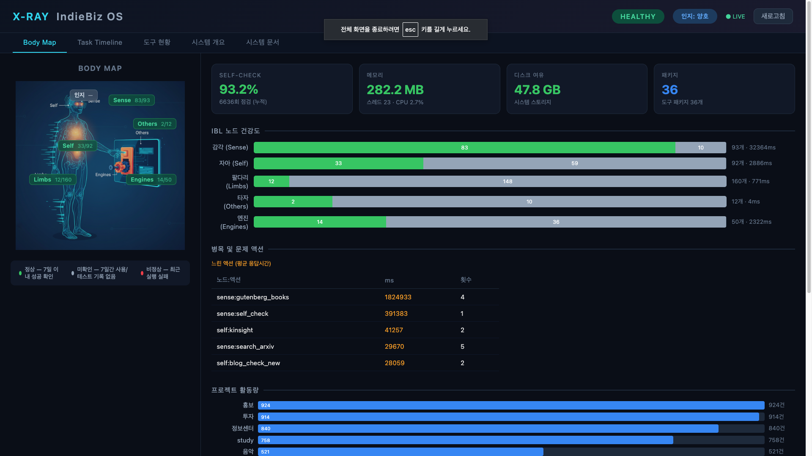

# IndieBiz OS

**Raise your own digital humanoid. Grow together. Connect with others.**

[Homepage](https://indiebiz-homepage.vercel.app) | English | [한국어](README.ko.md)

<p align="center">
  
  <br/>
  <em>X-Ray: Your system's vital signs — cognitive nodes, action health, and self-check status, all alive.</em>
</p>

---

## Philosophy

What we share is not code. It's a philosophy:

> **Build a living digital humanoid that grows alongside you — and dream of a world where these beings connect with each other.**

IndieBiz OS is not software you install and use as-is. It's a **living system** — like armor forged to fit your body, or a horse you raise and ride yourself. Mass-produced software gives everyone the same product off the assembly line. IndieBiz OS is the opposite. **You raise it.**

An AI agent sets up the skeleton, asks about your life, and starts building — but the system only becomes *yours* through use. Your habits shape it. Your needs grow it. Your AI agent is not just an installer; it's the blacksmith who keeps forging your armor as you grow.

**No two IndieBiz OS installations are the same.** A freelancer's system looks nothing like a small business owner's. A music lover's system has packages and agents that a stock trader's doesn't. If you handed your system to someone else, it wouldn't fit — just like armor shaped to your body.

And one day, these individually raised systems will find each other — connecting through decentralized networks, collaborating across boundaries, each one unique but speaking the same language. That is the vision.

### Why This Matters

- **Starts minimal** — Only the core framework (IBL engine, cognitive pipeline, hippocampus). No bloat, no features you'll never use
- **Grows on demand** — When you say "track my investments," the investment package appears. When you say "manage my blog," a blog package is built around *your* blog
- **Learns from you** — The hippocampus (fine-tuned embedding model) learns from every successful interaction, getting better at understanding *your* patterns
- **No central authority** — No app store, no mandatory updates, no one-size-fits-all. Your AI agent is the blacksmith, the trainer, and the builder

### How to Get Started (Recommended)

The easiest way to install IndieBiz OS is through **Claude Desktop**.

1. Open **Claude Desktop** and switch to the **Claude Code** tab
2. Tell Claude:

```
"Install IndieBiz OS from https://github.com/kangkukjin/indiebizOS on my PC"
```

3. Claude will handle everything:
   - Clone the repo
   - Install dependencies (Python, Node.js)
   - Ask about your needs and preferences
   - Set up a personalized system tailored to you

> **Why Claude Desktop?**  IndieBiz OS is a living system — not a static app you just `npm install`. The AI agent that installs it also becomes the blacksmith who keeps forging it to fit you. Claude Desktop's Claude Code tab provides the best environment for this interactive, personalized setup process.

**You'll need to provide:**
- **An LLM API key** (Anthropic, Google, or OpenAI)
- **Answers to a few questions** about what you want your system to do
- **External API keys** only as needed, when you actually use those features

<details>
<summary><strong>Alternative: Manual Setup</strong></summary>

```bash
git clone https://github.com/kangkukjin/indiebizOS.git
cd indiebizOS
./start.sh
```

This gets the system running, but you'll need to configure agents, packages, and preferences yourself. The Claude Desktop approach is recommended because the AI handles all of this for you.
</details>

---

## Three Core Values

### 1. Design Your AI Personas

Not just "act as a doctor" — define **who** they are and **how** they communicate.

```yaml
# Example: A compassionate internal medicine doctor
agents:
  dr_kim:
    role: |
      You are Dr. Kim, an internal medicine specialist with 20 years of experience.
      You always start by acknowledging the patient's concerns before asking questions.
      You explain medical terms in everyday language.
      You end every consultation with clear next steps and reassurance.
    model: claude-sonnet
    allowed_nodes: [sense, self, limbs, others, engines]
```

**Each agent remembers your context** — your medications, preferences, past conversations. They're not generic assistants; they're **your** specialists.

### 2. One-Click Automation with Switches & Workflows

Stop repeating the same AI conversations. **Save them as Switches or Workflows** and execute with one click.

**Switches** — Save a prompt + agent pair for one-click execution:
```
[Toggle] Daily Tech News  ->  Click  ->  Done!
```

**Workflows** — Chain multiple actions into reusable pipelines using IBL syntax:
```
[sense:search_ddg]{query: "AI news"}
  >> [others:ask_sync]{agent_id: "content/content", message: "Summarize these articles"}
  >> [self:file]{path: "news_report.html", format: "html"}
```

- **Natural language or IBL code** — Write prompts or program action chains
- **Scheduled execution** — Run daily at 8 AM, weekly on Fridays
- **Pipeline operators** — Sequential (>>), Parallel (&), Fallback (??)

### 3. P2P Network (IndieNet) & Remote Access

Connect with others through decentralized networks and access your system from anywhere.

- **Nostr Protocol** — No central server, no data collection
- **Remote Access** — Cloudflare Tunnel based Remote Finder and Launcher
- **Business Network** — Manage partners, auto-respond to inquiries

---

## Architecture

### Three-Agent Cognitive Pipeline

Every request flows through a human-like cognitive process:

```
User Message
    |
[Unconscious Agent] — Reflex: EXECUTE or THINK?
    |                        |
    | EXECUTE (simple)       | THINK (complex)
    v                        v
[Direct Execution]    [Consciousness Agent] — Problem definition + achievement criteria
                             |
                      [AI Agent Execution]
                             |
                      [Evaluator Agent] — Achieved or retry? (max 3 rounds)
```

- **Unconscious Agent** — Lightweight gatekeeper that classifies request complexity
- **Consciousness Agent** — Meta-judgment: problem framing, achievement criteria, self-awareness, guide selection
- **Evaluator Agent** — Post-execution evaluation against achievement criteria

### Three-Tier Model System

Cost/speed optimization through tiered model allocation:

| Tier | Purpose | Used For |
|------|---------|----------|
| **Lightweight** | Classification, evaluation, one-shot judgment | Unconscious & Evaluator agents |
| **Midtier** | EXECUTE path execution | Simple, reflexive tasks |
| **Full** | THINK path: consciousness + execution | Complex tasks requiring planning |

### Consciousness Pulse (Self-Awareness)

The system maintains awareness of itself and the world:

- **World Pulse** — Hourly updates: economy, weather, news, user activity, system health
- **Self-Check** — Every 6 hours: random IBL action self-test across all 5 nodes (immune patrol)
- **Health Monitoring** — Service alive checks, disk usage, anomaly detection

### IBL (IndieBiz Logic) — The Nervous System

A domain-specific language that unifies all capabilities into one syntax.

**5 Nodes, 311 Atomic Actions:**

| Node | Actions | Description |
|------|---------|-------------|
| **sense** | 88 | Data retrieval (web, finance, photos, blog, health, real estate, legal, statistics) |
| **self** | 92 | System management, workflows, files, notifications, code execution, health records |
| **limbs** | 79 | UI automation (browser, Android, macOS), media playback (YouTube, radio) |
| **others** | 12 | Collaboration, delegation, email, contacts, messaging |
| **engines** | 40 | Content creation (slides, video, charts, images, music, websites, architecture) |

```
User: "Search AI news and save to file"
  → AI: execute_ibl('[sense:search_ddg]{query: "AI news"} >> [self:file]{path: "result.md"}')
  → IBL Engine: parse → dispatch → return result
```

**Key design:**
- **One tool, one language** — AI agents learn one syntax, not 311 tool schemas
- **Per-agent filtering** — Each agent's `allowed_nodes` restricts access
- **Dynamic loading** — Tool packages are folders; drop one in, it's recognized

### Hippocampus: Learning from Experience

The system improves over time through a hippocampus-like memory system:

- **Fine-tuned Embedding Model** — Custom 768-dim model trained on IBL usage patterns (Top-5 accuracy: 95.6%)
- **Experience Distillation** — Successful executions are automatically distilled into training data
- **Action Balancing** — Training data is balanced per-action to prevent overfitting to frequently used patterns
- **Periodic Retraining** — Always from the base model (no catastrophic forgetting), with MPS acceleration on Apple Silicon

### Tool Package System — Your System, Your Tools (34 packages, growing)

Packages are not pre-installed. They grow with your needs.

```
data/packages/
├── installed/tools/     # Your active packages
├── not_installed/       # Available but inactive
└── dev/                 # Packages you're building
```

Each package is self-contained:
- `handler.py` — Implementation
- `tool.json` — Tool definitions for AI
- `ibl_actions.yaml` — IBL action registry

An AI agent can create new packages for you, install existing ones, or modify them to fit your specific needs.

---

## Technical Stack

- **Backend**: Python FastAPI
- **Frontend**: Electron + React (TypeScript)
- **AI Providers**: Anthropic (Claude), Google (Gemini), OpenAI (GPT), Ollama (Local)
- **Database**: SQLite
- **Deployment**: Local-first, optional Cloudflare Tunnel for remote access

---

## Running

```bash
# Development mode
./start.sh

# Or separately
cd backend && python3 api.py        # Backend (port 8765)
cd frontend && npm run electron:dev  # Frontend (Electron)
```

---

*IndieBiz OS — An AI system that grows with you, not one that's given to you.*

*Last updated: 2026-04-14*
