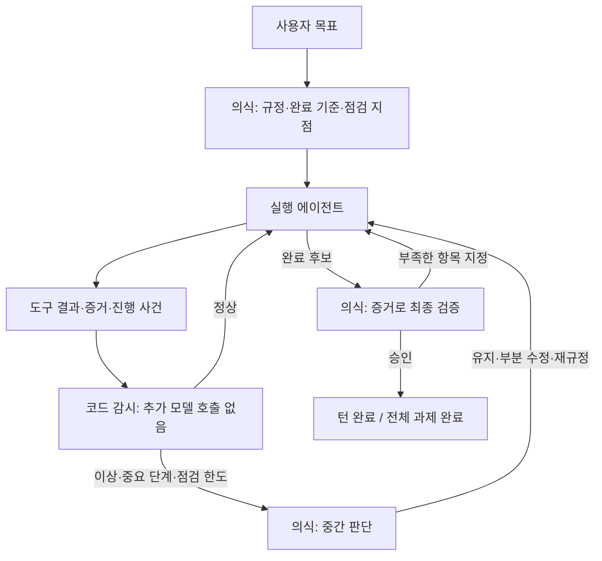

# 의식 에이전트의 계획·감독·승인 통합 설계

작성: 2026-09-10. 상태: **검토 제안, 미구현**. 조사 기준 코드: `f629f88f`.
정본 저장소의 코드와 로컬 실행 기록을 읽어 작성했다. 이 문서 작성으로 런타임 정책을 바꾸지 않는다.

## 1. 판단

의식 에이전트가 처음 문제를 규정하고, 진행 중 방향을 교정하며, 마지막에 완료를 승인하는 구조는 실용적이다.
효율성의 조건은 **관측은 코드가 계속하고, 의미 판단은 의식이 선택된 시점에 수행하는 것**이다.
의식과 실행의 역할은 유지하면서 계획·재규정·평가의 책임과 과제 상태를 한 감독자에게 모은다.
상시 관측은 모델을 상시 추론시키는 뜻이 아니다. 지속되는 것은 과제 상태와 사건 구독이다.

권고안은 THINK/REPAIR와 장기 과제부터 도입하는 이벤트 기반 감독이다.
짧고 정상적인 EXECUTE/Reflex에도 시작·중간·종료 의식 호출을 일괄 부과하면 빠른 경로의 목적을 잃는다.
이 경로는 코드 감시만 유지하고, 이상 신호나 길어진 탐색이 나타날 때 감독 대상으로 승격한다.

## 2. 현재 갖춘 기반과 실제 빈틈

| 구성 | 확인한 동작 | 통합 시 처리 |
|---|---|---|
| `backend/cognition/consciousness_agent.py` | 문제 규정·전제·달성 기준을 원샷으로 생성한다. 지속 관찰 세션은 아니다. | 초기 계획 기능을 유지하고 review/verify 입력·출력 계약을 추가한다. |
| `backend/cognition/reframe.py` | 실행자가 전제 파기를 보고하거나, 최종 평가의 치명 실패/반복 미달로 재호출한다. 턴당 재규정 상한 2회. | 명시적 재규정 요청과 자동 감독 신호를 같은 결정 경로로 합친다. |
| `backend/cognition/agent_pipeline.py` | 도구 시작·결과를 모으며 실행 뒤 GoalEval 또는 조건부 SelfReflect를 수행한다. | 감독 생명주기와 종료 승인 통로를 소유한다. |
| `backend/base/repeat_guard.py` | 같은 인자의 연속 호출 3/5/8회에 조언한다. 다른 호출이면 카운트가 초기화된다. | 원리와 어댑터를 재사용하되, 결과·진행과 짧은 순환도 고려한다. 기존 조언과 중복 호출하지 않는다. |
| `backend/cognition/cognitive_trace.py` | 오류·쓰기·일부 복잡성에 따라 종료 후 반성을 켠다. 정상 읽기 궤적은 길어도 제외한다. | 읽기 탐색도 의미 없이 반복할 수 있으므로 감독에서는 진행 정체를 별도로 본다. |
| `backend/base/steer_inbox.py` | 다음 도구 결과에 사용자 지시를 붙인다. 마지막 도구 뒤에는 전달할 수 없고 수신 보장이 없다. | 전달 패턴만 재사용한다. 감독 지시를 현재의 `[사용자 조향]`으로 보내면 권한 출처를 위조하므로 금지한다. |
| `backend/cognition/pursuit_bind.py`, `backend/datastore/pursuit_ledger.py` | 규정·전제·진행·사건·버전을 보존하며 턴별 관측을 저장한다. | 감독 상태의 영속 기반으로 사용한다. 유사한 두 번째 과제 DB를 만들지 않는다. |
| `backend/cognition/pursuit_tools.py` | 실행자의 `done` 요청으로 전체 과제를 완료 처리할 수 있다. | 감독 대상 과제에서는 완료 심사 요청으로 해석하고, 감독 승인 후에만 종료한다. |
| `backend/cognition/cognitive_eval.py` | 증거·산출물·이미지를 평가한다. 빈 응답·예외는 통과, 판정 토큰이 없어도 통과할 수 있다. | 증거 수집은 보존한다. 승인 여부는 APPROVED/REWORK/UNKNOWN으로 구분한다. |

핵심 빈틈은 실행자가 스스로 잘못을 인지하지 못하는 동안 중간 의미 점검이 없다는 점이다.
또한 현재 역할이 여러 개라는 사실보다, 미검증과 성공의 구별 및 완료 결정권이 중요한 문제다.
코드만으로 자연어 목표에서 벗어난 모든 행동을 판별할 수는 없으므로, 오류 없는 표류를 위한 드문 점검도 필요하다.

## 3. 실제 기록으로 본 비용 출발점

`data/world_pulse.db`를 SQLite `mode=ro`로 조회했다. 조건은
`episode_summary.started_at >= '2026-09-07'`, 최신 200건 상한이며 실제 해당 요약은 34건이었다.
기록 시각 범위는 2026-09-07T00:16:45.879055~2026-09-10T08:53:07.214251이다.
사용자 메시지·도구 결과 원문은 이 문서에 옮기지 않았다.

| 지표 | 표본 | 중앙값 | 90백분위 근삿값 |
|---|---:|---:|---:|
| 의식 모델 호출 지연 | `steps`의 usage/role=consciousness 24건 | 42.35초 | 63.73초 |
| 최종 목표 평가 지연 | 해당 에피소드의 validation.completed/validator=goal_eval 22건 | 5.322초 | 22.147초 |
| 의식 소요시간이 기록된 에피소드의 전체 시간 | 25건 | 806.163초 | — |

의식 usage의 기록상 입력 중앙값은 약 101,307토큰, 출력은 2,991토큰이다.
이는 현재 호출 배관의 기록이며 새 감독 프롬프트에 본질적으로 필요한 토큰량은 아니다.
캐시·프로바이더·모델 혼합 및 모델 식별 누락이 있으므로 이를 과금액이나 새 모델의 속도로 환산하지 않았다.
90백분위는 정렬 배열의 `floor((n-1)*0.9)` 위치를 사용했다. 작은 최근 표본이므로 일반 성능을 보장하지 않는다.
`oneshot:evaluate` 전체에는 다른 평가 용도도 섞일 수 있어 최종 평가 지연은 실제 validation 사건으로 한정했다.
22건 중 미달 판정은 1건, 코드의 오류/스킵 통과 문구가 관측된 건은 0건이다.
이 합격 기록 자체를 실제 품질의 정답으로 사용해서는 안 된다.

계산 예시: 현 의식 호출과 같은 42초짜리 호출을 중간 2회+종료 1회 추가하고 기존 5초 평가를 없애면
약 `3×42−5=121초`가 늘어난다. 초기 의식 호출은 양쪽에 공통이라 제외했다.
25스텝 모두에서 한 번씩 부르면 약 17.5분이 더 든다.
서로 다른 표본의 중앙값을 쓴 규모 비교일 뿐 실제 턴별 증가량 예측은 아니다.

따라서 첫 최적화 대상은 중간 점검을 현재의 초기 의식 전체 호출로 구현하지 않는 것이다.
성능 개선의 실증은 새 review/verify 입력으로 다시 해야 한다.

## 4. 제안 구조

의식은 세 모드로 동작한다. 같은 책임자·과제 상태를 사용하되 입력 문맥은 용도에 맞게 분리한다.

- **plan**: 문제 규정, 사용자 목표와 제약, 검증할 전제, 산출물별 완료 조건, 2~4개의 의미 있는 이정표를 만든다.
- **review**: 마지막 점검 뒤 무엇이 달라졌는지와 현재 증거를 보고 CONTINUE/ADJUST/REFRAME/WAIT를 결정한다.
- **verify**: 원래 요청과 현재 결과를 직접 대조하여 APPROVED/REWORK/UNKNOWN을 결정한다.

review와 verify는 별도 평가 에이전트의 자율 루프를 갖지 않는다.
단일 감독 상태 기계가 호출·판정·진행 예산을 소유한다. 기존 평가기는 증거 수집기와 검증 루브릭으로 흡수한다.
첫 실험에서는 세 모드에 같은 의식 모델을 써 책임 통합 자체를 검증한다.
그 후 쉬운 verify를 기존 evaluate 기어로 처리하는 비용 최적화를 비교할 수 있으나, 별도 정책 소유자는 만들지 않는다.

## 5. 언제 의식을 깨우는가

아래 숫자는 구현 기본값 후보이며 **측정된 최적값이 아니다**. 기존 반복 가드와 오류 의미 단일 소스를 재사용한다.

| 신호 | 초기 정책 후보 | 오탐 억제 |
|---|---|---|
| 실행자가 전제 파기를 명시 | 즉시 review/reframe | 사소한 재시도는 로컬 처리 |
| 같은 실패 또는 같은 무효 결과 반복 | 정규화한 작업 단위로 3회면 review | 정상 페이지 이동·예약된 재시도·비동기 작업 폴링을 구분 |
| A→B→A 같은 짧은 순환 | 최근 호출 창에서 같은 대상·결과 반복을 감지 | 단순 도구 이름 반복으로 판단하지 않음 |
| 의미 있는 증거의 증가가 없음 | 안전한 경계 8회 또는 활성 실행 120초 동안 지속되면 점검 후보 | 파일 쓰기 횟수를 진척으로 간주하지 않음. 새 근거·가설 배제도 진척 |
| 계획에서 정한 이정표 | 다음 큰 작업으로 넘어가기 전에 점검 | 모든 하위 도구 호출을 이정표로 만들지 않음 |
| 고비용·되돌리기 어려운 단계 진입 | 계획에서 정한 경계에서 동기 점검 | 파일 쓰기 하나마다 호출하지 않고 작업 묶음·현재 권한 범위로 판단 |
| 실행자가 완료를 제안 | 해당 모드의 verify 필수 | 바로 직전 같은 버전·같은 증거를 검증했다면 중복 호출 생략 가능 |

진척 관측은 하네스가 기록한 도구 호출·결과·산출물 변화에서 시작한다. 실행자에게 별도 진행 보고를 요구하지 않는다.
구조적으로 판정 가능한 것은 코드로 계산하고, 의미가 모호하면 “정체 확정” 대신 “점검 필요”로 다룬다.
새 검색 결과의 해시가 바뀌었다는 이유만으로 목표에 가까워졌다고 단정하지 않는다.
의식이 기존 목표·계획과 실제 실행 사건을 대조해 이정표와 진행을 판단한다.
실행자의 자발적인 reframe 요청은 추가 신호로 받을 수 있지만, 감독이 이를 기다리거나 의존하지 않는다.
실행자에게 정기 반성문을 만들게 하거나 매 사건마다 별도 요약 LLM을 돌리지 않는다.

긴 작업의 오류 없는 표류를 잡기 위해, 진척 신호가 계속 나와도 마지막 의미 점검 뒤 최대 간격을 둔다.
예를 들어 활성 실행 3~5분이면 다음 안전 경계에서 한 번 검토한다. 단순 조회는 제외한다.
120초 정체 신호와 이 최대 간격은 같은 점검으로 합쳐 중복하지 않는다.
도구 하나가 5분 걸리면 경과 시간만으로 같은 도구를 재시작하지 않는다.
그 도구의 진행 이벤트·예상 시간·취소 가능성을 확인하고, 다음 실행 경계에서 조치한다.

## 6. 무엇을 보여주고 어떻게 개입하는가

중간 review 입력은 하네스가 실행 로그에서 구성한다. 실행자가 보고서를 작성해 전달하는 절차는 없다.

1. 원래 사용자 목표·제약, 현재 규정 버전, 이번 단계의 달성 기준.
2. 직전 의식 판단과 기계 검증에서 얻은 충족/미충족/미확인 기준표, 근거 사건 ID. 새 결과의 의미는 의식이 판단한다.
3. 마지막 점검 뒤의 호출·결과 변화, 반복 실패와 모순의 발췌.
4. 새 산출물 참조, 실행 중인 호출이나 이미 요청된 다음 호출, 소비한 예산. 아직 결정되지 않은 다음 행동은 미확인으로 둔다.

현재 `pursuit_bind.observe`도 tool_start/tool_result를 직접 관측한다. 이를 감독의 기본 입력으로 연결한다.
관측 사건은 턴·호출 ID와 순서로 묶고, 의식이 마지막으로 검토한 사건 번호를 저장한다.
다음 review에서는 그 이후의 변화와 유지해야 할 목표·증거 인덱스를 제공한다.
실행 오류·절단 표시·실패한 검증을 보존하고, 요약에서 빠진 부분은 사건 ID로 원문에 다시 접근할 수 있게 한다.
여러 작업의 산문 로그를 섞어 읽거나 매번 전체 로그를 다시 주입하지 않는다.
별도 보고를 없애도 로그를 모델이 읽고 판단하는 비용은 남으므로, 이벤트 기록 빈도와 모델 호출 빈도는 따로 제어한다.
로그 밖의 동작이나 보존되지 않은 결과는 추적할 수 없다. 부족한 관측은 실행자의 정기 보고 대신 해당 도구 경계의 계측으로 보완한다.

첫 목표 예산은 review 입력 전체 3,000~6,000토큰, 출력 150~400토큰 정도로 둔다.
시스템 프롬프트까지 포함해 측정하며, 이 수치를 못 맞추면 생략한 증거 참조와 절단 표시를 남긴다.
판정에 필요한 증거가 빠졌으면 제한된 읽기 전용 증거 조회로 보강한다.
최종 verify는 코드 diff·테스트 결과·보고서 본문·렌더 이미지 등 실제 산출물이 필요하므로 더 큰 별도 예산을 인정한다.
짧은 실행자 요약만 보고 승인하면 기존의 맹점을 반복한다.

감독 출력은 자유로운 장문 조언 대신 다음 행동을 바꾸는 작은 계약으로 한다.
예: `ADJUST: 자료 수집은 완료. 원문이 잘린 2건만 다시 읽고 비교표를 수정. 나머지 8건은 재수집하지 않음.`
기존에 성공한 작업을 보존하고, 실패한 기준에 필요한 행동만 다시 연다.
CONTINUE면 실행자에게 불필요한 반성 대화를 추가하지 않고 내부 기록만 남긴다.

MVP는 **안전한 실행 경계에서 잠깐 멈추고 판단한 뒤 같은 세션을 이어가는 방식**이 낫다.
백그라운드 감독의 지연된 지시를 계속 실행 중인 작업에 끼워 넣는 경쟁 상태를 먼저 만들 필요가 없다.
후속으로 저위험 읽기 작업에 한해 비동기 review를 허용할 수 있다.
비동기 결과는 `task_id + framing_version + evidence_seq + directive_id`로 유효성을 확인한다.
사이에 사용자 정정·새 증거·새 규정이 생기면 낡은 지시를 폐기하거나 다시 판단한다.
사용자 지시는 감독 지시보다 우선한다. 전달·적용·폐기 상태를 남기며, 큐에 넣은 것을 개입 성공으로 세지 않는다.

프로바이더 스트림을 소비하는 바깥 루프를 멈추는 것만으로 자식 프로세스의 다음 도구 실행이 멈추지는 않는다.
직결 provider와 Claude Code/MCP 각각에서 실제 다음 행동 전에 멈출 수 있는 훅이 필요하다.
도구 결과에 지시를 붙이는 통로와 실행 전 차단 통로를 구분해야 한다.
IBL 한 문장 안의 다단계·반복, 네이티브 CLI 도구, 장시간 원격 도구도 관측/중단 범위를 검증한다.
관측 이벤트가 없는 내부 동작은 감독이 실시간으로 본다고 표현하지 않는다.
이미 실행 중인 부작용을 뒤늦은 지시가 되돌릴 수는 없다.

## 7. 완료와 재규정의 권한

- 실행 루프의 정상 종료·최종 응답·done 요청을 **완료 후보 사건**으로 포착한다. 별도 완료 보고는 요구하지 않는다. 감독이 근거와 결과 버전에 결부된 승인 사건을 기록한 뒤 완료된다.
- 이번 턴의 achievement_criteria와 전체 과제의 goal_criteria는 분리한다. 턴 합격으로 전체 과제를 닫지 않는다.
- 사용자 원문·명시 제약은 보존한다. 의식이 자신이 쓴 계획을 고칠 수 있어도 목표를 낮춰 합격시키면 안 된다.
- 기준 수정에는 이전/이후·근거·사용자 요청과의 관계를 남긴다. 범위 축소가 필요한 경우 승인 대신 질문/보류를 선택한다.
- 수리 등 실행 권한은 원래 승인 범위에 한정한다. 감독의 작업 완료 승인은 사용자의 외부 행동 권한을 대신하지 않는다.
- 같은 모델이 계획과 평가를 하므로 자기 계획에 대한 확증 편향이 남는다. verify에는 원래 요청·증거·루브릭을 우선 제공하고, 앞선 자기 합격 판정을 답안처럼 주지 않는다.
- 모델 응답 없음·JSON 오류·증거 부족은 UNKNOWN이다. 짧고 제한된 재시도 후에도 확인하지 못하면 미검증 상태로 보고한다.
- 사용자 수동 완료 표면은 사용자의 판정으로 별도 출처를 보존한다. 감독 검증 성공으로 기록하지 않는다.
- 승인 전 산출물은 미리 보여줄 수 있지만, 최종 완료 사건과 성공 경험 증류는 승인 상태와 정합해야 한다.

현재 GoalEval의 오류 통과는 실제로 발생하지 않은 턴도 많다. 위 변경은 과거 실패를 단정하는 것이 아니라
“의식이 승인한다”라는 새 계약에서 필수적인 의미 변경이다.

## 8. 비용과 루프 상한

중간 review와 재규정·재시도·기존 SelfReflect를 동시에 별도 예산으로 돌리면 통합 목적을 잃는다.
감독 대상 턴에서는 하나의 예산을 공유하고 최종 verify 비용을 먼저 남겨 둔다.
초기 후보는 선택적 중간 review 최대 2~3회, 전체 재규정 최대 2회, 검증 후 보완 최대 2회다.
장기 과제는 이정표별 실행 구간과 전체 과제의 누적 예산을 함께 관리한다.
동일 원인·동일 증거의 신호는 합치고, 새 정보 없이 재계획만 반복하면 사용자에게 미완 사유를 반환한다.
예산 소진 시 선택적 검토는 줄일 수 있어도 필수 검증을 자동 합격시키거나 안전 경계를 통과시키지 않는다.

비교식은 다음처럼 잡는다.

`순추가비용 = 중간감독 + (새 최종검증 - 기존 평가) + 전달·상태관리 - 없어진 재규정·반성·재작업`

토큰 수, 과금액, 사용자 대기 시간은 별도로 측정한다.
비동기로 시간을 가릴 수 있어도 모델 비용은 사라지지 않는다. 캐시도 전체 이력을 매번 읽는 비용을 없애지는 않는다.
캐시와 출력·추론 토큰을 구별하며, 서로 겹치는 계수는 두 번 합하지 않는다.
감독 도입의 운영 목표 후보는 정상 복잡 작업의 과금 증가 10~15% 이내, 짧은 조회의 추가 호출 0회다.
지금의 42초 호출을 재사용하면 이 목표를 못 맞출 수 있으므로 축약 review의 실측을 선행한다.

손익분기 예시: 감독 추가비용을 같은 단위로 1, 성공적으로 피한 재작업 비용을 10이라 두면,
오개입 비용을 제외해도 대상 작업의 10% 이상에서 그 재작업을 막아야 비용상 이득이다.
이는 예시다. 실제로 얼마나 자주 실패를 막는지는 현재 기록만으로 알 수 없다.
성과 기준은 단순 호출 감소보다 **사용자가 인정한 완료 1건당 총비용·시간**이다.

## 9. 구현 순서와 판정 실험

1. **관측과 기준선부터**: 현재 코드의 반복·정체·이정표 신호를 과거 궤적에 재생한다.
   사용자에게 지적받은 실패와 정상 긴 탐색을 함께 고른다. 이 단계에서는 모델 호출과 실행 개입 없이 신호 빈도·누락을 본다.
2. **짧은 감독 판단을 그림자 실행**: 선정한 점검 시점의 당시 정보만 제공해 review를 호출하고 판단·지연·토큰을 저장한다.
   미래 결과를 입력에 섞지 않는다. 과거 재생은 탐지 품질을 볼 뿐 실제 재작업 절약을 입증하지 못한다.
3. **THINK/REPAIR 한정 개입**: 안전 경계·두 provider 경로·턴별 신원을 먼저 닫고, 최소한의 ADJUST부터 적용한다.
   같은 원인의 reframe/반성과 중복하지 않는다. 감독이 반성 자체를 새로운 장기 실행으로 만들지 않는지 본다.
4. **최종 승인 통합**: verify가 GoalEval 판정을 대체하고, done/증류/사용자 완료 표시를 연결한다.
   감독 대상 외의 빠른 경로는 기존 정책과 명확히 분리하고 이상 발생 시 승격한다.
5. **비교 후 확대**: 대표 과제군의 반복 비교에서 도움이 확인될 때 장기 과제 전체로 넓힌다.

검증 사례에는 다음을 반드시 포함한다.

- 같은 실패 반복, 인자만 조금 바꾸는 헛돌기, 오류 없이 자료만 모으며 결론을 미루는 경우.
- 정상적인 긴 검색과 페이지 순회, 계획된 폴링, 오래 걸리지만 진척 중인 도구.
- 성공한 앞 단계 보존, 도구가 더 없는 종료, 승인 직전 산출물 변경, 사용자 정정 도착.
- 동일 agent의 다른 턴, MCP와 직접 provider, IBL 내부 반복, 지연된 비동기 판단, 취소와 재기동.
- 감독 API 오류·형식 오류·예산 소진·기준 완화 시도·실행자의 직접 done 시도.

초기 20~30개의 정상/실패 사례는 정책을 조정하기 위한 파일럿 규모다. 일반 성능의 통계적 증명으로 부르지 않는다.
실험은 현 구조, 최종 승인만 통합한 구조, 이벤트 감독까지 통합한 구조를 구분한다.
같은 모델·기어·예산에서 시작하고, 프롬프트·모델 변화 효과와 구조 효과를 섞지 않는다.
외부 부작용을 되풀이하지 않는 시험 환경에서 여러 번 비교하며, 과거 평가기의 ACHIEVED 대신 독립된 기준/사용자 판정을 정답으로 둔다.

핵심 지표는 완료 품질, 실패를 알아차릴 때까지의 낭비, 불필요한 개입률, 잘못된 완료 승인,
모델별 토큰·실제 과금·총시간의 중앙값/상위 지연, 사용자 추가 교정 횟수다.
정상 과제에 자주 끼어들고 실패율 개선이 없으면 방아쇠를 줄이거나 배포를 보류한다.

구현 시 `backend/cognition/`에 감독 정책·증거 패킷·상태 전이를 나누고 기존 모듈을 재사용한다.
새 IBL 낱말은 필요 없다. 내부 인지 통로의 계약으로 둔다.
새 backend 파일은 층 배정·1500줄 제한·폰 번들 재생성을 따르고, 변경 범위에 맞는 기존 재규정·평가·과제·조향 회귀를 실행한다.

## 10. 현실성 판단과 근거의 범위

**설계의 현실성은 높다. 비용 절감은 미검증이며 조건부다.**
이미 관측·재규정·과제 원장·증거 수집이 있으므로 새 다중 에이전트 프레임워크는 필요 없다.
난도는 감독 프롬프트보다 실제 멈춤 경계, provider 간 동작 일치, 정확한 완료 결정권에 있다.
MVP에서는 동기 경계 점검으로 이 난도를 제한할 수 있다.
실패한 큰 작업을 뒤늦게 재실행하는 경우에 효과가 클 것으로 예상하지만, 정상 짧은 작업에는 이득이 작다.

관련 외부 근거는 설계 원리만 뒷받침한다.
Anthropic은 orchestrator-workers와 evaluator-optimizer를 조합할 수 있는 패턴으로 설명하고,
복잡성 추가를 측정된 성과로 정당화할 것을 권한다([Building effective agents](https://www.anthropic.com/engineering/building-effective-agents)).
외부 피드백 없이 단지 다시 생각하게 하는 자기교정의 한계는 추론 과제를 대상으로 보고되어 있다
([ICLR 2024 논문](https://arxiv.org/abs/2310.01798)). 이를 2026년 모든 모델의 무능력으로 일반화하지 않는다.
본 제안이 도구 증거·검증 결과·사용자 목표와의 대조를 중심에 두는 이유다.
이 자료들은 indiebizOS에서 감독 통합이 더 싸거나 더 정확하다는 실증은 제공하지 않는다.
