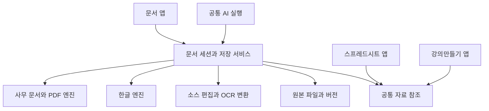

# 문서 앱 설계

작성일: 2026-10-02  
상태: 구현 진행 중. 아래 지원표는 출시 계약이며, 현재 동작·검증·미완료 범위는 말미의 「구현 상태」에서 구분한다. 전체 출시 완료로 선언하지 않는다.

indiebizOS에 **독립 문서 앱**을 만든다. 일반 글쓰기부터 보고서·공문·신청서·계약서·매뉴얼·논문 열람과 편집까지 한 작업 공간에서 처리한다. 기존 **강의만들기**는 강의 구성과 슬라이드 제작을 담당하고, **스프레드시트**는 별도 앱으로 셀·수식·분석을 담당한다. 세 앱은 파일 식별·버전·참조·AI 접근 계약을 공유한다.

별도 [스프레드시트 앱 설계](SPREADSHEET_APP_DESIGN_2026_10_02.md)는 시트 기능·계산·저장 호환을 정의한다. 두 설계의 공통 파일·세션·엔진 기반은 한 구현을 공유한다.

이번 설계는 자주 쓰는 형식과 기능을 사용 빈도에 따라 뒤로 미루지 않는다. 문서 앱의 출시 범위에 DOCX, HWP/HWPX, PDF, ODT, RTF, TXT, Markdown, HTML과 구형 DOC의 처리, 직접 편집, AI 수정, 저장·복구·인쇄를 포함한다. 개발 순서는 의존 관계를 뜻하며 뒤 단계의 필수 항목을 빼고 완성으로 선언하지 않는다.

설계 판단은 [IBL 진화 목적과 개선 판단](IBL_EVOLUTION_PURPOSE.md)을 따른다. 문서를 보기 좋게 열기만 하는 것보다, 사람이 원한 수정과 최종 제출까지 원본 손실 없이 완료하는지를 본다.

## 1 앱의 경계와 주요 결정

- 런처에 **문서** 독립 아이콘과 창을 추가한다. 여러 문서를 탭·별도 창·나란히 보기로 편집한다.
- 문서 앱은 글·페이지·문서 검토를 소유한다. 문서 안의 표는 지원하지만 계산용 시트 편집기를 복제하지 않는다.
- 강의만들기의 재료·데크·발표 흐름을 유지한다. 문서를 강의 재료로 전달할 때 원본 버전과 선택 범위를 함께 넘긴다. 기존 강의 앱을 임의 PPTX 전체 편집기로 간주하지 않는다.
- 사무 문서는 성숙한 편집 엔진을 내장한다. 페이지 조판·표·수식·변경 추적을 자체 HTML 편집기로 처음부터 재구현하지 않는다.
- **문서 원본 형식이 정본**이다. 전체 문서를 간소한 공통 JSON이나 Markdown으로 바꾸어 저장하는 구조를 채택하지 않는다. 공통 모델은 검색·AI 문맥·주소·변경 요청용 투영이다.
- **파일 저장의 책임은 indiebizOS**, 열린 문서의 실시간 편집 상태는 활성 편집 엔진이 소유한다. 디스크를 AI가 따로 고쳐 엔진의 자동저장과 경쟁하지 않게 한다.
- 기본 파일 처리·OCR·편집은 로컬 또는 소유자가 지정한 서버에서 수행한다. AI 모델 호출 시 선택한 자료가 기존 모델 제공자에게 전달되는 것은 별도로 표시한다.

## 2 현재 기반과 실제 공백

다음은 2026-10-02 코드와 선언을 확인한 결과다. 기존 문서 IR의 여러 출력 지원을 기존 파일의 완전한 왕복 편집 지원으로 읽지 않는다.

| 현재 기반 | 재사용 | 추가할 능력 |
| --- | --- | --- |
| [DOCX 편집](../data/packages/installed/tools/system_essentials/docx_edit_ops.py), [가이드](../data/guides/document_edit.md) | 파일 해시 확인, 문단 조회, 제한된 문구 교체, 추적 변경·주석, 비대상 ZIP 파트 보존 | 문단 추가·이동, 표 구조, 링크·필드·기존 변경이 있는 문단, 전체 서식·페이지 편집과 실제 편집 UI |
| [문서 읽기와 양식](../data/packages/installed/tools/system_essentials/office_ops.py) | PDF/DOCX 읽기, PDF 필드와 DOCX 자리표시자 채우기 | 시각적 양식 편집, PDF 본문·페이지 조작, 원본 레이아웃 탐색 |
| [PDF OCR](../data/packages/installed/tools/system_essentials/essentials_pdf_ocr.py) | 로컬 Tesseract, 한·영 인식, 실패·신뢰도 구분 | 다단·회전·혼합 페이지, 좌표와 검색 텍스트층, 사람이 OCR을 교정하는 화면 |
| [문서 생성](../data/packages/installed/tools/data-ops/doc_build.py), [형식 출력](../data/packages/installed/tools/data-ops/doc_formats.py) | 블록에서 HTML/PDF/DOCX/Markdown 등 새 산출물 생성 | 기존 파일의 형식별 왕복 저장, 변환 손실 보고 |
| [강의만들기](../frontend/src/components/LectureWorkspace.tsx), [앱 이동](../frontend/src/lib/surface-navigation.ts) | 독립 창, 자료 선택과 AI 대화 방식 | 문서 전용 표면·열기 연결·범위 선택 |
| [회원 문서](../data/packages/installed/tools/system_essentials/member_documents.py), [신원](../backend/base/principal.py) | 기존 사용자·파일 접근 경계 | 문서 세션·버전·엔진 콜백에서도 같은 소유권 확인 |
| [파일 색인](../backend/datastore/file_index.py), [과제 원장](../backend/datastore/pursuit_ledger.py), [실행 기록](../backend/services/execution_trace.py) | 파일 발견, 과제·실행 증거 연결 | 문서별 작업 상태, 범위별 출처와 최신 버전 연결 |

확인한 프론트엔드 의존성과 문서 처리 경로에는 범용 문서 편집기나 HWP/HWPX 원본 편집 연결이 없다. 현재 `self:document`의 `editable:false`는 보호 계약이므로 기존 제한을 그냥 제거하지 않고 새 엔진 경로로 능력을 추가한다.

## 3 파일 형식별 지원 계약

**원형 편집**은 해당 형식으로 다시 저장하는 경로를 제공한다는 뜻이다. 모든 공급자의 모든 확장 요소가 완벽히 동일하다는 보증은 아니다. 보존 못 하는 기능은 파일별로 확인해 전환 전에 알린다. **변환 편집**은 원본을 보존하고 명시한 다른 형식의 새 파일을 만드는 것이다.

| 형식 | 열람 | 편집과 저장 목표 | 구현 경로와 한계 |
| --- | --- | --- | --- |
| DOCX | 페이지·목차·주석·추적 변경 | 원형 편집, DOCX 저장, PDF 출력 | 주 사무 편집 엔진. 텍스트·표·그림·수식·구역·주석을 인수 검사 |
| HWP 5.x, HWPX | 한글 문서와 공문 양식 | 원형 편집과 HWP/HWPX 저장, PDF 출력 | 로컬 RHWP(MIT). 일반 엔진의 DOCX 변환만으로 완료하지 않음 |
| PDF | 썸네일·책갈피·검색·원본 페이지 | 주석·양식·페이지·가능한 텍스트/객체 편집, PDF 저장 | PDF 전용 편집 모드. 문단이 페이지를 넘어 흐르는 재작성은 DOCX 변환 사본에서 수행 |
| 스캔 PDF, JPG/PNG/TIFF 문서 | 원본 영상, 회전·확대 | 한·영 OCR 교정, 검색 가능한 PDF, DOCX 변환 | OCR 결과와 원본을 나란히 표시. 픽셀 속 글자를 직접 편집 가능한 원본 글자로 오인하지 않음 |
| ODT | 페이지·구조 | ODT로 왕복 저장, DOCX/PDF 내보내기 | 엔진의 내부 변환과 손실 검사 포함. ODF 전용 기능 보존도 시험 |
| RTF | 서식 문서 | RTF 저장, DOCX/PDF 출력 | RTF가 표현하지 못하는 새 기능은 저장 전 변환 안내 |
| DOC | 구형 Word 열기 | DOCX 작업 사본 편집, DOCX/PDF 또는 명시적 DOC 내보내기 | DOC 출력은 LibreOffice 변환 어댑터로 별도 검사. 확장자만 바꾸지 않음 |
| TXT | 인코딩·줄바꿈 선택 | 원문 편집, UTF-8 및 기존 인코딩 저장 | UTF-8/BOM·UTF-16·CP949/EUC-KR 구분. 인코딩 불가 문자는 저장 전에 표시 |
| Markdown | 원문과 미리보기 | 원문 편집, MD 저장, HTML/PDF/DOCX 출력 | 표·체크리스트·코드·수식·각주와 상대 이미지. 미지원 문법의 원문 보존 |
| HTML/HTM | 문서 보기와 소스 | 소스 및 문서 영역 편집, HTML·PDF 출력 | 스크립트 없는 문서 미리보기. 임의 웹앱을 시각 편집기로 왕복 변환하지 않음 |
| DOTX, OTT | 템플릿 미리보기 | 템플릿 만들기·저장, 새 문서 인스턴스 생성 | 원본 템플릿과 채워진 문서 분리. HWPX 양식도 템플릿으로 등록 |
| Pages | 파일 열기·변환 미리보기 | DOCX 변환 편집과 저장 | `.pages` 원형 저장은 제공하지 않음. 변환과 원본 보존을 명시 |
| EPUB | 목차·본문·검색 | 장 단위 XHTML·목차·메타데이터 편집, EPUB 저장·내보내기 | 비 DRM·재배치형 문서 대상. 고정 레이아웃은 열람과 변환 상태를 구분 |
| LaTeX, Typst | 소스와 컴파일된 PDF | 소스 편집·오류 위치·PDF 출력 | 소스 문서 모드와 별도 컴파일 워커. 최초부터 프로젝트 자산과 컴파일 범위를 식별 |

XLSX/ODS/CSV는 스프레드시트 앱으로 연결하고 문서에는 범위·표·차트를 가져온다. PPTX/ODP는 강의 재료로 전달하되, 해당 앱이 직접 편집할 수 있는 대상인지를 확인한다. 기존 강의 앱의 형식 공백은 문서앱 안에 두 번째 슬라이드 편집기를 넣어 해결하지 않는다.

암호 문서는 사용자가 입력한 암호로 열고 비밀번호를 대화·로그·일반 DB에 기록하지 않는다. DOCM/HWP 매크로·OLE·외부 데이터 실행은 자동 수행하지 않으며, 보존·제거·변환 결과를 구분한다. DRM·배포용 제한, 손상 파일, 지원하지 않는 구판 HWP는 원인을 표시한다. 보호 해제를 형식 지원으로 간주하지 않는다.

## 4 출시 범위의 사용자 기능

### 글쓰기와 서식

한글 IME 입력, 복사·붙여넣기와 서식 없이 붙여넣기, 실행 취소·다시 실행, 선택·드래그, 찾기·바꾸기, 글자·단어 수, 키보드 단축키를 기본으로 제공한다. 한글 조합 중 AI 결과나 자동저장이 문자를 끊지 않아야 한다.

글꼴·크기·색·강조·밑줄·위첨자·아래첨자, 문단 정렬·들여쓰기·줄/문단 간격, 글머리표·다단계 번호, 제목 스타일과 목차를 지원한다. 한·영 맞춤법·띄어쓰기 점검과 사용자 사전을 포함한다. 엔진에 한국어 점검이 없으면 기존 AI 호출 기반 선택 구간 교정으로 보충하고, 외부 AI를 쓰는 동작임을 표시한다. 직접 편집은 모델 연결 없이 가능해야 한다.

### 페이지와 삽입

A4/Letter와 사용자 용지, 여백·방향·구역·단 나누기, 쪽 나누기, 머리말·꼬리말·쪽 번호, 첫 쪽/홀짝 구분, 워터마크, 인쇄 미리보기를 제공한다. 그림·크기·자르기·본문 배치, 텍스트 상자·기본 도형, 하이퍼링크·책갈피, 각주·미주, 캡션·상호 참조, 수식·특수문자를 편집한다.

표 삽입·행/열 추가와 삭제·셀 병합/분할·너비·정렬·테두리·배경·제목행 반복을 지원한다. 여러 쪽 표와 중첩 표의 잘림을 검사한다. 문서의 간단한 합계는 지원하되 수식망·피벗·대량 데이터 편집은 스프레드시트에서 처리한다.

### 검토와 양식

주석·답글·해결, 변경 추적 표시, 개별/선택/전체 수락·거절, 두 버전 비교, 변경 작성자와 AI 실행 출처를 제공한다. 형식이 원래 지원하는 주석·변경 추적은 그 형식에 저장하고, TXT/MD처럼 표현하지 못하는 검토 정보는 앱 메타데이터에 저장해 본문과 구분한다.

보고서·제안서·회의록·공문·신청서·계약서·이력서 템플릿을 제공한다. 채우기 필드·날짜·선택·체크박스·표 반복행, CSV/시트/기존 원장으로 여러 문서를 만드는 메일 머지를 포함한다. 필드가 없는 공문도 표·텍스트를 직접 편집할 수 있어야 한다. 양식 값 매핑과 미리보기를 보여주고 실행 결과 파일별 성공·실패를 남긴다.

### PDF 작업

본문 검색·주석·강조·도형·텍스트 추가, 기존 텍스트/객체 수정, 양식 작성·채우기·평탄화, 페이지 재정렬·회전·추출·병합·분할·삭제, 이미지 삽입과 서명 이미지 배치를 제공한다. 서명 이미지를 암호학적 전자서명으로 표시하지 않는다. 이미 전자서명된 PDF는 원본을 보존하며 변경 시 서명 유효성이 영향을 받는다는 상태를 보여준다.

진짜 내용 제거 방식의 가림 처리, 문서 속성/숨은 정보 제거, 출력 압축과 품질 미리보기를 포함한다. 가림 처리는 검은 사각형을 얹는 것으로 끝내지 않는다. 텍스트·OCR층·관련 객체와 최종 배포 파일의 잔존 여부를 확인한다. 동적 XFA 양식이나 편집할 수 없는 PDF 구조는 AcroForm·보통 PDF와 구분해 표시하고, 원본 또는 평탄화 사본에서 가능한 작업을 안내한다.

OCR은 페이지별 원문·인식문·좌표·신뢰도·교정 이력을 연결한다. 인쇄문·다단·회전 문서의 처리, 한국어와 영어 혼합, 검색 PDF 생성까지 완료한다. 손글씨는 정확도를 보장하지 않으며 낮은 신뢰도를 표시한다.

### 파일 작업과 접근성

새 문서·열기·최근 문서·즐겨찾기·프로젝트 연결·드래그앤드롭·다른 이름으로 저장·복제·이름 변경·위치 열기·내보내기·인쇄를 제공한다. 자동저장, 종료 후 복원, 버전 이력·복구, 두 문서 비교를 포함한다. 탭별 수정 상태와 저장 위치를 표시한다.

키보드만으로 열기부터 저장까지 가능해야 한다. 한국어 UI와 기존 i18n 체계를 사용하고, 스크린리더 레이블·제목 구조·그림 대체텍스트·고대비/확대를 검증한다. 글꼴이 없으면 대체 글꼴과 배치 변화 가능성을 표시하고, 열람·편집·출력 엔진의 글꼴 묶음을 맞춘다.

## 5 화면과 실제 작업 흐름

첫 화면은 최근 문서·검색·새 문서·템플릿·파일 열기다. 편집 화면은 다음과 같이 구성한다.

| 영역 | 내용 |
| --- | --- |
| 상단 | 문서 탭, 제목·형식, 저장 상태, 파일/편집/삽입/배치/검토/보기 메뉴 |
| 왼쪽 | 목차·쪽 썸네일·검색 결과 전환. 필요할 때 접기 |
| 중앙 | 실제 페이지 편집. 원문·미리보기·비교 모드를 유형에 맞게 제공 |
| 오른쪽 | AI 대화·선택 범위·자료·수정 제안. 직접 편집 중에는 접을 수 있음 |
| 하단 | 쪽·글자 수·확대, OCR/변환 진행, 충돌·저장 실패 상태 |

AI 패널은 현재 문서·선택 문단·표·첨부 자료를 눈에 보이는 칩으로 표시한다. 선택이 없으면 문서 전체가 자동 전송되는 대신 현재 범위와 필요한 추가 읽기를 명시한다. 화면을 바꾸더라도 이미 시작한 AI 요청의 대상은 바뀌지 않는다.

AI의 기본 작업은 초안 작성, 선택 문장 교정·축약·확장·번역, 문서에 근거한 질의응답, 여러 자료의 비교·종합, 표/양식 채우기, 서식 통일, 인용·수치 대조다. 번역은 원문 대조와 구조 보존을 제공한다. 답변의 근거를 누르면 해당 문서 버전의 문단이나 PDF 위치로 이동한다. 다른 자료에서 가져온 수치·문구는 출처를 유지하고, 자료에 없는 사실을 보충했으면 구분한다.

대표 흐름은 다음과 같다.

1. HWPX 신청서를 연다. 원형 편집 상태를 확인하고 표의 빈칸을 채운다. AI에게 설명 문구만 다듬게 한 뒤 HWPX와 PDF를 저장한다.
2. DOCX 보고서에서 한 절을 선택해 축약을 요청한다. 변경 추적으로 결과를 보고 일부 수락한 뒤 Word에서 다시 열어 확인한다.
3. 스캔 PDF를 열어 OCR을 실행하고 잘못 읽힌 숫자를 원본과 대조해 고친다. 검색 가능한 PDF와 편집할 DOCX 사본을 만든다.
4. 스프레드시트의 지정 범위를 표로 넣고 출처 버전을 기록한다. 원본이 바뀌면 갱신 가능 상태를 보고 새 값으로 바꾸거나 기존 값을 유지한다.
5. 완성한 보고서의 특정 절을 강의만들기의 재료로 전달한다. 문서 내용과 전달한 버전은 계속 연결되며 강의 결과가 보고서를 자동 덮어쓰지 않는다.

## 6 편집 엔진과 배포 결정

### 일반 사무 문서와 PDF

**주 엔진 제안은 로컬 ONLYOFFICE Docs**다. DOCX 편집 UI와 PDF 편집, 여러 사무 형식의 변환을 같은 제품으로 연결해 직접 구현할 범위를 줄인다. 공급자의 형식 지원표는 변환 경유 여부를 구분하며, DOC 등은 원래 형식으로 저장되지 않을 수 있다. 이를 제품 지원표에 그대로 드러내고 DOC 재출력은 별도 변환기로 보충한다. [형식 문서](https://helpcenter.onlyoffice.com/docs/userguides/document_editor/supportedformats.aspx), [저장 계약](https://api.onlyoffice.com/docs/docs-api/get-started/how-it-works/saving-file/).

PDF는 엔진의 별도 PDF 모드를 사용한다. 공식 문서는 텍스트 영역·객체 편집과 페이지 조작, 가림 처리를 설명한다. 스캔 OCR과 앱의 파일 병합·일괄 처리는 기존 Python 기반을 보완하되, 활성 세션과 동시에 같은 원본에 쓰지 않는다. [PDF 편집](https://helpcenter.onlyoffice.com/docs/userguides/pdf_editor/EditPDF.aspx), [가림 처리](https://helpcenter.onlyoffice.com/docs/userguides/pdf_editor/redact.aspx).

Collabora/LibreOffice 계열도 비교 대상이지만 두 개의 범용 사무 편집기를 동시에 내장하지 않는다. 이 설계의 기본 연결은 ONLYOFFICE 하나이며, LibreOffice는 구형 형식 변환과 독립 재열기 검증에 사용한다. 가벼운 리치텍스트 편집기를 주 엔진으로 선택하면 페이지·각주·복잡한 표·원본 왕복을 추가로 만들어야 하므로 이번 범위에 맞지 않는다.

### HWP와 HWPX 원형 편집

**로컬 RHWP 0.8.6(MIT)을 기본 어댑터로 연결한다.** 한컴 유료 엔진은 필수 의존성이 아니다.
HWP 5.x/HWPX의 원형 읽기·화면 편집·같은 형식 저장을 WASM 엔진으로 처리한다.
[엔진 소스·MIT](https://github.com/edwardkim/rhwp/tree/v0.8.6),
[임베드 API](https://github.com/edwardkim/rhwp/blob/v0.8.6/npm/editor/README.md).

외부 데모 주소를 사용하지 않는다. 엔진·SDK·OFL 글꼴은 로컬 번들에 포함하고 외부 웹폰트를
빌드에서 끄며 CSP로 외부 통신을 제한한다. 브라우저·Electron의 파일 출처는 로컬 HTTP
호스트를 통해 같은 엔진에 연결한다. RHWP 저장 결과의 내용 손실 보고에 항목이 있으면
호스트 저장을 거절한다. 이 보고서가 모든 시각적 차이를 검출하는 것은 아니다.

ONLYOFFICE의 HWP→DOCX 변환은 원형 편집 성공으로 계산하지 않는다. 복잡한 공문·수식·
누름틀·병합 표·쪽 배치는 실제 사용 문서를 한컴에서도 다시 열어 별도로 확인해야 한다.
현재 검증은 합성 한글 본문과 표를 포함한 HWP/HWPX의 로컬 편집·저장·재열기이다.

### 텍스트와 출판 소스

TXT/MD/HTML/LaTeX/Typst는 원문을 보존하는 소스 편집 표면을 둔다. Markdown은 소스와 렌더 미리보기를 연결하고, HTML은 비실행 미리보기와 자산 목록을 제공한다. EPUB은 ZIP 패키지의 장별 XHTML·CSS·목차·메타데이터를 편집하는 경로를 두어 본문을 DOCX로 변환한 것만으로 EPUB 편집을 대신하지 않는다. 컴파일은 제한된 작업 폴더에서 취소·시간 제한을 가진 별도 프로세스로 실행한다.

### 설치와 비용

ONLYOFFICE Docs는 작은 프론트엔드 라이브러리가 아니라 별도 문서 서비스다. ARM64 Docker 설치의 공식 기준에는 Linux와 4GB 이상 메모리·40GB 이상 여유 디스크가 명시되어 있다. macOS에서는 Linux 컨테이너 런타임/VM을 포함한 설치·자원 비용을 실제 측정해야 한다. [설치 문서](https://helpcenter.onlyoffice.com/docs/installation/docs-community-install-docker-arm64.aspx).

제품 설치 화면이 엔진 준비·실패·업데이트를 맡고 사용자가 매번 터미널로 서버를 시작하지 않게 한다. 검증한 버전·이미지 digest를 고정하고 캐시·작업 상태를 영속 볼륨에 둔다. 문서 엔진의 고장이나 업데이트가 전체 indiebizOS 백엔드를 재기동하지 않게 분리한다. 여러 문서 창이 하나의 엔진 서비스를 공유하며 마지막 창 종료 시 저장 완료를 확인한다. 사용자의 다른 컨테이너 런타임 전체를 종료하지 않는다.

일반 엔진·한컴 엔진·변환기·OCR·글꼴의 라이선스와 재배포 조건을 버전별 목록으로 기록한다. 무료 무제한 재배포 가능성을 가정하지 않는다. ONLYOFFICE 외부 Automation API는 별도 유료 기능으로 안내되므로 기본 설계는 공식 플러그인 통로를 사용하며, 그 통로로 못 채우는 기능은 유료 API 도입 필요를 명시한다. 요금은 견적 없이 임의로 적지 않는다. [Automation API](https://api.onlyoffice.com/docs/docs-api/usage-api/automation-api/), [플러그인 API](https://api.onlyoffice.com/docs/plugins/interacting-with-editors/overview/).

## 7 문서 상태와 저장 모델

앱 목록에 등록한다고 사용자의 파일을 전용 폴더로 강제 이동하지 않는다. 파일 선택기의 로컬 경로 또는 원격 업로드를 서버의 문서 ID로 등록한다. 새 문서는 기본 DOCX, 사용자가 고르면 HWPX/ODT/MD 등으로 생성하며 최초 저장 때 위치를 정한다.

| 식별자와 상태 | 뜻 |
| --- | --- |
| `document_id` | 앱 간 참조하는 논리 문서. 같은 내용의 복사 파일을 자동 동일시하지 않음 |
| `source_uri`, `source_format`, `source_sha256` | 현재 원본 위치·형식·실제 바이트 버전 |
| `revision_id`, `parent_revision_id` | 확정 저장된 문서 버전과 이전 버전 |
| `session_id`, `engine_id`, `engine_epoch` | 현재 편집 세션과 엔진 재시작 세대 |
| `snapshot_id`, `session_revision` | 저장 전 변경까지 담은 고정 작업 스냅샷 |
| `operation_id`, `proposal_id`, `export_id` | 중복 적용 방지, 검토 대상, 출력 작업 |
| `capabilities`, `loss_report` | 실제 엔진·파일에서 가능한 동작과 변환 손실 |

영속 메타데이터는 제안 경로 `data/document_workspace/state.db`, 스냅샷과 버전은 같은 작업 공간의 문서 ID별 디렉터리에 저장한다. 작업 복구용 버전은 제품 데이터다. 수동 작업 전 일회성 백업은 저장소 규약대로 `data/_backups/YYYY-MM-DD_이름/`에 둔다.

자동저장은 편집 엔진 내부 반영, 복구 가능한 작업 저장, 원본 파일 저장을 구분한다. 화면의 **저장됨**은 원본 바이트가 실제 기록되고 확인됐을 때만 표시한다. 엔진에만 남은 상태는 **작업 저장됨**, 원본 실패는 **파일 저장 실패**로 표시한다. Ctrl/Cmd+S는 현재 변경의 전송·스냅샷·원본 저장 완료까지 기다린다.

일반 저장은 작업 버전 생성 → 출력 파일 검증 → 대상 파일 기대 해시 확인 → 같은 파일시스템의 임시 파일 기록과 동기화 → 원자적 교체 → 버전 기록 확정 순서다. 네트워크 저장소처럼 같은 보장을 할 수 없는 경우 지원 수준을 표시한다. DB와 파일시스템은 한 트랜잭션이 아니므로 저장 의도 원장과 결과 해시로 재시작 시 미완료 단계를 복구한다. 교체 성공 뒤 DB 기록만 실패했다고 원본을 다시 덮어쓰지 않는다.

외부 수정이 감지되면 원본과 작업 사본을 모두 보존하고 비교·새 파일 저장·가능한 구조 병합을 제공한다. 세이브 직전 재검사로 흔한 경합을 잡되 외부 프로그램의 임의 쓰기까지 완전히 원자화했다고 주장하지 않는다. 이미 열린 동일 문서는 같은 편집 세션에 참여하거나 두 번째 창을 읽기 전용으로 열며 서로 다른 저장자가 되지 않게 한다.

엔진의 지연·중복 콜백은 문서/세션/세대/작업 ID로 검증하고 이미 처리한 결과는 재적용하지 않는다. 원본 형식이 DOCX로 바뀌었는데 옛 `.hwp` 이름으로 저장하는 일은 MIME·파일 헤더·출력 형식 검사로 거절한다. ONLYOFFICE의 `forcesave` 호출 자체는 원본 저장 완료가 아니며, 콜백 수신과 바이트 수령 후 확정한다. [엔진 저장 절차](https://api.onlyoffice.com/docs/docs-api/get-started/how-it-works/saving-file/).

## 8 AI와 사람이 같은 문서를 다루는 계약

### 선택과 읽기

AI 요청은 `document_id + snapshot_id + 선택 앵커 + 목표`를 고정한다. 앵커는 엔진의 안정된 요소 ID, 문서 부분, 앞뒤 문맥과 선택 텍스트 해시를 포함한다. 문단 번호만으로 장기 주소를 삼지 않는다. 기존 DOCX `part#pN` 주소는 해당 파일 해시에 종속된 것으로 유지한다.

읽기는 제목/목차 → 해당 절 → 필요한 표·주석·원문 순서로 범위를 좁힌다. 페이지 번호는 렌더 지문과 함께 반환하고 OCR 인용은 페이지·사각형을 포함한다. AI 공통 투영에는 문단·제목·표·그림 참조·각주·출처·편집 가능 정보가 들어가되, 원본 전체를 이 투영으로 덮어쓰지 않는다.

`barrier()`는 입력 조합 종료, 현재 편집 변경 전송, 엔진 저장 응답을 확인한 뒤 스냅샷을 발급한다. 서버의 디스크 파일만 읽어서 저장 전 변경까지 읽었다고 하지 않는다. 편집 엔진이 이 보장을 제공하지 못하면 짧은 읽기 전용 전환과 명시적 저장으로 경계를 만들며, 실패하면 AI 요청을 시작하지 않는다.

### 제안과 적용

기본 AI 수정은 선택 구간의 제안으로 보여준다. 사용자가 직접 수정 실행을 지시한 경우 같은 요청 권한 안에서 적용하고 실행 취소를 제공한다. 모든 작은 변경에 별도 승인창을 반복하지 않는다. 검토 모드에서는 형식의 추적 변경 또는 앱 제안 레이어를 사용한다.

수정은 문구 교체뿐 아니라 문단 삽입·이동, 스타일 적용, 표 행/셀 수정, 그림·각주·주석 추가, 페이지 설정을 포함한다. AI가 생성한 임의 JavaScript를 그대로 엔진에서 실행하지 않고, 검증된 구조 명령을 엔진 어댑터가 공식 API로 번역한다.

제안 적용 직전에 기준 세션 버전과 앵커를 다시 확인한다. 비중첩 변경은 어댑터가 검증해 재배치할 수 있고, 충돌·애매한 일치는 재조회 또는 사용자 비교로 넘긴다. 현재 커서를 추정해 문자열을 붙여넣지 않는다. AI 한 묶음은 한 번의 실행 취소 단위로 제공하되 사람의 뒤이은 편집까지 취소하지 않는다.

활성 문서는 공식 편집 API로 변경한다. 세션 없이 파일 작업을 할 때는 같은 저장 서비스의 단독 편집 권한으로 작업 사본을 만들고 저장한다. 기존 제한적 OOXML 교체는 이 경로에서 재사용할 수 있지만 열린 엔진의 파일을 뒤에서 바꾸지 않는다.

### 다른 앱과의 연결

공통 참조는 `resource_id + revision_id + selector + provenance`다. 시트는 통합문서·시트·범위·수식/계산값·계산 상태, 강의는 강의·데크 버전·슬라이드 ID를 선택자로 쓴다. AI는 권한이 있는 자료를 앱이 닫혀 있어도 읽을 수 있다. 미저장 상태가 있으면 활성 세션 스냅샷을 명시적으로 요청한다.

문서에 넣은 시트 표/차트는 기본적으로 고정 버전이다. **원본과 연결**을 선택한 경우 원본 변경 알림과 **갱신**을 제공하며, 사람이 고친 보고서를 자동 재작성하지 않는다. 여러 앱을 수정하는 작업은 산출물별 완료·실패·재시도 상태를 갖고 전체 원자적 저장을 약속하지 않는다. 완료된 보고서가 강의 생성 실패 때문에 사라지지 않는다.

### IBL 연결

> **2026-10-05 개정**: 아래의 `self:document`/`self:sheet` 세션 op 는 범용 작업 공간 낱말 **`[self:workspace]`** 로 흡수됐다(`backend/services/workspace_sessions.py`, 가이드 `workspace.md`). 재계획 정본은 [APP_COMPOSITION_ON_IBL_PLAN_2026_10_05.md](APP_COMPOSITION_ON_IBL_PLAN_2026_10_05.md).

UI는 문서 서비스 API를 직접 호출한다. AI는 기존 `self:document`의 op를 확장해 같은 서비스에 접근하도록 하며 새 코어 문법·노드를 만들지 않는다. 제안 op는 `open`, `snapshot`, `read`, `propose`, `apply`, `save`, `export`, `versions`, `restore`, `capabilities`다. 기존 `inspect/edit` 인자·원본 보존·새 파일 반환 계약을 유지한다. 부작용 op별 선언과 사용자 신원 검사를 명시한다.

`table:document`는 새 문서 생성 책임을 유지하고 결과 파일을 문서 서비스에 등록한다. `self:read`의 일반 파일 읽기와 `self:fill`의 기존 양식 채우기는 중복 재구현하지 않는다. 능력 추가 때 소스 YAML·가이드·핸들러 도움말·용례·파생 빌드를 함께 갱신한다. 현재 설계 문서는 이 op들이 이미 구현됐다고 뜻하지 않는다.

## 9 내부 구조와 최소 API

아래 경로는 구현 제안이다. 기존 공통 신원·수명·기록 코드를 복제하지 않고 확장하며 새 모듈을 층 검사기에 배정한다. 패키지와 backend의 모듈 이름 충돌 및 1500줄 제한을 지킨다.

| 위치 | 책임 |
| --- | --- |
| `frontend/src/components/DocumentWorkspace.tsx`, `documents/` | 목록·탭·문서 표면·AI·검토·복구 화면 |
| `frontend/src/lib/api-documents.ts` | 문서 API와 사건 구독 |
| `frontend/electron/windows.js`, `preload.js`, `main.js` | 문서 독립 창·파일 선택·열기·인쇄 연결 |
| `backend/surface/api_documents.py` | 인증·세션·저장·내보내기 HTTP 경계 |
| `backend/services/document_workspace.py`와 형제 모듈 | 문서 수명·버전 확인·단일 저장 책임·AI 제안 |
| `backend/services/document_engines/` | office/hancom/pdf/source 어댑터, 세션과 공식 편집 명령 연결 |
| `backend/datastore/document_store.py` | 문서·버전·세션·작업 원장과 복구 |
| `backend/services/resource_links.py` | 앱 간 버전·범위·출처 연결. 문서 형식 내부는 모름 |
| 기존 문서 패키지 | IBL 진입, 검증된 읽기·양식·OCR·출력 기능 |

위 문서 모듈의 공통 책임은 [스프레드시트 설계 10절](SPREADSHEET_APP_DESIGN_2026_10_02.md#10-내부-구조와-ibl-연결)의 `office_resources`·`office_sessions`·`office_store`·`office_engines/`로 배정한다. `document_workspace.py`는 문서 전용 조정을 맡는다. 표의 `document_store.py`와 `document_engines/`는 이 공통 기반과 문서 어댑터에 통합하며, 앱마다 별도 잠금·버전 저장소·사무 엔진 서버를 만들지 않는다.

어댑터 계약은 `probe`, `open`, `capabilities`, `barrier`, `read`, `apply`, `flush`, `export`, `close`로 제한한다. 형식별 내부 DOM을 외부 계약으로 강제하지 않는다. `capabilities`는 파일·설치 버전·라이선스·현재 모드에 따라 달라지며 동작별 사유를 반환한다. 페이지를 열었어도 `edit_native`가 없으면 원형 편집으로 표시하지 않는다.

어댑터 기술 검증은 파일 열기만으로 통과하지 않는다. 각 엔진에서 **선택 범위 조회, 저장 전 상태 확정, 구조 변경, 사람이 입력한 뒤 오래된 제안 거절, 수정 묶음 되돌리기, 원형 내보내기**를 증명한다. 공개 API로 원자적인 확인·적용을 제공하지 않으면 적용 구간에 엔진 입력을 잠그고 검증·적용·해제를 한 묶음으로 수행한다. 다중 창의 입력까지 막을 수 없는 어댑터는 한 작성 세션만 허용한다. 필요한 API가 없는 엔진은 통합 비용/공급 조건을 다시 산정하며 기능을 구현한 것으로 표시하지 않는다.

| API 제안 | 책임 |
| --- | --- |
| `POST /documents/open`, `POST /documents` | 허용된 파일 등록 또는 템플릿으로 새 문서 생성 |
| `GET /documents/{id}`, `/capabilities`, `/versions` | 문서 상태·지원 범위·버전 목록 |
| `POST /documents/{id}/sessions` | 편집 엔진 세션 생성·재연결 |
| `POST /documents/{id}/snapshots`, `/read` | 저장 전 변경을 포함한 스냅샷, 큰 선택 범위 읽기 |
| `POST /documents/{id}/proposals`, `/apply` | 버전에 고정한 제안과 적용 |
| `POST /documents/{id}/save`, `/restore`, `/export` | 조건부 저장·새 버전 복구·형식 출력 |
| `GET /documents/jobs/{id}`, `/events` | OCR·변환·AI·저장 작업 진행과 재구독 |
| 엔진 전용 callback 경로 | 제한된 토큰으로 결과 수령, 중복·세대·출력 검증 |

변경 요청은 `expected_revision`, `operation_id`를 받는다. 충돌은 409와 현재/기준 버전, 미지원은 구체적 capability 사유, 엔진 불가와 파일 손상은 별도 오류다. 서버의 문서 ID가 허용 경로를 해소하며 원격 클라이언트가 임의 로컬 경로를 지정하지 않는다.

`resource_id`는 자료 종류와 소유자를 포함한 공통 참조이며 문서 자료에서는 `document_id`를 가리킨다. 파일 이동·이름 변경 시 ID를 유지하고 경로를 갱신한다. 같은 해시의 별도 파일은 사용자 선택 없이 합치지 않는다. 사건은 세션별 증가 순번과 작업 ID를 갖고, 재구독 시 마지막 순번 이후만 받는다. `source_sha256`와 작업 스냅샷 해시는 역할을 분리해 아직 원본에 쓰지 않은 버전을 원본 최신 버전으로 광고하지 않는다.

엔진 통신은 짧은 수명의 문서/세션 한정 토큰을 사용하고 콜백 원본과 서명을 확인한다. 다운로드 콜백 URL은 허용된 엔진 호스트로 제한한다. 프레임 메시지는 origin·세션·스키마를 검사한다. 문서 내용·매크로·HTML 스크립트·외부 이미지가 로컬 API를 호출할 권한을 얻지 않도록 분리한다. 파일 내용을 AI 명령이나 권한 부여로 취급하지 않는다.

업로드·압축 해제·OCR·컴파일은 크기/확장 비율·자원·시간 제한과 취소를 가진다. 상주 엔진은 기존 `runtime_work`의 서비스 수명, 변환·저장은 실제 작업 수명으로 관리한다. 앱/백엔드/엔진 재시작 각각에서 복구 경로를 갖춘다. 최근에 관측한 프론트엔드 로딩 실패처럼 빈 창에 머물지 않도록 엔진 재연결·초안 보존·다시 열기 상태를 제공한다.

## 10 호환성과 품질 판정

지원은 확장자 목록이 아니라 **형식 × 기능 × 저장 결과**로 판정한다. 파일을 열 때 원형/변환, 미지원 요소, 누락 글꼴, 보호 상태를 조사한다. 실제로 검출하지 못한 항목은 미확인으로 남기고 자동으로 무손실 판정을 하지 않는다.

변환 결과에는 입력/출력 형식, 엔진 버전, 원본 해시, 보존·변경·누락·미확인 항목, 미리보기 참조가 붙는다. 새 출력은 다른 이름으로 저장하며 명시적으로 선택한 원형 저장만 원본을 교체한다. 원본과 출력은 글·표·그림·페이지를 나란히 비교할 수 있다.

개발 인수에서는 기준 문서군의 페이지 렌더와 구조를 함께 대조한다. 픽셀 차이만으로 실패·성공을 결정하지 않고 글 누락·겹침·표 잘림·각주 이탈·순서·주석·추적 변경을 확인한다. Word/한글/LibreOffice 등 독립 소비자에서 재열기한다. 설치나 시험 접근이 없는 소비자는 검증 미완료로 기록한다.

모든 저장마다 대규모 렌더 검수를 돌리지는 않는다. 일반 저장은 구조·형식·해시 확인, 변환·최종 출력은 영향 페이지 확인, 엔진 버전 변경은 기준 문서군 회귀를 수행한다. AI 비용·토큰·완료 시간은 기존 실행 기록에서 계측하며 직접 편집·OCR·변환에 불필요한 모델 호출을 넣지 않는다.

## 11 구현 순서와 완료 조건

다음 단계는 **모두 이번 문서앱의 구현 범위**다. UI를 먼저 만들어 놓고 HWP·PDF·충돌 처리를 향후 기능으로 남기지 않도록, 엔진 검증을 맨 앞에 둔다.

| 단계 | 수행 | 통과해야 다음 단계의 전제가 되는 증거 |
| --- | --- | --- |
| 1 엔진과 배포 확정 | ONLYOFFICE/한컴/변환기/텍스트·OCR 경로, 라이선스·설치·글꼴 구성 | 실제 맥과 Windows 대상 구성에서 DOCX/HWP/HWPX/PDF 열기→수정→같은 형식 저장. HWP 오픈소스 재배포 고지 포함. 미충족이면 해당 기능의 출시 의존성으로 남김 |
| 2 파일과 세션 기반 | 공통 문서 ID·버전·스냅샷·저장·잠금·복구·사건 연결 | 엔진 지연 콜백, 외부 수정, 중복 저장, 종료 직전 실패에서 원본/초안 보존 |
| 3 문서 직접 편집 | 독립 앱, 표·서식·쪽·삽입·검토·템플릿·인쇄 | 일상 기능 표의 실제 문서 작업을 키보드와 마우스로 완료 |
| 4 형식 공백 완성 | HWP 양식, PDF 편집/OCR, DOC/ODT/RTF, MD/HTML/TXT, 템플릿·출판 소스 | 형식별 읽기·변환·원형 저장 계약과 오류/미지원 상태를 검증 |
| 5 AI와 앱 연결 | 미저장 상태 읽기·구조 수정·검토·되돌리기, 시트와 강의 참조 | 사람이 편집하는 동안 오래된 AI 제안이 덮어쓰지 않음. 파일/범위 출처 회수 |
| 6 제품 인수 | 설치·오프라인·복구·성능·접근성·원격 화면 | 아래 시나리오와 회귀 통과, 실제 지원표를 배포 판본에 고정 |

스프레드시트 앱 자체의 전 기능 구현은 이 문서의 작업 범위가 아니다. 문서앱에서는 기존 시트 서비스와 실파일로 범위 가져오기·출처·갱신 계약을 먼저 완성하여, 별도 앱 UI가 붙어도 계약을 다시 설계하지 않게 한다. 강의만들기 연결은 현재 앱을 상대로 실제로 검사한다.

### 필수 인수 시나리오

1. **보고서:** 한글·영문 혼합, 목차·쪽 번호·가로 구역·표·그림·각주·수식이 있는 DOCX를 편집하고 저장/재열기/인쇄/PDF 출력한다. 필드와 기존 추적 변경이 있는 문단도 정상 편집한다.
2. **한글 서식:** HWP 5.x와 HWPX 각각의 공문·병합 셀·결재란·누름틀·머리말·그림을 수정하여 원형 저장하고 한글에서 다시 연다. 변환된 DOCX 성공으로 대체하지 않는다.
3. **PDF:** 기존 텍스트 수정, 양식 채움, 두 PDF의 페이지 병합·회전·삭제, 주석과 가림 처리를 한다. 새 PDF의 화면·텍스트 추출·OCR층에서 가림 내용이 남지 않아야 한다.
4. **스캔:** 회전된 한·영 혼합 다단 스캔에서 OCR→교정→검색 PDF→DOCX 변환을 수행한다. 원본 대비 인식 정확도를 기록하고 숫자·고유명사 오류를 표시한다.
5. **원문:** CP949 TXT, 상대 이미지와 코드/각주가 있는 MD, CSS 자산이 있는 HTML을 편집·저장·다시 연다. 지원하지 않는 문법과 인코딩을 조용히 삭제하지 않는다.
6. **호환:** DOC→편집→DOC/DOCX, ODT/RTF 왕복, Pages→DOCX, EPUB 장·목차 변경과 소스 문서 컴파일을 각각 실제 처리한다. 원형과 변환 경로를 화면에서 구별한다.
7. **검토:** 사람과 AI의 변경을 구분하고 일부 수락·거절·주석·비교·복구한다. 한 번의 AI 수정 취소가 뒤에 입력한 사람 문장을 지우지 않는다.
8. **동시 상태:** AI 요청 뒤 사람이 같은 문단 수정, 선택 이동, 외부 파일 교체, 두 창 편집, 중복/역순 저장 콜백을 주입한다. 충돌 또는 검증된 재배치로 끝나야 한다.
9. **장애:** 저장 중 앱/백엔드/엔진 각각 종료, 디스크 부족, 원격 연결 단절을 재현한다. 마지막 확정 원본과 복구 가능한 초안을 보존하며 실패를 저장 완료로 표시하지 않는다.
10. **앱 연결:** 실제 XLSX 범위에서 보고서 표를 만들고, 원본 변경 후 선택 갱신한 뒤, 보고서의 절을 강의 재료로 넘긴다. 각 결과에서 원본 버전·범위를 찾아갈 수 있다.
11. **배포:** macOS Apple Silicon 및 Windows의 새 사용자 환경에서 설치→열기→수정→저장→다시 실행을 수행한다. 엔진 서비스 준비와 누락 글꼴/OCR 언어 데이터 오류가 사용자 화면에 나타난다.
12. **성능과 접근:** 100쪽/그림 포함 20MB DOCX, 500쪽 PDF, 문서 5개 동시 열기를 시험한다. 제품 목표는 웜 상태 일반 문서 첫 화면 3초, 대형 문서 첫 화면 10초, 통상 입력 반응 100ms 이내다. 시험 기기·콜드 시작·변환 시간은 따로 기록하며 미달이면 목표 달성으로 보고하지 않는다. 한글 IME·키보드·스크린리더 검증을 포함한다.

프론트엔드는 `npx tsc -p tsconfig.app.json` 및 실제 Electron/웹 조작, backend는 변경 영향에 맞는 회귀와 저장·엔진 계약 시험을 수행한다. 런처 앱 등록, 원격 라우트, 실제 파일 열기 연결까지 완료해야 한다. 문서 API의 health 성공은 화면·편집·저장 인수 성공을 대신하지 않는다.

## 12 확정 범위와 남은 외부 조건

이 설계의 결정은 **독립 문서앱, 원본 형식 보존, 전문 엔진 통합, 세션을 아는 AI 편집, 공통 저장·참조 기반**이다. 문서앱 완성을 위해 HWP/HWPX 원형 저장과 PDF 실편집을 필수로 포함한다.

외부 조건은 일반 엔진의 적용 가능한 라이선스, 실제 맥·Windows에서의 설치·성능, 문서별 호환성이다. 이 조건은 추후 생각할 기능 목록이 아니라 구현 착수 단계에서 해결하고 결과를 기록할 항목이다. 실제 검증한 형식·기능 범위를 명확히 보여주되, 요구한 문서앱 전체가 완성됐다고 선언하지 않는다.

전체 Office 매크로 실행, DRM 해제, 인증서 발급·전자계약 서비스, 전문 출판의 모든 DTP 기능, 문서앱 안의 스프레드시트/슬라이드 중복 구현은 제품 범위에서 제외한다. 일반 문서의 일상 편집·한글 서식·PDF 업무는 이 제외 항목에 넣지 않는다.

## 구현 상태 (2026-10-02)

### 실제 연결된 기능

- 독립 문서 앱에서 파일 가져오기·생성·최근 문서 선택, 소스 원문과 Markdown/비실행 HTML 미리보기.
- 로컬 ONLYOFFICE 9.3.1의 DOCX/ODT/RTF/PDF 편집 모드. 엔진 콜백은 초안만 저장하고,
  앱의 명시적 원본 저장만 조건부 파일 교체를 수행한다. 편집 서버 저장 버튼과 원본 파일 저장을 구분한다.
- 같은 형식의 배타적 사본 저장, 저장 버전·초안 복구, 외부 원본 변경 거절, 창 이동 전 엔진 초안 확보.
- PDF 쪽 회전·삭제·전체 재정렬은 확인한 엔진 스냅샷을 새 세대의 초안으로 전환한다. 이전 편집기의 늦은 콜백을 거절하고 원본 저장은 별도로 수행한다.
- 문서 선택 위치를 공식 플러그인의 책갈피로 고정하고 선택 내용/스냅샷을 검증한 뒤 변경 추적으로 적용.
  직접 입력한 제안과 설정된 모델의 AI 제안은 같은 적용 경계를 지난다. AI에 전달되는 선택을 화면에 표시한다.
- 보고서·회의록·제안서·공문·신청서·계약서 초안·이력서의 기본 섹션 템플릿.
- ONLYOFFICE 변환 사본(DOC/Pages/HWP 등 입력은 엔진이 허용하는 파일에 한함), Markdown의 Pandoc 출력,
  단일 파일 Typst PDF 출력. 형식별 호환성은 변환 결과를 확인해야 하며 HWP 변환은 원형 편집이 아니다.
- Tesseract 한국어/영어 OCR, 쪽·단어·신뢰도·좌표와 교정 화면, 교정 텍스트를 담은 검색 PDF 사본.
  한 번에 20쪽까지 처리한다. 선택 쪽은 영상으로 보존하고 잘못된 기존 텍스트층을 교체하므로 벡터/주석은 그 사본 쪽에서 보존하지 않는다.
- `office_store/resources/sessions` 공유 기반, XLSX/XLSM 고정 버전 범위의 Markdown 표 삽입,
  출처 변경 확인과 명시적 갱신, 소스 문서 선택의 강의 재료 전달. IBL `self:document` 세션 op는 같은 서비스를 사용한다.

### 이 Mac의 엔진 운영

`colima-indiebiz-office` Docker context, `indiebiz-office` 컨테이너, 호스트 파일 마운트 없는
전용 Colima VM을 사용한다. ONLYOFFICE는 `127.0.0.1:8093`에만 게시한다. 현재 연결은 로컬 PC용이며
원격 브라우저에 loopback 엔진을 제공하지 않는다. Mac 재부팅 후에는 문서 앱의 **편집 서버 시작** 또는
`python3 scripts/manage_document_engine.py start`를 실행한다. `status`/`stop`도 제공한다.
Docker/Colima의 최초 설치는 별도이며 이 버튼은 이미 설정된 엔진만 시작한다.

JWT 설정은 git 제외 `data/document_workspace/engine.json`(0600)에 저장한다. 설정을 출력하거나
커밋하지 않는다. Mac의 callback_origin은 Colima 호스트 게이트웨이 `http://192.168.5.2:8765`다.
콜백은 서명·문서 키·세션 세대·만료 ticket을 확인하고 다운로드는 설정한 엔진 출처만 허용한다.
배포 환경을 바꾸면 두 주소의 도달성을 별도로 확인해야 한다. Docker의 저장소 volume은 제거하지 않는다.

공식 근거: [ARM64 설치](https://helpcenter.onlyoffice.com/docs/installation/docs-community-install-docker-arm64.aspx),
[저장 프로토콜](https://api.onlyoffice.com/docs/docs-api/get-started/how-it-works/saving-file/),
[플러그인 명령](https://api.onlyoffice.com/docs/plugins/interacting-with-editors/overview/how-to-call-commands/).

### 아직 출시 완료가 아닌 이유

HWP/HWPX 원형 편집은 아래 RHWP 경로로 연결했다. 복잡한 실제 공문의 한컴 재열기·수식·누름틀·병합 표·쪽 배치 호환성, 한글 선택 AI 제안은 아직 인수하지 않았다. 기본 파일 왕복 성공을 전체 한글 기능의 검증 완료로 확대하지 않는다.

EPUB 장·목차 편집, LaTeX 컴파일과 프로젝트 자산, 이미지 파일 OCR 입력·회전 자동 검출,
메일 머지/반복 필드, DOC 출력, 템플릿 파일 등록, 사무 문서의 시트·강의 범위 연결,
탭·나란히 보기, 문서별 정밀 손실 보고, 암호·DRM·접근성·대용량·Windows 실인수는 미완료다.
ONLYOFFICE가 제공하는 모든 도구·형식 보존을 앱 전체의 검증 완료로 간주하지 않는다.

### 에피소드에서 바꾼 작업 방식

4251~4257의 중단된 구현은 정본의 현재 코드와 대조한 조각만 가져왔다. 독립 작업 사본의 완료 기록이나
수리 과제의 성공 상태로 앱 완료를 판정하지 않는다. 실제 편집 화면에서 입력→원본 저장→파일 재열기,
선택 변경 추적 XML, 변환 출력, OCR 검색 텍스트와 원본 보존을 직접 확인한다.
엔진 저장과 앱 저장의 중복 강제 콜백, 플러그인 URL의 언어 매개변수, iframe 재포커스도 실인수에서 확인했다.
검증되지 않은 출시 항목은 위 목록과 API `release_complete:false`에 남긴다.

검증 기록: 로컬 Chromium+ONLYOFFICE에서 DOCX 직접 입력·표 보존·책갈피 선택·변경 추적
삽입/삭제·원본 저장·PDF 출력, ODT 직접 입력/동형 저장, RTF 직접 입력/동형 저장 후 DOCX
재변환·문구 확인, PDF 열기·쪽 회전·재연결·원본 저장을 통과했다(`test_document_office_live.py`,
`INDIEBIZ_OFFICE_LIVE_TEST=1`). Tesseract 실 OCR 교정·검색 텍스트·원본 보존을 포함한
문서 서비스 44검사 통과. 기존 소스 브라우저와 Python/어휘 시스템 묶음 72검사 통과.
종합 회귀는 8,407통과·4실패·1건너뜀·102분리였다. 새 검사 직접 실행 진입점과 용례 재검토
원장 누락은 수정 후 관련 관문 19검사 통과. 남은 기존 `test_render_core.py` 2실패는
런처 스크립트 블록을 하나로 가정하는 검사이며 이번 문서 변경의 통과로 숨기지 않는다.

설정된 실행 모델의 실제 단발 호출도 합성 문장으로 확인했다. 도구 없이 선택 문장을 교정하고
AI 출처를 반환했다. 실제 개인 문서를 외부 모델에 보내는 인수 검사는 수행하지 않았다.

### 오픈소스 한글 편집 연결 (2026-10-02)

- 문서 앱에서 HWP/HWPX 열기 → 로컬 RHWP 화면 편집 → 작업 초안 → 원본 저장 또는 같은
  형식 사본 저장. 버전 복구는 엔진 세대를 갱신해 이전 화면의 저장을 차단한다.
- 앱이 문서 신원을 관리한다. 임베드의 다른 파일 열기·새 문서 메뉴/단축키·파일 드롭을 막고,
  Ctrl/Cmd+S 및 편집기 저장 메뉴를 앱의 원본 저장으로 연결한다.
- 초안 업로드는 바이트 해시·작성 창·세대·리비전·operation_id를 확인한다. 실패 재시도는
  같은 바이트와 식별자를 유지한다. 원본은 기존 원자 저장·외부 변경 검사·복구 계약을 사용한다.
- 암호/배포용/DRM HWP, 잘못된 HWP/HWPX 컨테이너·XML, 상한 초과는 거절한다.
  형식 검증과 내용 손실 보고는 완전한 레이아웃 호환성의 보증이 아니다.
- 생성 파일은 원본 확장자를 유지한다. 새 HWP/HWPX 생성, 다른 형식으로 변환, 선택 AI 수정은
  이번 연결에 포함하지 않는다. 기존 문서 가져오기에서 편집을 시작한다.

설치: `cd frontend && npm ci --ignore-scripts`, Node 22.12 이상을 PATH에 둔 뒤
`npm run hwp:prepare`. `scripts/prepare_document_hwp.py`가 SHA-256으로 고정한 v0.8.6
소스·WASM 배포본을 확인하고 로컬 번들을 만든다. 소스 압축 파일이 크므로 최초 준비에는
다운로드 시간이 필요하다. 결과는 git 제외 `backend/static/rhwp/`이고 Electron 배포에 포함된다.
`npm run hwp:check`가 파일 해시·호스트 소스 신선도를 확인하며 배포 빌드의 선행 조건이다.
일반 문서 열기에서 다운로드·엔진 설치·외부 전송을 실행하지 않는다.

MIT LICENSE·THIRD_PARTY_LICENSES.md, OFL/GUST 글꼴 라이선스·저작권 고지를 번들에 보존한다.
별도 무료 배포 조건의 Cafe24·Happiness 글꼴은 제외하고 기본 오픈 글꼴로 대체한다.
**본 제품은 한컴의 HWP 문서 파일(.hwp) 공개 문서를 참고하여 개발하였습니다.**
[한컴 공개 형식 조건](https://www.hancom.com/support/downloadCenter/hwpOwpml).
RHWP 외부 저장 보고 API의 두 메서드에만 손실 보고 거절 패치를 적용하며 준비 스크립트에
재현한다. SDK·엔진·글꼴 버전은 빌드 영수증 `indiebiz-build.json`으로 확인한다.

검증: 서비스 회귀 52개(문서 원문·Office·HWP 어댑터), 실제 Chromium의 HWP/HWPX 각각
한글 문구 입력·원본 보존·작업 저장·원본 저장·새 WASM 파서 내용 확인·앱 재열기, Electron과 같은 file: 출처의 로컬 편집기 연결 통과.
HWPX 표 XML 보존과 시험 중 외부 HTTP 요청 0건을 확인했다. 타입 검사와 IBL 빌드 정합을
확인했다. 한컴 앱·Windows·복잡한 실문서 전수 호환성은 미검증이다.

종합 회귀는 8,538 통과·18 실패·9 건너뜀(실행 중 공유 작업 트리 변경 포함).
새 HWP 시험의 직접 실행 진입점 누락을 수정해 단일 러너/HWP 12개 재검사 통과.
회원 감사 표식·수리 프롬프트 실패 묶음도 동시 작업 반영 뒤 17개 재검사 통과했다.
기존 `test_render_core.py`의 스크립트 블록 수 가정 2실패는 이번 범위 밖에 남아 있다.
전체 회귀를 다시 실행해 전부 통과했다고 주장하지 않는다.
