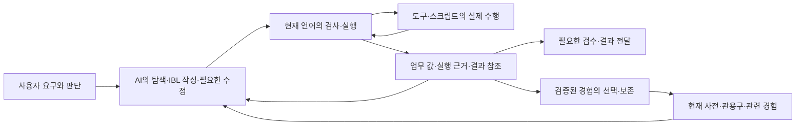

# IBL과 주변 시스템의 구조 수렴 설계

상태: **0~6단계의 구현과 후속 수리는 §6.1~6.7에 기록한다. §6.8은 Python 라이브러리 직접 호출의 구현 설계이며 런타임 미구현이다. 함수 직접 호출·객체·메서드·값 변환을 하나의 첫 구현 범위로 정했다. 기능 구현과 운영 비용 개선은 별도 상태다.**
작성·보완: 2026-09-27. 최초 조사 `918fc1ee`, 검토·탐침 기준 정본 main `09a2b99c`.
범위: 사용자 요구가 IBL 작성·실행·피드백·재사용으로 이어지는 전체 경로.
목적 정본: [IBL 진화 목적](IBL_EVOLUTION_PURPOSE.md), [vision.md](../data/system_docs/vision.md).

## 1. 이번에 바꾸려는 개발 방향

**처음 만나는 요구도 작은 능력으로 분해하고, 이를 긴 프로그램으로 조합하며, 실행 결과에 따라
필요한 부분을 수정하고, 얻은 능력을 다시 더 큰 조합의 부품으로 쓸 수 있게 한다.** 이것이 이번
계획이 향하는 일반 능력이다. 품질·완료 시간·전체 토큰이라는 목적은 유지한다. 구조 수렴은
이 능력이 커져도 특별 규칙과 재작성 부담이 함께 늘지 않도록 하는 기반이다.

계획은 이 목표에서 필요한 성질을 도출하고 그 의존 관계에 따라 세운다. 특정 업무의 성공률,
실패 빈도나 전후 측정을 다음 개선의 선행 조건으로 삼지 않는다. 사용자에게 실행할 몇 가지
사례를 요구하거나 그 사례에 맞는 정답 절차를 늘리는 것으로 일반 능력의 향상을 대신하지 않는다.
사례는 일반 구조의 결함을 드러내는 반례로 사용할 수 있다. 구현 검증은 설계한 성질을 지키는지
확인하며, 성능 측정은 관측한 효과를 설명한다. 어느 쪽도 목표 구조를 세우는 일을 대신하지 않는다.

사용자의 문제 제기는 오류가 계속 발견된다는 사실 자체가 아니다. 한 기능을 정교하게 만들며
예외·규칙·검사를 쌓은 뒤, 다른 구조 변경으로 그 기능 전체가 불필요해지는 개발의 반복이다.
상상훈련을 더 많이 하거나 피드백 장치를 하나 더 추가하는 것만으로 이 문제를 해결할 수 없다.

따라서 다음 개발 묶음은 **일반 능력을 확장하면서 그 기반을 수렴시키는 일**이다. 새 기능은
이 설계의 책임 배치 안에 자리 잡아야 하며, 기존 기능을 대체할 때는 기존 경로의 퇴장까지 같은
작업에 둔다. 새 능력의 근거는 목표 구조에서 도출한 표현·조합·수정의 공백으로도 충분하다.
운영 실패가 먼저 발생할 때까지 기다리지 않는다. 새 문법·범용 관리자·전면 재작성은 현재
구조로 그 공백을 닫을 수 있는지 따져 필요한 범위에서 선택한다.

단순함은 파일 수나 코드 줄 수 하나로 판단하지 않는다. 작성자가 알아야 할 특별 규칙,
같은 사실을 별도로 판단하는 위치, 함께 수정해야 하는 소비자, 전환 뒤 남은 임시 경로를 본다.
파일을 합치거나 코드를 Python 스크립트 안으로 옮긴 것만으로 복잡성이 줄었다고 하지 않는다.

### 1.1 도달하려는 일반 능력

아래 성질은 업무 이름·자료 주제·특정 모델과 독립적으로 성립해야 한다. 기존에 지원하는
부분은 유지·연결하고, 비어 있는 부분을 같은 계약 아래 확장한다. 이 표는 계속 지향할 목표이며,
이번에 구현한 계약과 이미 있던 기능을 연결한 범위는 §6.1과 구분한다.

| 능력 | 목표 구조 | 개발이 맡을 일 |
| --- | --- | --- |
| 표현과 분해 | 새로운 요구를 지역 함수·명시적 입력·반환·완료 조건으로 구성한다. 저장된 정답 관용구가 없어도 작성할 수 있다. | 작성 지침·계약 조회·검사·실행이 같은 함수와 값의 의미를 사용하게 한다. |
| 조합과 추상화 | 도구·지역 함수·저장 함수로 만든 큰 기능을 다시 하나의 부품으로 쓸 수 있다. 조합 깊이가 늘어도 내부 절차를 매번 펼칠 필요가 없다. | 입력·반환·효과·실패·적용 조건을 호출 경계에 보존하고, 필요한 때 정의와 내부 근거를 펼치게 한다. |
| 결과의 연속성 | 값의 출처·누락·실패·참조가 중첩 호출과 표시 축약 뒤에도 이어진다. | 생산자부터 다음 함수·모델·화면까지 같은 의미를 전달한다. 정상 빈 값과 실패, 자료 불완전과 표시 생략을 구분한다. |
| 부분 수정과 재개 | 새 정보나 사용자 개입으로 계획이 바뀌어도 유효한 결과를 보존하고 영향받는 부분을 다시 구성한다. | 기존 영수증·의존 관계·효과 계약으로 재사용 범위와 다시 실행할 범위를 해소한다. |
| 능력의 축적과 발견 | 경험에서 얻은 절차를 계약으로 찾고 새 조합에 사용하며, 아직 연결되지 않은 수단도 떠올릴 수 있다. | 사전·회상·세계의 지도·증류를 연결하되, 이름의 발견과 실제 실행 가능성을 구분한다. |
| 외부 라이브러리의 직접 조합 | 설치된 Python 함수·생성자·메서드를 그 이름으로 호출하고 객체와 결과를 다음 IBL 호출에 전달한다. | 함수별 래퍼 등록 없이 호출·값 변환·객체 수명·실행 근거를 공통 경계로 연결한다. 구현 계약은 §6.8이다. |

순서는 **계약과 결과의 일관성 → 큰 조합의 추상화 → 부분 수정과 재개 → 능력의 축적·발견**이다.
앞의 성질이 뒤의 성질을 지탱하기 때문이다. 기존 구현을 이용해 독립적으로 진행할 수 있는
부분은 함께 진행한다. 각 단계에서 대체된 규칙을 제거하며 특정 업무의 비교 실험을 기다리지 않는다.

## 2. 현재 구조에서 확인한 것

이 표는 코드 경로 확인과 과거 수리 기록을 구분한다. 실제 모델 성능·운영 호출 빈도·전체 중복
규모를 새로 측정한 감사는 아니다. 과거에 수정한 결함을 현재 미해결 결함으로 다시 세지 않는다.

| 확인 | 근거 | 설계에 주는 의미 |
| --- | --- | --- |
| 현재 문법의 함수·값·제어·검사·실행 기반이 있다. 새 경로는 구형 파싱·암묵 변수 주입보다 먼저 분기한다. | `system_tools_ibl._execute_ibl_unified_impl`, `ibl_v2_entry`, `ibl_v2_compile`, `ibl_v2_runtime` | 코어를 다시 만드는 것보다 주변 소비자가 같은 계약을 사용하게 하는 것이 출발점이다. |
| 검사와 실행은 같은 컴파일 계획을 사용한다. 도구는 선언 계약 또는 호환 어댑터로 연결된다. | `ibl_v2_entry.handle_request`, `ibl_v2_adapters`, `ibl_callable_contract` | 새로운 작성 지원·표시 기능에 별도의 언어 판정기를 두지 않는다. |
| 수정 프로그램의 읽기 재사용, 명시 결과 참조, 관측 반환 필드가 구현돼 있다. | [증분 실행 기록](IBL_INCREMENTAL_EXECUTION_2026_09_26.md)과 해당 코드 | 세션 관리자·새 복구 엔진을 먼저 제안하지 않는다. 기존 계약의 범위와 사용 경로를 정리한다. |
| 전환 시 관측 필드 경고가 새 검사기에 연결되지 않았다가 복원됐다. | 위 증분 실행 기록 §1·§2 | 언어 전환의 완료 범위에 기존 주변 능력의 연결·은퇴가 포함되어야 한다. |
| 구형 제외 정책과 신형 숨김 임시 규칙이 겹쳐 반사 후보가 전부 사라진 일이 있었고, 수리됐다. | [반사 규칙 모순 수리](REFLEX_RULES_CONTRADICTION_REPAIR_2026_09_26.md) | 개별 규칙의 타당성만 검사하면 전체 경로의 모순을 놓친다. 대체 규칙 도입과 임시 규칙 제거가 한 작업이어야 한다. |
| 관용구 반환 필드 표시가 공통 함수로 모여 있다. | `ibl_returns_observed.returns_display`, 회상·카탈로그·describe 소비 경로 | 이미 통합한 곳을 다시 만들지 않는다. 선언과 관측의 의미 차이는 유지한다. |
| 피드백은 정적 검사, 실행 근거, 명시 `criteria`, 감독·최종평가에 이미 있다. | `ibl_quality`, `final_evaluator`, `conscious_supervisor` | '피드백 없음'을 이유로 범용 평가 층을 추가하는 것은 부정확하다. 각 판정의 질문과 비용을 구분한다. |
| 실행 영수증·보고서 저장 저널·검수 후 전달이 별도로 있다. | `ibl_run_journal`, `ai_tips_storage`, `supervision_delivery` | 각각 호출 결과, 업무 데이터 확정, 공개 바이트를 다룬다. 이름이 비슷하다고 하나의 저장소로 합치지 않는다. |

9월 11일의 [시스템 단순화 계획](SYSTEM_SIMPLIFICATION_PLAN.md)은 이미 표시·전송·계측·실행
주변의 정리를 수행했다. 9월 23일 [전환 잔여 계획](IBL_MIGRATION_REMAINING_PLAN_2026_09_23.md)의
1~4단계도 완료로 기록돼 있다. 이 문서는 그 작업을 처음부터 다시 하자는 목록이 아니다.
남은 코드가 실제 소비자를 지원하는지 확인하고, 현재 구조 위에서 다음 변경의 경계를 정한다.

### 2.1 Fable 검토 뒤의 제한 탐침

회상부를 첫 구현 대상으로 정했던 것은 과했다. `ibl_usage_rag`의 자격 판정은 이미
`corpus_policy.exclusion_reason`을 소비하고, 이름 조회는 최신 행의 provenance를 보충한다.
`ibl_name_search` 자체가 세 곳에서 정책을 부르는 것은 아니다. 검색 토큰 길이·관련도·노출
길이는 자격과 다른 질문이다. 구형 본문을 현재 작성 정답에서 제외해도 호환 함수 이름은
소개할 수 있으므로, 모든 경로의 결과를 무조건 동일하게 만드는 것도 옳지 않다.

기존 회상 조립 관문·self-test와 관련 행동 시험을 실행했다(명령·결과는 §6).
이번 표본에서는 회상부를 다시 통합할 결함을 확인하지 못했다. 전체 회상 경로의 완전성 증명은
아니며, **기존 1단계를 제한 사전 확인으로 내리고 결과 전달을 첫 구현 묶음으로 올린다.**

첫 구현 대상은 실제 재현됐다. 수정 전 `BaseProvider._verify_tool_result`는 구조화된 실행 결과의
성공 여부 대신 본문의 `error:`·`failed:`·`traceback` 등을 검색한다. 현재 IBL 런타임의
정상 반환 `"traceback"`은 오류로, `1 / 0`의 실패는 비오류로 표시한다. OpenAI·Anthropic·
Gemini·Ollama 제공자의 호출 지점을 확인했다. 이는 해당 공통 메서드의 오프라인 재현이며,
모든 제공자의 실제 모델 응답·화면에서 같은 문제가 발생했다고 측정한 것은 아니다.

### 2.2 기존 실패 목록과 현재 상태의 연결

9월 16일 감사의 요약을 과거 결함의 참조로 보존한다. 출처는 2026-09-27 사용자가 이 설계의
검토 대화에 전달한 Fable 의견(최초 검토와 `df390007` 재검토)이다. 정본 밖 초안은 인용하지 않는다.
이 검토에서 원 감사의 전체 입력·집계를 재확인하지 못했으므로 **현재 실패 질량이나 미수리
건수로 사용하지 않는다.** 과거 원문을 확보하지 못한 항목은 재현 대기로 남긴다.

| 과거 신호 | 이번에 확인한 현재 상태 | 다음 행동·설계 위치 |
| --- | --- | --- |
| select/filter 필드 추측 | 관측 필드 경고는 9월 26일 복원됨. 관련 기존 시험 통과 | 신규 검사기 금지. 원 사례에서 경고 전달·AI 사용 효과는 별도 확인 |
| 검색 연산자·따옴표 파싱 | 원 실패 문장 미확보. 이후 현재 문법 전환·컨테이너 호출·줄 이음 개정이 있음 | 현행 파서에 원문을 재현한 뒤 구현 오류/표현 공백 분류. 일괄 미수리로 단정하지 않음 |
| 성공+incomplete_steps의 오류 표시 21건 | 해당 21건 자체는 미재현. 같은 결과 전달 경계에서 성공/실패 뒤집힘을 새로 재현·수리 | **G1 수정 전 실패 → 수정 후 통과**. 원 21건의 원인 전체를 설명했다고 단정하지 않음 |
| 페이징·되읽기 비용 | 4078은 결과 참조·reuse 보강, 4083은 ledger limit 범위 수리. 관련 시험 통과 | 원천 절단/의도한 표본/화면 미리보기를 구별. 원 감사의 페이징 건수는 미확인 |
| REPAIR 오라우팅 4/4 | [3803~3807 수리](EPISODE_3803_3807_REPAIRS_2026_09_15.md)에 재판정·예약 출처 보호가 있고 해당 시험 통과 | 원 4건의 시각·요구·분류를 재대조. 최초 분류 품질이 해결됐다는 뜻도 아님 |
| DeepSeek timeout 미지정 | SDK 경로는 명시 timeout이 없고 HTTP 경로는 180초를 지정 | SDK 기본값·상속·호출별 재정의와 원 정체를 확인한 뒤 판단. 명시값 없음=무한 대기라고 하지 않음 |

개발 순서는 §1.1의 일반 능력과 의존 관계가 정한다. 이 표는 해당 구조를 구현할 때 보존할
반례와 미해결 사실을 제공한다. 원문 확보나 빈도 측정을 능력 확장의 착수 조건으로 삼지 않는다.
현재 실행을 깨뜨리는 결함은 수리하되, 그 사례에만 맞는 예외로 공통 구조를 바꾸지 않는다.

## 3. 유지할 전체 구조와 책임

아래는 기존 기능의 책임 배치다. 새로운 서비스·프로세스·폴더 계층을 만드는 제안이 아니다.
저장소의 물리 층 규칙은 그대로 적용한다.



알려진 절차·분기는 프로그램 안에서 진행하고, 새로운 정보로 방법을 정해야 할 때 AI가 다시
작성한다. 저장된 관용구도 같은 호출 가능한 부품이다. 목표에 대한 인간의 변경·개입은 보존한다.

| 책임 | 유지할 소유 위치 | 다른 곳에서 다시 만들지 않을 것 |
| --- | --- | --- |
| 무엇을 달성할지와 새 판단 | 사용자와 기존 인지 경로. 의식이 있는 턴의 기준은 의식이 소유 | 검사기·관측 이력이 새로운 사용자 목표를 생성하지 않는다. 단순 실행에 숙고를 의무화하지 않는다. |
| 언어의 뜻과 실행 순서 | 현재 파서·컴파일러·런타임 | 업무별 문법, 프롬프트 속 실행 규칙, 화면별 별도 타입 추론 |
| 도구의 인자·반환·효과 | 어휘 YAML의 선언, 공통 해소기·어댑터와 실제 핸들러 | 같은 계약의 독립 사본. 관측 필드는 보조 정보이며 선언을 대체하지 않는다. |
| 업무 값과 실행 근거 | 런타임·도구 경계. `value/value_wire`와 근거를 구별 | 자료 누락을 화면 절단으로 바꾸거나, 정상 빈 값을 실패로 바꾸는 소비자별 추측 |
| 표시와 원문 접근 | `model_result_view`와 기존 전송 경계 | 공급자·MCP·UI가 업무 성공이나 반환형을 다시 판정하는 정책 |
| 재개·재사용 | 실행기는 호출 영수증, 업무 스크립트는 업무 확정, 전달 큐는 공개 확정 | 기존 경계를 덮는 별도 범용 재시도/트랜잭션 관리자 |
| 기억의 자격·노출·실적 | 기존 코퍼스 정책·회상·증류 경로에서 각 질문의 소유자를 구분 | 표시 길이 제한을 자격 정책으로 사용하거나, 함수 반환 성공을 목표 달성으로 승격 |

권한·주체·취소·예산 검사는 실제 효과 경계에서 유지한다. 한 곳에서 계약을 정의한다는 말은
외부 입력이나 실행 직전의 필요한 검증을 지우라는 뜻이 아니다. 검증 경계가 여러 개여도
같은 규칙을 소비할 수 있다. `ibl_engine`은 구형 이름만 남은 폐기물이 아니라 현재 도구의
권한·라우팅·후처리에도 쓰이므로 구형 프로그램 실행기와 통째로 묶어 삭제하지 않는다.

## 4. 피드백은 기존 책임 안에서 정리한다

세 질문을 구별한다. 새 전역 성공 플래그나 모든 함수에 강제하는 반환 봉투는 추가하지 않는다.

1. **문장과 연결이 유효한가:** 컴파일러의 정적 진단과 필요한 런타임 검사.
2. **요청한 행동이 실제로 어떻게 끝났는가:** 도구 결과·실행 영수증·부분 실패·업무 상태.
3. **사용자의 요구를 충족했는가:** 프로그램의 명시 완료 조건과 기존 조건부 의미 평가.

명시 `criteria`는 해당 단계의 품질을 판정하고 가능한 경우 제한된 재시도를 한다.
최종평가는 의식이 정한 전체 기준을 판정한다. 같은 자료·같은 기준을 반복 평가하는 경우가
실제로 확인되면 어느 쪽이 맡을지 정리한다. 두 기능이 존재한다는 사실만으로 중복이라 하지 않는다.
파일 존재·행 보존·필수 키 같은 결정 가능한 조건에 별도 AI 심사를 덧붙이지 않는다.

관측에서 얻은 '평소 결과'와 이번 요구의 '필수 결과'는 다르다. 관측 필드는 오타·변화의
단서이고 목표의 정본은 아니다. 관측 밖의 정상 결과를 무조건 실패로 만들지 않는다.
미판정·미완료·실패도 구분하며, 이를 하나의 통과/실패로 접을 때 생기는 의미 손실을 확인한다.

우선 기존 `criteria`·실행 진단·최종평가가 모델 경계까지 어떤 뜻으로 전달되는지 정리한다.
그 전에 관용구마다 예측 모델·자율 교정기·추가 평가자를 붙이는 확대는 이 설계에 포함하지 않는다.

### 의식 없는 경로에서 남는 공백

`criteria_contract`가 없는 EXECUTE·Reflex에는 독립 최종평가가 없다. 기존 시험은 도구 실패·
정체만으로 감독/평가를 뒤늦게 추가하지 않는 정책을 명시적으로 검증한다. 자율주행 표면 전체가
의식 없는 경로인 것은 아니며, 예약도 에이전트 요청·직접 프로그램·장기 goal을 구별해야 한다.
장기 goal에는 `success_condition` 평가가 있고, 업무 스크립트의 완료 검사·명시 criteria도 존재한다.

**공백은 '기준이 없는 실행에서 사용자 요구 충족을 공통 방식으로 독립 확인하는 보장'이다.**
실행자는 요청을 읽고 결과를 판단하지만 별도 검증과 같지 않다. 직접 예약 프로그램에 완료
검사가 없다면 실행 성공 이상을 보장할 수 없다. 이것을 소유자 정리만으로 해결됐다고 하지 않는다.

후속 설계에서는 완료 조건이 있는 호출은 그 조건과 판정 상태를 결과 전달까지 보존하고,
조건이 없는 호출은 확인된 실행 사실과 미판정 범위를 구별하도록 한다. 이 공통 표현을
기존 결정론 검사·선택적 criteria·최종평가가 소비하게 한다. 잘못된 완료 주장 사례의 발생을
기다릴 필요는 없다. 전 턴 평가자 신설이나 자동 THINK 승격은 채택하지 않는다.
이번 문서 개정은 해당 설계 방향을 정하며 운영 평가 정책 자체는 변경하지 않았다.

## 5. 유지·통합·은퇴의 결정

| 대상 | 결정 | 통합하거나 없애는 조건 |
| --- | --- | --- |
| 현재 값·함수·조합 의미론 | 일반 능력 확장의 기준선으로 유지 | 목표 구조에서 도출한 공통 표현의 공백을 현재 의미로 해결할 수 없으면 언어 개정으로 판단 |
| 계약 조회·검사·표시·회상 | 같은 사실은 같은 소유자에서 해소 | 독립 추론·복사된 규칙이 확인되면 공통 결과를 소비하게 바꾸고 기존 규칙 제거 |
| 신구 프로그램 경로 | 새 작성은 현재 의미, 기존 저장본은 명시 호환 경계 | 저장 함수·앱·예약·회원 등 소비자가 이전됐음을 확인한 범위만 은퇴 |
| 전용 Python 스크립트 | 도구 구현·업무 정책·저장 확정은 유지 | 서로 다른 업무가 같은 이음매를 중복 구현할 때 그 부분만 기존 공통 층으로 이동 |
| 원장·증거 저장소 | 서로 다른 수명·권한·확정 의미를 유지 | 같은 사실의 이중 소유가 확인된 부분만 정리. 물리 합병 자체를 목표로 하지 않음 |
| 프롬프트·교재 | 현재 계약의 사용법을 전달 | 엔진 결함을 피하라는 임시 지침은 결함 수리와 함께 제거. 상시 지침 덧붙이기보다 기존 설명 교체 |
| 문서·회귀 시험 | 설계 결정과 실패 재현은 보존 | 오래된 본문은 역사로 표시하고 현행 입구에서 분리. 같은 불변조건의 시험은 재현 범위를 유지해 묶음 |

삭제 조건을 충족하지 못한 호환 기능은 남긴 이유와 소비자를 기록한다. 사용량 0, 파일 이름,
현재 선택하지 않은 모델만으로 죽은 코드라고 판단하지 않는다. 일률적인 삭제 비율이나 줄 수
감축 목표를 두지 않는다. 필요한 복잡성은 한 소유자 아래 명시적으로 남기는 것이 목표다.

## 6. 변경 순서와 각 단계의 끝

0~1단계의 실행 기록과 기존 검사 명령은 보존한다. 후속 단계는 §1.1의 능력을 구현하는
작업이며, 특정 사용자 업무의 전후 측정을 통과해야 시작하는 단계는 없다. 단계의 완료는
목표 계약이 필요한 생산자·소비자에 연결되고 관련 구현 검증을 통과한 상태를 뜻한다.
시간·토큰 개선 수치를 주장할 때는 실제 측정 근거가 필요하지만, 그 수치가 설계·개발의
착수 조건은 아니다.

기존 pytest와 검사 명령을 완료 관문으로 사용한다. 모든 단계에 새 스크립트나 억지로 실패하는
시험을 만들지는 않는다. 실제 결함은 수정 전 실패 재현을 남기고 수정 후 같은 재현을 통과해야
한다. 이미 맞는 경로는 반례를 포함한 기존 행동 시험과 확인 범위를 기록한다. 검사되지 않은
주장을 통과로 승격하지 않는다. 아래 명령은 저장소 루트에서 실행한다.

### 0단계 — 계약·회상 사전 확인 (제한 탐침 완료)

**연결된 실패:** 반사 후보 전멸·보류 이름 재노출·관측 반환의 소비 경로 불일치.
기존 수리를 다시 구현할 근거를 확인하는 단계다. G0는 공급원 조립, 현재/구형 자격,
hold 처리, 노출 중복, 반환 표시·호출 계약 및 무의식 경로의 평가 생략을 검사한다.

```bash
.venv/bin/python3 scripts/check_recall_assembly.py
.venv/bin/python3 scripts/check_recall_assembly.py --self-test
.venv/bin/python3 -m pytest backend/test_corpus_policy.py backend/test_reflex_rules_2026_09_26.py backend/test_phrase_channel_exposed_names_2026_09_26.py backend/test_idiom_observed_returns_2026_09_26.py backend/test_ibl_callable_contracts.py backend/test_evaluation_route_boundary.py -q -o addopts=''
```

**실측:** 조립 관문·self-test 통과, pytest **48 passed**. 소스 검사도 §2.1과 일치한다.
따라서 이 범위는 재정리하지 않고 1단계로 간다. 지역 함수부터 모든 회상 표면까지의 완전한
종단 검증을 마쳤다는 뜻은 아니다. 기존 시험 밖의 모순이 발견되면 해당 반례만 추가한다.

### 1단계 — 결과의 성공·실패 해석을 일치시키기 (수리 적용)

**연결된 실패:** §2.2의 결과 표시 부류, 현재 G1의 성공/실패 뒤집힘.
소유자: IBL 실행기는 실행 상태를 결정하고, 제공자는 이를 운반한다. 구조화된 IBL 결과를
본문 키워드로 다시 판정하는 기존 분기를 대체한다. 일반 도구의 평문·빈 출력 계약까지 무조건
제거하지 않는다. 업무 값 안의 `error` 키나 `traceback` 텍스트를 실행 오류와 혼동하지 않는다.

G1은 실제 컴파일러·런타임과 제공자 공통 검증기를 연결한 최소 재현이다. 네트워크·모델 호출이
없고 운영 상태를 쓰지 않는다. 수정 전 **두 사례 모두 불일치, exit 1**, 수정 후 **exit 0**이다.

```bash
.venv/bin/python3 - <<'PY'
import sys, json
sys.path.insert(0, 'backend')
import boot_paths
from ibl_v2_compile import compile_program
from ibl_v2_runtime import Runtime
from providers.base import BaseProvider
failed = 0
for code in ['return "traceback"', 'return 1 / 0']:
    result = Runtime(compile_program(code, {})).run()
    _, flag = BaseProvider._verify_tool_result(
        None, 'execute_ibl', {'code': code}, json.dumps(result, ensure_ascii=False))
    expected = result['success'] is False
    failed += flag != expected
    print(code, {'success': result['success'], 'is_error': flag, 'expected': expected})
raise SystemExit(1 if failed else 0)
PY
```

**끝:** G1 exit 0. 이 재현을 기존 제공자 회귀에 편입하고 정상·실패·부분 자료·업무 값의 오류
문자열·일반 도구 평문을 함께 확인한다. `_verify_tool_result` 호출부와 실제 전송형(원문/표시
사본)을 통과하는 행동 시험까지 통과해야 한다. 도우미 단위 G1 통과만으로 끝내지 않는다.
기존 무의식 경로에 새 감독·평가·재시도를 만들지 않으며, 같은 상태의 두 번째 판정 규칙을 남기지 않는다.

**적용:** 기존 전송 모듈에 둔 `ibl_result_transport.tool_result_is_error`에서 최상위 bool `success`를
운반한다. 상태 없는 옛 오류 봉투는 최상위 `error`를 읽고, 키워드 호환 판정은 비JSON 평문에만
남긴다. 중첩 업무 값의 오류 문자열과 `source_complete:false`를 실행 실패로 승격하지 않는다.
긴 결과의 마지막 참조 축약에서도 `source_complete`를 보존한다.

API 공통 검증기의 소비자는 OpenAI·OpenRouter·DeepSeek·Anthropic·Ollama·Gemini다.
MCP는 같은 판정을 원문에서 읽어 `CallToolResult.isError`로 전달하므로 Codex·Claude Code와
외부 MCP 클라이언트가 함께 적용받는다. Codex의 item 실패/취소와 MCP 오류 결합은 **전송 상태**이며
업무 본문을 다시 해석하는 중복 규칙이 아니다. 이 경로와 Claude Code 이벤트 소비도 회귀에 포함했다.
Gemini HTTP·DeepSeek HTTP는 별도 오류 플래그를 추측하지 않고 실행 봉투를 모델에 전달하므로
기존 경로의 보존 동작을 검사했다. 특정 모델 이름·업무에 따른 수리 분기는 없다.

기존 `backend/test_public_result_boundary_matrix.py`에 실제 런타임→제공자 도구 처리→모델 입력,
MCP 변환→두 CLI 이벤트, 부분 자료·이미지·참조 축약의 회귀를 추가했다. SDK 네트워크 호출과
실제 CLI 프로세스 실행은 대역으로 분리했으므로 실제 모델의 수정 행동·비용 개선은 미검증이다.

**검증 기록(2026-09-27):** G1 exit 0. 제공자 경계·MCP·완료 대기·값 판정 관문 묶음
**75 passed**. 백엔드 전체 회귀도 실행했으며 최초 실패 12건 중 변경 관련 4건(MCP 응답형식
기대 3건·평문 호환 판정의 관문 사유 1건)은 수정 뒤 위 묶음에서 통과했다. 나머지 8건은
`test_report_repair_contracts_2026_09_08.py`·`test_stale_idiom_overwrite_2026_09_07.py`의
기존 시험 DB/이름 조회 불일치다. 변경한 운영 모듈 3개를 `df390007`의 소스로 메모리에서 로드한
별도 대조도 **동일한 8 failed, 28 passed**였다. 이 8건은 미수리이며 전체 회귀의 완전 통과를
주장하지 않는다. 층·은퇴 계약·어휘 파생 관문 통과, Android 몸 번들 재생성 확인.

### 2단계 — 값·근거·참조의 연속성 확립

**목표 능력:** 결과가 중첩 호출·수집·저장·표시·재입력을 거쳐도 값과 근거의 의미가 이어진다.
기존 실패는 원천 불완전의 은폐/오인, 페이징과 표본의 혼동, 이미 얻은 결과의 재수집이다.
`system_tools_ibl`→`ibl_v2_entry/runtime`→`ibl_run_journal`→`model_result_view`→전송 경계를
본다. 보고서 업무 확정과 전달 큐는 소비자로 확인하며 저장소를 합치지 않는다.

G2는 재사용·재개·참조 입력, 실제 도구 경계와 모델 표시, 공개 값 전송, REPAIR 재판정과
ledger의 표본 범위를 검사하는 현재 회귀 묶음이다.

```bash
.venv/bin/python3 -m pytest backend/test_ibl_v2_incremental_2026_09_26.py backend/test_ibl_run_lifecycle.py backend/test_ibl_v2_boundaries.py backend/test_public_result_boundary_matrix.py backend/test_episode3803_3807_repairs.py backend/test_continuation_and_ledger_scope_2026_09_26.py -q -o addopts=''
```

**기존 확인:** **84 passed**, 기존 Pydantic forward-reference 경고 1건. 이미 있는 기능을
사용해 호출 경계별 값·근거·참조의 전달 계약을 연결한다. 부분 실패·빈 값·의도한 표본·큰 결과가
분기·반복·중첩 호출을 지나도 뜻을 보존하도록 구현하고 검증한다. 과거 원문을 확보하면 반례로
보충하되 원문 부재로 이 작업을 미루지 않는다. 기존 시험 밖의 성질은 구현·검증 상태를 구분한다.

**끝:** 변경한 결과의 전체 값·참조·실패 근거가 왕복 후 동일하고 G1·G2가 통과한다.
쓰기·모델 호출의 reuse 제외와 결과 불명 효과 재전송 금지를 보존한다. 기존 참조로 해결되는
본문 복사·중복 변환만 제거한다. 새 세션 저장소·exactly-once·전역 재시도는 만들지 않는다.

### 3단계 — 공통 계약의 소비 경로 정리와 임시 규칙 제거

**연결된 실패:** 옛 규칙과 대체 규칙의 동시 적용, 검사 통과 뒤 교재·실행 경로의 재분기.
1~2단계에서 바뀐 계약의 조회·검사·표시·교재 경로를 같은 소유자에 연결한다. 제거 목록은 해당 커밋 본문에 남기며,
은퇴한 외부 계약의 문구는 기존 `data/retired_contracts.yaml`과 관문을 사용한다.

```bash
.venv/bin/python3 scripts/check_retired_contracts.py
.venv/bin/python3 -m pytest backend/test_ibl_current_surfaces.py backend/test_conscious_supervisor.py -k 'current or real_pipeline_suppresses_draft_and_fast_lane_has_no_supervisor_call' -q -o addopts=''
```

**기준선:** 은퇴 계약 관문 통과, **52 passed, 45 deselected**. G3는 등록된 은퇴 문구와
선택된 현재 작성·저장·예약·평가 경로를 검사한다. 임의의 죽은 코드가 없다는 증명은 아니다.
**끝:** 변경별 제거 목록의 각 항목이 실제 diff에 있거나, 남긴 소비자·호환 이유가 기록되어야
한다. G3와 변경한 호출자의 행동 시험이 통과해야 한다. 파서 통합·코퍼스 일괄 번역으로 확대하지 않는다.

### 4단계 — 큰 조합을 다시 부품으로 만드는 추상화

**목표 능력:** 처음 만드는 지역 함수와 저장된 함수, 도구를 같은 호출 계약으로 조합하고,
완성한 조합을 더 큰 프로그램의 부품으로 사용할 수 있다.

기존 callable 계약·컴파일러·런타임·계약 조회·작성 지침을 연결한다. 함수의 입력·반환·효과·
실패·적용 조건을 호출자가 알 수 있게 하고, 일상 호출에서는 계약을 사용하며 수정할 때 정의와
내부 근거를 펼친다. 완료 조건과 판정 상태도 §4의 구분을 보존한다. 저장·등록을 처음 작성하는
프로그램의 전제로 두지 않는다. 교재는 요구를 분해하고 지역 함수를 정의한 뒤 최상위에서
조합하는 과정을 설명하며, 특정 업무의 완성 관용구를 늘리는 것으로 이 작업을 대신하지 않는다.

**끝:** 지원하는 함수·도구 호출 경로가 같은 계약을 소비하고 중첩·분기·반복에서도 값·효과·
실패의 뜻을 보존한다. 지역 정의에서 저장·재호출로 옮겨도 명시한 입출력과 적용 조건을 유지하며,
주변 변수에 대한 숨은 의존을 만들지 않는다. 제한은 공통 계약에 드러내고 경계 행동을 검증한다.
현재 중첩·재귀 한계를 무제한으로 풀거나 새 함수 체계를 만드는 것을 전제하지 않는다.

### 5단계 — 의존 관계에 따른 부분 수정과 재개

**목표 능력:** 새 정보·실패·사용자 개입으로 프로그램을 바꿀 때, 유효한 결과를 이어 쓰고
달라진 부분과 그에 의존하는 부분을 다시 실행한다.

기존 증분 실행·영수증·결과 참조를 기준으로 인자·함수 정의·읽은 상태·효과에 따른 재사용
조건을 일관되게 해소한다. 내부 실패 위치와 이미 확보한 값에 접근하게 하여 AI가 해당 부분을
수정할 수 있게 한다. 결과가 불명확한 쓰기 효과와 단순 읽기의 재실행을 구별하고, 기존의
쓰기·모델 호출 reuse 제외를 보존한다. 업무 확정과 공개 확정은 각 소유자가 계속 맡는다.

**끝:** 입력·정의·의존 값이 바뀐 결과는 무효화하고, 계약상 재사용 가능한 결과는 보존한다.
중첩 호출의 진단이 수정할 위치를 가리키며, 부분 실패를 복구해도 원천 누락 근거는 남는다.
취소·권한·예산 검사는 실행 경계에 유지한다. 새 전역 재시도 관리자 없이 기존 경로에 구현한다.

### 6단계 — 조합 가능한 능력의 축적과 발견

**목표 능력:** 과거에 얻은 절차와 아직 실행 어휘가 되지 않은 수단을 새 요구에 맞게 찾고,
그 계약을 사용해 새 프로그램을 구성한다.

기존 사전·코퍼스 정책·회상·세계의 지도·증류를 연결한다. 재사용 후보는 이름만 아니라
적용 조건·입출력·효과·출처를 통해 선택할 수 있어야 한다. 전체 본문을 상시 주입하지 않고
계약으로 호출하거나 필요한 정의만 펼친다. 새 조합에서 반복 사용할 가치가 있는 정의는 기존
저장 경로로 보존하고, 개정·은퇴한 정의와 계약이 회상·검사·실행에서 어긋나지 않게 한다.
지도의 이름은 가능한 수단을 상기시키되 설치·권한·접근 가능성의 보증으로 취급하지 않는다.

**끝:** 새 함수가 기존 계약·저장·조회 경로를 통해 다시 조합 가능한 부품이 되고, 개정·보류·
은퇴 상태가 필요한 소비자에 전달된다. 미등록 요구도 지역 함수로 구성할 수 있어야 한다.
관용구 수나 특정 업무 성공 건수를 완료 조건으로 삼지 않는다. 0단계에서 확인한 기존 정책은
재구현하지 않고, 이 능력에 필요한 연결과 공백만 보완한다.

각 단계의 검증은 일반 계약의 보존을 확인한다. 업무별 성능 측정은 필요할 때 별도로 할 수
있으며 계획의 다음 단계를 여는 관문으로 두지 않는다. 측정하지 않은 시간·토큰 절감은
입증했다고 쓰지 않는다. 후속 개발은 §1.1의 목표 구조에서 남은 공백과 의존 관계를 따라 정한다.

### 6.1 2~6단계 구현 기록 (2026-09-27)

새 문법·업무별 관용구·전역 관리자를 추가하지 않고 기존 소유자에 다음 계약을 연결했다.

| 단계 | 구현과 소비 경로 | 대체·보존 |
| --- | --- | --- |
| 2 값·근거·참조 | `model_result_view.resolve_input_refs`가 원 결과의 지문·출처·선택 경로·불완전성을 전달하고, `system_tools_ibl`→`ibl_v2_entry`→런타임 입력의 `input_ref` 근거로 연결한다. 순수 변환·중첩 호출 뒤 `evidence`로 조회하고 다음 결과 참조로도 이어진다. 재개 지문에 출처를 포함한다. | 값만 풀어 넣던 경계를 대체. 판본 2 업무 값의 `error`·`source_complete`는 상태로 읽지 않는다. 이전 전체 근거는 원 참조로 조회하므로 매 실행에 과거 그래프 전체를 복제하지 않는다. |
| 3 공통 계약 소비 | 도구 `describe`가 실행 어댑터의 해소된 계약을 사용한다. 회상·정의 펼침은 `hippo_tree.phrase_call_line`의 호출·관측 반환 표시를 공유한다. | 조회에서 별도로 만들던 레거시 파라미터 계약과 회상의 호출 줄 조립을 제거. 구형 저장 함수의 실행 다리와 Record 봉투는 유지한다. |
| 4 조합의 추상화 | 컴파일러가 함수별 입력·반환과 함께 파이프 자리·기본값 식·전이적 도구/효과·정의 지문을 생성한다. `check.functions`와 저장 함수 `describe`가 같은 결과를 소비하며 내부 검사 수와 호출 경로를 전달한다. | 함수 조회에 프로그램 전체 효과를 붙이던 경로를 제거. 기존 지역 함수→메모리/워크플로 저장→더 큰 함수의 호출 경로와 명시 입력·자유 변수 금지는 유지한다. |
| 5 부분 수정·재개 | 읽기 재사용 키를 액션·인자·선택 계약(구현 포함)·의존성·코어 의미로 구성한다. 쓰기·모델·해소되지 않은 효과 이후에는 과거 읽기 재사용을 중단한다. 재사용 영수증은 새 프로그램의 요청 지문으로 저장한다. | 액션·인자·구현만 비교하던 키를 대체. 전체 프로그램 원문은 키에서 계속 제외해 독립된 수정 뒤 읽기를 보존한다. 기존 권한·취소·예산·결과 불명 효과 보호와 resume/replay를 유지한다. |
| 6 축적·발견 | 저장 정의의 같은 시각 개정은 id로 순서를 고정한다. 이름 검색은 관측 반환·provenance를 보존하고 회상/펼침에 적용 조건을 전달한다. `corpus_policy`의 호출 후보 정책을 회상·상시 목록이 함께 소비하며 DB/WAL 변경으로 목록 캐시가 만료된다. | 별도 hold 두 항목 검사 대신 보류·격리·무효 판정을 공통 사용한다. 구형 호출과 compatibility 이름은 허용한다. 최신 정의가 보류됐다고 과거 정의를 다시 추천하지 않는다. 사전·세계 지도·증류의 기존 발견 경로는 유지한다. |

적용 조건의 공개 투영도 `corpus_policy.applicability_note` 한 곳으로 모았다. 내부 provenance
전체를 회상에 노출하지 않는다. 보류는 추천 자격이며, 이미 아는 이름의 명시 실행 권한을
철회하는 장치는 아니다. 설치·권한·접근 가능성은 기존 실행 경계가 확인한다.

일반성은 특정 업무명을 조건으로 분기하지 않는 함수·값·효과·참조 계약으로 구현했다.
`backend/test_ibl_general_capabilities.py`는 실제 참조 입력의 두 번 왕복, 업무 필드와 실행 상태의
분리, 함수별 효과, 변경 계약과 상태 변경 뒤 재사용 무효화, 수정 실행의 replay, 지역 정의의
저장·재조합·하위 정의 개정, 회상/펼침의 적용 조건, 판본별 후보 정책과 WAL 캐시 갱신을 검사한다.
기존 관용구 시험 두 파일의 공용 임시 DB에는 현행 스키마의 `returns_observed`·`provenance`를
보충했다. 운영 코드를 옛 시험 스키마에 맞추지 않았으며, §6의 과거 미수리 8건은 이 보완으로
단독 회귀 36건 모두 통과했다.

**검증:** 정본 맥 전체 백엔드 실행은 **6,754 passed, 9 failed, 1 skipped**였다.
실패는 위 시험 DB 누락 8건과 새 시험 파일의 직접 실행용 pytest 진입점 누락 1건이었다.
두 시험 인프라를 보완한 후 새 계약·단일 러너 관문·기존 관용구 두 파일을 함께 재실행해
**67 passed**를 확인했다. 전체 실행 중 수집된 새 계약 시험 이후 추가한 두 경계 시험도
이 재검사에 포함된다. 보완 뒤 전체를 다시 실행했다고 표기하지 않는다.
층·은퇴 계약·어휘/교재 파생 관문 통과, Android 번들 재생성 확인.

참조의 필드를 골라도 이전 실행 전체의 불완전성을 보수적으로 이어받는다. 효과 이후의 무효화도
자원별 세밀한 분석 대신 남은 외부 읽기 전체에 적용한다. 외부 세계가 실행 밖에서 바뀌었는지
자동 감지하는 계약은 없으며, `reuse`는 호출자가 이전 읽기를 이어 쓰겠다고 명시할 때 적용된다.
재귀 한계·평가 정책·업무 확정·공개 확정의 소유자는 바꾸지 않았다. 실제 모델의 작성 판단이나
시간·토큰 개선 수치는 이번 구현으로 입증했다고 주장하지 않는다.

### 6.2 운영 평가와 다음 연결 수리 (2026-09-27)

**시간 경계:** 구조 수렴 구현 `5237aefb`(06:25) 이후 4096~4101(06:50~08:17)이 실행됐다.
`05c590bb`(09:18)의 권한 집합 직렬화·잘린 도구 호출·함수 조회·오류 안내 수리는 이 실행들 이후다.
따라서 다음 표는 최근 구조 최적화의 운영 관측이며, 후속 수리의 효과 측정은 아니다.

| 에피소드 | 작업 | 경과 초 | 실행 라운드 | execute_ibl 실패/호출 | 전체 토큰 |
| --- | --- | ---: | ---: | ---: | ---: |
| 4096 | AI 동향 첫 시도 | 272.623 | 30 | 5/57 | 2,513,410 |
| 4097 | 행정가 주간 재조사 | 126.369 | 14 | 9/10 | 814,889 |
| 4098 | 창업 주간 재조사 | 103.106 | 24 | 7/20 | 1,400,754 |
| 4099 | 부동산 주간 재조사 | 138.950 | 26 | 15/24 | 1,519,169 |
| 4100 | AI 동향 재시도 | 362.177 | 42 | 8/40 | 6,154,497 |
| 4101 | 부동산 발굴 | 441.364 | 51 | 20/63 | 7,839,660 |

근거는 `episode_log`·`trajectory_event`의 해당 episode_id와 supervision 원문 입력/결과다.
IBL 호출은 실행·조회·검사를 포함한다. 토큰은 `model.usage`의 billable_usage 입력+출력을
합산하며 증류도 포함하되 distillation.cost를 중복 가산하지 않는다. 합계 20,242,379 중
입력 19,987,470(캐시 읽기 19,408,384), 출력 254,909다. 캐시는 입력의 부분집합이고
추론 181,925는 출력의 부분집합이다. 증류 지연은 전경 경과 시간 밖일 수 있으며 동시 실행의
시간을 하나의 사용자 대기 시간으로 더하지 않는다. 첫 보고서 재시도까지는 634.8초·8,667,907토큰이다.

**판정: 구조 기반은 개선됐지만 운영 최적화는 부분 실현이다.** 저장 함수·묶음 수집은 실제로
쓰였으나 새로 보강한 `reuse`·`resume`은 요청 0회, `$ref` 입력은 1회 시도 후 형식 오류,
지역 함수 정의도 1회 시도 후 구문 오류였다. 모델은 deepseek-flash이며 서로 다른 여섯 분야의
독립 표본이 아니다. 같은 조건의 개정 전 실행이 없어 개선율·퇴행률을 계산하지 않는다.
4096은 도구 호출 잘림으로 보고서 미완성, 4097은 문서 갱신 실패, 4098~4099는 구판 우회가 있었다.
4100~4101의 산출물 생성과 내용·근거의 완전한 재검수는 구분한다. 독립 최종평가 경로는 여섯 건 모두 none이다.
Set 오류 26회는 언어 표현 부족이 아닌 내부 권한 메타데이터 경계 결함이었다(`05c590bb`에서 수리).

4100의 read_result 9회·220,075자, 4101의 8회·96,063자를 모두 낭비로 세지 않는다.
원문 판단·다른 필드·정상 페이징도 있다. 다만 참조 입력의 성공 사용은 없었고 주 실행 입력이
각각 약 34천→235천, 34천→254천 토큰으로 늘어, 읽기→모델 재작성의 비용이 남았음을 보여준다.

#### 이번 연결 수리의 책임과 범위

| 공통 간극 | 소유자와 수리 | 보존·제외 |
| --- | --- | --- |
| 결과를 읽는 안내만 있고 다음 계산 인자는 직접 재구성 | model_result_view가 판본 2 `result_ref.input_args`와 read_result의 선택 전체값용 `input_args` 제공. 기본 읽기를 업무 value로 고정해 value_wire·근거 그래프를 크기순으로 읽지 않게 함. 잘못된 최상위 `$ref`는 이름을 가진 정확한 예로 실행 전 거절 | 원문·타입·출처·불완전성 보존, 입력 자동 주입 없음. 읽기 페이지를 전체 값으로 오인하지 않음 |
| 부분 재사용 기능을 발견하기 어려움 | Runtime이 이미 판정한 읽기 효과와 성공 영수증으로 `continuation.reuse_args` 제공. 실제 요청 인자를 그대로 사용할 수 있고 전송 경계도 보존 | 실행 불명·정리로 차단된 실행에는 제안 없음. 최신 조회 여부는 호출자가 결정. 권한·구현·의존성 검사와 쓰기/모델 제외 유지. 자동 재시도·자동 reuse 없음 |
| 처리 종료가 목표 달성으로 읽힘 | execution_trace가 task_status_scope와 에피소드별 마지막 기록 goal_evaluations를 따로 전달. 기존 평가 사건만 사용하고 미평가·미관측·판정 불명을 구분 | 작업 DB 상태·평가 정책은 유지. 과거 승인 이후 현재 산출물까지 검증했다고 주장하지 않음. 산문 분류나 추가 평가 모델 없음 |
| 실제 도구를 쓰는 분해·완료 조건의 예제가 부족함 | 조합 교재에 지역 함수의 문서 읽기→존재/비어 있지 않음 검사→미완료 보존 예제와 선택 결과 참조/부분 수리 설명 추가. full/compact 교재의 모호한 inputs 안내 교체 | 내용의 정확성과 파일 존재를 구분. 업무 complete:false를 실행 실패로 재해석하지 않음. 모든 작업에 강제 분해·검수 호출을 추가하지 않음 |

검증은 `backend/test_ibl_operational_handoff.py`에서 실제 반환 인자 그대로의 참조 왕복,
실패 뒤 코드 수정·읽기 미재실행, 잘못된 입력의 실행 전 차단, 페이지를 넘는 평가 상태 보존,
문서 누락·빈 문서·정상 문서의 완료 조건을 확인한다. 기존 참조·재개·전송·교재·실행 추적 회귀도 함께 검사한다.
실제 모델의 사용률·시간·토큰 개선은 후속 운영 관측으로 확인할 항목이다.

**검증 결과:** 관련 회귀 126건, 정본 맥 전체 백엔드 6,797 passed·1 skipped·실패 0(607.94초).
층·은퇴 계약·어휘/문서 파생·Android 번들 검사를 통과했다. 라이브 HTTP에서 첫 결과의
input_args를 그대로 다음 요청에 보내 합성 값 2+3=5를 확인했으며, 기존 4097의 추적 페이지에서
목표 평가 not_evaluated가 조회됐다. 운영 보고서 재실행이나 모델 비용 개선 실험은 하지 않았다.

#### 지속할 작업 방식과 남은 범위

최근 변경 이후의 운영 묶음을 기존 원장으로 읽고, **설계 계약 → 실제 활용 → 품질·비용 → 공통 수리**를
이 절에 누적한다. 이미 수리한 결함, 현재 재현되는 결함, 기능은 있으나 미사용인 경우를 구분한다.
수리마다 변경 시점·대상 에피소드·재현과 검사·잔여를 남기며 후속 운영을 이전 수리의 증거와 혼동하지 않는다.
캐시·내부 모델·증류를 포함하되 중복 합산하지 않고, 실패 뒤 재요청도 같은 사용자 목표의 비용으로 설명한다.
이 절차를 개발의 대기 관문이나 매 실행의 새 평가 호출로 만들지 않는다. 주기·종료 조건이 없는 자동 예약은 만들지 않는다.

남은 범위는 실제 모델의 참조·부분 수리 사용과 새 과제의 분해 행동, 큰 반환값의 선택 설계,
완료 조건을 작성·검사·최종 전달까지 보존하는 공통 계약이다. 이번 완료 상태 표시는 관측의 수리이며
기준 없는 요청의 목표 달성을 독립적으로 보장하는 구현은 아니다. 외부 자료의 정확성·누락과
회상 후보의 실사용률도 이후 운영에서 검토한다. 업무별 정답 함수의 추가로 이 공백을 대신하지 않는다.

### 6.3 값 처리 기반 통합 개정 (2026-09-27, 구현·이행 완료)

사용자 승인: 일반 능력의 목표 구조에서 개발 범위를 정하며, 과거 에피소드의 빈도를
기능 도입의 선행 조건으로 삼지 않는다. 필요한 기반을 생략한 임시 구현 대신 계약의
생산자·소비자·교재·이행을 한 개정에서 연결한다. 성능 개선은 검증 결과와 구분한다.

**목표 구조:** 판본 2의 식 트리·값 연산·평가를 공용 층으로 내려 현재 프로그램과
기존 compute/reduce/할당식이 함께 사용한다. 구식 Python 표기 AST는 호환 입력 변환기로만
남기고 Python compile/eval 기반 독립 실행기는 제거한다. 파싱 성공만으로 호환성을
주장하지 않는다. 기존의 열 이름·col·조건식·연쇄 비교·숫자 관측·명시 str 및 문자열
함수의 암묵 변환은 호환 트리에 명시하고, 새 식에 그 규칙을 전파하지 않는다.

**개정 범위:** 문자열(split/replace/strip/upper/lower/contains/join), 슬라이싱,
zip/enumerate/any/all/sorted, 레코드 keys/values/entries, 순서 보존 목록 집합
연산(unique/union/intersection/difference), 레코드·호출 인자 펼침, 다중 행 문자열,
assert와 구조화된 실패. 집합 함수는 처음 나온 대표 값을 보존하며 values_equal을
공유한다. 독립 Set 타입은 두지 않는다. JSON의 한계 때문이 아니라 현재 일반 능력을
충족하면서 도구 경계·추가 타입 계약을 줄이기 위한 선택이다.

**책임:** 함수 서명·값 의미는 common, 원문 문법은 공통 파서, 펼침의 순서·타입과
assert의 조건·실패·근거는 컴파일/평가 경로가 소유한다. 순수 함수의 반복 작업도 실행
예산에 포함한다. 새 공용 파일은 실행 의미 지문에 들어가 재개·재사용을 무효화한다.
기존 API 모듈은 재수출하여 소비자의 타입 동일성과 import 경로를 유지한다.

**완료 기준:** 저장 코퍼스와 용례의 이행 조사, 기존 회귀와 새로운 분야 중립 조합
검증, 두 입력 표면의 공통 실행 확인, 실패·취소·근거·재개 검사, 정본 교재와 파생물
갱신. 실제 모델의 시간·전체 토큰 절감은 별도 운영 관측 전에는 주장하지 않는다.
조기 종료/지연 실행은 이 개정에 몰래 넣지 않는다. 기존 each 뒤 take의 효과와 실패
의미를 보존한다. 향후 명시적 수요·취소·부분 결과 계약으로 설계한다.

**이행 조사:** [집계와 재현 스크립트](experiments/ibl_value_revision_2026_09_27/audit.json).
관측 코퍼스는 판본 1 9,398건·판본 2 896건이며 저장 파일 24개를 함께 조사했다.
구판 table compute/reduce/select에서 추출한 고유 식 115종 중 종전 compile_expr가
받던 113종을 새 호환 입력 변환기도 모두 받는다. 두 종류의 거절은 종전에도 있던
ValueError/SyntaxError다. 현재 문법으로 바로 읽으면 85종은 열 이름 바인딩 변환,
7종은 구문 변환이 필요하다. 23종의 직접 파싱 성공도 같은 실행 의미의 증명은 아니다.
암묵 문자열 변환의 영향을 받을 수 있는 식은 3종이며, 값이 없는 조사로 실제 null
의존 여부까지 주장하지 않는다. 전체 미래 식이나 모든 동적 코드의 조사도 아니다.
조사는 식을 실행하지 않으며 원문 대신 지문과 집계만 저장한다. 기준선은 변경 전
safe_expr.py(5d76eb63)이고 audit.py --baseline <저장한 기준선 경로>로 재현한다.

**연결한 구현:** common/expression_*의 트리·함수·평가기와 구판 입력 변환,
판본 2 모듈의 import 호환 재수출, 펼침의 정적/실행 시 인자 검사, assert 실패 근거,
공유 단계·반복 행 예산, 실행 의미 지문과 구판 의존 폐포.
구판 튜플 문자열화·문자열 반복/서식·리터럴 산술 오류·min/max의 종전 의미도
호환 트리에서 보존하며, 새 식의 명시적 값 규칙과 구분한다. 목록 집합 연산은
value_semantics.equality_bucket으로 비교 후보를 좁히고 values_equal로 최종 판정한다.
날짜-시각 비교는 동치 관계가 아닐 수 있어 날짜를 거칠게 묶고 원래 판정을 보존한다.
파서에 새 기능을 넣기 위해 기존 부작용이나 순서·실패를 최적화로 생략하지 않는다.
교재의 실재 예제와 새 용례 3건을 검사했으며 add_examples_batch 경로로 등록·시맨틱/FTS
색인을 완료했다. join 검색어에 교집합·차집합을 연결하고 기존 관련 용례 7건을 재검토했다.

**검증 결과:** 정본 맥 전체 백엔드 6,963 passed·1 skipped·실패 0(620.01초).
전체 실행 시작 뒤 보완한 중첩 펼침과 구판 튜플·리터럴 연산의 호환 경계는 관련
교재·구판 식·관리 기록·재사용을 포함한 607건으로 다시 검증했다(16.80초, 모두 통과).
층·값 판단·은퇴 계약·어휘/문서 파생 검사 통과, Android 번들 재생성 완료.
라이브 HTTP에서 다중 행 문자열→split→difference→sorted→함수 인자 펼침→assert→
join/역순 슬라이싱의 조합을 실행해 ["a","c"]와 "a / c"를 확인했다.
구판 table:compute의 split(null), str((1,2)), 문자열 반복도 각각 "None", "(1, 2)",
"xxx"로 기존 의미를 보존했다. 백엔드 ACTIVE 상태 확인.
모델의 실제 시간·전체 토큰 개선율은 이번 구현 검증에 포함되지 않는다.

### 6.4 도구 값 경계·선택 범위·본문 이미지 전달 (2026-09-27, 수리 완료)

4102 관측: 495.477초·49라운드, IBL 프로그램 27회·53액션. 도구 실패 5건은
소수 좌표 전송 2건, 선택 범위가 unknown이 된 PARTIAL_SOURCE 2건, 사용자 작성
JavaScript 괄호 오류 1건이다. 입력 참조 5회와 읽기 영수증 2건의 재사용은 작동했으나
11회 되읽기로 약 10만 자를 전달했다. 개인 나들이 지식을 추가하지 않고 공통 경계를 수리한다.

- **숫자 전송:** IBL Decimal의 십진 표기가 JSON 숫자 왕복 뒤 같을 때만 float로
  투영한다. 정밀도 손실·비유한 수·큰 정수·Unit/Result는 거절하고 인자 경로를 제공한다.
  원래 타입 값과 영수증 지문은 유지하고 실제 도구에 투영한 사본을 보낸다.
- **범위:** 요청 limit 충족은 selection, 미충족 수집 누락은 source. 장소 검색의
  뒷페이지 실패를 정상 결과로 삼키지 않는다. 브라우저 스냅샷은 전체 요소 수와
  표시 수를 유지하며 표시 예산 선택임을 선언한다. unknown/source 거절은 유지한다.
- **본문·이미지:** 기존 crawl의 content에 CSS 선택 영역과 이미지 첨부 옵션을 둔다.
  같은 HTML 스냅샷에서 본문과 이미지 주소를 추출하고 원문 출처를 보존한다.
  이미지 첨부는 기존 멀티모달 경계의 4장 한도를 따르며 후속 offset과 실패를 명시한다.
  원문 캐시와 선택 결과를 구분하고 현재 브라우저 탭을 이동시키지 않는다.
  모델 표시 전에 이미지 바이트를 공통 이미지 봉투로 추출해 일반 문자열 미리보기의
  500자 절단을 피한다. 전체 원문·타입 값은 기존 결과 저장소에 유지한다.
- **검증:** 좌표/중첩 값/정밀도 손실, 페이지 실패와 요청 표본, 표시 제한과 실제 누락,
  본문·이미지 선택/페이지/전달 실패 및 모델 첨부 경계의 회귀로 검사한다.
  실제 모델의 전체 시간·토큰 개선율은 후속 업무 관측 전에는 주장하지 않는다.
- **검사 결과:** 관련 회귀 72 passed, 정본 맥 전체 백엔드 7002 passed·1 skipped·실패 0
  (606.44초). 층·값 판단·은퇴 계약·어휘/문서 파생·Android 번들 및 커밋 관문 통과.
- **실제 연결:** 재기동한 HTTP 실행기에서 원 에피소드의 소수 좌표와 장소 검색
  limit:2가 성공했다(전체 10건 중 2건, selection, source_complete:true).
  실제 공지의 관측된 CSS 영역에서 본문 164자와 이미지 1장을 함께 읽었고,
  이미지 첨부 216,084자는 모델 미리보기·공통 이미지 추출 뒤에도 온전히 보존됐다.
  5장 공지의 4+1 페이지는 고정 자료 검사로 같은 HTML 캐시·source_ref 재사용을 확인했다.
- **반영:** 이전 워커가 사용자 실행 0건·비동기 자식 1건으로 배수를 완료하지 못했다.
  기존 제어 프로토콜로 대기를 취소하고 명시적 강제 재기동 후 ACTIVE를 확인했다.
  자식 작업의 정확한 정체·정체 원인은 미확인이며 이 수리에서 해결했다고 주장하지 않는다.

### 6.5 후보를 숨기지 않는 표시와 본문 전달 (2026-09-27, 수리 완료)

4103은 112.268초·11라운드·도구 실패 0건이지만, 원문 문화정보 11건 중 첫 6건만
표시하여 7번째 후보를 후속 검토하지 못했다. 참조 입력은 작동했으나 메뉴가 앞선
본문을 재포장한 뒤 다시 10,347자를 읽었다. 개선 전후 업무가 달라 비용 절감의
인과 비교로 삼지 않는다. 일반 검색의 무관한 결과와 후보의 실제 운영일은 별개다.

- 표시 사본만 글자 예산으로 압축한다. 짧은 값에 필요한 몫을 먼저 배정하고 남은
  예산을 긴 값에 나눠, 고정 6행/12필드 절단을 없앤다. 큰 목록·깊은 구조는 한도를
  두되 생략 경로·원래 수·표시 수와 실행 없이 읽는 인자를 제공한다. 원문, 입력 참조,
  값의 순서·타입·실패/근거 판정은 유지한다. 표시 생략은 원천 누락과 구분한다.
- HTML 본문 선택은 semantic main/article와 일반 편집기의 명시 본문 컨테이너를
  공유한다. 페이지 UI는 제거하되 본문 안 머리말·표·날짜·설명은 보존한다. 선택 범위를
  공개하고 저장 HTML은 유지한다. 불명확하면 기존 body 범위를 유지한다.
- 교재는 전체 후보에 조건을 적용한 뒤 표시하고, 검색 성공을 관련성·당일 운영의
  검증으로 오인하지 않게 한다. 검색 결과를 임의 삭제하거나 평가 AI를 추가하지 않는다.
- 검증: 7번째 후보·후반 날짜 필드, 큰/깊은 값의 생략 조회, 실패·이미지 보존,
  공통 HTML과 기존 수집 회귀 및 실제 4103 저장 입력 재생. 실제 모델의 다음 업무
  성과는 별도로 관측한다. 빈 증류 결과 자체를 오류로 간주하거나 증류를 끄지 않는다.

최종 검사: 전체 백엔드 **7015 passed·1 skipped·실패 0**(608.89초). 전체 검사 시작 뒤
진단 없는 값 표시의 전송 예외를 제한한 보완은 관련 72건 재검증으로 확인했다.
층·값 판단·은퇴 계약·어휘/문서 파생·Android 번들·커밋 관문 통과.

검증한 실제 자료 재생:
- 4103 최초 병렬 결과의 11개 후보가 모두 남고, 원문과 같은 값으로 7번째 제목·날짜를
  확인했다. 단일 표시량은 종전 6,596자에서 11,120자로 늘어난다. 후보를 숨겨 얻는
  단발 표시 절감보다 검토 범위 보존을 우선하며, 전체 턴 절감은 별도로 측정한다.
- 전문을 다시 포장했던 반환값도 새 표시에서 원문과 동일한 값으로 전달됐다. 두 전시의
  날짜가 첫 응답에 보이며, 종전 고정 500자 절단 뒤 10,347자 재조회 경로가 필요 없다.
- 저장 HTML의 문화재단 본문은 2,242→1,122자, 갤러리 글은 2,936→1,835자로 줄고
  전시 종료일·운영시간을 유지했다. 이를 전체 업무의 토큰 절감률로 환산하지 않는다.
- 재기동한 실제 HTTP 실행에서 문화재단 본문 1,122자·선택 범위·종료일을 확인했다.
  11행 값의 실행 결과를 모델 표시 경계로 전달해 7번째 제목·날짜와 생략 진단을 확인했다.
- 일반 검색의 관련성 개선은 기존 후보 전체 대조·상세 조회를 가르치는 교재로 반영한다.
  불확실한 후보의 삭제나 추가 평가 모델은 도입하지 않는다. 별도 대화 요약 호출의
  에피소드 비용 귀속은 원인이 미확인이라 이 변경의 완료 범위로 주장하지 않는다.

### 6.6. 4104·4105 — 타입 진단·원천 계약·읽을 수 있는 검수와 문맥 재사용 (2026-09-27)

관측: 의료 상담 78.432초/386,758토큰(후처리 포함), 부동산 보고서 937.212초/
3,700,182토큰(캐시 읽기 3,390,654). 후자의 상위 호출 실패 3회와 초기 묶음 내부
원천 실패 10회는 서로 다른 지표다. 컴파일러 오류 뒤 다음 호출까지 149초,
첫 HTML 검수부터 통지까지 약 5분은 구간 관측이며 전부 회피 가능한 낭비로 계산하지 않는다.

이번 수리의 책임·계약:
- 타입 분석은 Result와 Union의 내부 표현을 구분한다. 잘못된 unwrap은 진단으로 끝나고
  유효한 Result 합집합은 내용 타입을 합친다. 목록/값 참조의 오류 안내도 실제 계약을 말한다.
- 호출 계약의 maximum을 공통 사전 검사·실행 검사에 연결한다. 직방 상한은 사전 데이터,
  빈 groupby 키는 표 계약이 소유한다. 정적 목록도 실행 없이 검사하며 동적 인자는
  런타임에 검사한다. 저장된 기본 수집 관용구의 60건 요청도 50건으로 수정한다.
- 지역명은 기존 행정구역 정규화를 재사용한다. 도 약칭만 맞추며 동의 부분 문자열,
  다른 도·동명이인의 첫 검색 후보를 고르는 우회는 허용하지 않는다.
- 보고서 공용 CSS는 긴 셀을 줄바꿈한다. 렌더는 실제 이미지 크기와 DOM 가로 넘침을
  반환한다. 이미지 읽기·비평은 긴 이미지를 개요+전 구간 원본 픽셀로 한 호출에 전달한다.
  제한을 넘으면 명시 실패하며 페이지를 조용히 생략하지 않는다. 추가 평가 호출은 없다.
- 실행 증거에서 tool_failure를 세어 외부 원천 실패·상위 실패·사전 검사 거절을 구분한다.
  실패 재조회 기본 경로는 거대한 evidence 대신 diagnostic/issues/error다.
- 가이드의 본문 지문·명시적 if_hash·절 제목 조회를 모든 호출 표면에 연결한다.
  현재 문맥 보유를 자동 추정해 본문을 숨기지 않는다. 본문을 잃으면 전문을 다시 읽는다.
  기본 프롬프트의 무차별 축약이나 새 요약 모델 호출은 도입하지 않는다.
- 검색 교재는 site: 연산자의 정확한 표기를 안내한다. 실제로 존재할 수도 있는 site.*
  도메인을 런타임이 임의로 다른 검색 뜻으로 바꾸지 않는다.

검증 결과:
- 원래 4105의 실패 프로그램과 손실 없는 저장 입력을 재생해 컴파일 오류 0건을 확인했다.
  잘못된 unwrap 최소 예제는 TYPE 진단, 유효한 Result 합집합은 값·내용 타입을 보존한다.
- 실제 HTTP에서 잘못된 unwrap·직방 limit 60·빈 groupby 키가 실행 전에 거절된다.
  동적 limit 및 구판 직방 직접 호출도 외부 조회 전에 거절한다. naver에는 직방 상한을 적용하지 않는다.
- 원래 논산 보고서의 표 5개를 그대로 렌더했다. 가로 넘침은 데스크톱 2→0개,
  모바일 4→0개이고 DOM 본문은 양쪽 6,022자로 동일하다. 업무 산출물은 덮어쓰지 않았다.
- 390×7,418 이미지가 개요+원본 구간 5개로 한 호출에 전달되고 마지막 픽셀이 보존된다.
  DOM 사실을 전달하는 보고서 관용구도 실제 IBL 실행기와 도구 대역으로 검증했다.
- 저장한 초기 수집 결과에서 내부 도구/원천 실패가 각각 10건으로 집계됐다. 상위 실행 성공과 별개다.
- HTTP 가이드 전문 18,185자에 대해 변경 확인 응답 1,853자, 선택한 절 1,426자였다.
  문자열 수치이며 토큰·전체 턴 절감률로 환산하지 않는다. 세 native 스키마 사본은 공용 한 벌로 대체했다.
- 실 관용구 #4871·#4898을 백업 후 갱신·재색인했고 서명은 기존 정본 게이트로 재산출했다.
  실행 성적·정체성은 보존했다. 부동산 용례 97건의 영향 검토 및 재검토 원장 갱신 완료.
- 최초 전체 검사에서 드러난 구판 재조회 경로의 퇴행 3건을 수정하고, 실제 이미지가 아닌
  stub을 쓰던 시험 경계를 새 준비 단계에 맞췄다. 직접 시험 실행도 pytest로 위임한다.

- 최종 전체 backend 회귀: 7,035 passed·1 skipped·실패 0(605.06초). 전체 검사 시작 뒤의
  직방 구판 사전 검사 이동·다른 원천 타입 보존 보완은 관련 44건 재검증 통과(11.07초).
  층·값 판단·은퇴 계약·어휘/문서 파생 검사 통과, Android 번들 재생성.

실 에피소드의 다음 실행 시간·토큰 절감률은 미측정이다. 긴 이미지의 전 구간 읽기는
입력 이미지 토큰을 늘릴 수 있으며 재검수 감소까지 포함한 총비용으로 평가한다.

### 6.7. 4106~4108 — 사용법·오류 복구 정보의 전달 (2026-09-27)

4106은 최신 메일 제목 5개 조회에 17라운드·76.3초가 걸렸다. 액션 조회의 빈 입력 계약과
상세 사용법 누락으로 인자를 추측했고, 핸들러가 반환한 지원 채널·예시도 봉투 변환에서 유실됐다.
계정 제한 오류는 읽기를 발신 차단으로 설명했으며 Chrome 연결 실패는 TaskGroup 표지만 노출했다.
네이티브 브라우저로 우회했지만 제목 하나는 축약형으로 전달됐다. 4107의 목록 행 필터 오류는
실제 타입 불일치였고, 4108은 별도 실행 결함이 없었다.

- **책임과 변경**: `describe_actions`가 legacy-envelope 액션의 `target_description`을 전달한다.
  설명이 구판 전용이면 소스의 `target_description_edition`으로 구분한다. 구판 each의 do/collect
  설명을 현재 교재로 다시 노출하지 않는다. `channel_read`는 소스 YAML의 입력·허용 값 계약을
  컴파일러와 실행기가 함께 소비하며 새로운 메일 서비스 분기를 코어에 추가하지 않는다.
  조회 개수는 기존 limit·max_results 모두 실제 공급자로 전달하고 동시 지정은 거절한다.
  구판 오류 힌트도 callable_contract의 인자·별칭을 읽어 정상 인자를 미인식으로 오판하지 않는다.
- **복구 정보**: 기존 봉투 어댑터가 usage·지원 채널·가능 액션·stage를 Fault.details에 보존한다.
  신원 관문은 그대로 두고 조회·발신 양쪽의 오류·설정 힌트를 전달한다. Chrome 드라이버는
  중첩 예외의 실제 원인을 마스킹·길이 제한해 전달한다. 서버 설치나 계정 권한을 자동 변경하지 않는다.
- **작성과 전달**: 레코드 목록을 요구하는 곳의 타입 오류에 each 변환·flat_map 대안을 안내한다.
  교재에 실행 가능한 복구 예제와 기존 grep·범위 읽기를 연결하고, 브라우저 가이드에는
  축약된 제목의 상세 확인과 드라이버 간 세션 비공유를 명시한다. 필터의 타입 계약은 유지한다.
- **검증과 한계**: 관련 116건과 전체 검사에서 발견한 경계·검토 원장·러너 보완 후 54건 회귀 통과.
  채널 조회 용례 7건 중 채널 미지정 5건과 학습 파일의 대응 5건은 기존 corpus_review의
  hold 판정으로 회상 실행·학습에서 보류했다. 원문·실적·이전 검토는 보존하고 SQLite 온라인
  백업을 남겼다. 빌드의 코퍼스 열거도 기존 학습·회상 소비자의 review_exclusion_reason을 사용한다.
  미검토 오류는 계속 실패하며, 보류된 원문을 유효한 실행 예제로 주장하지 않는다.
  새 회귀는 잘못된 인자의 외부 호출 차단, 기존 메일·Nostr
  호출, 계정 우회 거절, 오류→모델 표시 전달, 두 목록 변환, 중첩 예외 원인·마스킹을 검증한다.
  전체 회귀·실행 서버 반영 결과는 changelog에 기록한다. 실제 사용자 작업의 시간·토큰 개선과
  브라우저의 전체 제목 재조회는 이 계약 검증으로 대신 주장하지 않는다.

### 6.8. Python 라이브러리 직접 호출 — 구현 설계 (2026-09-27)

**결정: 설치된 Python 라이브러리를 이름으로 찾아 직접 호출하는 외부 언어 연결을 만든다.**
4108의 질문에서 발견한 공백은 Python 코드를 보관하는 방법이 아니라, 기존 라이브러리의
능력을 새로운 IBL 프로그램에서 바로 조합하는 방법이다. `self:script`는 특정 코드의 결정화이며
이 설계의 기반·대안·우회로로 사용하지 않는다. 함수별 Python 파일 작성·래퍼 등록·새 액션 생성 없이
함수, 클래스 생성자, 객체 메서드, 속성 읽기를 지원한다. 객체 지원을 다음 과제로 미루면
배열·표·모델을 쓰는 작업이 다시 별도 코드 작성으로 돌아가므로 **첫 구현에 함께 포함한다.**

이 절은 구현할 계약을 확정한 설계다. 아래 예제는 아직 실행 가능한 현행 교재가 아니다.
순서는 내부 의존 관계에 따른 구현 순서이며 각 단계 뒤에 사용자의 재승인이나 성능 실험을
기다리는 관문을 두지 않는다. 완료는 아래 범위가 검사·실행·표시·복구까지 연결된 시점이다.

#### 호출 표면: 하나의 액션, 라이브러리 이름은 데이터

`[self:python]` 하나를 Python 실행 패키지의 사전 항목으로 추가한다. `always_on:false`로 두고
Python 능력 탐색 때 활성 사전에서 발견한다. 6노드와 `STANDARD_CORE_NODES`는 유지한다.
모듈명·함수명·클래스명·코덱명은 패키지 데이터이며 파서나 코어의 이름별 분기에 넣지 않는다.
값 타입에 외부 참조를 추가하는 부분은 언어 경계 개정이므로 명세·wire·검사·교재를 함께 고친다.

| op | 입력과 의미 | 결과 |
| --- | --- | --- |
| modules | `query` 선택. 실행 환경의 설치 배포판·모듈 후보를 조회한다. 전부 import하지 않는다. | 환경 ID·지문, 설치 버전, 후보 목록과 탐색 범위 |
| describe | `target` 또는 `receiver`와 `name` 선택. 함수·클래스·객체의 서명과 문서를 한정 조회한다. | 출처·서명·알 수 없는 항목·반환 힌트·효과 계약 |
| call | `target:"모듈:qualified.name"` 또는 `receiver:$객체,name:"메서드"`; `args:List`, `kwargs:Record` 선택 | 기본은 IBL 값, 변환할 수 없는 결과는 외부 참조 |
| get | `target` 또는 `receiver,name`. 상수·속성을 한 번 읽는다. 메서드를 자동 호출하지 않는다. | 값 또는 외부 참조 |
| export | `receiver`, `format`과 형식별 `options` 선택. 객체를 선언된 코덱으로 명시 변환한다. | IBL 값 또는 기존 파일 영수증 |
| release | `receiver`. 참조 소유권을 반납한다. | Unit |

`target`과 `receiver`는 배타적이다. target은 콜론으로 import할 모듈과 그 안의 속성 경로를
명확히 나눈다. `eval`·`exec`·Python 원문 인자는 없다. 위치 인자는 `args` 순서, 키워드 인자는
`kwargs`의 문자열 키를 그대로 따른다. 생략한 기본값은 라이브러리가 결정하며 누락을 null로
채우지 않는다. `args`의 목록 하나와 여러 위치 인자를 구분한다. 파이프 자리는 `receiver`다.
module 함수를 파이프로 호출할 때 인자 위치를 추측하지 않고 지역 변수와 `args`로 명시한다.

```ibl
$평균 = [self:python]{op:"call",target:"statistics:mean",args:[[2,4,6]]}
$배열 = [self:python]{op:"call",target:"numpy:array",args:[[2,4,6]],result:"ref"}
$목록 = $배열 >> [self:python]{op:"call",name:"tolist",result:"value"}
return {평균:$평균,목록:$목록}
```

```ibl
$표 = [self:python]{op:"call",target:"pandas:DataFrame",
  args:[[{분류:"A",금액:3},{분류:"A",금액:5},{분류:"B",금액:2}]],result:"ref"}
$묶음 = $표 >> [self:python]{op:"call",name:"groupby",args:["분류"],kwargs:{as_index:false}}
$합계 = $묶음 >> [self:python]{op:"call",name:"sum",kwargs:{numeric_only:true}}
$행 = $합계 >> [self:python]{op:"call",name:"to_dict",kwargs:{orient:"records"},result:"value"}
return $행 >> [table:filter]{where:($r)=>$r.금액>4}
```

두 예제 모두 함수별 등록이 없다. 별도 Python 소스·라이브러리별 IBL 어휘·중간 스크립트를
생성하지 않는다. IBL 지역 함수와 저장 관용구에서도 동일한 호출을 사용한다.

#### 값과 객체: 손실 없는 기본 변환, 명시적인 자료 추출

- `result:"auto"`가 기본이다. 정확히 대응하는 Python 기본값(None, bool, int, 유한 float,
  str, list, 문자열 키 dict)과 Decimal은 공통 값 규칙으로 변환한다. 하위 클래스는 임의 변환
  메서드를 실행하지 않고 객체로 남긴다. float는 관측된 십진 표현을 보존하며 원래 계산의
  정밀도를 개선했다고 하지 않는다. IBL Decimal의 Python 입력도 Decimal 그대로 전달한다.
  float를 요구하는 함수에는 `builtins:float` 등 명시 변환을 쓴다. 기존 JSON 경계의 묵시적
  Decimal→float 규칙을 이 네이티브 경계에 복제하지 않는다.
- tuple, set, bytes, 복소수, 비유한 수, 문자열 아닌 dict 키, 순환 객체, ndarray, DataFrame,
  모델·파일·이터레이터는 기본적으로 객체 참조다. 컨테이너의 일부가 표현 불가능하면 그
  컨테이너 전체를 보존한다. tuple→List, set→List, NaN→null, 객체→str 같은 손실 변환은 없다.
- `result:"ref"`는 기본값도 Python 객체로 보존한다. `result:"value"`는 값 변환을 요구한다.
  변환 실패는 실제 함수 실행 뒤의 실패이며 `PY_VALUE_CONVERSION`과 보존된 결과 참조를 준다.
  사용자는 그 참조를 export하거나 메서드로 변환한다. 변환 실패를 이유로 원함수를 재호출하지 않는다.
  실패 partial에 보존한 참조도 정상 참조와 같은 소유권·수명을 갖는다.
- 깊이·원소 수·전송 크기를 넘으면 auto는 참조로 보존하고 value는 구조화 실패로 반환한다.
  일부만 잘라 완전한 값으로 반환하지 않는다. 기존 모델 미리보기·result_ref는 변환 후 값의
  표시·재전달을 맡는다. Python 객체 참조와 영속 결과 참조는 다른 종류다.
- export의 코덱 등록은 **자료형→표현**을 연결한다. 함수마다 래퍼를 등록하는 체계가 아니다.
  최초에는 기본 컨테이너의 명시 목록 변환, bytes→파일, ndarray→목록, DataFrame→행 레코드와
  스키마를 지원한다. dtype·인덱스·시간대 등 사라지는 의미와 변환 정책을 결과 근거에 기록한다.
  지원하지 않는 자료형은 객체로 계속 호출할 수 있다. 임의 `repr`·`tolist`·이터레이터 소비를
  변환기의 탐색 과정에서 자동 실행하지 않는다. 파일 출력은 기존 쓰기 관문과 작업대를 거친다.

언어에는 불투명 `ForeignRef` 타입을 추가하고 Python 공급자가 이를 발급한다. 내부 값은
공급자·작업 소유자·실행 환경·워커 세대·객체 ID를 결합한다. 평문 Record를 만들거나 토큰을
복사한 것만으로 참조가 성립하지 않는다. 중첩 입력에서 복원할 때도 소유권을 다시 검사한다.
일반 값 연산은 타입·동일 참조 여부만 판정하며 Python의 `__eq__`, `__bool__`, `__repr__`를
몰래 실행하지 않는다. 속성은 `get`, 항목 접근은 `operator:getitem` 직접 호출로 표현한다.
참조가 나타내는 객체의 공개 메서드는 call로, callable 객체 자체는 name 없는 receiver call로
호출한다. Python callable 참조를 다른 함수에 인자로 줄 수 있어 라이브러리 내부 콜백도 연결된다.
call 결과가 awaitable이면 워커의 같은 이벤트 루프에서 호출 예산 안에 기다려 최종 값을 반환한다.
generator는 자동 소비하지 않고 참조로 남긴다. `builtins:next`의 종료 예외도 실제 호출 실패로
전달하며, 호출자가 종료를 정상 분기로 다룰 수 있다. 특별한 반복 문법은 추가하지 않는다.
IBL lambda→Python 콜백, IBL에서 Python 클래스 본문 정의, Python 소스 실행은 이 계약에 포함하지 않는다.

새 참조 태그는 `ibl-value/2`로 협상한다. 기존 값만 있는 응답은 `ibl-value/1`을 유지한다.
미지원 소비자에게 참조를 일반 Record로 위장하지 않고 명확한 프로토콜 오류·표시용 요약을 준다.
API·MCP·참조 입력·변수 바인딩·영수증이 같은 코덱을 소비해야 한다.

#### 객체 수명·동시성·실행 환경

워커는 **최상위 IBL 실행 하나**에 귀속된 별도 Python 프로세스다. 같은 프로그램의 지역 함수,
관용구와 반복은 같은 워커·모듈 상태·객체 저장소를 사용한다. 다른 실행·프로젝트·에이전트와
객체를 공유하지 않는다. 병렬 가지에서 동일 워커로 보낸 Python 호출은 직렬화하며, Python 호출
외의 IBL 가지는 기존대로 병렬 실행한다. 라이브러리 내부 병렬 실행까지 직렬이라고 주장하지 않는다.
효과가 불명인 Python 호출을 포함한 쓰기 충돌 가능 조합은 기존 보수적 효과 검사도 통과해야 한다.

프로그램 종료·취소·시간 초과·워커 종료는 해당 참조를 모두 만료시킨다. 함수 반환으로 바깥 지역에
객체를 전달할 수 있지만 최상위 반환 객체는 수명 종료 표시만 남고 다음 실행에서 호출할 수 없다.
여러 모델 턴이나 영속 재개에 필요한 결과는 종료 전에 값/파일로 내보낸다. 모델 결과에는 타입·
수명·환경과 export 안내를 함께 표시한다. `release`는 idempotent이며 실제 자원 종료를 보장하지 않는다.
파일·연결의 `close`나 컨텍스트 관리자의 진입·종료는 IBL try/finally에서 명시 호출한다.
참조 개수·변환 크기·작업 시간 예산은 호출 전에 검사하고, 프로세스 메모리 감시도 둔다.
강제 종료 시 Python finally·외부 자원 정리가 실행됐다고 기록하지 않는다.
[Python 프로세스 종료 문서](https://docs.python.org/3/library/multiprocessing.html#multiprocessing.Process.terminate).

첫 환경은 현재 몸의 패키지 런타임 하나이며 호출 인자로 임의 interpreter 경로를 받지 않는다.
Python 버전·배포판 버전·설치 manifest·편집 가능 패키지 소스 지문·브리지 구현을 환경 지문에
포함한다. 프로그램 중 환경 변경을 감지하면 재바인딩하지 않고 `PY_ENV_CHANGED`로 중단한다.
관리되는 환경 쓰기는 실행 중인 워커와 잠금을 공유한다. 외부 pip·수동 파일 변경까지 그 잠금이
막지는 못하므로 각 dispatch 전후에도 지문을 확인하고, 실행 중 변경이면 결과의 환경 일관성을
보장하지 못한 실패로 남긴다. import 가능 여부는 실제 워커에서 확인한다.
배포판 이름과 import 이름은 별개이며 modules가 후보와 확인 여부를 구분한다.
없는 모듈은 `PY_MODULE_MISSING`, 바이너리/하위 의존성 import 실패는 `PY_IMPORT_FAILED`다.
call 도중 자동 pip 설치·업그레이드·다른 몸 위임은 없다. 설치는 기존 패키지 관리 경로가 맡고
설치 완료 후 새 실행에서 바로 호출할 수 있다. 라이브러리별 IBL 등록을 추가로 요구하지 않는다.
Python 실행 환경이 없는 몸은 `PY_RUNTIME_UNAVAILABLE`을 반환한다.

#### 발견·계약·권한

modules → describe → call은 탐색 경로이지 필수 왕복 순서가 아니다. 이름과 입력을 알면 바로
call한다. describe는 `inspect.signature`와 정적 속성 조회로 서명·문서·관측 가능 타입을 얻는다.
서명을 얻지 못하는 확장 함수는 `signature:unknown`으로 두고 실행 직전 Python 인자 검증을 쓴다.
타입 힌트를 평가하거나 default/annotation 객체를 임의 실행하지 않는다. 속성 탐색 중 descriptor를
호출하지 않으며, 실제 get의 property 실행은 별도 호출 사건이다. import도 코드를 실행하므로
describe를 무조건 순수 조회라고 간주하지 않는다.
[Python inspect 문서](https://docs.python.org/3/library/inspect.html).

확인된 함수별 메타데이터는 환경 지문에 묶인 사전 데이터로 축적할 수 있다. 이는 입력·결과·
효과의 정확도를 높이는 선택 사항이며 호출 자격 조건이 아니다. 선언 출처와 추론·관측을 구분한다.
정적 target은 컴파일 때 알려진 계약으로 검사하고 동적 target은 실행 직전에 같은 resolver가
검사한다. check는 새 import나 함수를 실행하지 않는다. 미확정 항목은 오류 대신 미확정 경계로
보고하고, 타입·중복 인자·권한 등 확정 위반만 사전에 차단한다. 서명 획득이 가능하면
`Signature.bind`로 위치 전용·키워드 전용·가변 인자·중복 전달을 호출 전에 검사한다.

일반 라이브러리 호출은 로컬 코드 실행 권한이다. 노드 self 접근이나 함수 효과 메타데이터가
이 권한을 부여하지 않는다. 최초 공급자는 기존 신원·패키지 접근 검사에 더해 명시된
`local_python` 능력 권한을 검사하고, 임의 코드 실행이 금지된 회원·외부 요청·제한 에이전트에는
허용하지 않는다. 워커는 충돌·수명 격리이며 보안 샌드박스라고 주장하지 않는다. 라이브러리 내부
파일/네트워크 쓰기는 기존 IBL 쓰기 관문을 자동 경유하지 않는다. 따라서 해당 관문으로 모든
접근을 강제해야 하는 실행 문맥에는 이 공급자를 열지 않는다. OS 격리가 없는 상태에서 함수명
차단 목록으로 보장한 것처럼 꾸미지 않는다. 주인의 승인된 로컬 실행에는 호출마다 새 확인을 요구하지 않는다.

#### 오류·근거·재개

모든 호출은 기존 실행 원장에 target/객체 타입, 환경·계약 지문, 호출 위치, 경과 시간, 값/참조
여부를 남긴다. stdout/stderr는 제한·마스킹한 진단이며 업무 반환값으로 파싱하지 않는다.
실패는 resolve/import/bind/invoke/convert/export 단계, Python 예외 타입·메시지·원인 연쇄와
`invoked`, `effect_status`를 기존 Fault.details로 전달한다. Python의 정상 오류 문자열은 성공 값이다.
발견·변환을 포함한 Python 코드 실행의 효과는 기본 `unknown`이며 이름/타입 힌트로 순수성을
추측하지 않는다. 권한·취소·예산 실패의 기존 fallback 제한을 보존한다.

- 초기 공급자의 Python 호출은 **자동 retry·수정 프로그램의 reuse 대상에서 제외**한다.
  순수성 메타데이터가 있더라도 첫 구현에서 임의 import·모듈 상태를 무시한 재사용은 하지 않는다.
  기존 읽기 결과의 재사용 무효화도 unknown 효과를 그대로 따른다.
- 동일 실행 영수증 재생과 수정 실행 reuse는 별개다. Python 호출의 완료 영수증은 실행 증거로
  읽을 수 있지만, 새 워커에는 해당 호출의 모듈·객체 상태가 없다. Python 실행 구간을 건너뛴 뒤
  후속 Python 호출로 이어지는 자동 resume를 금지하고 `PY_STATE_EXPIRED`로 설명한다.
  명시 export한 값·파일을 새 프로그램 입력으로 쓰는 것은 허용한다.
- 함수가 실행됐으나 값 변환이 실패하면 원실행 효과는 유지하고 보존 참조만 복구 대상으로 삼는다.
  전송은 기존 invocation ID로 중복 접수를 차단하고, 응답 유실 시 같은 ID의 상태만 조회한다.
  타임아웃·프로세스 충돌·응답 유실은 외부 효과 완료 여부를 `unknown`으로 남긴다. 호출하지 않은
  상태로 되돌리거나 성공으로 표시하지 않는다. 워커 세대가 사라지면 그 참조로 재개하지 않는다.
- 객체를 경유한 결과 근거는 워커에서 실제 실행한 이전 호출들의 보수적 누적 의존성을 포함한다.
  alias·제자리 변경을 특정 행의 독립 결과처럼 표시하지 않는다. export 뒤에도 원천 누락·실패
  근거를 보존한다. 로그·미리보기에 객체 전체를 repr하여 노출하지 않는다.

#### 구현 소유 위치와 완료 조건

| 순서 | 변경 소유자 | 이번 범위의 완료 조건 |
| --- | --- | --- |
| 1. 경계와 타입 | `common` 값/wire, `ibl_v2_types`, `ibl_v2_adapters`의 새 `python-call/1` 프로토콜 | ForeignRef·소유권·wire 협상·동적 계약을 검사와 실행이 공유. 어휘 이름 분기 없이 연결 |
| 2. 직접 실행 | 새 Python 도구 패키지의 resolver·워커·자료 코덱, `ibl_actions.yaml` | 미등록 함수·생성자·메서드·속성·객체 인자·export가 동일 실행 안에서 동작. 패키지 코드가 Python 세부를 소유 |
| 3. 기존 책임 연결 | 실행기의 Adapter 권한/의존성, `ibl_dependencies`, `ibl_run_journal`, 모델 결과 표시 | unknown 효과, 상태 만료, timeout, 참조 입력, 오류 partial, 근거가 API·MCP까지 동일하게 전달 |
| 4. 작성·배포 마감 | `ibl.md`, 조합 가이드, 패키지 도움말, 사전 빌더·몸 번들 | 설치/지원 여부를 발견하고 실제 호출. 문서의 미구현 표시는 실제 종단 검증 후 변경 |

새 backend 모듈은 기존 층에 배정하고 1500줄 제한을 따른다. 공통 코어에는 외부 참조·계약
프로토콜만 두며 Python import·객체 저장소·NumPy/pandas 코덱은 공급자 패키지에 둔다.
기존 script 실행기·등록 DB를 복사하거나 새 범용 워크플로 관리자·독립 평가 AI를 만들지 않는다.
일반 외부 라이브러리 호출을 반드시 script로 보내던 현행 안내는 이 경계가 구현될 때 교체하고,
특정 코드 결정화의 기존 계약과 과거 설계 기록은 유지한다.

필수 검증은 다음과 같다. 특정 업무의 성능 측정 결과를 기다려 구현을 유예하지 않는다.

1. 표준 라이브러리 함수와 사전 미등록 설치 함수 직접 호출. kwargs·기본값·위치 전용·동적 target,
   서명 없는 함수·정상 빈 반환·None·오류 문자열을 검사와 실행에서 구분한다.
2. NumPy 배열 → 메서드 → IBL 값, pandas 생성 → groupby → 집계 → 행 → table 조합.
   호출 가능한 객체·속성·중첩 객체 인자·제자리 변경·alias·명시 release도 검증한다.
3. Decimal·큰 정수·비유한 수·tuple·비문자열 키·순환/대형 자료에서 무손실 값 또는 참조를
   반환한다. 값 변환 실패 후 원함수 호출 횟수는 1회이며 partial 참조로 결과를 회수한다.
4. 위조/타 소유자/만료 참조, 제한 신원, 미설치 모듈, import 부작용·실패, descriptor 조회,
   timeout·워커 충돌·환경 변경·중복 전송에서 실행 여부와 불명 효과를 보존한다.
5. 지역/저장 함수·병렬·catch/finally·최상위 종료·resume/reuse와 결합해 객체 상태를 가짜 복원하지
   않는다. 실행된 쓰기는 재시도하지 않고 값으로 export한 결과만 새 입력으로 연결한다.
6. HTTP·MCP·모델 표시가 같은 성공/실패·참조 수명·근거를 전달한다. 새 기능의 문법만 통과하는
   시험으로 끝내지 않고 실제 설치 라이브러리 실행을 포함한다. 기존 전체 회귀·층·파생물·번들 관문을 통과한다.

이 설계의 이득은 새로운 작업에서 기존 전문 라이브러리를 바로 조합할 수 있다는 것이다.
실제 시간·전체 토큰 개선은 최초 탐색/import 비용, 값 복사, 객체 export와 후속 복구 비용까지
포함해 관측한다. 연결한 라이브러리 수나 IBL 문장 길이를 성능 개선의 증거로 삼지 않는다.

## 7. 변경을 다시 땜질로 만들지 않는 최소 규율

별도 기록 문서를 요구하지 않는다. **기존 커밋 본문**에서 다음 골격을 사용하고, 기존
`data/system_docs/changelog.log`에는 변화와 검증 상태를 짧게 남긴다. 이 보완 커밋부터 적용한다.
고정 템플릿 설정·새 commit hook·필드 검사기는 추가하지 않는다.

```text
목적·소유자: 높이는 공통 능력과 판단을 맡는 기존 위치
계약·소비자: 바뀌는 의미, 영향 경로, 보존하는 동작
대체·제거: 없앤 규칙·지침 또는 남긴 호환 소비자와 이유
검증·잔여: 실패 재현 → 같은 검사 결과, 전체 연결 확인, 미검증 범위
```

단순 변경에는 짧게 쓰며 순수 추가라면 기존 것으로 충족할 수 없는 이유를 적는다. 본문의
항목 수 자체를 성과로 세지 않는다. 발견만 하고 고치지 않은 결함은 '수리 완료'로 기록하지 않는다.

동일한 핵심 계약을 서로 다른 방향으로 동시에 개정하지 않는다. 한 계약의 변경은 생산자,
소비자, 교재, 관련 시험과 임시 경로 정리까지 마친 다음 그 위의 기능을 정교하게 만든다.
독립된 업무 작업까지 직렬화할 필요는 없다. 일부 이행만 끝났으면 상태를 부분 이행으로 남긴다.

상상훈련에서 나온 문제는 **현 계약을 어긴 구현 결함 / 계약 자체의 공백 / 업무별 선택**으로
나눠 다룬다. 첫째는 현재 소유자에서 수리하고, 둘째는 이 설계의 영향을 검토한 뒤 개정하며,
셋째는 해당 프로그램·사전에 둔다. 발견할 때마다 공통 규칙을 추가하는 흐름을 끊는다.

대상 구조가 바뀌어야 할 근거가 나오면, 먼저 이 문서의 책임·대체 관계와 영향 범위를 수정한다.
오류가 새로 나왔다는 이유만으로 방향을 바꾸거나, 기존 설계를 지키려고 오류를 숨기지 않는다.

## 8. 기존 설계와의 관계·이번 작업의 범위

- 목적은 `vision.md`와 `IBL_EVOLUTION_PURPOSE.md`가 소유한다. 이 문서는 현재 구조를 수렴시키는
  개발 순서와 책임 배치를 소유한다. §6.8은 다음 구현의 외부 호출·참조 계약을 제안하며,
  현행 언어 규격은 구현과 함께 `ibl.md`로 반영하기 전까지 바꾸지 않는다.
- [현재 조합 코어 설계](IBL_COMPOSITION_CORE_V2_DESIGN_2026_09_23.md)와 현재 `ibl.md`의 실행
  계약을 기준선으로 쓴다. 과거 설계의 도입 전 진단을 현재 결함 목록으로 복제하지 않는다.
- [작업 분해 설계](IBL_TASK_DECOMPOSITION_DESIGN_2026_09_26.md)는 작성 행동을 다루는 하위
  설계다. 완료된 지침·증분 실행을 재구현하지 않고, 추가 교재·실험은 관련 경계 정리와 연결한다.
- 기존 시스템 단순화·전환 계획의 집행 기록은 보존한다. IBL 바깥 UI·재기동·통신·기기 배포의
  미완료 사항은 이 문서가 완료 처리하거나 새로운 필수 선행 작업으로 끌어오지 않는다.

최초 작성·검토에서는 코드·프롬프트·운영 DB·관용구 등록·설정을 변경하지 않았다. 후속 1단계는
공통 전송 경계·API 기본 검증기·MCP 오류 전달과 관련 회귀를 수정했다. 프롬프트·관용구·평가 정책은
유지한다. G1은 수리 후 통과하며, 실제 운영 전 경로·신규 모델 비교는 미검증이다.
후속 2~6단계는 §6.1의 공통 실행·검사·조회·회상 경계와 조합 교재를 수정했다. 운영 관용구와
업무별 스크립트·모델 설정을 변경하지 않았으며 격리된 저장소로 저장·재호출을 검증했다.
구현 때는 변경 경계의 시험과 저장소의 전체 회귀·파생물·번들 규약을 따른다.
