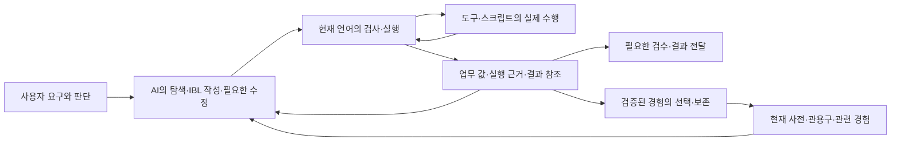

# IBL과 주변 시스템의 구조 수렴 설계

상태: **설계안 작성. 아래 통합·은퇴 작업은 미착수이며 구현 완료나 성능 개선을 뜻하지 않는다.**
작성: 2026-09-27. 조사 기준: 정본 main `918fc1ee`의 코드·설계·수리 기록.
범위: 사용자 요구가 IBL 작성·실행·피드백·재사용으로 이어지는 전체 경로.
목적 정본: [IBL 진화 목적](IBL_EVOLUTION_PURPOSE.md), [vision.md](../data/system_docs/vision.md).

## 1. 이번에 바꾸려는 개발 방향

**이미 만든 능력의 책임과 연결을 안정시켜, 새로운 요구를 더 적은 이음매로 표현하고 실행하며,
다음 개선 때 함께 다시 고쳐야 하는 부분을 줄인다.** 품질·완료 시간·전체 토큰이라는 목적은 유지한다.
긴 IBL 프로그램을 즉석 구성하는 능력과 검증된 관용구를 재사용하는 능력을 함께 키운다.

사용자의 문제 제기는 오류가 계속 발견된다는 사실 자체가 아니다. 한 기능을 정교하게 만들며
예외·규칙·검사를 쌓은 뒤, 다른 구조 변경으로 그 기능 전체가 불필요해지는 개발의 반복이다.
상상훈련을 더 많이 하거나 피드백 장치를 하나 더 추가하는 것만으로 이 문제를 해결할 수 없다.

따라서 다음 개발 묶음의 중심을 **기능 추가에서 구조 수렴으로 옮긴다.** 새 기능은 이 설계의
책임 배치 안에 자리 잡아야 하며, 기존 기능을 대체할 때는 기존 경로의 퇴장까지 같은 작업에 둔다.
필요한 새 능력과 명백한 오류 수리는 계속할 수 있다. 새 문법·범용 관리자·전면 재작성은 각각
현재 구조로 해결할 수 없는 근거가 있을 때 검토한다. 기존 기능의 영구 동결을 뜻하지 않는다.

단순함은 파일 수나 코드 줄 수 하나로 판단하지 않는다. 작성자가 알아야 할 특별 규칙,
같은 사실을 별도로 판단하는 위치, 함께 수정해야 하는 소비자, 전환 뒤 남은 임시 경로를 본다.
파일을 합치거나 코드를 Python 스크립트 안으로 옮긴 것만으로 복잡성이 줄었다고 하지 않는다.

## 2. 현재 구조에서 확인한 것

이 표는 코드 경로 확인과 과거 수리 기록을 구분한다. 실제 모델 성능·운영 호출 빈도·전체 중복
규모를 새로 측정한 감사는 아니다. 과거에 수정한 결함을 현재 미해결 결함으로 다시 세지 않는다.

| 확인 | 근거 | 설계에 주는 의미 |
| --- | --- | --- |
| 현재 문법의 함수·값·제어·검사·실행 기반이 있다. 새 경로는 구형 파싱·암묵 변수 주입보다 먼저 분기한다. | `system_tools_ibl._execute_ibl_unified_impl`, `ibl_v2_entry`, `ibl_v2_compile`, `ibl_v2_runtime` | 코어를 다시 만드는 것보다 주변 소비자가 같은 계약을 사용하게 하는 것이 출발점이다. |
| 검사와 실행은 같은 컴파일 계획을 사용한다. 도구는 선언 계약 또는 호환 어댑터로 연결된다. | `ibl_v2_entry.handle_request`, `ibl_v2_adapters`, `ibl_callable_contract` | 새로운 작성 지원·표시 기능에 별도의 언어 판정기를 두지 않는다. |
| 수정 프로그램의 읽기 재사용, 명시 결과 참조, 관측 반환 필드가 구현돼 있다. | [증분 실행 기록](IBL_INCREMENTAL_EXECUTION_2026_09_26.md)과 해당 코드 | 세션 관리자·새 복구 엔진을 먼저 제안하지 않는다. 기존 계약의 범위와 사용 경로를 정리한다. |
| 전환 시 관측 필드 경고가 새 검사기에 연결되지 않았다가 복원됐다. | 위 증분 실행 기록 §1·§2 | 언어 전환의 완료 범위에 기존 주변 능력의 연결·은퇴가 포함되어야 한다. |
| 구형 제외 정책과 신형 숨김 임시 규칙이 겹쳐 반사 후보가 전부 사라진 일이 있었고, 수리됐다. | [반사 규칙 모순 수리](REFLEX_RULES_CONTRADICTION_REPAIR_2026_09_26.md) | 개별 규칙의 타당성만 검사하면 전체 경로의 모순을 놓친다. 대체 규칙 도입과 임시 규칙 제거가 한 작업이어야 한다. |
| 관용구 반환 필드 표시가 공통 함수로 모여 있다. | `ibl_returns_observed.returns_display`, 회상·카탈로그·describe 소비 경로 | 이미 통합한 곳을 다시 만들지 않는다. 선언과 관측의 의미 차이는 유지한다. |
| 피드백은 정적 검사, 실행 근거, 명시 `criteria`, 감독·최종평가에 이미 있다. | `ibl_quality`, `final_evaluator`, `conscious_supervisor` | '피드백 없음'을 이유로 범용 평가 층을 추가하는 것은 부정확하다. 각 판정의 질문과 비용을 구분한다. |
| 실행 영수증·보고서 저장 저널·검수 후 전달이 별도로 있다. | `ibl_run_journal`, `ai_tips_storage`, `supervision_delivery` | 각각 호출 결과, 업무 데이터 확정, 공개 바이트를 다룬다. 이름이 비슷하다고 하나의 저장소로 합치지 않는다. |

9월 11일의 [시스템 단순화 계획](SYSTEM_SIMPLIFICATION_PLAN.md)은 이미 표시·전송·계측·실행
주변의 정리를 수행했다. 9월 23일 [전환 잔여 계획](IBL_MIGRATION_REMAINING_PLAN_2026_09_23.md)의
1~4단계도 완료로 기록돼 있다. 이 문서는 그 작업을 처음부터 다시 하자는 목록이 아니다.
남은 코드가 실제 소비자를 지원하는지 확인하고, 현재 구조 위에서 다음 변경의 경계를 정한다.

## 3. 유지할 전체 구조와 책임

아래는 기존 기능의 책임 배치다. 새로운 서비스·프로세스·폴더 계층을 만드는 제안이 아니다.
저장소의 물리 층 규칙은 그대로 적용한다.

알려진 절차·분기는 프로그램 안에서 진행하고, 새로운 정보로 방법을 정해야 할 때 AI가 다시
작성한다. 저장된 관용구도 같은 호출 가능한 부품이다. 목표에 대한 인간의 변경·개입은 보존한다.

| 책임 | 유지할 소유 위치 | 다른 곳에서 다시 만들지 않을 것 |
| --- | --- | --- |
| 무엇을 달성할지와 새 판단 | 사용자와 기존 인지 경로. 의식이 있는 턴의 기준은 의식이 소유 | 검사기·관측 이력이 새로운 사용자 목표를 생성하지 않는다. 단순 실행에 숙고를 의무화하지 않는다. |
| 언어의 뜻과 실행 순서 | 현재 파서·컴파일러·런타임 | 업무별 문법, 프롬프트 속 실행 규칙, 화면별 별도 타입 추론 |
| 도구의 인자·반환·효과 | 어휘 YAML의 선언, 공통 해소기·어댑터와 실제 핸들러 | 같은 계약의 독립 사본. 관측 필드는 보조 정보이며 선언을 대체하지 않는다. |
| 업무 값과 실행 근거 | 런타임·도구 경계. `value/value_wire`와 근거를 구별 | 자료 누락을 화면 절단으로 바꾸거나, 정상 빈 값을 실패로 바꾸는 소비자별 추측 |
| 표시와 원문 접근 | `model_result_view`와 기존 전송 경계 | 공급자·MCP·UI가 업무 성공이나 반환형을 다시 판정하는 정책 |
| 재개·재사용 | 실행기는 호출 영수증, 업무 스크립트는 업무 확정, 전달 큐는 공개 확정 | 기존 경계를 덮는 별도 범용 재시도/트랜잭션 관리자 |
| 기억의 자격·노출·실적 | 기존 코퍼스 정책·회상·증류 경로에서 각 질문의 소유자를 구분 | 표시 길이 제한을 자격 정책으로 사용하거나, 함수 반환 성공을 목표 달성으로 승격 |

권한·주체·취소·예산 검사는 실제 효과 경계에서 유지한다. 한 곳에서 계약을 정의한다는 말은
외부 입력이나 실행 직전의 필요한 검증을 지우라는 뜻이 아니다. 검증 경계가 여러 개여도
같은 규칙을 소비할 수 있다. `ibl_engine`은 구형 이름만 남은 폐기물이 아니라 현재 도구의
권한·라우팅·후처리에도 쓰이므로 구형 프로그램 실행기와 통째로 묶어 삭제하지 않는다.

## 4. 피드백은 기존 책임 안에서 정리한다

세 질문을 구별한다. 새 전역 성공 플래그나 모든 함수에 강제하는 반환 봉투는 추가하지 않는다.

1. **문장과 연결이 유효한가:** 컴파일러의 정적 진단과 필요한 런타임 검사.
2. **요청한 행동이 실제로 어떻게 끝났는가:** 도구 결과·실행 영수증·부분 실패·업무 상태.
3. **사용자의 요구를 충족했는가:** 프로그램의 명시 완료 조건과 기존 조건부 의미 평가.

명시 `criteria`는 해당 단계의 품질을 판정하고 가능한 경우 제한된 재시도를 한다.
최종평가는 의식이 정한 전체 기준을 판정한다. 같은 자료·같은 기준을 반복 평가하는 경우가
실제로 확인되면 어느 쪽이 맡을지 정리한다. 두 기능이 존재한다는 사실만으로 중복이라 하지 않는다.
파일 존재·행 보존·필수 키 같은 결정 가능한 조건에 별도 AI 심사를 덧붙이지 않는다.

관측에서 얻은 '평소 결과'와 이번 요구의 '필수 결과'는 다르다. 관측 필드는 오타·변화의
단서이고 목표의 정본은 아니다. 관측 밖의 정상 결과를 무조건 실패로 만들지 않는다.
미판정·미완료·실패도 구분하며, 이를 하나의 통과/실패로 접을 때 생기는 의미 손실을 확인한다.

우선 기존 `criteria`·실행 진단·최종평가가 모델 경계까지 어떤 뜻으로 전달되는지 정리한다.
그 전에 관용구마다 예측 모델·자율 교정기·추가 평가자를 붙이는 확대는 이 설계에 포함하지 않는다.

## 5. 유지·통합·은퇴의 결정

| 대상 | 결정 | 통합하거나 없애는 조건 |
| --- | --- | --- |
| 현재 값·함수·조합 의미론 | 다음 개발 묶음의 안정된 기준선으로 유지 | 현재 표현으로 못 하는 실제 공통 요구가 확인되면 언어 개정으로 별도 판단 |
| 계약 조회·검사·표시·회상 | 같은 사실은 같은 소유자에서 해소 | 독립 추론·복사된 규칙이 확인되면 공통 결과를 소비하게 바꾸고 기존 규칙 제거 |
| 신구 프로그램 경로 | 새 작성은 현재 의미, 기존 저장본은 명시 호환 경계 | 저장 함수·앱·예약·회원 등 소비자가 이전됐음을 확인한 범위만 은퇴 |
| 전용 Python 스크립트 | 도구 구현·업무 정책·저장 확정은 유지 | 서로 다른 업무가 같은 이음매를 중복 구현할 때 그 부분만 기존 공통 층으로 이동 |
| 원장·증거 저장소 | 서로 다른 수명·권한·확정 의미를 유지 | 같은 사실의 이중 소유가 확인된 부분만 정리. 물리 합병 자체를 목표로 하지 않음 |
| 프롬프트·교재 | 현재 계약의 사용법을 전달 | 엔진 결함을 피하라는 임시 지침은 결함 수리와 함께 제거. 상시 지침 덧붙이기보다 기존 설명 교체 |
| 문서·회귀 시험 | 설계 결정과 실패 재현은 보존 | 오래된 본문은 역사로 표시하고 현행 입구에서 분리. 같은 불변조건의 시험은 재현 범위를 유지해 묶음 |

삭제 조건을 충족하지 못한 호환 기능은 남긴 이유와 소비자를 기록한다. 사용량 0, 파일 이름,
현재 선택하지 않은 모델만으로 죽은 코드라고 판단하지 않는다. 일률적인 삭제 비율이나 줄 수
감축 목표를 두지 않는다. 필요한 복잡성은 한 소유자 아래 명시적으로 남기는 것이 목표다.

## 6. 변경 순서와 각 단계의 끝

전체 설계는 여기서 잡고 구현은 아래 순서로 작은 범위를 닫는다. 각 단계는 조사에서 실제로
드러난 중복만 바꾸며, 이미 일치하는 경로를 새 추상화로 다시 감쌀 이유는 없다.

### 1단계 — 계약의 생산자와 소비자 정리

첫 묶음은 **호출 계약·관측 반환·회상 자격**으로 한정한다. 실행 의미론은 바꾸지 않는다.
`ibl_v2_adapters`·`ibl_callable_contract`·`ibl_v2_store.describe`·`model_result_view.describe_actions`,
`ibl_returns_observed`·`corpus_policy`·`hippo_tree`·`ibl_usage_rag`·`ibl_name_search`를 연결해 본다.

지역 함수와 저장 관용구를 각각 조회→검사→실행→표시→회상하는 작은 사례로,
선언·관측·자격·표시 길이의 판단 위치를 확인한다. 이름 조회가 별도 자격 규칙을 갖거나
표시가 계약을 재추론한다면 기존 소유자를 사용하게 하고 그 사본을 제거한다.

**끝:** 같은 정의가 표면에 따라 다른 계약·자격을 갖지 않는다. 현재의 적격 짧은 예제는 실제
후보가 되고, 부적격 예제는 어느 조회에서도 다시 살아나지 않는다. 이미 일치하면 변경 없이
그 근거를 남기고 다음 단계로 간다. 현재 사전 전체의 수작업 정밀화로 확대하지 않는다.

### 2단계 — 실행 결과와 복구의 연결 정리

1단계의 계약을 전제로 `system_tools_ibl`→`ibl_v2_entry/runtime`→`ibl_run_journal`→
`model_result_view`→`ibl_result_transport`에서 값·근거·참조의 소유를 확인한다.
보고서 스크립트와 전달 큐는 이 경계의 실제 소비자로 확인하되 상태 기계를 합치지 않는다.

같은 코드 재개, 수정 코드의 읽기 재사용, 결과 참조를 다음 명시 입력으로 전달하는 경로를
하나씩 확인한다. 기존 참조로 해결할 수 있는 본문 복사나 중복 정규화만 걷어낸다.
실행 성공·원천 완전성·업무 완료·공개 완료가 각 경계를 지나며 뒤섞이지 않게 한다.

**끝:** 필요한 원문을 다시 실행하지 않고 읽거나 다음 입력으로 넘길 수 있고, 수정 시 재사용한
범위와 다시 실행할 범위가 명확하다. `reuse`가 쓰기·모델 호출을 재사용하지 않는 현재 정책과
결과 불명 효과의 재전송 금지를 보존한다. API·MCP·모델 전송에서 상태·참조가 유지된다.
새 세션 저장소·모든 효과의 exactly-once·전역 자동 재시도는 이 단계의 산출물이 아니다.

### 3단계 — 대체된 규칙과 임시 경로 마감

앞 두 단계에서 대체가 확인된 규칙·도움말·프롬프트 우회만 제거한다. 구형 저장본의 호출자는
별도로 확인하고, 남는 호환 코드에는 소비자와 제거 조건을 붙인다. 신구 파서 전면 통합이나
코퍼스 일괄 번역을 시작하지 않는다. 기능 이름을 바꾸어 전체 문서를 다시 쓰지도 않는다.

**끝:** 같은 기능에 옛 지침과 새 지침이 함께 적용되지 않고, 임시 제한은 대체 구현 뒤에 남지
않는다. 살아 있는 호환 경로와 완료된 수리 기록이 구분된다. 기존 시험의 단언도 목적·계약에
비춰 검토해 임시 동작을 영구 요구처럼 고정하지 않는다. 필요한 실패 재현 자체는 보존한다.

### 4단계 — 전체 능력 확인과 다음 묶음 선택

정리한 경로가 연결됐는지 기존 시험·도구로 확인한다. 별도 평가 플랫폼을 먼저 만들지 않는다.
실제 AI 작성 능력은 전체 업무의 정답 관용구가 없는 보고서 변형과 자료 비교 같은 서로 다른
소수 과제로 확인한다. 작은 재사용 부품은 허용하고 단순 조회가 무거워지지 않았는지도 본다.
같은 요구·자료·모델·권한에서 품질·완료 시간·전체 토큰을 비교하고 미측정은 미측정으로 남긴다.

**끝:** 구조 정리의 성과와 실제 비용·능력의 성과를 각각 기록한다. 시험 통과만으로 비용 절감을
주장하지 않는다. 전체 흐름이 충족되면 수렴 묶음을 끝내며, 더 많은 오류를 찾기 위해 무기한
훈련을 계속하지 않는다. 남은 실패 중 목표를 가장 크게 막는 원인 하나로 다음 묶음을 정한다.

## 7. 변경을 다시 땜질로 만들지 않는 최소 규율

기존 설계·작업 기록에 다음 네 가지를 짧게 남긴다. 새 관리 도구·DB·승인 단계를 만들지 않는다.

- 이 변경이 높이는 공통 능력과 그 책임 소유자.
- 바뀌는 계약, 영향을 받는 소비자, 그대로 유지할 의미.
- 대체되어 없어질 규칙·경로·지침. 순수 기능 추가라면 기존 것으로 충족할 수 없는 이유.
- 연결된 실제 경로에서 확인할 결과와 이번 작업의 끝.

동일한 핵심 계약을 서로 다른 방향으로 동시에 개정하지 않는다. 한 계약의 변경은 생산자,
소비자, 교재, 관련 시험과 임시 경로 정리까지 마친 다음 그 위의 기능을 정교하게 만든다.
독립된 업무 작업까지 직렬화할 필요는 없다. 일부 이행만 끝났으면 상태를 부분 이행으로 남긴다.

상상훈련에서 나온 문제는 **현 계약을 어긴 구현 결함 / 계약 자체의 공백 / 업무별 선택**으로
나눠 다룬다. 첫째는 현재 소유자에서 수리하고, 둘째는 이 설계의 영향을 검토한 뒤 개정하며,
셋째는 해당 프로그램·사전에 둔다. 발견할 때마다 공통 규칙을 추가하는 흐름을 끊는다.

대상 구조가 바뀌어야 할 근거가 나오면, 먼저 이 문서의 책임·대체 관계와 영향 범위를 수정한다.
오류가 새로 나왔다는 이유만으로 방향을 바꾸거나, 기존 설계를 지키려고 오류를 숨기지 않는다.

## 8. 기존 설계와의 관계·이번 작업의 범위

- 목적은 `vision.md`와 `IBL_EVOLUTION_PURPOSE.md`가 소유한다. 이 문서는 현재 구조를 수렴시키는
  개발 순서와 책임 배치만 소유한다. 여기서 새 언어 규격을 정의하지 않는다.
- [현재 조합 코어 설계](IBL_COMPOSITION_CORE_V2_DESIGN_2026_09_23.md)와 현재 `ibl.md`의 실행
  계약을 기준선으로 쓴다. 과거 설계의 도입 전 진단을 현재 결함 목록으로 복제하지 않는다.
- [작업 분해 설계](IBL_TASK_DECOMPOSITION_DESIGN_2026_09_26.md)는 작성 행동을 다루는 하위
  설계다. 완료된 지침·증분 실행을 재구현하지 않고, 추가 교재·실험은 관련 경계 정리와 연결한다.
- 기존 시스템 단순화·전환 계획의 집행 기록은 보존한다. IBL 바깥 UI·재기동·통신·기기 배포의
  미완료 사항은 이 문서가 완료 처리하거나 새로운 필수 선행 작업으로 끌어오지 않는다.

이번 작성에서는 코드·프롬프트·운영 DB·관용구 등록·설정을 변경하지 않았다. 설계의 근거는
현재 코드와 수리 기록의 읽기이며, 실제 운영 전 경로·신규 모델 비교는 미검증이다.
구현 때는 변경 경계의 시험과 저장소의 전체 회귀·파생물·번들 규약을 따른다.
