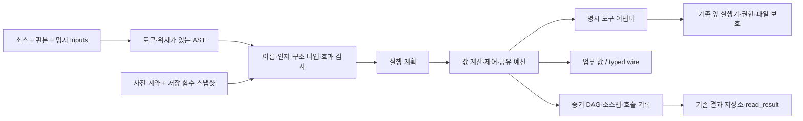

# IBL 조합 코어 판본 2 구현 기록

이 문서는 최초 코어 구현의 기록이다. 후속 통합에서 모델·MCP 작성 기본값과 주 교재를 현재 문법으로 전환했다. 기존 저장 함수·스케줄·앱·직접 HTTP는 원문의 실행 의미를 보존한다.
[설계](IBL_COMPOSITION_CORE_V2_DESIGN_2026_09_23.md)의 모든 장기 목표를 완료한 것은 아니다.
이번 범위는 새 값/함수/식/반복의 의미를 실제 도구와 연결하는 선택형 출시이며,
모델의 첫 생성 능력과 품질·시간·토큰 개선은 별도 비교가 필요하다.

이 문서는 최초 코어 구현 기록이다. 관용구·전체 활성 어휘·코퍼스 연결의 후속 변경은
[자산 통합 기록](IBL_V2_ASSET_INTEGRATION_2026_09_23.md)이 갱신한다. 아래의 당시 제한과 구분한다.

사용법 정본: [ibl_v2.md](../data/guides/ibl_v2.md).

## 바뀐 동작

기존 `$x`는 결과 봉투의 message/items/기타 메타데이터 모양에 영향을 받았다.
판본 2의 `$x`는 원래 값이며, 실행 실패와 증거는 별도 경로로 흐른다.
함수의 입력은 본문에서 추측하지 않고 선언한다. 파이프 자리는 첫 인자 또는 사전의 pipe_input이다.
map·flat_map·effect는 반환 모양을 추측하는 대신 명시된 결과 법칙을 따른다.

## 구현 위치

| 파일 | 책임 |
| --- | --- |
| backend/ibl/ibl_v2_ir.py | Node, Unit, Result, Fault, 모든 컨테이너를 태그하는 wire. 큰 정수는 십진 문자열 태그로 전달. |
| backend/ibl/ibl_v2_parser.py | 한 벌의 토큰·표현식 문법, 판본 충돌, 블록과 인자 구분, 명시 보간. |
| backend/ibl/ibl_v2_types.py / ibl_v2_compile.py | 구조 타입, 자유 변수/인자/파이프 검사, 읽기 전용 캡처, 비재귀 함수 연결, 원문·계약·하위 정의 의존 지문. |
| backend/ibl/ibl_v2_expr.py / ibl_v2_runtime.py | 순수 연산, 제어·반복·병렬·Result 수집, 공유 예산, 취소와 제한된 finally, 증거·기록 재생. |
| backend/ibl/ibl_v2_adapters.py | YAML callable_contract 검증과 고정된 봉투 해제. 표 콜백 및 기존 도구 잎 연결. |
| backend/ibl/ibl_v2_store.py | 기존 workflow 원장에 edition:2 함수 저장, 새 id 보호, 참조된 함수만 연결. |
| backend/ibl/ibl_v2_entry.py | 요청 판본 선택, 명시 inputs, 네 상태 검사 응답, capability 명세. |
| scripts/ibl_v2.py | check/run/replay/register/inventory/capabilities CLI. |

HTTP `/ibl/execute`, `/ibl/validate`, 에이전트 도구 스키마, MCP, 폰 진입점에 edition/inputs를 연결했다.
`/ibl/capabilities`로 판본·wire·재개/원격 프로토콜 지원 여부를 확인할 수 있다.
기존 `validate_code(code)`의 단일 인자 계약도 유지한다.

새 실행은 기존 `ibl.started/finished` 궤적을 지나며 판본을 기록한다.
모델 표면에서는 상세 증거·중복 wire를 필요에 따라 접고 원본 참조를 준다.
판본 2 실행을 기존 판본용 자동 증류 코퍼스에 섞지 않는다.

## 사전·스크립트 경계

callable_contract는 기존 원천 YAML 안의 추가 계약이다. 빌더와 런타임이 같은 검증기를 쓴다.
판본 1의 returns/flow와 판본 2의 Callable·값 타입은 의미가 다르므로 이번에는 하나를 다른 것으로 자동 변환하지 않는다.
도구 이름 분기를 언어 파서에 넣지 않는다. 각 어댑터의 protocol/operation/value_path/value_fields를 사전이 지정한다.

첫 연결 범위는 표 filter/select/compute/sort/take, 파일 read/write/list, 명시 계약의 script다.
read는 텍스트·PDF·Office를 text/blocks/data로 정규화한다. 표·시트·이미지·범위·부분 추출 정보도 data에 보존한다.
script는 Python/Bash/Node 기존 실행기를 사용하되 명시 등록한 프로토콜에서만 args/context와 value를 분리한다.
일반 JSON script 경계에서 안전 정수 범위를 넘거나 별도 wire가 필요한 값은 정밀도를 잃는 대신 거절한다.
기존 script의 stdin/stdout, 비동기 작업, input_as는 그대로 유지한다.

회원 스크립트는 기기의 목록 응답으로 ibl-script/2 지원과 등록 계약을 확인한다.
허브에서 회원 args_file을 읽거나 프로그램을 실행하지 않고, 기존 승인·작업 영수증 경로를 사용한다.
원격은 인증된 capabilities와 ibl-script-call/1을 협상하고 /ibl/call로 원문 값을 전달한다.
실행 POST의 응답이 불명확하면 자동 재전송하지 않는다. 구형 도우미·폰은 업데이트가 필요하다.
회원 기기 경로·문서 변환 회귀로 확인하고 system_essentials의 감사 지문을 갱신했다.

self:workflow의 72개 용례와 self:script의 54개 용례를 재검토했다.
새 필드는 선택 입력이며 기존 용례는 모두 기존 판본·프로토콜로 실행된다. 원장은 해당 두 액션만 갱신했다.
기존 개인 script 원장과 관용구 데이터는 이 구현 작업에서 변경하지 않았다.

## 검사와 재현의 범위

함수 본문은 실행 전에 AST로 고정하며 반복 행마다 재파싱하지 않는다.
변경된 하위 함수가 따뜻한 검사 캐시에 가려지는 문제는 캐시를 도입하지 않고 매 계획의 의존 지문으로 방지했다.
순수 계산 결과 캐시도 아직 없다. 어댑터의 실행 소스·계약이 바뀌면 새 계획을 요구한다.
직접 또는 연결된 함수에서 확인 가능한 동일 자원 쓰기는 병렬 전에 거절한다.
동적 경로·외부 자원의 독립성을 증명한 것으로 간주하지 않는다.

병렬 결과는 입력 순서이고 중첩 목록을 펼치지 않는다. 실패 시 새 제출을 멈추고 시작한 작업의 종료를 기다린다.
coverage와 실제 성공 값만 남기며 미실행 슬롯을 null로 성공처럼 채우지 않는다.
권한·취소·예산·지원하지 않는 프로토콜은 기본 catch/fallback으로 바꾸지 않는다.
각 실행의 node_id와 invocation_id를 구분하고 소스맵을 한 번만 보관한다.
증거는 보수적 의존 DAG이며 정확한 행별 lineage를 완성했다고 주장하지 않는다.

replay는 기록에 맞는 외부 호출 결과만 재생한다. 입력·계획 지문이 다르거나 기록이 없으면 실행을 거절한다.
현재 실행은 SQLite FULL 영수증을 외부 호출 전후에 저장한다. resume:{run_id}는 동일 소스·입력·계약·신원의 완료 호출을 재사용한다.
동일 인자의 반복/병렬 호출을 위치와 순번으로 구분한다. started만 남은 호출은 EFFECT_UNCERTAIN으로 멈춘다.
프로세스 간 배타 잠금, 취소 후 finally의 외부 정리 차단, 회원 사적 세션 수명도 적용한다.
확인된 실패는 다시 보여주며 자동 재시도·외부 exactly-once 보장은 제공하지 않는다.
예산과 취소는 계산·도구 경계의 협력적 검사이며 이미 진행 중인 외부 작업을 즉시 끝냈다고 표시하지 않는다.

## 검증

전체 백엔드 회귀 **5,599 passed, 1 skipped**(478.29초). 최종 보완 집중 검증 **166 passed**(9.93초)이며 중복 시험이므로 합산하지 않는다.
어휘·몸 번들 파생, 층·값 의미론·은퇴 계약·파일 크기·Windows 이식성·diff 검사도 통과했다.
0/1/1,000행 독립 참조 계산과 일치했고, 1,000행은 11,011 계산 단계로 전건 처리했다. 이는 모델 성능 비교가 아니다.

전용 시험은 값 codec의 충돌 방지와 큰 정수, 0/1/N건의 모양 보존, 함수 추출 동등성,
명시 입력/자유 변수/파이프 충돌의 효과 전 거절, 캡처 시점, return/finally,
map/flat_map/effect/collect, 순서가 뒤집힌 실제 병렬 완료, 공유 예산·취소,
부분 원천과 근거 전파, 의존 정의 변경, 재생의 누락 기록 거절을 검증한다.

실제 경계 시험은 임시 디렉터리의 텍스트/Markdown 읽기·쓰기, 파일별 실패 수집,
등록 Python 자식 프로세스의 새/기존 프로토콜, 저장 함수 재사용 및 기존 id 보호,
HTTP/모델 도구 파라미터, 회원·원격 프로토콜 협상과 미지원 거절을 포함한다.
운영 스크립트·개인 원장 실행이나 외부 메시지 전송으로 시험하지 않았다.

실행 가능한 예제는 [표 계산](examples/ibl_v2/table.ibl),
[문서와 근거](examples/ibl_v2/document.ibl), [파일별 부분 실패](examples/ibl_v2/partial_files.ibl)다.
최종 시험·빌드 결과는 이 문서와 함께 보관하는 [검증 기록](experiments/ibl_composition_core_v2_2026_09_23/implementation.json)에 기록한다.

## 다음 단계와 기본 판본 전환 조건

- 모델 첫 생성 비교(P4)는 아직 실행하지 않았다. IBL 1/IBL 2/Python을 같은 도구·문제·문서·예산으로 비교해야 한다.
  이 변경으로 실제 시간·전체 토큰·처음 생성 성공률이 좋아졌다는 결론은 아직 내리지 않는다.
- 기존 자산을 자동 번역하거나 새 판본으로 바꾸지 않았다. inventory와 새 id 등록은 제공하며,
  모호한 값 추출·예전 `$return =` 뒤의 효과까지 보존하는 일반 마이그레이터는 별도 작업이다.
- 판본 1은 기존 실행기를 호환 경로로 감싼 상태다. 두 파서를 공통 코어로 완전히 내리는 작업은 후속 단계다.
- 설치 사전 호환 계약과 PDF/Office·회원·원격 연결은 구현했다. 네이티브 타입 계약의 추가 정밀화는 개별 도구 개선이다.
- 새 wire 스크립트의 background와 직접 연결 불가 원격의 푸시 큐 전송은 지원 범위 밖이다. 회원 기록은 사적 세션 종료 시 폐기한다.
- 완료 영수증에 의한 재개는 구현했다. LSP/IDE 디버거, 정밀 캐시·행별 lineage는 별도 확장이다.

초기 구현 시점에는 선택형 조합 기반이었다. 후속 [자산·교재 통합](IBL_V2_ASSET_INTEGRATION_2026_09_23.md)에서 주 교재와 모델/MCP 작성 기본값을 현재 문법으로 전환했다.
