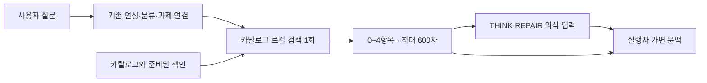

# 지식 카탈로그 — 작은 단서로 세계와 연결하는 구현 설계

상태: **설계, 미구현**. 기준 코드: `06737045`. 사용자와 연구 에이전트의 지식 지도 논의 및 현재 세션의 구체화를 반영한다.

## 1. 구현할 것

질문에 관계되는 지식의 **이름과 짧은 설명 0~4개**를 골라, 본격적인 사고를 시작하기 전에 프롬프트에 넣는다.
세계의 지도는 큰 도서관의 카탈로그이고, 주입되는 것은 이번 질문에 해당하는 작은 조각이다.
모델이 그 단서로 가진 지식을 활용하거나 필요한 자료를 찾아가게 한다.

초기값은 **보통 2~3항목, 최대 4항목, 태그·안내문을 포함한 전체 600자 이내**다.
이는 구현 예산의 제안이며 최적값이라는 주장은 아니다. 문자 수를 토큰 수로 환산해 실측처럼 보고하지 않는다.
관련 항목이 없으면 빈 문자열을 반환하여 추가 문맥을 만들지 않는다.

첫 자료는 이미 있는 `world_tools.md`와 `docs/world_map/` 조사본이다.
우선 이 자료만으로 유용한 단서가 나오는지 확인한다. 개념·학문·사고 방법도 같은 항목 형식으로 확장할 수 있지만,
첫 구현에서 전 분야 지식 수집, 전문 저장, 새로운 지식 그래프, 자동 증류를 시작하지 않는다.
새 IBL 어휘나 의식 출력 필드도 필요하지 않다.

## 2. 확인한 현재 경로와 바꿀 전제

| 현재 근거 | 확인한 동작 | 이번 설계에서 활용할 것 |
|---|---|---|
| `backend/cognition/cognitive_recall.py` | 해마 검색과 기억·실행 지도 등을 `execution_memory` 문자열로 전달 | 참고 문맥을 함께 전달하는 구조 |
| `backend/cognition/agent_pipeline.py` | 연상 → 분류·과제 연결 → 의식 → 실행 프롬프트 조립 | 의식 직전의 공통 주입 위치 |
| `backend/cognition/consciousness_agent.py` | `associative_memory`를 의식 입력에 포함 | 사고의 출발점에 단서 제공 |
| `backend/cognition/prompt_builder.py::_build_dynamic_context` | `execution_memory`를 가변 `turn_context`에 포함 | 실행자에도 같은 단서를 전달, 안정 프롬프트 캐시 유지 |
| `data/packages/installed/tools/blog/tool_blog_rag.py` | 분류 경로를 검색 텍스트에 반영, 키워드·벡터 검색을 RRF로 결합 | 작은 카탈로그에도 사용할 검색 원리 |
| `data/guides/world_tools.md` | 현재는 이름을 의식이 떠올리고 지도가 통로를 제공하도록 설명 | **이름 자체도 지도에서 먼저 제시**하도록 전제 확장 |

현재 블로그 검색 클래스는 블로그 DB에 결합돼 있다. 코어에서 해당 패키지 클래스를 직접 import하지 않는다.
심층기억·포식기억의 개인 사실 자동 주입을 다시 켜는 작업도 아니다. 이 카탈로그는 선별한 세계 지식의 목록이다.
기존 가이드 본문과 설치·실행 통로는 필요할 때 현재 도구로 읽는다.

## 3. 카탈로그의 정본

추가할 정본은 `data/knowledge_catalog/world.yaml` 한 파일로 시작한다.
트리는 각 항목의 `path`에서 파생한다. 별도의 트리 DB나 수작업 목차를 중복 유지하지 않는다.

```yaml
version: 1
entries:
  - id: tool.or_tools
    path: [계산과 분석, 최적화와 제약]
    name: OR-Tools
    hint: 인원·시간·순서 등의 제약이 있는 배치와 일정 최적화
    aliases: [근무표, 교대, 배정, 조합최적화, scheduling]
    source:
      path: data/guides/world_tools.md
      section: 조사로 확인된 추가 표준
```

필수는 `id`, `path`, `name`, `hint`, `source`이고 `aliases`는 선택이다.
`id`는 정체성, `path`는 분류, `hint`는 한 줄 설명, `aliases`는 사용자가 쓰는 표현과 이름을 이어주는 검색용 자료다.
설치 명령·가격·무료 한도·현재 설치 여부·긴 업무 절차를 항목에 복제하지 않는다.
`source`와 `aliases`는 검색·관리용이며 기본 주입문에는 싣지 않는다.

검증기는 중복 ID, 빈 이름·설명, 잘못된 분류 경로, 존재하지 않는 원본 파일을 거절한다.
항목은 이름 60자·설명 100자 이내로 편집하고, 초과하면 작성 오류로 돌려준다. 실행 중 문장을 잘라 뜻을 바꾸지 않는다.
분류명과 세계의 명사는 모두 YAML 데이터에 두며 파서·엔진에 도구 이름이나 분야별 분기를 넣지 않는다.

초기 이관은 기존 표에서 대표 항목을 추려 사람이 검토하는 일회성 편집이다.
같은 도구가 여러 조사본에 있으면 한 항목으로 합치고, 묶음 행은 설명이 다른 경우 나눈다.
원문에 있는 오래된 ‘현재 능력의 구멍’·어휘 후보·버전 주장을 사실처럼 복제하지 않는다.
원래 조사본은 조사 이력, 새 YAML은 **주입할 짧은 표현의 정본**, 기존 가이드는 상세 사용 통로를 맡는다.
가이드가 바뀌었다고 매 턴 Markdown을 다시 파싱하지 않는다. 원본 내용 지문이 바뀌면 관련 항목을 검토 대상으로 표시한다.

## 4. 검색: 이름을 몰라도 항목에 닿게 하기

한 턴에 한 번, 로컬에서 검색한다. **추가 생성형 AI 호출은 0회**다.
준비된 로컬 임베딩 모델을 쓰는 경우에는 질의 인코딩 연산이 추가된다. 이 연산도 비용과 지연에 포함해 측정한다.

검색 대상은 `name + aliases + hint + path`다. 트리의 한 가지로 먼저 대상을 제한하지 않고 전체 항목을 검색한다.
다른 분야의 유용한 단서가 초기 가지 선택 때문에 사라지지 않게 한다.

### 질의와 후속 대화

- 현재 사용자 발화를 주 질의로 사용한다. 도구 출력·옛 과제 목표·모델의 긴 답변은 검색어로 자동 합치지 않는다.
- 같은 대화의 직전 사용자 발화 최대 2개를 합쳐 400자 이내의 보조 질의로 만들 수 있다. 최신 발화부터 온전한 발화 단위로 담는다.
- 주 질의와 보조 질의는 별도 순위로 계산하며 주 질의에 더 큰 가중치를 둔다. 초기 가중치 1.0:0.25는 평가로 조정한다.
- 주 질의가 명확한 후보를 찾으면 보조 질의만 맞는 후보로 자리를 채우지 않는다. 주 질의의 근거가 약한 짧은 후속 요청에서는 보조 질의 후보를 허용한다.
- `그걸 구현해`의 선행 주제가 살아나는지, 새 주제로 바뀌었을 때 옛 항목이 남지 않는지를 함께 검증한다.
  가벼운 검색이 대명사의 의미를 완전히 판정한다고 가정하지 않는다. 모호하면 주입을 생략할 수 있다.

### 순위와 선택

1. 이름·별칭의 정확 일치를 우선 후보로 잡고, SQLite FTS5로 설명·분류까지 키워드 검색한다.
   한글 조사·띄어쓰기 차이를 별도 시험하며, 별칭과 정규화로 흡수할 범위를 정한다.
2. 같은 카탈로그 텍스트의 로컬 벡터 검색을 준비된 경우 함께 사용한다. 문서 벡터는 인덱스 갱신 때 만들고,
   주 질의·보조 질의는 한 배치로 인코딩한다.
3. 두 검색의 상위 후보를 RRF로 결합한다. 순위 결합 점수를 관련성 확률로 취급하지 않는다.
4. 정확 일치·유효 키워드 일치·원래 벡터 유사도에 대한 관련성 조건을 통과한 후보만 남긴다.
   벡터의 수치 문턱은 검증 질문·무관 질문으로 보정하여 인덱스 설정에 기록한다. 해마의 Reflex 문턱을 가져오지 않는다.
5. 같은 ID와 같은 대상을 가리키는 중복 항목을 제거한다. 비슷한 점수의 후보 사이에서는 다른 세부 가지를 우대할 수 있다.
   분야 수를 채우려고 무관한 항목을 강제로 넣지 않는다.
6. 순위대로 최대 4개를 선택하되 전체 600자 예산을 넘는 항목은 통째로 뺀다. 선택 ID와 생략 이유를 기록한다.

### 임베딩을 재사용하는 범위

현재 블로그의 일반 모델 설정은 `jhgan/ko-sroberta-multitask`이고 해마는 별도의 로컬 IBL 임베딩 모델을 쓴다.
해마 모델이 일반 지식 검색에도 적합하다고 가정하지 않는다.

구현 시 블로그의 **모델 적재·인코딩 부분만** `backend/datastore/text_embeddings.py`로 분리해 블로그와 카탈로그가 공유한다.
블로그 DB·검색 API·본문 처리·결과 형식은 유지한다. 기존 모델의 로컬 파일이 준비된 경우에만 재사용한다.
모델 ID뿐 아니라 실제 리비전·차원·전처리 버전을 인덱스에 기록하며, 다른 공간의 벡터는 섞지 않는다.

모델 다운로드·콜드 로드·전체 인덱스 재생성을 사용자 질문 앞에서 수행하지 않는다.
모델 적재와 인코딩은 기존 런타임의 서비스/작업 수명 추적에 포함하고, 적재 잠금과 인코딩 동시성 한도를 둔다.
질문 경로에는 대기열을 쌓지 않는다. 준비 전·혼잡·오류에는 키워드 검색만 사용하고 그 상태를 기록한다.
준비된 인코딩도 검색의 남은 시간 예산 안에서만 기다린다. 기한이 지나면 해당 턴에는 키워드 결과를 사용하고,
늦게 끝난 결과를 이미 조립한 프롬프트에 끼워 넣지 않는다. 실행 중인 인코딩은 실제 종료까지 추적하며,
끝나기 전에는 새 작업을 누적하지 않는다. 이는 실행을 취소했다고 가장하는 타임아웃이 아니다.
초기 자료를 점검한 결과 키워드+별칭만으로 충분하면 임베딩 분리는 후속 단계로 미룰 수 있다.

## 5. 실제 주입 형태

‘여러 조건을 지키면서 직원 근무표를 짜고 싶다’에 대해 선택될 수 있는 조각의 예다.
선정 결과를 미리 보장하는 예가 아니라 주입 형식을 보여준다.

```xml
<knowledge_catalog>
검토할 지식의 단서입니다. 관련 있는 것만 활용하세요. 도구의 설치·사용 가능 여부는 별도 확인이 필요합니다.
- 최적화와 제약 / OR-Tools — 여러 제약이 있는 배치·일정 최적화.
- 수학과 논리 / Z3 — 논리 제약을 동시에 만족하는 조건 탐색.
</knowledge_catalog>
```

검색 순위·점수·별칭·출처 경로·전체 트리·운영 규약은 이 조각에 넣지 않는다.
설명은 카탈로그에 적힌 문장을 그대로 사용한다. 매 턴 모델에게 요약·선정 이유를 생성시키지 않는다.
이름과 설명은 XML 이스케이프하며, 모델 지시문을 카탈로그 항목에 저장하지 않는다.

이 조각은 사고의 참고다. 특정 도구 사용, 추가 조사, 새로운 평가 기준을 강제하지 않는다.
또한 가이드 전체 열람을 요구하는 기존 자작 관문의 ‘가이드 확인’으로 간주하지 않는다.
카탈로그를 봤다는 이유로 설치 승인이나 상세 사용 통로의 확인이 생략되지 않는다.

## 6. 주입 위치와 적용 경로



정확한 삽입 위치는 `agent_pipeline._cognitive_stream_body`의 과제 연결·CONTEXT_UPDATE 처리 뒤,
THINK/REPAIR의 `_run_consciousness_or_reuse` 호출 전이다.
이 위치에는 원래 `message`, `history`, 분류 결과가 모두 있다.

```python
# 설계 의사코드. 기존 분류·과제 연결 다음, 의식 호출 이전.
if catalog_applies(principal, request_type, reflex_hint, force_role):
    snippet = recall_catalog(message, history, cancel_check)
    if snippet:
        execution_memory += "\n" + snippet
```

- 기본 대상: 주인 신원으로 실행하는 시스템 AI·프로젝트 에이전트의 THINK/REPAIR/일반 EXECUTE.
- 제외: SESSION_RESET, CONTEXT_UPDATE, Reflex, 포식 등 별도 강제 역할, 모델을 부르지 않는 앱 직접 실행.
- 첫 버전은 기존 연상과 같은 주인 신원 범위를 유지한다. 외부 회원·이웃 요청으로 노출 범위를 넓히지 않는다.
- THINK에서는 의식과 실행자가 같은 조각을 받는다. EXECUTE에서는 실행자가 직접 받는다.
  새 의식 출력 필드나 의식의 복사 지시에 의존하지 않는다.
- 선택은 턴의 지역 변수에 보관한다. 상주 runner에 ‘마지막 카탈로그’를 저장하지 않는다.
- 의식 재규정·실행 프롬프트 재조립에도 같은 조각을 재사용한다. 매 라운드 다시 검색하거나 덧붙이지 않는다.
- 의식과 실행자의 입력에 각각 실리는 분량은 별도로 계측한다. ‘한 번 선택’이 ‘전체 호출에서 한 번 과금’을 뜻하지 않는다.

현재 `_build_execution_memory`의 반환 점수·코드는 해마 Reflex용이다. 카탈로그 점수를 그 값에 섞지 않는다.
카탈로그 장애로 기존 연상 전체가 빈 값이 되지 않도록 별도 예외 경계를 둔다.
취소는 빈 결과로 숨기지 않고 기존 턴 취소 경로로 전달한다.

## 7. 최소 구현 파일과 상태

| 파일 / 변경점 | 책임 |
|---|---|
| `data/knowledge_catalog/world.yaml` 신규 | 사람이 읽고 편집하는 작은 항목 정본 |
| `backend/datastore/knowledge_catalog.py` 신규 | 스키마 검증·스냅샷·FTS/벡터 색인·후보 검색 |
| `backend/cognition/catalog_recall.py` 신규 | 현재 턴 질의 구성·선택·600자 렌더·관측 |
| `backend/cognition/agent_pipeline.py` 수정 | 한 곳에서 검색하고 기존 `execution_memory` 전달 |
| `backend/datastore/text_embeddings.py` 신규, 블로그 적재부 수정 | 의미 검색을 켤 때 일반 모델 적재·인코딩 공유 |
| `scripts/build_knowledge_catalog.py` 신규 | 명시적 검증·색인 생성, `--check`로 정본/색인 지문 대조 |
| `scripts/check_backend_layers.py` 및 몸 번들 | 새 모듈 층 등록, 기존 빌더로 폰 번들 파생 |

파생 색인은 `data/knowledge_catalog_index/`에 두고 git에서 제외한다.
정본 내용·스키마·검색 전처리·모델 리비전으로 지문을 만든다. 완성된 색인만 원자적으로 교체한다.
각 턴은 하나의 불변 스냅샷을 사용한다. 정본 변경 중에는 새 목록과 낡은 벡터를 섞지 않는다.
정본이 유효하고 벡터만 준비되지 않았으면 새 목록의 키워드 검색을 사용할 수 있다.
정본 자체가 깨지면 자동 주입을 생략하고 설정 오류로 관측한다. 질문을 실패시키지 않는다.

설정은 `data/world_pulse_config.json`의 `knowledge_catalog` 구역 하나로 둔다.
`enabled`, `enabled_agents`, `max_items`, `max_chars`, `semantic_enabled`만 첫 운영 설정으로 노출하고,
점수·가중치·모델 리비전은 색인 설정에서 버전 관리한다. 새 설정 화면은 첫 구현에 필요하지 않다.
`enabled_agents`에는 표시 이름이 아닌 프로젝트를 포함한 실행 신원 키를 사용한다.
초기에는 연구 에이전트의 실제 키만 넣고, 생략했을 때만 앞 절의 주인 신원 공통 범위를 적용한다.

`recall.started/finished`의 stage=`knowledge_catalog`와 별도 `knowledge_catalog.selected` 사건에
카탈로그 리비전, 선택 ID, 주/보조 질의 구분, 검색 모드, 항목 수, 문자 수, 지연, 생략 이유를 남긴다.
질의 원문을 새 로그에 중복 저장하지 않는다. 오류·무관 결과·설정 꺼짐을 서로 구분한다.

## 8. 검증과 도입 순서

### A. 카탈로그부터 확인

기존 지도의 대표 항목만 정리한다. 정확한 도구 이름 질문뿐 아니라 ‘많은 제약을 만족하는 근무표’,
‘종류가 다른 파일들을 한꺼번에 분석’처럼 이름을 모르는 사용자 표현을 검증 질문에 포함한다.
시험 정답은 유용한 단서의 **허용 집합**으로 두고 특정 제품 하나를 유일 정답으로 강제하지 않는다.
키워드만으로 적절한 항목이 나오는지 먼저 보고, 부족한 경우 준비된 일반 임베딩을 결합한다.

### B. 하네스 회귀

1. 실제 공통 파이프라인에서 THINK 의식·실행 및 EXECUTE 입력에 같은 조각이 전달된다.
2. 항목은 최대 4개, 태그·안내문 포함 600자 이내다. 무관한 질문에는 블록이 없다.
3. 프롬프트 재조립·재규정 때 중복 주입·재검색이 없고 해마 점수와 안정 프롬프트는 바뀌지 않는다.
4. 별칭·한글 표현 차이·영문명·짧은 후속 질문·주제 전환을 검증한다.
5. 외부 주체·Reflex·포식·취소·동시 대화·정본 갱신을 실제 분기로 검증한다.
6. 색인 부재·손상·모델 미준비·혼잡에서 질문이 정상 진행되고 대화 경로에서 다운로드·콜드 로드가 발생하지 않는다.
7. 준비 상태 검색의 추가 지연 p95 100ms 이내를 초기 목표로 측정한다. 미달하면 의미 검색을 끄거나
   구현을 조정한다. 느린 연산을 백그라운드로 숨겨 매 턴 누적하는 방식으로 해결하지 않는다.

### C. 실제 시야가 넓어지는지 비교

같은 모델·질문·예산으로 ①주입 없음 ②이름만 ③이름+짧은 설명을 비교한다.
명칭을 직접 말한 질문, 간접 표현, 여러 분야에 걸친 질문, 무관 질문, 주제 전환을 섞은 소규모 세트를 만든다.
카탈로그 작성에 사용한 예제와 평가 질문은 분리한다.

주요 판정은 **답변에 유용한 관점·방법·자료원이 더해졌는가**다. 이름을 인용했거나
도구 호출이 늘었다는 사실만으로 성공 처리하지 않는다. 부적절한 도구 선택·옛 주제 혼입도 함께 센다.
추가 입력 토큰, 로컬 인코딩 시간, 전체 응답 지연과 전체 모델 호출 수를 함께 비교한다.
THINK/EXECUTE는 별도로 보고, 필요하면 질문당 반복해 우연한 차이를 구분한다.

첫 적용은 연구 에이전트의 설정으로 범위를 제한한 뒤 결과를 보고 공통 기본값으로 확대한다.
끌 때는 `enabled=false` 한 설정으로 주입만 사라지고 기존 대화·기억·검색은 그대로 작동해야 한다.
기존 세계의 지도만으로 효과가 충분하면 거기서 멈춘다. 추가 분야의 수집은 실제 누락 사례가 근거가 된다.

## 9. 구현 시 함께 정리할 문서

`world_tools.md`의 ‘이름은 의식이, 통로는 지도가’는 이름도 선택 주입될 수 있다는 설명으로 갱신한다.
상세 통로 확인·로컬 실측·설치 승인의 현재 역할은 유지한다.
`anatomy.md`·`memory.md`에는 세계 지식 카탈로그와 개인 기억의 구분 및 실제 주입 위치만 기록한다.
현재 설계 문서를 추가하는 단계에서는 기존 시스템이 이미 이 기능을 제공한다고 문서를 고치지 않는다.
