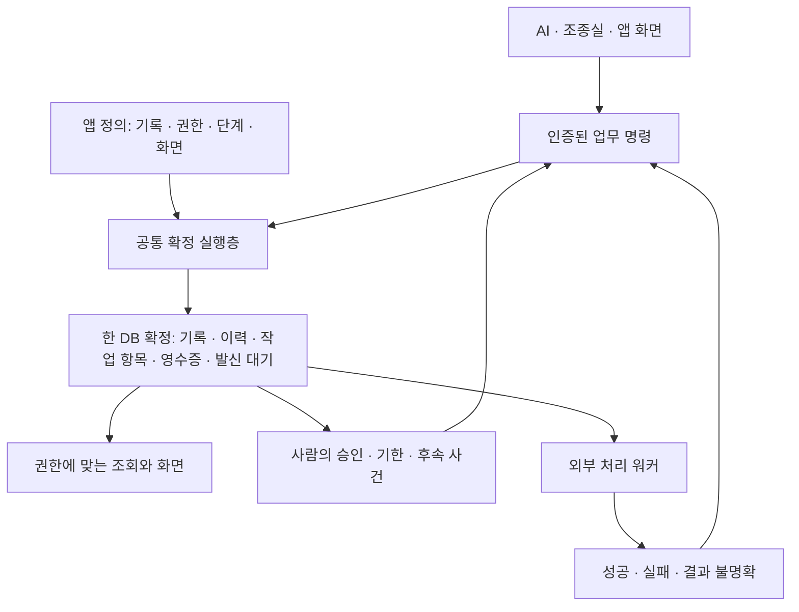

# 관리되는 기록과 업무 명령 — indiebizOS 능력 확장 설계

작성: 2026-09-20. 상태: **공통 기반 v1 구현**. 아래는 목표 설계이며, 현재 실행 계약과 범위는 다음 구현 현황 및 [사용 가이드](../data/guides/managed_records.md)가 구분한다.
목적: 업종별 앱을 추가할 때 반복되던 데이터 일관성·권한·상태 전이·대기·재시도 구현을 공통 기반으로 옮긴다.
이 문서는 구현 지시로 옮길 수 있는 목표 계약이다. 가상 앱 실험이나 기능 부재 조사 계획이 아니다.

## 구현 현황 (2026-09-20)

선택 패키지 `record-ops`와 `[self:record]`, 공간별 SQLite 확정 엔진, 현재 권한 검사,
버전 충돌·고유성·참조 검사, 변경 이력·멱등 영수증, 다인 승인·영속 타이머·사건 큐,
외부 처리 outbox, 불변 첨부, 정의 발행·원자적 데이터 이전·내보내기·복원을 구현했다.
PC와 회원 웹은 기존 앱 렌더러의 `web_app` 선언으로 같은 `/records/app`·`/m/records/app` 화면을 연다.
새 패키지는 내 어휘에서 선택하고, 회원 공개는 기존 별도 공개 설정을 사용한다.

목표 설계와 v1의 구체적인 차이:

- 단건 조회 op는 기존 IBL 정본에 맞춘 `detail`이다. 아래 초안의 `get` 표기는 `detail`로 읽는다.
- 기존 스칼라 폼 프로토콜 전체를 바꾸는 대신 공통 업무 화면이 타입 있는 action-ID API를 호출한다.
  객체·목록 입력은 JSON 편집기이고 `views`는 아직 사용자 지정 배치로 렌더링하지 않는다.
- v1은 공간당 1,000개 기록·한 명령 100개 변경을 명시적으로 제한한다. 전체 최종 상태를 검사하는
  구현을 인덱스 기반 검사로 확장하기 전까지 대용량 장부에 이 상한이 적용된다.
- 명령 변경 원자는 create/patch/archive/transition/task다. 가변 길이 `each` 변경 IR,
  재사용 앱 패키지 자동 설치·JSON 장부 자동 매핑은 아직 제공하지 않는다.
- publish는 현재 데이터를 만족하는 정의만 발행한다. 비호환 변경은 중지한 공간에서
  `migrate`의 명시적 set/drop 변환과 새 정의를 한 확정으로 반영한다. 열린 승인·미완료 후속 처리가
  있으면 이전을 거절한다. 진행 업무의 버전은 유지하되 현재 권한·사람 확인 요구는 즉시 적용한다.
- 외부 연결은 등록 어댑터와 HTTPS 기본 어댑터를 제공한다. 업무별 결제·금융·행정 연결,
  서명 웹훅 수신, 외부 효과 자동 보상은 별도 연결 구현이 필요하다. 불명확한 원격 결과는
  unknown으로 남겨 운영자가 근거와 함께 대사한다. 이미 전송 중인 호출을 권한 회수로 취소할 수는 없다.
- `confirmation:human`은 인증된 업무 화면의 입력·버전별 확인 증표다. 장치 인증이나
  전자서명으로 사람의 신원을 별도 증명하는 기능을 의미하지 않는다.
- 첨부는 승인 대상 기록 버전과 불변 ID·해시로 연결한다. 참조가 없는 첨부 정리 UI는 아직 없다.
- 복원은 새 공간에만 하고 권한을 소유자부터 다시 부여한다. 외부 효과와 예약 명령은 자동 재발송하지 않는다.

런타임 자료는 `data/record_spaces/`에 저장하며 소스 관리에서 제외한다.
구체적 문법과 두 재사용 정의는 [공동 업무 가이드](../data/guides/managed_records.md)에 있다.

## 1. 방향과 결정

**IBL이 정보를 처리하는 능력에, 여러 주체가 같은 기록에 대해 약속된 변경을 확정하는 능력을 더한다.**

AI는 제안·해석·업무 정의 작성을 돕고, 공통 실행층은 실제 권한·조건·변경·이력을 결정론적으로 집행한다.
새 업무를 만들 때 필요한 것은 앱 안의 기록 형식, 허용 명령, 담당 규칙, 화면 연결이다.
앱마다 잠금·트랜잭션·중복 방지·승인 대기·복구 코드를 작성하지 않게 한다.

| 결정 | 선택 | 이유 |
|---|---|---|
| 기본 단위 | 관리되는 기록 + 선언된 업무 명령 | CRUD만으로는 승인·재고·담당자 변경의 의미를 보호하지 못한다 |
| IBL 표면 | 선택 패키지 `record-ops`의 `[self:record]{op}` 한 액션 | 새 문법 없이 기존 조회·표 연산·AI·출력과 결합한다 |
| 저장 | 업무 공간마다 로컬 SQLite 한 DB | 원자 확정의 경계를 명확히 하고 개인 소유 운영을 유지한다 |
| 쓰기 | 서버에 등록된 명령만 실행 | 호출자가 검증·권한·상태 규칙을 생략할 수 없다 |
| 장기 업무 | 기록 상태 + 영속 작업 항목 + 사건 소비 | 프로세스·AI 턴·IBL 호출 수명과 분리한다 |
| 외부 처리 | 확정 시 발신 대기 기록, 별도 실행·대사 | 로컬 확정과 원격 성공을 혼동하지 않는다 |
| 화면 | 기존 `app:` 렌더러에 계약으로부터 생성한 폼·목록·명령 버튼 연결 | 앱별 서버와 CRUD 화면 구현을 줄인다 |
| 공유 | 명시적으로 발행한 업무 공간의 데이터 | 회원 개인 파일·기억의 기존 저장 경계와 구별한다 |

이 확장은 주문·예약·배정·검토·승인·수정 요청·발행·반품 등에서 재사용된다.
신규 업종의 수만큼 엔진이 늘지 않고, 새로운 업무 규칙이 선언 데이터로 늘어난다.



## 2. 기존 철학과의 정합 및 필요한 명시적 확장

`data/system_docs/ibl.md`는 세계의 명사를 코드에 넣거나 선행 명사 스키마를 강제하는 것을 금지한다.
따라서 전역 `Customer`·`Order`·`Manuscript` 타입이나 조직 전체의 객체·관계 모델은 만들지 않는다.
공통 엔진은 `space / collection / record / command / revision / task / event` 같은 저장·실행 개념만 안다.
상품·원고·민원·승인 단계의 이름과 의미는 앱 정의 데이터에만 존재한다.

다만 **공동 업무에서 확정하는 데이터까지 무제약으로 두는 것은 이 설계의 목적과 양립하지 않는다.**
따라서 구현 시 `ibl.md`의 해당 조항에 다음 범위의 예외를 명시적으로 반영한다:

> 사용자가 선택한 업무 공간에는 그 앱이 책임질 변경을 위한 지역적 입력·저장 계약을 선언할 수 있다.
> 이 계약은 세계 전체의 사실 모델이 아니며, 기억·검색·일반 JSON 장부에는 소급 적용하지 않는다.
> 계약은 버전을 가지며 그 적용 범위·변경·내보내기가 사용자에게 보인다.

현재 문서만으로 기존 명세를 바꾼 것으로 취급하지 않는다. 구현 1단계에 이 명세 개정을 포함한다.
IBL 파서·6개 노드·표준 기능어 코어는 유지한다. 새로운 업무 IR은 액션이 소비하는 페이로드 계약이다.
`self:ledger`의 기존 JSON 계약도 유지한다. 파일 경로를 받는 장부를 옵션에 따라 권한 저장소로 바꾸지 않는다.
새 액션을 분리하는 이유는 저장 형식이 아니라 **신원·권한·버전·명령을 필수로 요구하는 의미의 차이**다.

## 3. 용어와 소유권

| 개념 | 계약 |
|---|---|
| 업무 공간 `space` | 하나의 원자 확정·접근 정책·백업 경계. 소유 몸과 불변 UUID를 갖는다 |
| 기록 묶음 `collection` | 앱 안의 이름 붙은 JSON 객체 집합. 이름은 정의 데이터다 |
| 기록 `record` | 서버 ID, 정수 revision, 정의 버전, 생성·변경 주체, 본문, 보관 표식을 갖는다 |
| 업무 명령 `command` | 입력 형식·권한·읽기·조건·변경·작업 항목·후속 사건을 묶은 불변 정의 |
| 업무 인스턴스 | 상태 전이 계약을 가진 기록. 별도 범용 워크플로 VM을 만들지 않는다 |
| 작업 항목 `task` | 특정 기록·단계·대상 버전에 대해 누가 어떤 명령을 실행해야 하는지 저장한 대기 기록 |
| 확정 `commit` | 같은 DB의 변경·이력·작업 항목·중복 방지 영수증·발신 대기열을 함께 저장한 사건 |
| 첨부 `artifact` | 공간에 반입되어 내용 해시와 불변 ID로 고정된 파일. 로컬 경로 문자열과 구별 |

공간의 소유자는 호스팅·설정·백업을 관리한다. 업무상 작성자·검토자·승인자는 별도 역할이다.
소유자라고 보통 승인 경로의 자기 승인 금지나 버전 검사를 생략하지 않는다.
관리자 복구는 사유와 대상 버전을 요구하는 별도 관리 명령이며 일반 승인으로 표시하지 않는다.
운영체제·DB 파일을 직접 통제하는 소유자에 대한 위변조 방지는 이 로컬 시스템의 보장 범위가 아니다.

## 4. IBL 계약

선택 패키지 `record-ops/ibl_actions.yaml`이 아래 계약을 소유한다. 기본 op는 읽기인 `describe`다.
경로·임의 SQL·임의 Python·호출자 지정 actor·클라이언트 작성 변경 계획은 받지 않는다.

| op | 입력 | 결과 / 효과 |
|---|---|---|
| `describe` | space, 선택 collection | 이 주체가 볼 필드·입력 형식·사용 가능한 명령의 공개 설명 |
| `query` | space, collection, where, fields, order, cursor, limit | 권한 필터를 통과한 `items` |
| `get` | space, collection, id | 현재 기록과 revision, 지금 가능한 명령의 공개 설명 |
| `apply` | space, command, definition_revision, input, expected, request_id, 선택 reason·confirmation | 선언된 명령 하나의 원자 확정 |
| `history` | space, collection, id, cursor | 현재 열람 권한에 맞게 투영한 변경 이력 |
| `inbox` | space, cursor, 선택 상태·기한 | 자신에게 배정되었거나 자격이 있는 작업 항목 |
| `receipt` | space, request_id | 해당 주체의 요청 확정 여부·관련 외부 처리 상태 |

`apply`만 부작용을 가지며 그 반환은 effect 봉투에 둔다. 조회들은 기존 `items` 통화를 사용한다.
화면은 apply 후 get/query를 사용한다. 전체 비공개 변경 행을 effect 결과에 무조건 싣지 않는다.
예시의 공간·명령·ID는 가상 값이며 **설계 문법 예시**다:

```text
[self:record]{op:"query", space:"shop", collection:"orders", where:{status:"confirmed"}}
  >> [table:groupby]{by:"product_id"}

[self:record]{op:"apply", space:"shop", command:"confirm_order",
  definition_revision:3, input:{order_id:"o_123"},
  expected:[{collection:"orders", id:"o_123", revision:7}], request_id:"req_01"}

[self:record]{op:"inbox", space:"editorial"}
```

`space:"shop"`은 권한 판정 후 UUID로 해소하는 로컬 별칭이다. 별칭은 신원이나 권한을 부여하지 않는다.
명령 정의의 요구 대상은 `expected`에 반드시 있어야 한다. 빠뜨리면 무조건 덮어쓰기가 아니라 오류다.
화면에서 본 주문·원고·작업 항목은 observed revision을 요구하고, 재고처럼 명령 내부에서만 읽는
자원은 트랜잭션 안의 최신 값으로 조건을 검사한다. 서로 다른 요구를 한 버전 검사로 뭉개지 않는다.
여러 기록 변경은 한 명령에 선언한다. 여러 `apply`를 `>>`로 연결해도 전체가 한 트랜잭션이 되지 않는다.

정상 반환 예:

```json
{"success":true,"status":"committed","commit_id":"c_10","request_id":"req_01",
 "replayed":false,"changed":[{"collection":"orders","id":"o_123","revision":8}],
 "effects":[{"id":"e_20","status":"pending"}]}
```

실패 부류는 `validation / forbidden / not_found / conflict / rule_failed / duplicate_key /
definition_changed / busy / outcome_unknown`으로 고정한다. 규칙의 미충족과 실행기 고장을 구별한다.
권한 없는 기록과 없는 기록은 외부에 같은 not_found로 보인다. 충돌 정보도 열람 가능 필드만 준다.
`outcome_unknown`은 실패 확정이 아니다. 같은 request_id로 receipt를 조회하거나 동일 요청을 재전송한다.

공개 HTTP 실행은 `POST /records/spaces/{space}/actions/{action_id}`를 목표 경로로 두고,
읽기도 등록된 action_id로 같은 바인딩을 통과시킨다. 공간 UUID만 알면 조회할 수 있는 API는 만들지 않는다.
관리 API는 인증된 소유자 화면에서만 정의 validate/publish, membership 변경, migrate, backup/export를 제공한다.
관리 작업도 request_id·expected 관리 revision·사유를 요구하고 관리 이력에 남긴다.
공간 생성의 첫 관리자 등록만 부트스트랩이며, 이때도 명시적 소유자 인증이 필요하다.

## 5. 정의 데이터와 작은 변경 계획

공간에는 `contract_version`, collections, commands, access, processes, effects, views를 등록한다.
등록 소스는 앱 파일이며 활성 정의는 DB의 불변 버전으로 보관한다. 파일 수정만으로 실행 규칙이 바뀌지 않는다.
관리 화면의 검사→발행이 활성 포인터를 바꾼다. 일반 회원·업무 명령은 정의나 역할 원장을 수정할 수 없다.

### 5.1 기록 계약

- 필드 타입, required, nullable, 기본값, 허용값, 범위·길이, 추가 필드 허용 여부를 선언한다.
- 기본값은 생성 때만 적용한다. patch의 필드 부재는 유지, 명시 null은 null 허용 여부를 검사한다.
- 고유성은 공간·묶음·선언 필드 조합 범위다. null의 취급을 명시하며 기본은 고유 키에 null 금지다.
- 참조는 같은 공간의 서버 ID만 정합성을 보장한다. 참조 대상 보관 시 기본 restrict다.
- 교차 공간 참조는 외부 근거이며 FK나 원자성으로 표시하지 않는다.
- 불변식은 변경 후 전체 결과에 적용한다. 중간 편집 상태와 확정 가능한 상태를 분리할 수 있다.
- 시스템 필드(ID·revision·작성 주체·상태 관리 필드)는 입력 JSON으로 덮어쓸 수 없다.
- 값 비교·고유성·정렬은 `common/value_semantics.py`가 소유한다. DB collation으로 뜻을 바꾸지 않는다.
  인덱스 키는 공용 의미론과 동치임을 검증한 경우만 사용한다. 그렇지 않으면 같은 잠금 안의 공용 비교로 검사한다.
- 금액·수량 계약은 단위·정밀도를 선언한다. 금액은 기본적으로 정수 최소 단위와 통화 코드로 저장한다.
  환율·반올림·세율은 앱 규칙이다. 다른 통화를 묵시적으로 합산하지 않는다.

### 5.2 명령 계획

등록 시 제한된 IR을 검증하고 실행 계획으로 컴파일한다. 지원 원자는 `read / require / create /
patch / archive / transition / task / emit`이다. 이것들은 IBL의 새 어휘가 아니다.
식은 기존 순수 값·조건 해석의 공용 부분만 사용하며, AI 술어·도구 호출·파일·네트워크·임의 eval을 허용하지 않는다.
기존 해석기가 도구 실행을 포함한다면 순수 부분을 common으로 분리해 공유한다. datastore에서 IBL 엔진을 import하지 않는다.
조건을 새 문자열 언어로 재발명하지 않는다. IR의 참조는 input·actor·읽은 기록·서버 시각·이전 결과로 한정한다.
유한 입력 목록 처리는 선언된 상한 안에서 가능하되, 재귀·무한 반복·명령 안 명령 호출은 없다.

논리 순서는 다음과 같다. 실제 구현은 이 순서를 보존한다:

```text
명령 권한 확인
  → 최신 기록 읽기 + 대상별 접근 확인
  → observed revision / 현재 상태 / 업무 조건 확인
  → 변경 후 값 계산
  → 결과 계약·고유성·참조·교차 기록 불변식 확인
  → 기록 변경 + 상태 전이 + 작업 항목 처리
  → 이력 + 발신 대기 + 요청 영수증 저장
  → COMMIT
```

선언 예시는 저장 문법의 목표 형식이다. `expr`은 순수 식의 자리이며 임의 실행문이 아니다:

```yaml
commands:
  confirm_order:
    input:
      order_id: {type: record_ref, collection: orders, required: true}
    allow: {roles: [clerk]}
    read:
      order: {collection: orders, id: "$input.order_id", version: observed}
      stock: {collection: stocks, id: "$order.stock_id", version: current}
    require:
      - {expr: '$order.status == "draft"'}
      - {expr: '$order.quantity > 0'}
      - {expr: '$stock.available >= $order.quantity'}
    change:
      - patch: {record: stock, set: {available: {expr: "$stock.available - $order.quantity"}}}
      - transition: {record: order, from: draft, to: confirmed}
    emit:
      - {event: order_confirmed, record: order}
```

일반 patch로 상태 필드를 수정할 수 없다. transition은 processes에 선언된 간선과 명령 이름이 일치해야 한다.
명령의 계산은 잠금 안의 최신 데이터를 사용한다. 호출자가 완성된 재고 잔량·승인자를 보내 적용시키지 않는다.
외부 자료나 AI 결과는 먼저 초안·근거로 반입하고, 확정 명령은 그 고정된 버전을 참조한다.

## 6. 원자 확정과 동시 실행

공간마다 로컬 디스크의 SQLite DB를 두고 `WAL`, `synchronous=FULL`, `foreign_keys=ON`을 연결마다 검증한다.
쓰기는 `BEGIN IMMEDIATE` 뒤 수행하고 모든 오류에서 명시적으로 rollback한다.
SQLite는 동시 쓰기 하나를 허용하며 IMMEDIATE는 읽기 전에 쓰기 트랜잭션을 시작한다.
[SQLite 트랜잭션 계약](https://www.sqlite.org/lang_transaction.html), [동기화 설정](https://www.sqlite.org/pragma.html#pragma_synchronous).

| 내부 테이블 | 역할 |
|---|---|
| definitions / active_definition | 불변 앱 정의와 활성 포인터 |
| records | collection, id, revision, definition_revision, body, 메타 |
| memberships / access_revision | 공간 역할·대상 범위와 권한 변경 순서 |
| revisions / commits | 변경 전후 값 또는 재구성 가능한 차이, 행위자·사유·인과 ID |
| requests | actor_subject + request_id의 유일 키, payload_hash, 확정 영수증 |
| tasks / timers | 배정·대기·기한·세대 번호·소비 상태 |
| events / subscriptions / deliveries | 확정 사건, 구독, 소비·재시도 상태 |
| effects / effect_attempts | 외부 처리 상태·고정 요청·시도·응답 근거 |
| artifacts | 첨부 메타·내용 해시·권한·참조 수 |

업무 역할 변경도 같은 공간 DB에서 확정한다. 권한 변경과 업무 쓰기 중 먼저 확정된 순서로 효력이 정해진다.
조회는 한 read snapshot에서 권한·기록·페이지를 읽는다. 변경 명령은 권한부터 결과 저장까지 한 write transaction이다.
외부 인증 키 폐기는 기존 인증 관문에서 확인하며 진행 중 명령의 의미는 이 확정 경계로 설명한다.
개별 기록 revision은 그 명령에서 한 번 증가한다. 여러 행이 바뀌어도 commit_id는 하나다.

잠금 중 AI·HTTP·파일 변환·사람 대기·다른 공간 호출을 하지 않는다. 첨부는 먼저 완전하게 저장한다.
명령 상한은 초기 계약으로 입력 256KiB, 읽기 1,000행, 쓰기 100행, 잠금 대기 2초로 둔다.
상한 초과는 분할 성공으로 바꾸지 않고 거절한다. 대량 가져오기는 별도 관리 작업으로 처리한다.
실행 시간 상한도 DB/식 평가에 집행하며, 오래 걸리는 계산은 초안 계산 후 버전 확인으로 연결한다.
DB 파일을 네트워크 드라이브에서 여러 몸이 동시에 열거나 여러 공간을 ATTACH해 확정하지 않는다.

## 7. 신원·권한·사람의 승인

### 7.1 인증과 업무 역할

기존 `base/principal.py`의 인증 주체를 재사용한다. 새 별도 로그인 체계는 만들지 않는다.
다만 `principal.current()`는 미설정 시 owner이므로 **그 반환값만으로 업무 쓰기를 허용하지 않는다**.
신뢰된 전송 관문 또는 내부 작업 발급자가 만든 명시적 RecordAuthContext가 필수다.
context에는 인증 주체, canonical subject, 실제 실행자, 인증 경로, 공간·명령 범위, 발급 근거가 들어간다.
미설정·불명확한 subject·잘못된 공간이면 fail-closed다. 사용자 input으로 이 context를 복원하지 않는다.

같은 이웃의 `member:<id>`와 `portal:<id>`는 신뢰된 기존 신원 결합으로 같은 업무 subject에 연결한다.
로그인 경로를 바꿔 자기 승인 금지를 우회할 수 없다. 이메일·표시명으로 동인을 추정하지 않는다.
사람과 AI 실행자의 구분도 이력에 남긴다. 에이전트 이름은 사람 신원이나 업무 역할이 아니다.

접근 정책은 역할 + 기록과의 관계(작성자·담당자·신청인) + 명령 + 현재 상태로 판정한다.
기본 거부이며 소유자가 공개한 규칙만 허용한다. AI의 자연어 판단을 권한 판정에 쓰지 않는다.
명령이 관련 재고 등 일반 조회가 안 되는 기록에 닿아야 하면 **정의에 한정된 내부 접근 범위**를 발행한다.
대상은 입력 참조에서 검증된 관계로 해소하며, 임의 collection/path를 입력으로 받아 그 범위를 넓히지 않는다.
그 내부 값은 명령을 실행했다는 이유로 호출자에게 공개되지 않는다.

조회 권한은 limit·count·정렬·검색·집계보다 먼저 적용한다. 숨긴 열로 필터·정렬해 값을 추론하는 것도 거절한다.
캐시·cursor는 space + subject + access_revision + query 지문에 묶고 권한 변경 시 무효화한다.
이력·첨부·영수증·오류·다운로드·사건 구독도 같은 읽기 정책을 쓴다.
이전에는 볼 수 있었던 결과를 재시도 캐시로 돌려주는 우회가 없도록 반환 때 현재 권한으로 다시 투영한다.

### 7.2 승인 대상 고정

작업 항목은 대상 기록 revision과 첨부 해시, 필요한 승인 역할을 고정한다.
승인 후 본문을 바꾸면 새 revision에 대해 새 검토가 필요하다. 옛 승인은 옛 버전의 이력으로 남는다.
자기 승인 금지는 created_by뿐 아니라 계약이 지정한 제출자·수정자 집합을 canonical subject로 비교한다.
여러 승인자가 필요한 경우 quorum·필수 역할·동일인 중복 금지를 선언한다.
각 승인 명령은 task revision도 요구하며 이미 처리된 항목은 다른 request_id로 다시 처리할 수 없다.

`confirmation: human`인 명령은 인증된 확인 화면에서 발급한 짧은 수명의 일회성 확인 증표를 요구한다.
증표는 subject·space·command·input hash·대상 revision·정의 버전에 묶고 확정과 함께 소비한다.
일반 AI 실행 도구에 증표 발급 능력을 주지 않는다. 같은 owner 문맥이라는 이유만으로 사람 승인으로 기록하지 않는다.
이것은 앱 경로의 인간 확인 계약이며 호스트 관리자나 변조된 클라이언트에 대한 하드웨어 인증 주장은 아니다.
자동 처리를 허용한 명령은 별도로 선언하며 누가 위임했는지와 실제 자동 실행자를 기록한다.

## 8. 멱등성과 결과가 불명확한 요청

쓰기에는 request_id가 필수다. UI는 한 사용자 동작의 ID를 전송 전에 보존하고 타임아웃·재시도에 재사용한다.
AI·저장 워크플로도 한 논리 동작의 ID를 먼저 고정한다. 시스템이 매 재시도마다 새 ID를 만들지 않는다.
요청 키는 공간 내 canonical subject + request_id이고, hash에는 명령·정의 버전·input·expected·reason이 들어간다.
같은 키·다른 내용은 `duplicate_key`로 거절한다. 확인 증표의 전송 표현은 의미 hash에서 제외하되 최초 확정에 검증한다.

1. 현재 인증·공간 접근을 확인한 뒤 동일 요청 영수증을 먼저 찾는다.
2. 이미 확정되었다면 상태 검사나 증표 소비를 반복하지 않는다. 현재 열람 권한 안의 원래 영수증을 반환한다.
3. 영수증이 없으면 정의 버전·현재 권한·조건을 검사하고 확정한다.
4. requests 삽입과 업무 변경이 같은 transaction이므로 동시 동일 요청도 한 번만 확정된다.
5. 확정 전 실패는 업무 데이터가 바뀌지 않는다. 거절 기록은 별도 제한된 운영 로그에 남긴다.
6. 응답 유실·프로세스 종료는 같은 키로 확인한다. 클라이언트는 실패로 추정해 새 요청을 만들지 않는다.

성공 영수증의 중복 방지 키는 공간 수명 동안 유지한다. 본문 보존 정책으로 상세를 없애도 키·hash·결과 표식은 남긴다.
같은 ID의 create는 영수증뿐 아니라 기록 식별과 업무상 고유 키로도 보호한다.
멱등성은 같은 요청의 중복만 막는다. 서로 다른 키로 들어온 주문·승인은 상태·고유성·업무 조건이 막아야 한다.

## 9. 며칠에 걸친 업무와 재개

업무 상태와 실행 상태를 구별한다. `검토중`은 기록의 업무 상태, `effect.pending`은 후속 처리 상태다.
접수·보완·검토·승인·종결이라는 이름이나 순서를 엔진에 하드코딩하지 않는다.
processes 정의는 초기 상태, 허용 간선, 간선의 command, 진입 시 task·timer, 종결 여부를 가진다.

- 단계 진입은 상태 변경과 작업 항목 생성을 한 번에 확정한다. 알림 실패로 승인 건이 사라지지 않는다.
- 배정 대상은 특정 subject 또는 자격을 가진 역할이다. 역할 큐의 claim도 버전 검사 명령이다.
- 재배정·위임·기한 연장·반려·보완·재접수·취소는 모두 명시한 간선과 명령으로 처리한다.
- 승인은 기다리던 Python 스택을 되살리지 않는다. 작업 항목을 소비하고 다음 사건·명령을 만든다.
- 타이머는 due_at(UTC), 표시 시간대, 대상 revision/단계 세대, 명령, 정의 버전을 저장한다.
  오래된 타이머가 이미 끝난 단계에 도착하면 무변경으로 소비하고 이유를 남긴다.
- 재시작 시 미완료 task·timer·delivery를 DB에서 다시 읽는다. 메모리 큐만을 정본으로 쓰지 않는다.
- 업무 인스턴스는 process 정의 버전을 고정한다. 진행 중 정의의 자동 교체는 없다.
  현재 접근 정책·계정 폐기는 즉시 적용한다. 옛 프로세스 버전이 옛 권한을 되살리지 않는다.

예약 작업은 owner 기본 문맥으로 실행하지 않는다. 발행 시 저장한 좁은 실행 권한과 원래 위임자를 복원하고,
현재 위임 유효성·역할·대상 범위를 확인한다. 권한이 없어졌다면 blocked로 남겨 권한 있는 관리자가 재배정한다.
알림·후속 처리와 업무 명령을 잇는 이벤트 전달에는 event_id + subscription_revision 유일 키를 사용한다.
핸들러 재실행은 가능하지만 업무 확정은 고정 request_id를 통해 한 번만 일어나도록 한다.

## 10. 외부 효과와 보상

외부 호출은 명령 확정 시 `effects`에 요청을 저장하고 commit 후 실행한다. 이 저장이 outbox다.
외부 호출을 DB 잠금 안에 넣거나 `[try][catch]`가 이미 발송한 요청을 취소한다고 설명하지 않는다.
`effect_id`, adapter 버전, 목적지 설정 참조, payload, idempotency key는 확정 뒤 불변이다.
비밀 키는 별도 기존 자격 저장소의 참조로만 연결하고 정의·이력·IBL에는 넣지 않는다.

상태는 `pending → leased → succeeded | failed | unknown`이다. 재시도 가능한 실패는 같은 effect_id로 pending에 돌아간다.
워커는 만료 있는 lease와 단조 증가 attempt/fencing 번호로 점유한다. 늦은 결과는 현재 점유 번호와 대조한다.
그러나 lease만으로 이미 원격에 나간 중복을 막을 수 없으므로 adapter 능력별 규칙이 필요하다:

| 상대 시스템 계약 | 동작 |
|---|---|
| 멱등 키 지원 | 같은 키·같은 본문만 재전송. 상대의 키 보존 기한 뒤에는 조회·대사 또는 수동 확인 |
| 처리 결과 조회 가능 | 응답 유실 때 먼저 조회. 미처리를 확정할 수 있을 때만 재전송 |
| 둘 다 없음 | 발송 여부가 불명확하면 unknown. 자동 재발송하지 않고 확인 작업 항목 생성 |

leased 상태에서 프로세스가 사라졌다면 실제 발송 전이었는지 추정하지 않는다.
lease 회수는 위 표의 조회·재시도·unknown 판정을 거쳐 수행한다. pending으로 무조건 되돌리는 큐 구현은 금지한다.
취소나 권한 폐기는 아직 발송하지 않은 효과를 막을 수 있다. 이미 진행 중인 원격 호출의 취소 완료까지 보장하지 않는다.

원격 성공은 해당 결과를 확인한 뒤 별도 완료 명령으로 로컬 상태에 반영한다.
웹훅은 서명·대상 공간·effect 연결을 확인하고 외부 event ID로 중복을 제거한다. 역순 통지도 상태 규칙으로 검사한다.
전체 외부 세계에 대한 exactly-once는 약속하지 않는다. 로컬 확정은 한 번, 외부 전달은 상대 계약에 따른다.
취소·환불·정정 발송은 과거 변경 삭제가 아니라 원래 효과를 참조하는 새 보상 명령이며 실패·unknown도 가질 수 있다.
원격 처리 중 취소가 오면 cancel_requested를 기록하고 결과 확인 후 앱의 보상 규칙을 적용한다.

## 11. 첨부·이력·저장 복구

첨부는 인증된 업로드/반입 경로에서 공간 임시 위치에 쓰고 해시·크기·권한을 검사한 뒤 불변 파일로 확정한다.
파일 저장 완료 뒤 DB에서 artifact ID를 연결한다. DB rollback으로 남은 미참조 파일은 유예 후 청소한다.
DB가 아직 완성되지 않은 파일을 가리키는 순서는 허용하지 않는다. 다운로드는 ID와 권한을 거쳐 제공한다.
같은 파일의 새 내용은 새 artifact ID다. 원고 승인에는 이름이나 경로가 아니라 이 ID와 해시가 붙는다.

업무 이력은 현재 값과 함께 원자적으로 저장하며 command·정의 버전·주체·실행자·사유·전후 revision·변경값을 갖는다.
실행 에피소드/포털 호출 감사와 역할이 다르다. 기존 실행 기록에는 업무 본문 대신 commit ID와 상태만 연결한다.
전체 이벤트 소싱을 도입하지 않는다. records가 현재 상태의 정본이고 revisions는 이력·복구 근거다.
되돌리기는 현재 버전 위에 만드는 새 보상 변경이다. 과거 snapshot을 덮어 외부 처리 사실을 지우지 않는다.

백업은 SQLite backup API와 그 snapshot이 참조하는 불변 첨부 목록을 함께 사용한다.
진행 중 DB 본체 파일 하나만 복사하지 않는다. [SQLite Backup API](https://www.sqlite.org/backup.html).
보존 정책은 공간별이며 이력 열람 권한·삭제 사유·최소 중복 방지 표식 보존을 함께 정의한다.
복구 후 외부 effects는 자동 재전송 전에 대사한다. 백업 시점 이후 원격 성공이 있었을 수 있기 때문이다.
백업 이후 소실된 로컬 확정까지 복원했다고 주장하지 않는다. 복구 시 쓰기를 잠그고 복구 시점·유실 가능 구간을 표시하며,
남아 있는 영수증·외부 결과를 대조한 뒤 재개한다. 유실된 영수증에 대해서는 과거 확정 여부를 임의로 미실행 처리하지 않는다.
내보내기는 정의·현재 기록·필요 이력·첨부·업무 상태를 포함하며, 인증 비밀과 자동 재전송 권한은 포함하지 않는다.

## 12. 화면과 회원 앱 연결

목록·상세·입력 폼·내 할 일·변경 이력·처리 버튼을 같은 계약에서 만든다.
서버가 사용 가능한 명령과 입력 필드를 내려주며 화면 검사는 편의다. 확정 때 서버가 다시 검사한다.
충돌 시 변경된 부분과 새 revision을 표시하고 사용자가 다시 판단하도록 한다. 최신 버전에 조용히 덮어쓰지 않는다.
장기 업무는 대기 상태·담당자·기한·다음 가능한 행동을 표시하며 AI 응답 대기를 대신 보여주지 않는다.

현재 `member_app_actions.resolve`는 단일 값만 받는다. 주문 행·파일 참조·expected 목록에는 구조화 입력이 필요하다.
따라서 `app:`에 typed action binding을 추가한다. **이것은 뷰 표준 개정이며 패키지 단독 변경으로 숨기지 않는다.**
바인딩은 `action_id + definition_revision + input + expected + request_id`를 전달한다.
서버 registry가 공간·명령·허용 입력을 해소하고 IBL AST/타입 값으로 연결한다. 사용자 JSON을 코드 문자열에 삽입하지 않는다.
데스크탑 `GenericInstrument`와 웹 렌더러, 앱 선언 검증자, 문서 두 곳을 함께 수정한다.
새 레이아웃 언어는 만들지 않고 기존 폼·목록·상세 요소를 사용한다. 부족한 표현은 기존 custom escape를 사용한다.

### 공유 저장 경계

기존 회원 앱의 기본 계약은 개인 파일·기억을 허브에 영구 저장하지 않는 것이다.
새 업무 공간은 `resource_scope: app_shared`를 명시해 **참여자가 제출한 공동 업무 데이터**를 호스트 공간에 보관한다.
가입/제출 화면에 호스팅 주체·저장 범위·공개 대상·보존 규칙을 표시한다. 개인 기억 전체를 공유로 옮기지 않는다.
shared 선언 없는 기존 액션은 종전 저장 계약을 유지한다. `lands_on: hub`만으로 공유 저장을 허용하지 않는다.

`member_profile`과 빌더는 공유 자원 범위·허용 op·감사 지문을 선언에서 판정하도록 확장한다.
권한 관문에 `if action == record` 같은 예외는 넣지 않는다. 발행된 공간·명령의 범위를 핸들러에서도 강제한다.
기존 감사 지문은 패키지 Python만 보므로, 공통 backend 실행층을 쓰는 새 공개 액션에는 실제 의존 모듈까지 포함한
명시적 dependency fingerprint를 검증해야 한다. 백엔드 정책 변경이 옛 감사 표식으로 자동 개방되지 않는다.
미감사 효과 adapter·정의 관리·관리자 복구·파일 경로 도구는 회원 공개 대상이 아니다.
record-ops를 잠재우면 새 실행과 발신 대기 소비를 중지하고 기록·task·영수증은 보존한다.
재활성화 시 현재 권한·정의·구현 지문을 검사한 뒤 처리한다. 패키지 제거가 공간 데이터 삭제를 뜻하지 않는다.

기존 community portal은 self 노드를 금지한다. 이를 통째로 해제하지 않는다.
공동 업무 앱은 인증된 action-ID 관문을 사용하고, 포털 쿠키를 사용할 때도 같은 바인딩·RecordAuthContext 경로로 연결한다.
포털 기존 임의 code 템플릿 입구는 유지하며 새 공유 쓰기 통로로 사용하지 않는다.

## 13. 몸 사이의 일관성

공간마다 확정을 소유하는 몸은 하나다. 회원 브라우저·다른 기기는 그 공간의 인증된 앱 동작을 요청한다.
다른 독립 몸이 능력을 요청할 때는 기존 명함·부탁 경계를 유지한다. 새 전역 사전·특권 RPC를 만들지 않는다.
폰에 공간을 직접 호스팅하는 것은 가능하되 그 공간도 소유 몸 하나가 확정한다.
오프라인에서는 초안과 명령 의도만 보존한다. 연결 시 원래 expected와 request_id로 제출한다.
연결되지 않은 몸에서 재고 차감·공식 승인을 확정했다고 표시하지 않는다.
기존 CRDT 동기화에는 이 공간 DB·확정 상태를 넣지 않는다. 열람용 복제는 출처·시점·revision을 표시한다.
여러 몸의 독립 확정과 사후 병합은 이 기반과 별도의 분산 시스템 설계가 필요하다.

## 14. 구현 위치와 의존 방향

아래는 **만들 파일의 배치안**이다. 현재 존재한다는 뜻이 아니다.

| 위치 | 책임 |
|---|---|
| `backend/common/record_contract.py` | 정의 IR 검사, 순수 식 어댑터, 버전 계약 |
| `backend/datastore/record_store.py` | DB 연결·transaction·revision·requests |
| `backend/datastore/record_policy.py` | 명시적 인증 문맥 검증, subject·역할·행/열 범위 |
| `backend/datastore/record_commands.py` | 명령 실행, 최종 불변식, 작업 항목·사건 저장 |
| `backend/datastore/record_assets.py` | 첨부 등록·접근·참조·백업 목록 |
| `backend/services/record_dispatch.py` | 타이머·사건·effect lease 회수·재시도·대사 |
| `backend/services/record_adapters.py` | 외부 어댑터 등록과 기존 API/workflow 실행 연결 |
| `backend/surface/api_records.py` | 인증 앱 action-ID·업로드·다운로드·관리 화면 관문 |
| `data/packages/installed/tools/record-ops/` | IBL 선언, 얇은 handler, 용례·도움말 |
| 기존 frontend/generic 및 웹 렌더러 | typed binding·공통 기록 화면 |

datastore는 services·IBL·인지층을 import하지 않는다. 사건·effect 데이터만 저장하고 services가 소비한다.
기존 workflow/trigger는 계산·알림·도구 호출을 맡을 수 있지만 새 DB의 원자성·권한·재개 상태를 소유하지 않는다.
기존 스크립트는 공통 API의 소비자이며 내부 DB 파일 직접 수정이나 검증 우회 훅을 제공하지 않는다.
파일은 1500줄 전에 책임별로 분할하고 새 backend 모듈을 LAYERS에 등록한다.
공간 DB·첨부·비밀·사용자 정의는 런타임 데이터로 git 커밋 대상에서 제외한다. 배포 정의 예시에는 가상 데이터만 쓴다.

## 15. 발행·변경·이전 정책

앱 정의는 검사→비활성 등록→발행의 절차를 갖는다. 미지원 필드·명령·순환·권한 참조·무제한 계획은 등록 때 거절한다.
동작 버튼에는 정의 버전을 포함한다. 발행 후 옛 화면의 쓰기는 definition_changed로 거절하고 새 정의를 받는다.
진행 중 업무의 고정 버전은 명시적으로 허용된 버전 집합에서만 실행한다. 폐기 버전은 관리자가 이전하거나 중단한다.
보안 정책은 최신 활성 정책이 우선한다. 정의를 되돌려도 폐기된 권한·자격을 자동 복원하지 않는다.

필드 추가 같은 호환 변경과 필수값·참조·상태 변경 같은 비호환 변경을 구분한다.
비호환 변경은 쓰기 접수 중지→백업→전체 검사·변환→버전 전환→재개로 수행한다.
진행 중 task·timer·effect도 이전 계획에 포함하며 자동으로 새 상태 이름에 대응시키지 않는다.
큰 이전은 별도 DB에 구성·검증하고 모든 연결을 닫은 상태에서 교체한다. 실패 시 이전 DB로 복귀한다.

JSON 장부는 선택해서 가져온다. 기존 호출을 자동 이전하거나 같은 데이터를 양쪽에 이중 쓰지 않는다.
가져오기는 ID 대응·참조·고유성 오류 보고를 먼저 만들고, 유효한 전체 묶음을 공간에 확정한다.
기존 ledger가 적합한 개인 기록·순회 상태·임시 장부까지 managed record로 승격시키지 않는다.

## 16. 구현 순서와 완료 조건

순서는 실험 결과에 따라 방향을 정하기 위한 것이 아니라, 보장 사이의 의존 순서다.

| 단계 | 구현 범위 | 완료 조건 |
|---|---|---|
| 1. 확정 기반 | 지역 계약 예외 명세, DB·명령 IR·명시적 신원·권한·버전·고유성·참조·영수증·이력 | 같은 서비스 경계를 통과하는 모든 쓰기가 동일 계약을 지킨다 |
| 2. 업무 수명 | 상태 전이·배정·승인 대상 고정·사람 확인·타이머·사건·발신 대기·복구 | 중단·재시작과 중복 전달 뒤에도 기록·대기 항목·후속 의도가 일치한다 |
| 3. IBL과 화면 | record-ops, typed binding, 공유 자원 관문, 정의 발행, 공통 화면 | 앱별 서버 코드 없이 정의로 입력→조회→처리→이력을 제공한다 |
| 4. 운영과 이전 | 어댑터 능력 계약·unknown 대사·보상·백업 복원·가져오기/내보내기·정의 이전 | 실패·복구 후 외부 처리 여부와 다음 조치가 명시된다 |

1단계부터 권한과 이력을 포함한다. 데이터 기반 완성 뒤 덧붙이는 부가 기능으로 미루지 않는다.
4단계까지가 이 설계의 전체 구현 범위이며, 부분 구현을 전체 업무 플랫폼 완성으로 보고하지 않는다.
업종별 정의는 최종 구현을 사용하는 산출물이다. 이를 만들어 봐야 공통 기반의 필요성을 결정한다는 순서는 취하지 않는다.

### 필수 계약 검증

| 상황 | 판정 기준 |
|---|---|
| 다른 프로세스의 동시 주문 | 마지막 재고보다 많은 주문이 확정되지 않고 실패 주문의 변경이 0 |
| 여러 기록 중 마지막 검증 실패 | 앞서 계산한 변경·이력·task·outbox·영수증도 모두 미확정 |
| 같은 요청 동시 실행 / 응답 유실 | 확정·이력·effect가 한 벌, 동일 영수증 반환 |
| 같은 요청 키의 다른 본문 | duplicate_key, 데이터 불변 |
| 동일 subject의 다른 로그인 경로 | 자기 승인 금지 유지 |
| 권한 취소와 명령 경합 | DB 확정 순서에 맞는 결과, 재시도·이력·첨부 캐시 누출 0 |
| 필드 숨김·행 범위 제한 | count·정렬·검색·이력·다운로드에서도 같은 범위 |
| 승인 대상 수정 / 동시 승인 | 옛 승인으로 새 버전 확정 불가, task 소비는 한 번 |
| 인증 context 없이 내부 호출 | owner 폴백 없이 거절 |
| AI가 사람 확인 명령 호출 | 유효 확인 증표 없으면 거절, 자동 실행을 사람 승인으로 기록하지 않음 |
| COMMIT 전후 강제 종료 | 변경 전 또는 영수증 있는 변경 후 중 하나, 부분 상태 없음 |
| lease 만료·워커 중복·늦은 응답 | 로컬 결과 덮어쓰기 방지, 외부 중복은 어댑터 계약대로 처리 |
| 원격 성공 후 응답 유실 | 조회/같은 멱등 키 또는 unknown, 무조건 재발송 없음 |
| 폐기된 타이머·진행 중 정의 변경 | 이미 끝난 단계 부활 없음, 고정 버전·현재 권한 적용 |
| 백업 복구 / 오프라인 재접속 | 외부 효과 대사 전 재전송 없음, 옛 revision 조용한 덮어쓰기 없음 |
| 기존 ledger·회원 개인 앱 | 기존 의미와 개인 저장 경계 유지 |

실제 구현 검사는 이 계약에 대한 다중 프로세스·실패 주입 시험을 포함한다.
어휘 빌드/--check, retired-contract 검사, backend 층 검사, 전체 backend 회귀, frontend tsc,
웹 렌더러 검증, 폰 번들 재생성·검사를 적용한다. 이 문서 작성에서는 런타임을 바꾸지 않았으므로 이를 실행 완료로 주장하지 않는다.

## 17. 기존 구현과의 대조 근거

- [장부 구현](../data/packages/installed/tools/system_essentials/ledger_ops.py): 한 파일 쓰기 잠금·원자 저장·제한된 값 검사.
- [장부 어휘 선언](../data/packages/installed/tools/system_essentials/ibl_actions.yaml): path 기반 select/append/upsert/set.
- [요청 주체](../backend/base/principal.py): 인증·좁힘, 미설정 current의 owner 기본값, snapshot 전달.
- [회원 공개 판정](../backend/ibl/member_profile.py): lands_on, 회원 활성 원장, 패키지 구현 지문.
- [회원 앱 바인딩](../backend/surface/member_app_actions.py): action ID와 서버 치환, 현재 단일 값 입력 제한.
- [포털 관문](../backend/surface/portal_gate.py), [포털 규칙](../data/packages/installed/tools/community-portal/portal_core.py): 기존 self 금지·템플릿·회원·한도.
- [앱 공통 호출](../frontend/src/lib/instrument.ts): 기존 IBL/AI 앱 호출 경로.
- [회원 서비스 설계](EXTERNAL_SERVICE_APP_HANDOFF.md): 개인 데이터·기억의 저장 경계, 회원 신원과 발행 모델.
- [IBL 정본](../data/system_docs/ibl.md): 표준/사전, 세계 명사, 페이로드/뷰 계약, 가능성 공간 확대 원칙.
- [해부도](../data/system_docs/anatomy.md), [층 가드](../scripts/check_backend_layers.py): 몸·표면·층의 배치.

핵심 효과는 앱 하나를 빨리 만드는 데 그치지 않는다. **IBL로 만든 모든 앱이 같은 확정·권한·대기·복구 능력을 조합할 수 있게 하는 것**이다.
