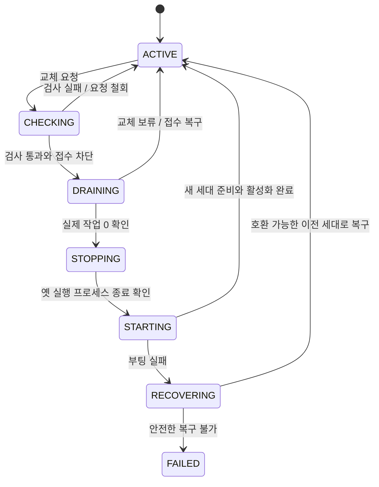

# 재기동 제어 단일화와 조건부 blue/green 설계

상태: **구현 전 인계 설계**. 기준: 정본 main `777430f9`, 2026-09-11.
관련: [단순화 수리 기록](SYSTEM_SIMPLIFICATION_PLAN.md), [실행 원장 조회 설계](EXECUTION_TRACE_VIEW_DESIGN_2026_09_11.md).

## 1. 결정

**재기동 제어의 단일화는 필요하다. 완전한 blue/green은 현재 필수라고 판단할 근거가 부족하다.**

우선 구현할 것은 한 제어자가 새 작업 접수 차단, 기존 작업 종료 대기, 코드 사전검사, 재기동, 복구를 책임지는 구조다. 이것만으로도 서로 다른 타이머와 복구 주체의 충돌을 줄일 수 있다. 다음으로 부작용 없는 후보 준비를 만든다. 두 세대가 동시에 사용자 작업을 실행하는 blue/green은 이 두 단계 이후에도 측정된 중단 비용이 크면 도입한다.

`/health`가 초록이면 새 포트로 바꾸는 정도로는 충분하지 않다. 아래 사실 때문에 Fable의 “안전 9겹을 2겹으로 대체”라는 수량 목표는 채택하지 않는다. 기존 장치가 보장하던 기능은 새 소유자가 검증을 마친 것만 은퇴시킨다.

## 2. 현재 코드에서 확인한 사실

| 근거 | 현재 동작 | 설계상 의미 |
|---|---|---|
| [api.py](../backend/api.py) `lifespan` | 부팅 시 일정·채널·창고 폴러, 터널, 기기 등록, 공급/수집 작업 등을 시작 | 두 번째 정상 부팅은 수동 대기 프로세스가 아니다. 중복 실행·쓰기 가능 |
| 같은 파일 `/health` | healthy와 live episode ID를 반환. 관측 예외 때 빈 목록으로 남을 수 있음 | 생존, 관측 실패, 실행 준비를 분리해야 함 |
| [quiescent_reload.py](../backend/base/quiescent_reload.py) | 진행 턴을 기다리지만 상한/관측 불능 뒤 재기동 경로 존재 | 대기 종료와 안전한 인계는 다른 판정 |
| [reload_gate.py](../backend/base/reload_gate.py) | 파일 표식, 단계별 TTL, 부팅 회수 | 제어자의 수명 상태로 이관하되 새 일 거절 의미 보존 |
| [red_apply.py](../backend/datastore/red_apply.py), [red_watchdog.py](../backend/datastore/red_watchdog.py) | 편집자 밖 프로세스가 적용·검증·복구 수행 | 자기 죽음 이후 조치는 외부 소유자가 계속 맡아야 함 |
| [backend_keeper.sh](../scripts/backend_keeper.sh) | 고정 포트 health, 3회 확인, 부팅 유예, 프로세스 정리·재시작 | 후보와 현역을 구분하지 않는 기존 소생 명령을 다중 세대에 그대로 사용하면 안 됨 |
| [backend-process.js](../frontend/electron/backend-process.js), [start.sh](../start.sh) | 기동·종료·keeper와 고정 포트의 또 다른 제어 입구 | 하나의 요청 계약으로 합류시켜야 함 |
| [chat_runs.py](../backend/services/chat_runs.py), [execution_workers.py](../backend/base/execution_workers.py) | 연결 종료 뒤에도 승인된 작업/워커가 계속될 수 있음 | WS 개수나 채팅 active 맵만으로 drain 완료 판정 불가 |
| [api.py](../backend/api.py) 종료부 | 터널 소유자 정리, 큐 drain, 종료 시한 | 단순히 옛 프로세스를 두면 자연 종료한다는 가정 불가 |

이 표는 코드 조사다. 최신 운영 중단 횟수·중단 시간·메모리 여유는 이번에 측정하지 않았다. 과거 사고 주석을 현재 빈도로 환산하지 않는다.

## 3. 첫 구현 범위: 단일 현역 재기동

### 3.1 소유자와 요청

백엔드 워커 밖에 `restart_controller`를 둔다(제안 이름). 기존 keeper를 단계적으로 이 제어자의 감시/복구 루프로 바꾸고, 별도 경쟁 데몬을 추가하지 않는다. 개발 리로더·RED 적용·Electron·시작 스크립트는 제어자에게 요청한다.

요청은 `request_id`, `reason`, `expected_generation`, `artifact_digest`, `policy`를 가진다. 같은 request_id 재전달은 새 재기동을 만들지 않는다. 다른 요청은 직렬화하며, 적용 대상 코드가 달라지면 새 검사가 필요하다. 편집 중인 파일 묶음의 일관된 manifest/hash를 검증 직전과 적용 직전에 대조한다.

제어 상태는 다음 항목만 영속화한다. 경로·이름은 구현 때 data_ownership에 선언한다.

- 상태 버전, 작업 ID, 현재/후보 generation, 코드 digest, 요청 이유
- 프로세스 PID와 시작 신원/기동 nonce, 현재 단계, 마지막 결과, 단계별 마감 시각
- 취소/복구 정책과 마지막으로 관측한 실제 작업 소유자

원자적 파일 교체와 내구성 처리를 사용하고, 운영체제 수준 단일 소유 잠금을 둔다. PID 파일의 존재나 PID 숫자만으로 소유권을 판단하지 않는다. 제어자 재시작은 상태 기록과 실제 자식 프로세스를 대조한 뒤 이어 간다. 제어용 상태는 실행 원장 물리 통합에 의존하지 않는다.

### 3.2 상태 전이

- 새 최상위 작업의 접수 차단과 active 작업 등록을 같은 동기화 경계로 만든다. “0 확인 직후 새 작업 시작” 경쟁을 차단한다.
- 기존 작업의 자식 호출·도구 종료·대화 저장·결과 회수는 drain 중에도 허용한다. 전역 HTTP 503으로 기존 작업의 MCP 재진입까지 막으면 교착한다. 검증된 parent execution 신원으로 기존 작업의 연속임을 판단한다.
- 관측 가능한 대상: GUI/HTTP/MCP 최상위 실행, 스케줄·채널에서 접수한 작업, 위임 자식, 도구의 별도 스레드/프로세스, 종료 후 저장 작업. 에피소드·UI 연결·스레드 수는 보조 신호이며 단독 정답이 아니다.
- 완료 카운터는 실제 작업의 finally에서 해제한다. HTTP/WS 타임아웃과 소켓 종료만으로 해제하지 않는다. 취소 요청과 실제 중단 완료도 분리한다.
- 살아 있지만 작업 상태를 알 수 없으면 `UNKNOWN`이다. 자동 교체는 보류한다. 죽음/부팅 지연/관측 실패를 하나의 0건으로 합치지 않는다.
- 예정된 교체의 대기 상한이 지나면 기본은 보류·접수 복구다. 강제 중단은 요청에 명시된 별도 정책만 허용하고 잘린 실행을 interrupted로 기록한다. 이미 발생한 외부 효과를 취소 성공으로 표현하지 않는다.
- 현역 크래시는 별도 복구 사건이다. 실제 프로세스 트리의 종료를 확인하고 새 현역을 시작한다. 응답 유실만으로 이전 외부 작업을 자동 재실행하지 않는다.

### 3.3 준비 상태

기존 `/health`와 `/ping`의 호환 응답은 유지하고, 제어자 전용 상태 계약을 추가한다(제안: 내부 `/runtime/status`). 예시 필드:

`generation, code_digest, phase, readiness, active_roots, active_children, pending_finalizers, ownership, observed_at, errors`

`readiness`는 `starting/ready/degraded/failed/unknown`을 구별한다. 필수 구성요소는 해당 설치의 활성 기능에 따라 선언하고, 선택 기능 실패와 서비스 인계 불가를 구분한다. 필드 누락을 준비 완료로 읽지 않는다. 모니터는 세대와 code_digest까지 대조한다. 제어 API는 로컬 소유 인증을 적용하며 외부 프록시 경유를 무조건 localhost로 신뢰하지 않는다.

## 4. 두 번째 단계: 부작용 없는 후보 준비

부팅을 `inspect → prepare → activate → deactivate`로 나눈다. 현재 lifespan의 서비스 시작뿐 아니라 import 부작용, boot_common, DB 생성/마이그레이션, 기기 등록, 자동 다운로드도 조사한다.

후보는 기본적으로 다음 권한이 없다: 운영 DB/설정 쓰기, 스케줄·폴러·터널 소유, 모델/외부 API 호출, 사용자 작업 접수, 공개물 발행. 허용된 읽기와 일시 작업 공간만 쓴다. 플래그를 믿는 수준을 넘어 시험에서 DB·파일·네트워크·자식 프로세스 부작용을 적발한다. 필수 라이브 경로가 이를 보장하지 못하면 해당 준비 검사를 격리된 데이터 사본에서 한다.

코드 root와 사용자 data root를 분리해야 한다. 현재 `__file__` 기반 경로와 동적 패키지/설정 로딩을 감사한다. 후보를 같은 가변 checkout에서 띄우고 옛 워커가 변경 후 파일을 lazy import하게 두면 세대 격리가 성립하지 않는다. 배포용 불변 코드 산출물과 digest를 사용한다. 이는 개발용 새 clone/브랜치가 아니며, 정본 main의 빌드 산출물이다. 사용자 비밀과 DB를 산출물에 복사하지 않는다.

후보 검사가 끝나도 최초 도입은 **옛 현역 drain/종료 → 후보 활성화**로 진행한다. 작은 접수 중단은 허용한다. 후보 단계의 캐시가 활성화 때 읽은 설정·권한·DB 버전과 일치하는지 다시 검증한다.

## 5. 완전한 blue/green을 다시 결정할 조건

앞 단계의 대표 실행에서 다음을 측정한다: 재기동 요청~적용 시간, 접수 불가 시간, 완료 전 잘린 실행, 중복 외부 효과, 부팅 실패 복구 시간, 후보 준비의 최고 RSS. 필수 효과는 중복 0·허위 완료 0·안전한 실패 복구다. 중단 시간 목표와 메모리 한도는 이 기준선과 사용 환경에서 정한다. 임의 수치를 현재 시스템의 SLA로 선언하지 않는다.

그 후에도 해결해야 할 장기 실행의 중단 비용이 분명할 때만 다음 구조를 설계/구현한다.

1. 공개 주소/포트는 안정된 앞단이 소유한다. 백엔드 세대는 내부 포트에만 bind한다. 그 앞단도 장애 소유자·재시작 계약이 필요하다.
2. 기존 WS와 스트림은 연결된 세대로 고정한다. 진행 작업의 cancel/steer/MCP 재진입도 generation+execution 신원으로 원래 세대에 전달한다. 새 연결의 새 작업만 새 세대로 간다. 스위치만으로 소켓을 이식할 수 있다고 가정하지 않는다.
3. 스케줄·폴러·터널의 소유권은 하나만 활성이다. generation을 실은 소유 토큰과 실행 직전 검증을 도입한다. TTL 만료만으로 새 소유자를 켜면 멈췄던 이전 프로세스가 재개할 수 있다. 이전 소유자의 정지 확인 또는 효과 경계의 실질적인 차단이 필요하다.
4. 이미 승인된 옛 작업과 새 작업의 동시 DB/파일 쓰기를 허용하려면 저장소별 동시성·캐시 정합·외부 효과 중복 방지를 검증한다. singleton lease 하나는 모든 사용자 작업을 막아 주지 않는다. 준비가 안 된 저장소는 기존 세대가 끝나기 전 새 쓰기를 허용하지 않는다.
5. 외부 시스템이 idempotency를 지원하면 논리 operation ID를 사용한다. 지원하지 않으면 전송 후 응답 유실을 `effect_unknown`으로 남기며 무조건 재전송하지 않는다. “정확히 한 번”을 전체 외부 세계에 보장하지 않는다.
6. 두 버전이 함께 쓰는 기간의 스키마 호환성을 확인한다. 파괴적 마이그레이션은 동시 세대 방식에서 제외한다. 코드 롤백이 이미 쓴 DB/외부 효과까지 되돌리는 것은 아니다.
7. 원격 인증 세션과 MCP/브라우저의 메모리 상태를 소유·공유·재인증 중 어떻게 처리할지 정한다. 신뢰된 proxy 정보만 전달하고 임의 forwarded 헤더의 인증 우회를 시험한다.
8. 메모리 한도를 넘으면 후보를 폐기하고 기존 단일 현역 방식으로 돌아간다. 개발/패키지/macOS/Windows, 폰의 시작·종료 계약을 각각 검증한다.

## 6. 구현 묶음과 완료 기준

| 순서 | 변경 | 통과 기준 |
|---|---|---|
| R0 | 모든 기동/종료/재기동 입구와 실제 작업 경계 지도, 관측 상태 구분 | 미관측을 0으로 처리하지 않고 현재 부하의 기준선 확보 |
| R1 | 외부 제어자, 직렬 요청, 단일 현역 drain/재기동, RED/keeper 이관 | 접수 경쟁·제어자 사망·기동 실패·의도적 종료 시험 통과 |
| R2 | 부팅 단계 분리, 불변 코드 산출물, 후보 준비 | 후보 운영 부작용 0, 코드/데이터 경로 격리, 메모리 한도, 실패 시 현역 유지 |
| R3 | 안정 앞단과 두 세대 동시 처리 | §5의 모든 선행조건과 실제 필요성 측정 충족 후 별도 착수 |

기존 안전장치 제거는 R1/R2의 기능별 대응표를 작성한 뒤 한다. keeper의 크래시 감시, preflight, 사용자 의도적 종료, RED 검증/복구는 필요 기능이다. 파일 개수 감소가 완료 조건이 아니다.

필수 장애 주입: 각 상태 저장 직전/직후 제어자 사망, 새 작업 등록과 drain 경쟁, 응답만 느린 현역, 실제 현역 사망, 도구가 타임아웃 뒤 계속 실행, 후보 부작용 시도, 오래된 generation의 명령, PID 재사용, 포트 점유, 후보 설정 손상, 모든 창 닫기, 재시작 뒤 동일 요청 재전달. 외부 송신은 시험 어댑터로 대체한다.

R0/R1은 기존 동작 회귀(`test_quiescent_reload`, `test_preflight_restart`, `test_red_apply_turn_cut`, `test_worker_lifecycle`, `test_chat_run_isolation`, `test_remote_session`)와 전체 backend 검사를 실행한다. Electron 변경 시 TypeScript·빌드·실제 종료/재시작도 확인한다. 각 실패 지점에서 남은 실제 작업, 원장 상태, 제어 상태를 함께 검증한다.

## 7. 다른 세션에 넘길 요청

> 정본 `/Users/kangkukjin/Desktop/AI/indiebizOS`의 AGENTS.md와 이 문서를 읽고 R0→R1을 구현하라. 현재 코드를 재확인하고 단일 현역 재기동의 소유권부터 모아라. R2는 R1 검증 뒤 진행하고, R3의 동시 실행 blue/green은 측정과 선행조건 없이 구현하지 마라. 기존 승인된 작업·취소·재개·의도적 종료 의미를 보존하고, 실제 외부 송신 없는 장애 주입으로 검증하라. 새 브랜치/clone 없이 정본 main에 검토 가능한 묶음별로 커밋하고 이 문서에 결과를 기록하라.

## 8. R0 조사 결과 (2026-09-11)

정본 main에서 조사했다. 17:19 KST 단회 실측: `/health` 200, 0.010초,
`live_turns=[]`. 리로더 PID 571/RSS 103.3 MiB, 실행 워커 PID 584/RSS 633.3 MiB,
keeper PID 65566/RSS 2.0 MiB. 이는 **에피소드 0의 관측**이며 실제 실행·저장 작업
0의 증거가 아니다. 기존 계약에는 그 전수를 답하는 경계가 없었다. 과거 중단 비용은
이 표본에서 추정하지 않는다. R1 시험에서 제어 시간·접수 중단·복구 시간을 별도 측정한다.

### 입구와 수명 지도

| 입구 | 현재 소유/경쟁 | R1 귀속 |
|---|---|---|
| `backend/api.py` 직접 실행, Electron 개발/패키지 Python spawn | uvicorn 마스터/워커, 개발 WatchFiles | import 부작용 전에 외부 제어자로 합류; 워커는 reload 없이 1개 |
| `start.sh` | 시작 때 포트/이름 kill, 별도 keeper spawn, EXIT trap 소탕 | 같은 제어자 시작·의도적 종료 요청 |
| `scripts/backend_keeper.sh` | health 3회+유예 후 포트/이름 kill | 같은 제어자의 호환 실행 입구; 별도 감시 루프 폐지 |
| `quiescent_reload` | live episode 관측→TTL 관문, cap/unknown 강행 | 파일 변경 요청만 발급; 검사·drain·교체는 제어자 |
| `red_apply` | 예약 턴/증류 기다림, 독자 관문, 적용 | 예약 턴 저장 계약 유지, 실제 drain·적용 직렬화는 제어자 |
| `red_watchdog`, repair prepare/finalize | 백업 검증/복원, keeper pause 표식 | 백업/검증 기능 유지, 제어자가 사망 뒤 복구 소유 |
| Electron 모든 창 닫기 / start.sh INT·TERM·EXIT | 의도 표식 후 그룹·포트·이름 kill | 의도 표식/요청을 먼저 영속화, 소유 신원을 검증한 프로세스 트리만 종료 |
| `scripts/preflight_restart.py` | episode DB+미예약 repair staging, UNKNOWN=2 | 사전검사 기능 유지; 실행 소유 관측을 대체하지 않음 |
| `scripts/restart_electron.sh`, 앱 런처 | Electron 재시작 | Electron 동일 시작/종료 경유 |
| 폰 `phone_api` | 별도 몸의 부팅/종료 | R1 데스크탑 제어자 밖; 기존 계약 보존 |

실행 경계: `ChatRuns.begin/invoke`(WS 분리 후에도 수명 유지),
`api_ibl.execute_ibl_code`(HTTP 대기 종료 뒤 실제 to_thread 계속), `cognitive_stream`
(프로젝트·시스템 AI·위임·채널 공통), `calendar_manager._execute_task`,
채널 수신/발송·내부 위임 큐, `execution_workers`(submit에서 문맥 인수, 실제 finally),
도구의 스레드/프로세스와 `cognitive_distill`/`distill_queue` 저장이다.
취소 플래그, WS active map, episode ended_at 어느 하나도 완료 카운터로 쓰지 않는다.
MCP의 agent/task/episode ID는 추적용이며 drain 통과 자격으로 신뢰하지 않는다.

R0 관측 구분: `/health`의 기존 list 필드는 호환 유지하고
`live_turns_observation=known|unknown`을 추가했다. 관측 예외가 난 빈 목록은 리로드/RED
프로브가 UNKNOWN으로 읽는다. R1의 `/runtime/status`만 실제 교체 준비를 판정한다.
