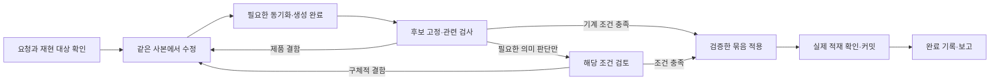

# 자기수리 절차 재설계 — 관련 검사에서 적용까지 한 흐름으로

상태: **2026-10-03 정책 2 구현, 관련 검사 통과.** 에피소드 4284·4285의 실패와 사용자의 심사 절차 재검토 요청을 반영한다. 이 문서의 본문은 같은 날 앞서 구현한 설계의 후속 구현이며, 이전 구현·검증 사실은 끝의 부록에 보존한다. 새 수리에 정책 2를 고정하고 진행 중인 수리는 기존 정책을 유지한다.

정본: `/Users/kangkukjin/Desktop/AI/indiebizOS`. 외부 구현 작업은 정본 main에서 수행한다. 아래 사본은 실행 중 자기수리의 기존 `.worktrees/repair-*`를 뜻한다. 목적 정본은 [IBL 진화 목적](IBL_EVOLUTION_PURPOSE.md), 검사 범위는 [회귀 규약](REGRESSION_TESTING.md)이다.

## 1. 설계 결정

**명확한 수리는 실행자가 같은 사본에서 조사·수정·관련 검사를 끝내고, 신뢰된 적용 서비스가 그 결과로 반영한다. 모든 수리에 별도 AI의 포괄적인 준비 승인과 최종 승인을 요구하는 절차를 없앤다.**

검사는 사용자가 요구한 동작과 변경의 회귀를 확인한다. 기계로 확인한 사실을 다른 AI가 산문을 읽고 다시 승인하도록 하지 않는다. 실제 의미 판단이 필요한 조건에만 기존 평가자를 사용한다. 실행자의 자기 선언, 임의 명령의 종료 코드 0, 검사 0건은 기능 통과의 근거가 아니다.

유지하는 것은 격리, 사용자 권한·취소, 같은 사본의 단일 수정 소유권, 정본 충돌 방지, 검증 바이트의 고정, 적용·복구·커밋 영수증이다. 없애는 것은 무조건적인 의식 계획 호출, 모든 기준을 다시 읽는 AI 적용 심사, 적용 뒤의 동일 기능 재평가, 심사 실패를 새 개발 세션으로 전환하는 동작이다. 비수리 작업의 평가 정책은 이 변경의 대상이 아니다.

### 수리 사본의 목적과 능력 연결 (4295 후속)

수리 사본은 실행 중인 자신을 수정하는 수명 문제를 해결하기 위한 작업 대상이다.
별도 환경을 만든다는 이유로 모델·인증·외부 네트워크·검색·일반 IBL 능력을 줄이지 않는다.
기존 사용자·회원·어휘·설치 권한은 유지하며, 일반 도구 호출에 대한 수리 전용 허용 목록은 제거했다.
코드 수정·생성·기능 검사는 사본에서 수행하고 적용·재기동·복구·각인은 기존 제어자가 맡는다.

- 공통 호출 경계 `repair_execution_scope`가 사본 신원을 선택하고 `thread_context`가 병렬 호출에 전달한다.
  호출 종료·예외 뒤 원래 문맥을 복원하며 프로세스 전역 작업 경로를 변경하지 않는다.
  `~workspace`, 파일 도구, workspace 도구 문맥, 등록 스크립트 원장·소스·의존 지문,
  임시 `~turn` 파일과 실행 기록은 같은 사본을 사용한다.
- 수리 셸과 등록·임시·세션 스크립트의 자식 실행은 `repair_process.prepare`를 공유한다.
  외부 네트워크를 허용하고 `.env` 인증은 환경으로만 전달한다. 소스·시험 데이터 기준은
  `INDIEBIZ_BASE_PATH`, 모델 선택 설정의 읽기 기준은 `INDIEBIZ_MODEL_CONFIG_ROOT`로 구분한다.
  모델 설정을 읽기 위해 정본으로 작업 경로를 되돌릴 필요가 없다.
  CLI 인증은 읽기 연결하고 세션·캐시는 작업 런타임에 둔다.
- 사본 파일 읽기는 텍스트·JSON·CSV·문서의 기존 계약을 그대로 쓴다. API·AI·드라이버·시스템
  도구는 평소의 호출·권한 경로로 실행한다. 일반 외부 동작까지 사본의 트랜잭션으로 되돌린다고
  주장하지 않는다. 기능 시험의 데이터·포트는 사본에 준비한다.
- 정본 코드·공유 의존성·Git·적용 원장에 대한 자식 프로세스 쓰기는 계속 차단한다.
  운영 서버 직접 호출과 다른 프로세스 종료로 적용 절차를 대신하지 않는다.
  네이티브 CLI의 코딩 명령은 기존 MCP 사본 파일/셸 통로를 사용해 실행 근거를 남긴다.
  적용 전후 검사·충돌·취소·복구 계약은 변경하지 않는다.

4295의 재현 원인은 모델 설정 부재, 외부 통신 차단, JSON 읽기 및 AI 호출의 일괄 거절이었다.
번역기는 빈 응답을 JSON 구문 오류로 바꾸지 않고 번역 모델 실패로 전달한다.
실제 수리 프로세스에서 같은 번역기로 `설정`, `언어`를 요청해 `設定`, `言語`를 받았고,
인증 파일이 사본에 복제되지 않았음을 확인했다. 전체 일본어 카탈로그 생성·UI 반영을 완료한
시험은 아니며 그 원래 수리 요청의 완료와 구분한다.
검증은 `test_repair_capability_parity`와 기존 사본·영수증·스크립트·실행 경계 회귀를 따른다.

후속 실제 IBL 인수에서도 사본 JSON 읽기 → `table:ai`의 실제 모델 번역 → 같은 사본 JSON 저장을 한 프로그램으로 실행했다. 두 원본 행·ID와 `設定`/`言語`를 보존했고 저장된 `items`가 IBL 반환 행과 일치했다. 이 검사는 수리 문맥·실제 도구·모델 연결을 확인하며 전체 `#repair` UI 과제를 다시 수행한 검사는 아니다.

사본 선택은 실제 경로/실행이 필요할 때 지연하고 같은 호출의 병렬 첫 사용은 한 번만 준비한다. `self:patch status`는 새 세션을 만들거나 적용 예약·적용 완료 상태를 바꾸지 않는다. 이 세 상태와 병렬 첫 사용, 문맥 복원, JSON 조합, 등록/임시/세션/백그라운드 실행, 설정·인증 전달을 신규 회귀 14개로 검사한다.

2026-10-04 최종 호스트 전수(`.venv/bin/python -m pytest backend/ --ff`): **8,763 passed, 16 skipped, 1,133.25초**, 실패 0. 초기 전수의 7개 실패는 회원 감사 지문·파생물 갱신 전 상태 4건, 옛 수리 지침 전제 2건, 새 시험 파일의 직접 실행 진입점 1건이었으며 각각 수정·재검증한 뒤 최종 전수를 실행했다. IBL·층·Android 번들·동시성·은퇴 계약 등 커밋 관문과 자기수정 안전장치 30개도 통과했다. 정본 main의 구현 커밋은 `a582edab`이며, 실행 백엔드 `ACTIVE`와 현재 코드 지문 일치를 확인했다. 실제 에피소드의 소요 시간·토큰 절감률은 아직 재측정하지 않았다.

## 2. 이번 실패에서 확인한 구조적 원인

| 확인한 사실 | 결과 | 설계에서 바꿀 책임 |
| --- | --- | --- |
| `repair_readiness.prepare`가 `missing_criteria`와 `decision`을 반환하지만 `ibl_v2_adapters.decode_envelope`의 오류 필드 목록이 이를 버린다. 작은 입력으로 `details={}`를 재현했다. | 실행자는 무엇을 보완해야 하는지 모른다. | 생산자부터 모델 표시·인계까지 구조화된 실패 원인과 다음 행동을 보존한다. |
| `repair_staging.verify`는 검사 전 `candidate.refresh`와 IBL 생성기를 실행한다. 둘 다 사본을 바꿀 수 있다. | 먼저 검사한 내용과 적용 심사가 보는 내용이 달라질 수 있다. 이번 첫 거절의 지문 불일치는 관측했지만 바뀐 파일의 정확한 원인은 별도 추적이 필요하다. | 준비·생성과 읽기 전용 검증을 분리한다. |
| 준비 심사는 출력을 앞뒤 3,000자씩으로 줄이고 도구 없는 평가자에게 전달한다. 실행자는 재검사의 브라우저 출력을 `/dev/null`로 버렸다. | 기능 실패 증거 없이 `UNKNOWN: evidence`로 막힌다. | 원문·검사 결과를 서비스가 보존하고, 필요한 증거 회수는 서비스가 한다. |
| 준비 단계의 증거 부족이 최종평가에서 C5 적용 미완료로 재서술된다. | 구체적인 다음 행동이 사라지고 큰 문맥의 새 실행이 시작된다. | 원래 실패를 유지하며 증거·환경 복구와 제품 개발을 구분한다. |
| 동일 미달 기준·산출물의 3회 반복 차단은 이미 있고, 4284·4285의 진행 지문도 같다. | 무한 반복이라고 단정할 수는 없으나, 차단 전의 무진전 재시도도 비싸다. | 입력이 같은 재요청은 이전 결과를 즉시 돌려주고 새 모델 호출을 하지 않는다. |
| 실행자 지침 `13_repair.md`는 forage·등록 스크립트를 요구하지만 현 격리 경로와 `14_consciousness_repair.md`는 일부를 미지원으로 규정한다. | 실행 전에 예측 가능한 도구 실패가 발생한다. | 실제 실행 능력과 지침을 한 계약으로 맞춘다. |

4284의 경과 시간은 약 20분 50초, 실행 도구 호출은 62회, 실패 집계는 14회다. 이 수치는 관측 기준선이며 모든 시간을 심사 비용으로 간주하지 않는다. 수정·조사·검사에도 시간이 들었다. 후속 개선의 시간·토큰 절감률은 구현 후 측정한다.

## 3. 요청 해석과 검사 선택

### 명확한 요청은 실행자가 바로 처리

`#repair`는 격리 수리 권한과 적용 경로를 선택한다. 별도 의식 모델의 계획·장문 기준 생성을 강제하는 신호로 사용하지 않는다. 기존 실행자의 첫 작업에서 사용자 요청, 재현 대상, 필요한 검사 범위를 짧게 정리하고 바로 조사한다. 이전 과제·기억은 관련성이 있을 때만 읽는다. 수리마다 기억 가지·전체 해부도·기존 미완료 과제 전체를 다시 읽는 의례를 만들지 않는다. 저장소 필수 규약은 유지하고 동일 세션에서 읽은 내용은 재사용한다.

독립적인 설계 선택·불명확한 정책·큰 의존 관계 때문에 계획이 실제로 필요하면 기존 의식을 호출한다. 명시적인 `#think`도 유지한다. 이를 결정하기 위한 새 상시 분류 모델이나 작은/큰 수리별 별도 엔진은 추가하지 않는다. 원인 조사 중 규모가 커지면 같은 작업을 유지한 채 필요한 계획을 보충한다.

기존 `criteria_contract`를 재사용하며 새 요구사항 원장을 만들지 않는다. 명확한 수리는 실행자가 현재 사용자 요구를 짧은 기능 조건으로 연결하고, 의식이 필요한 수리는 의식이 그 역할을 맡는다. 기준 소유권과 출처를 기록한다. 평가자가 기준을 추가·강화·면제하는 권한은 없다. 사용자 조건을 삭제하거나 좁히는 변경은 단순 검사 수정과 구분해 기존 기준 변경 경로에 기록한다.

### 검사와 의미 판단을 구분

| 조건 | 책임과 근거 |
| --- | --- |
| 타입·구문·실제 회귀 검사·API 응답·DOM 문자열·상태 전환 | 기존 검사기와 호스트 실행 영수증. 검사 식별자·단언·대상·입력이 연결돼야 한다. |
| 배치·가독성·문장의 의미·비정형 결과의 적합성 | 실행자가 필요한 관측을 확보하고 기존 평가자가 해당 조건만 검토한다. |
| 충돌·권한·취소·검사 대상 일치·필수 관문 | 현재 신뢰된 호스트 코드. 모델이 대신 승인할 수 없다. |
| 정본 적재·재기동·커밋 | 기존 적용 제어자·각인 서비스의 영수증. 기능 평가 항목으로 반복 생성하지 않는다. |

검사 범위는 변경 계약과 직접 소비자에서 도출한다. 파일 수나 확장자만으로 저위험을 선언하지 않는다. 영향 불명·격리 정책 변경은 기존 회귀 규약대로 넓게 검사한다. 위험도가 높다는 이유만으로 증거 없는 AI 승인 단계를 추가하지 않고, 필요한 검사와 관측을 늘린다.

새 기능 검사는 요청·재현 입력·예상 동작·실제 단언과 연결해 작성한다. 기존 검사의 삭제·skip·단언 약화는 검사 통과로 숨길 수 없으며, 호스트의 필수 정책 검사는 사본의 변경으로 면제되지 않는다. 변경된 검사와 요청의 의미적 연결이 불명확할 때만 그 연결을 검토한다. 새 검사를 썼다는 이유만으로 모든 수리에 의미 심사를 추가하지 않는다. 이 절차도 임의 코드의 완전한 정당성을 증명하지는 않는다.

## 4. 정상 경로

별도 UI나 여러 번의 수동 API 호출을 요구하는 그림이 아니다. 기존 `run_command`와 `self:patch` 내부에서 이 순서를 구현한다. 기존 `apply` 진입점은 같은 검증 조정 함수를 사용한다. 신뢰할 수 있는 검사가 없으면 구체적인 누락을 반환하고 같은 실행자가 보완한다.

### 준비와 검증의 경계

- 동기화·의존 준비·관련 파생물 생성은 후보를 고정하기 전에 한다. frontend 표시 수정에 무관한 IBL 생성기를 매번 돌리지 않는다. 기존 필수 빌드 규칙을 영향 범위에 맞춰 재사용한다.
- 생성과 검사를 한 셸 문자열에 합쳐 전체를 하나의 검사로 기록하지 않는다. 기존 실행 경로가 준비 단계와 검사 단계를 별도 영수증으로 연결하도록 한다. 사용자가 절차를 수동으로 맞출 책임을 지지 않는다.
- 검증과 적용 판정은 소스·검사·의존 입력을 바꾸지 않는다. 검사 출력·캐시는 사본의 별도 작업 경로에 보존한다. 테스트가 소스나 적용 대상 산출물을 변경하면 해당 검사 통과를 새 후보에 그대로 적용하지 않는다.
- 후보 지문이 다르면 변경 파일과 무효화된 검사를 반환한다. 동기화·생성을 숨겨서 진행한 뒤 일반적인 “유효한 검사 없음”을 내지 않는다.
- 검사 재사용 키는 검사 내용/명령·대상·입력·의존 환경·기준 판본이다. 신뢰된 범위 정보가 있으면 관련 검사만 무효화하고, 영향 범위가 없으면 보수적으로 전체 후보 지문을 사용한다. 임의로 프런트/백엔드라는 이름만 보고 재사용하지 않는다.

### 검사 영수증과 적용

`execution_checks`, `TurnStore`, `readiness`, `sealed`를 확장하며 평행 원장을 만들지 않는다. 영수증에는 실제 검사 식별자·수집/실행/성공/실패/건너뜀, 대상 지문, 입력·환경, 원문 참조와 확인한 조건을 연결한다. `git status` 성공이나 `print("PASS")`를 기능 검사로 인정하지 않는다. 지원되는 검사기의 결과는 실제 보고서와 종료 상태로 읽고, 임의 명령은 관측 자료로 구분한다. pytest 등 보고서 형식과 현재 검사 스크립트를 먼저 재사용한다.

출력량 축소는 모델 표시에서만 한다. 원문은 호스트가 보존한다. 자식 명령이 출력을 버렸고 다른 구조화된 보고서도 없으면 그 검사는 근거 부족으로 남기고 정확히 그 명령의 보완을 요청한다. 버린 출력을 시스템이 복원할 수 있다고 가정하지 않는다.

`repair_readiness.prepare`는 신뢰된 영수증과 필수 조건을 기계적으로 대조한다. 모든 기능 조건에 유효한 기계 근거가 있으면 AI 준비 심사를 호출하지 않고 고정 묶음을 만든다. 의미 판단이 남아 있으면 해당 조건·변경·관련 증거만 기존 평가자에게 전달한다. 이미 확정된 사실을 다시 판단하거나 전체 도구 이력과 이전 대화를 되풀이해서 주입하지 않는다.

모든 적용 진입점은 같은 고정 묶음·소유권·취소·충돌 검사를 거친다. 정본 미커밋 변경과 수리 델타를 구분하고 공유 인덱스·타인 변경을 보존한다. 적용 직전에도 기대 정본과 검사한 바이트를 대조한다. 준비·검사 함수의 수정본이 자기 자신을 승인하지 않도록 현재 호스트 정책으로 집행한다.

## 5. 의미 심사는 제한된 검토로 사용

기존 평가자를 사용하되 포괄적인 APPROVED를 모든 수리의 필수 토큰으로 삼지 않는다. 심사 단위는 아직 기계적으로 확인할 수 없는 명시 조건이다. 거절은 조건 ID·구체적인 관측·최소 보완을 포함해야 한다. 이미 통과한 동작에 일반적인 품질 요구를 새로 붙일 수 없다.

증거 부족은 제품 실패와 다르다. 신뢰된 서비스가 같은 root에 속한 요청된 증거를 원문 저장소에서 회수해 조건 검토를 한 번 보충한다. 모델에 파일시스템 전체 접근이나 무제한 증거 탐색을 허용하지 않는다. 원문이 없거나 필요한 관측 자체가 없으면 실행자에게 정확한 관측 항목을 돌려준다. 평가 서비스 오류는 검토 단계 대기이며, 구현을 다시 시작할 사유가 아니다.

같은 조건·후보·검사 근거·정책 판본의 합격과 거절은 재사용한다. 의미 검토 보충은 새 증거가 들어왔을 때만 다시 호출한다. 서로 다른 실패를 “사본 준비 미달 또는 검증 중 변경” 하나로 뭉치지 않는다.

## 6. 실패와 재개

오류 봉투에는 단계, 원인 종류, 실패한 조건/검사, 근거 참조, 다음 행동, 재개 위치를 담는다. 기존 `Fault.details`/`recovery` 계약으로 생산자 → IBL 변환 → 모델 표시 → 과제 인계까지 같은 내용을 보존한다. 특정 어휘 이름을 언어 엔진에 하드코딩하지 않는다. 일반 필드의 안전한 보존·마스킹 정책을 정하고 작은 반례로 전체 경로를 검사한다.

| 실패 종류 | 처리 |
| --- | --- |
| 제품 동작/회귀 실패 | 같은 실행·사본에서 해당 부분을 수정하고 영향 검사 재실행 |
| 검사 출력 누락 | 저장된 원문 회수, 없으면 해당 관측만 재수행 |
| 검사기/환경/도구 미지원 | 해당 기반 조건을 해결하거나 구체적인 미완료로 표시. 제품 재구현을 지시하지 않음 |
| 평가 서비스 오류 | 검토 단계만 보존하고 제한된 서비스 재시도. 새 개발 세션 금지 |
| 정본 충돌/후보 변경 | 변경 파일과 영향을 보여주고 같은 사본에서 재조정 |
| 적용/재기동 실패 | 기존 제어자의 결과 회수·복구. 결과 불명인 부수효과를 자동 반복하지 않음 |
| 커밋만 실패 | 적용 상태를 유지해 표시하고 각인 단계만 회수/재시도 |

검사 실패나 준비 거절은 실행자 종료 신호가 아니다. 최종 평가가 이를 “적용되지 않음”이라는 새 결함으로 바꾸지 않는다. 동일 후보·동일 증거·동일 장애의 요청은 저장된 결과를 즉시 반환한다. 새 실행 task ID나 응답 문구는 진전이 아니다.

기존 취소와 작업 예산, 무진전 반복 차단을 유지한다. 예상 가능한 다음 행동 없이 단지 실패했다는 이유로 자동 세션을 만들지 않는다. 프로세스 사망·문맥 한도·실제 재기동 때문에 새 실행이 필요할 때는 같은 root의 사본·기준·통과 조건·원문 참조·정확한 다음 행동만 계승한다. 원래 요청은 보존하되 이전 장문 조사 전체를 다시 주입하지 않는다.

과제에 속한 증거는 작업 범위가 제한된 조회로 접근하게 한다. 격리 사본 밖이라는 이유로 자기 검사 영수증까지 읽지 못하는 상황을 없애되, 운영 상태 디렉토리 전체의 읽기/쓰기를 열지 않는다. 지원하지 않는 도구를 프롬프트에서 사용하라고 요구하지 않는다.

## 7. 적용 뒤의 완료

수리의 완료는 기능 근거, 검증된 묶음의 정본 반영, 필요한 활성 확인, 수리 델타의 커밋이 함께 확인된 상태다. 활성 확인은 배포 환경에서만 필요한 차이를 검사한다. 같은 소스 회귀를 다시 전부 돌리지 않는다. 사용자 화면의 번역 수정이면 실제 로드된 UI 번들과 해당 표시의 관측을 포함하고, backend health 응답만으로 UI 적재를 대신하지 않는다.

사본의 실제 빌드에서 기능을 검사할 수 있으면 먼저 검사한다. 살아 있는 사용자 GUI에서만 확인할 조건은 애초 그 실행 경계를 계획하고, 기존 호스트 관측 서비스가 허용된 읽기 전용 관측을 수행하도록 한다. 기능 검사를 피하려고 사후에 활성 항목으로 옮기지 않는다. 지원하지 않는 관측은 초기에 밝히며 시도 가능한 적재 확인과 사용자가 체감하는 완료를 구분한다.

정상 경로의 완료는 위 영수증을 기계적으로 조합한다. 사본의 기능 조건을 적용 뒤 최종평가 AI가 다시 승인하지 않는다. 의미 검토가 필요한 활성 조건이 실제로 남아 있을 때만 그 조건을 평가한다. 판단 경로는 기계 확인/의미 검토/혼합으로 기록하고, AI 평가를 실행하지 않은 일을 AI가 ACHIEVED 판정한 것처럼 원장에 쓰지 않는다. 응답·주행기록·과제 상태·증류의 소비자도 이 구분을 함께 처리한다.

완료 보고는 결과, 관련 검사, 실제 반영 상태, 남은 한계만 전달한다. 고정된 다섯 문단 보고 형식이나 특정 표현을 합격 조건으로 삼지 않는다.

## 8. 이번 번역 수리에 적용한 예상 흐름

1. 사용자가 말한 시스템상태 화면의 진입 경로를 확인하고, `label/detail`의 번역 경계와 서비스명 등록을 추적한다. 같은 이름의 X-Ray 등 다른 화면으로 범위를 추측해 확대하지 않는다.
2. 기존 공통 번역 경로에 필요한 문구를 연결한다. 언어마다 화면 조건문을 추가하지 않는다.
3. 관련 번역 산출물을 생성한 뒤 후보를 고정한다. 화면의 영어 표시·갱신·재열기·한국어 복귀·일본어 테스트 리소스 연결을 실제 사본 빌드에서 확인하고, 관련 타입·회귀 검사를 실행한다. 일본어 전체 UI 출시는 요구하지 않는다.
4. 위 조건을 실제 DOM/상태 단언으로 확인했다면 별도 AI가 검사 로그를 다시 승인하지 않는다. 적용 서비스가 영수증·충돌·묶음을 확인해 반영한다.
5. 실제 앱이 수정한 번들을 적재했고 해당 표시가 바뀌었는지 확인하고 커밋 결과를 보고한다. 이 관측 경로가 없다면 검사 직전까지 숨기지 말고 초기에 해결해야 한다.

목표는 정상 경로에서 실행자 세션 하나, 최종 적용 한 번, 변경 없는 검사 재실행 0회, 기계 조건에 대한 별도 준비/최종 AI 심사 0회다. 실제 제품 실패 수정·재기동·문맥 교체는 별도 계수한다. 고정된 몇 분 내 완료를 보장하거나 이번 코드가 이미 완성됐다고 소급 승인하지 않는다.

## 9. 구현 위치와 삭제할 경로

| 소유 위치 | 변경 | 제거·대체 |
| --- | --- | --- |
| `backend/cognition/agent_pipeline.py`, 수리 진입·그랜트·감독 연결 | 격리 권한과 의식/평가 필요 여부 분리, 명확한 요청의 직접 실행 | REPAIR이면 의식·최종평가를 무조건 켜는 결합 |
| `backend/cognition/repair_readiness.py` | 검사 영수증 대조·제한된 의미 검토·기계 준비 결과 | 모든 사본 조건에 대한 `final_evaluator.invoke(workspace)` 의무 |
| `system_essentials/repair_staging.py`, `repair_candidate.py`, `repair_gates.py` | 준비/생성 분리, 읽기 전용 검증, 영향별 무효화, 고정 묶음 적용 | apply 내부의 암묵적인 동기화·무관한 빌더 실행 |
| `system_essentials/repair_tool_scope.py`, 기존 검사 실행기·증거 저장소 | 실제 검사 보고서, 준비/검사 단계 영수증, 원문 보존 | 출력 정규식·종료 코드만으로 모든 셸 명령을 검사 통과 취급 |
| `backend/cognition/final_evaluator.py`, 감독 완료 연결 | 필요한 조건만 평가·원문 보충·유효 판단 재사용 | 적용 전후 전체 기준 중복 심사, 증거 부족의 제품 실패화 |
| `backend/ibl/ibl_v2_adapters.py`, 결과 표시·인계 소비자 | 일반 구조화 진단과 복구 정보 보존 | `missing_criteria`·판정·다음 행동의 유실 |
| `backend/datastore/repair_continuation.py`, `repair_resume.py`, `api_repair_continuation.py` | 원인별 재개, 같은 입력 거절 재사용, 적재/각인 단계만 지속 | 같은 장애에서 큰 개발 세션 재생성 |
| 기존 제어자·각인·주행/과제/증류 소비자 | 적용/적재/커밋 영수증으로 완료, 평가 방법 구분 | 완료를 모델 평가 Boolean 하나에 종속시키는 소비 |
| `13_repair.md`, `14_consciousness_repair.md`, 관련 교재 | 실제 지원 도구·조건별 검사·간결한 보고로 일치 | 미지원 forage/등록 스크립트 의무, 강제 기억 조회·보고 형식 |

새 어휘·별도 수리 엔진·평행 상태 머신·상시 분류/심사 AI는 만들지 않는다. 기존 자료형에는 필요한 검사/판단 방법과 버전만 추가한다. 일반 작업의 도구 평가·권한 정책과 이번 자기수리 변경을 분리한다.

## 10. 구현 순서와 인수

1. **연결 결함을 먼저 재현한다.** 오류 상세 유실, 검증 중 후보 변경, 증거 부족의 새 개발 세션 전환을 생산자부터 실행자·인계까지 검사한다. 단위 함수에 가짜 APPROVED를 넣은 시험만으로 완료하지 않는다.
2. **영수증과 준비 순서를 고친다.** 생성 후 후보를 고정하고 기계 검사·원문 보존·무효화·거절 재사용을 연결한다. 기존 승인 정책을 통째로 먼저 끄지 않는다.
3. **수리 판단 경로를 함께 교체한다.** 명확한 요청의 직접 실행, 조건별 의미 검토, 기계 준비·완료를 모든 즉시/예약/제안/재시도 경로와 상태 소비자에 연결한다. 전체 연결을 검증한 판본에서 의무 AI 심사를 제거한다.
4. **도구·지침·재개를 맞춘다.** 미지원 도구 강제 지침을 없애고, 작업 범위 증거 조회와 단계별 재개를 실제로 확인한다. 호스트 UI 적재 관측의 지원 여부를 함께 인수한다.
5. **동일 과제와 다른 종류 수리로 확인한다.** 번역 사례, backend 동작 변경, 검사 자체 변경, 권한/격리 변경을 포함한다. 정책·환경 변경의 검사 범위를 줄이지 않는다.

필수 행동 시험:

- 번역 같은 기계 판정 가능한 수리가 수정→실제 검사→정본 반영→적재 확인→커밋까지 완료되며 준비/최종 평가 모델 호출은 0회다.
- 의미 조건이 하나면 그 조건만 검토하고, 기계 통과 조건을 다시 판정하지 않는다. 의미 실패·원문 부족·모델 장애가 각각 다른 복구를 선택한다.
- 미달 조건·판정 이유·최소 보완이 실제 IBL 봉투와 모델 표시·재개까지 유지된다.
- 준비 생성이 끝난 뒤 검사/심사가 후보를 바꾸지 않는다. 코드·검사·입력·의존성 변조와 동시 정본 변경은 감지한다.
- 단순 셸 성공·0건·skip·timeout·출력 소실·약화된 검사로 필수 기능을 통과시키지 않는다. 검사 소스만 바뀌어도 관련 근거를 무효화한다.
- 같은 입력의 재요청에는 추가 검사/모델 호출이 없고, 새 증거가 생기면 그 기준만 다시 확인한다.
- 이미 적용됐는데 각인만 실패했거나, 적용 결과가 불명인 경우 중복 적용/커밋과 새 개발을 시작하지 않는다.
- 실제 사본의 UI 검사와 실제 적재 관측을 구분한다. 오래된 캡처·다른 번들·다른 사본 증거로 완료하지 않는다.
- 취소·소유권·정본 충돌·타인 dirty·프로세스 사망·복구는 기존 보장을 유지한다. 단위 모의 판정뿐 아니라 실제 CLI/MCP→적용 서비스 경로를 포함한다.

시험은 기존 `test_repair_workspace_completion`, `test_repair_continuation`, `test_episode_flow_persistence`, `test_final_evaluator`, `test_repair_execution_capabilities` 등 관련 묶음을 확장한다. 구현의 공통 어댑터·권한·재기동 영향에 따라 회귀 규약의 종합·시스템 검사를 실행한다. 문자열 지침 검사만으로 동작 검증을 대체하지 않는다.

비교는 같은 사용자 요청·모델 설정·기준·환경에서 벽시계, 도구/모델 호출, 새 실행 세션, 반복 검사, 적용 횟수, 입력·출력·캐시 토큰과 실제 화면 결과를 기록한다. 초기 실패의 단순 재연보다 전체 경로와 서로 다른 변경 종류의 인수가 우선이며, 미측정 속도 향상을 실적으로 보고하지 않는다.

## 11. 이행과 설계 완료 범위

정책 2 구현은 `repair_policy`, `repair_check_runner`, `repair_test_results`와 기존 사본·감독·적용·인계 경로에 연결했다. 명시적 `#repair`는 계획 모델을 생략한다(`#think` 동시 지정은 기존 계획). 자연어 분류의 대상 확인은 기존 의식을 사용한다. `verification_plan`에서 단일 pytest/Node test의 실제 보고서를 조건별로 연결하고 다른 관측은 의미 조건 검토로 처리한다. 새 어휘·독립 수리 엔진은 만들지 않았다.

격리 셸 시작이 동기화 지점이며 적용은 읽기 검사다. 기계 관문은 변경 입력에 따라 선택하고 IBL도 `--check`만 실행한다. 실패·0건·건너뜀·검사 중 후보 변경은 통과가 아니다. 동일 후보·환경의 통과 검사와 동일 입력의 거절을 재사용한다. 의미 검토는 선택 조건만 받고 요청된 저장 원문을 한 번 보충한다. 서비스 장애의 같은 입력 재시도도 두 번으로 제한한다. 적용·각인·실제 정본 바이트와 커밋 내용이 맞으면 최종 모델 및 재개 실행 없이 완료한다. 전체 영속 과제 완료나 별도 공개 산출물은 기존 검토 경계를 유지한다.

신규 행동 시험 `backend/test_repair_receipt_flow.py`는 실제 격리 pytest→검사 재사용→반영·각인→모델 없는 완료, 원인 보존·반복 차단, 의미 조건 한정·원문 회수, 새 실행 없는 지연 완료, 정책 고정, 읽기 빌드 검사를 확인한다. 기존 적용·충돌·취소·프로세스 격리 시험도 유지한다. 실제 UI 요청의 시간·토큰 개선율은 측정하지 않았으며 원래 번역 변경은 다른 작업의 변경분이다.

구현 시 작업 root에 정책/영수증 판본을 고정한다. 이미 applying/복구 중인 묶음은 기존 제어자가 끝낸다. staging 작업의 전환은 안전한 정지 지점에서 기준·후보·근거를 검증하여 수행하고, 바뀐 정책이 요구하는 누락만 보충한다. 구형 소비자가 새 영수증을 대충 승인하거나 새 소비자가 옛 승인을 소급 재사용하지 않도록 호환성 실패를 명시한다. 사용자 취소는 계속 우선한다.

구현 완료는 코드·프롬프트·상태 소비자가 같은 정책을 사용하고, 실제 기계 조건의 수리가 의무 AI 심사 없이 한 흐름으로 완료되며, 의미 판단·충돌·복구의 인수도 통과한 상태다. 문서만 고치거나 오류 문구만 개선한 것을 절차 재설계 구현 완료로 보고하지 않는다.

### 정책 2 검증 결과

- 최초 관련 회귀 215개 통과. 최종 보강 뒤 관련 101개 통과(신규 수리 흐름 15개 포함). 실제 격리 pytest와 정본 반영·Git 각인을 수행했다. 의미 검토의 모델 응답은 결정적 시험 대역으로 검증했으며 실제 모델의 판단 품질·원래 UI 수리의 시간·토큰 절감률은 측정하지 않았다.
- backend 전수: 8,708 통과 / 7 실패 / 16 건너뜀, 1,111.41초. 실패 중 새 지침과 충돌한 옛 기대 3건·용례 원장 갱신 전 검사 1건·신규 테스트 직접 실행 진입점 1건은 수정/갱신 후 해당 전체 파일과 수리 소비자를 포함한 위 101개로 재검증했다. 기존 `test_render_core` 두 실패(`<script>` 블록 1개 기대, 실제 2개)는 남아 있다. 최종 전체 전수 재실행 결과로 보고하지 않는다.
- IBL `--check`, backend 층 검사, 은퇴 계약 검사 통과. Android 번들 재생성. 자기수리 관련 기존 용례 6개는 ID를 유지해 검사 계획을 추가하고 벡터 재색인·학습 JSON도 갱신했다. 수정 전 값은 `data/_backups/2026-10-03_repair_policy_examples/`에 보존했다.
- 원래 번역 수정과 다른 작업의 미커밋 파일은 이 변경의 커밋 범위에 포함하지 않는다. 확인 시 로컬 백엔드 8765가 실행 중이지 않았으므로 운영 모델로 새 수리를 실행한 결과는 없다. 다음 백엔드 실행의 새 수리부터 정책 2를 사용하며 기존 수리 root는 기존 정책을 유지한다.

---

아래 기록은 개정 전 구현의 사실과 한계다. 위 새 설계의 구현·통과 증거로 해석하지 않는다.

## 부록: 개정 전 구현과 검증 기록 (2026-10-03)

새 어휘·수리 엔진·평가 에이전트를 만들지 않았다. 기존 사본, 감독과 도구 없는 최종 평가자, 적용 제어자, 인계 원장, 각인 서비스를 연결했다.

| 책임 | 구현 | 상태·근거 |
| --- | --- | --- |
| 원래 root의 실행 소유권 | `repair_readiness.execution_stream`, 기존 `OwnerLock` | `owner-<root>.lock`; 진단만으로 사본을 만들지 않음 |
| 같은 사본·시작 기준·실제 변경 수집 | `repair_staging`, 형제 `repair_candidate` | `root_task_id`, `baseline`, `candidate_version`, `files`; HEAD와 시작 시 미커밋을 구별 |
| 공통 도구 경계 | `repair_context`, `repair_tool_scope`, `system_tools`, `ibl_routing` | 파일 도구는 사본 경로, 지원 없는 API/드라이버/스크립트 직접 실행은 거절 |
| 프로세스 쓰기·자식 수명 | `repair_process` → 기존 `coding_process.sandbox_command`, `script_process` | macOS OS 경계, 작업별 임시 HOME/캐시/IPC, 취소·시간 초과 시 소유 자식 정리 |
| 네이티브 실행자 | `codex`, `claude_code`, `cli_provider` | Codex 읽기 전용, Claude 내장 도구 비활성+전용 MCP, 다른 실행자 거절; Codex 설정/세션 홈은 root별 분리 |
| 유효한 실행 근거 | `repair_tool_scope.run_shell`, 기존 `TurnStore.evidence` | `execution_checks`: 명령, 상태, 변경·환경 지문, 원문 참조; 0건/skip/무출력/실패/timeout/검사 중 변경을 통과로 쓰지 않음 |
| 사본 준비 | `Supervisor.prepare_repair` → `repair_readiness.prepare` → 기존 `final_evaluator.invoke(phase="workspace")` | 기존 `criteria_contract`, `workspace_coverage`; 모든 workspace 기준에 유효한 통과 근거 ID 필요. 실패 근거도 평가자에게 전달 |
| 고정 묶음 | `repair_candidate.seal/validate` | `readiness`의 후보·환경·기준·묶음 해시, 소유자·root·활성 계획; `sealed`의 전후 바이트/모드. 예약 잡의 `readiness_hash` 재대조 |
| 적용·복구 | 기존 `repair_staging._perform_apply`, `restart_red.apply_job/recover_code` | `staging → apply_scheduled → applying → applied`. 검증 직후 가변 파일을 다시 읽지 않고 고정 바이트를 원자 파일 교체. 중단 결과 불명은 재적용하지 않음 |
| 활성 확인·각인·완료 | `api_repair_continuation.active_check`, `repair_candidate.activation/commit`, 기존 `body_ops.op_commit`, 감독 완료 관문 | 활성 확인 영수증 뒤 수리 델타만 임시 인덱스로 커밋. 공유 인덱스·같은 파일의 선행 dirty hunk 보존. 준비 승인을 전체 완료로 소비하지 않음 |

정본의 다른 변경을 사본에 동기화하는 일은 준비 이전에만 한다. 수정 충돌은 양쪽을 보존하며, 준비 이후 변경은 판정 무효다. 의존 환경은 기존 Python 환경 지문과 npm 설치 잠금 지문을 함께 확인한다. 적용·완료 영수증을 가진 사본을 같은 key의 새 사본으로 조용히 덮지 않는다. 폐기는 정본 빌더를 돌리지 않는다.

원래 REPAIR 그랜트·사용자·모델 조건을 유지한다. 빌드/검사 정책 자체를 바꾼 사본도 현재 호스트의 준비/적용 코드가 검증한다. 전역 Git 메타데이터, 운영 원장, 백업, 소유하지 않은 프로세스와 정본 API 쓰기는 실행자 권한에 넣지 않는다. 외부 편집자의 변경을 OS 수준으로 막는다는 뜻은 아니며, 기준 비교와 기존 복구의 알려진 바이트 검사로 충돌을 거절한다.

### 지원 범위와 인수 한계 (초기 구현 당시)

아래 일반 도구·외부 네트워크 제한은 본문 「수리 사본의 목적과 능력 연결」에서 해제했다. LibreOffice 미해결 등 당시 시험 결과는 보존한다.

- 이 판본의 명령 프로세스 격리는 macOS다. 지원 없는 OS는 실행을 거절한다. 사본 파일 도구·격리 셸을 정식 경로로 쓰며 등록 세션 스크립트, 임시 Python 어댑터, 다른 패키지/API/드라이버 직접 실행은 지원하지 않는다. 필요한 로컬 스크립트는 격리 셸로 실행한다.
- 로컬 임시 서버·ONLYOFFICE 콜백은 허용한다. 운영 API 8765로 나가는 연결은 차단한다. 임의 외부 네트워크·상주 GUI 앱 조작을 허용하는 범용 개발 환경은 아니다.
- 실제 스프레드시트 인수는 기존 임시 서버/임시 XLSX를 사용했다. 일반 실행의 편집→브라우저 강제 종료→복구→오프라인 재연결→저장→독립 LibreOffice 재열기 시험은 통과했다. 수리 OS 경계 안에서는 저장과 openpyxl 재확인까지 통과했으나 마지막 LibreOffice 변환은 종료 코드 1로 실패했다. **샌드박스 안 LibreOffice 실행은 미지원/미해결이며 이 전체 시험을 격리 인수 통과로 세지 않는다.** 쓰기 경계를 풀어 통과시키지 않았다.
- 활성 확인 실패·결과 불명과 커밋 실패는 완료가 아니다. 기존 제어자의 부팅/코드 복구 및 영수증을 먼저 회수한다. 결과 불명의 활성 명령을 자동 재실행하지 않는다. 신원 없는 옛 대기 잡은 새 준비 판정 없이 적용되지 않으며, 과거 완료 영수증을 소급 재적용하지 않는다.
- 의미 평가자를 테스트에서는 결정적인 응답으로 대체해 전체 기준 거절/승인과 한 번의 적용을 검증했다. 실제 모델이 임의 요청을 항상 올바르게 평가한다는 보장은 하지 않는다. 비용·토큰 절감 및 실서비스 요청당 새 세션 감소량은 미측정이다.

### 회귀 증거

`backend/test_repair_workspace_completion.py`는 부분 A 완료/B 미달에서 정본 무변경, 같은 사본 보완 후 묶음 적용 1회·커밋 1회, 바이너리/추가/삭제/모드, 준비 후 변조·정본 충돌·취소, OS 파일/자식/심볼릭·하드 링크/Git/원장 쓰기 거절, 실패/0건/skip/timeout 근거, 중복 소유권·실행 영수증, 동일 파일의 타인 dirty 보존을 검사한다. 기존 스테이징·재기동·인계 시험도 유지했다.

- 작업공간·기존 스테이징·복구 묶음: 47 passed. 동일 요청 중복 각인과 다른 root의 동일 델타를 구별하며, 같은 파일의 타인 staged hunk도 보존한다.
- 인계·과제 지속·적용 실패·시험 진입점: 92 passed.
- 회원 경계·어휘 아카이브·분리 배포: 100 passed.
- 기존 실제 스프레드시트 브라우저 시험: 1 passed (격리 프로세스 안 전체 시험의 실패는 위 한계에 별도 기록).
- 전수: **8654 passed, 2 failed, 16 skipped, 1093.71초**. 이후 보강한 준비 근거 노출·공유 인덱스/커밋 식별·누락 코드 관문은 위 47개, 기존 각인 8개, 공급자·감독·재개 142개 및 안전장치 스모크 30개로 확인했다. 전수 무실패로 보고하지 않는다. 실패한 `test_render_core`의 `<script>` 개수 전제 2건은 변경 전 HEAD 파일의 임시 시험 사본에서도 동일하게 실패했다(2 failed, 1 passed). 이 작업에서 렌더러 범위를 확대하지 않는다.

어휘 예제 10건은 기존 status/apply 요청을 검토하고 같은 `self:patch` 계약에 재연결했다. apply 예문 자체가 준비 충족을 보장하는 것은 아니다. 새 예제나 어휘는 추가하지 않았다. 패키지 회원 경계 재감사 지문, 어휘/도구 파생물, Android 엔진 번들도 갱신한다.

## 에피소드 4281–4283의 검수 능력 보완

사용자가 2026-10-03에 확정한 핵심 문제는 **실제로 사용할 이미지 검수모델이 없었고, 필요한 명령들이 격리환경에서 실행되지 않았다는 것**이다. 로그 중복이나 반복 횟수보다 이 능력 공백을 먼저 해결한다. 재시도 제한·토큰 절약·더 상세한 오류 보고만으로 이 문제를 수리했다고 하지 않는다. 인수 조건은 실제 이미지 판독과 실제 격리 명령 성공, 그리고 정본 쓰기 차단의 동시 확인이다.

### 확인한 원인과 수정

- `evaluate/system_ai`는 `codex gpt-6-astra:high`였다. 능력표는 모델 slug를 갖지만 판정기는 추론 옵션까지 비교하여 이미지 지원을 미확인으로 처리했다. 대체 비전 설정의 CLI도 없어 검수가 불가능했다. 실행 공급자와 능력 판정이 같은 선택자 파서를 공유하도록 고쳤다. 사용자의 기어·모델·추론 옵션은 바꾸지 않는다.
- `self:grep`·패턴 검색 `self:file_find`이 수리 허용 목록에서 빠졌고, 허용 뒤에도 grep의 절대 경로 제외 규칙이 `.worktrees` 안 전체를 제외했다. 검색 루트를 사본에 고정하고 제외 규칙을 그 루트의 자손에 적용한다. 경로를 벗어나는 패턴은 거절한다.
- 실행기억 회상은 문서·DB를 동기화하는 부작용 때문에 막혔다. `store:"실행"` 조회만 SQLite의 일관된 스냅샷으로 읽고 동기화를 유예한다. 기억 쓰기나 다른 패키지를 포괄 허용하지 않는다.
- `node_modules` 전체 링크는 TypeScript/Vite의 캐시 쓰기까지 정본을 향하게 했다. 패키지별 읽기 전용 공유와 사본 소유 캐시를 분리한다. 런타임은 설치된 Node 중 프로젝트와 직접 의존성의 `engines.node`를 충족하는 것을 선택한다. 선택 프로브 자체도 OS 격리 안에서 실행한다.
- macOS에서는 바깥 OS 격리 안 Electron의 중첩 Chromium sandbox가 실패했다. 중첩 경계만 비활성화하고 Electron 및 자식의 바깥 쓰기·네트워크 경계를 유지한다. timeout 때 사라졌던 stdout/stderr도 보존한다.

### 실제 증거와 남은 범위

- 현재 `system_ai_call(role="evaluate", images=...)`로 임시 이미지의 네 자리 숫자 `7349`를 판독했다. 응답은 `7349`로 일치했으며 8,956ms, 입력 24,972·출력 81·캐시 12,160 토큰이었다. 모델 이름만 조회한 시험이 아니다.
- 실제 격리 Electron 창이 HTML을 로드하고 제목 `English UI`를 읽었으며 PNG 캡처를 사본에 저장했다. 명령 종료 후에도 캡처 파일이 남는 것을 확인했다. 같은 자식에서 격리 밖 파일 쓰기는 거절됐고 원본은 `original`로 유지됐다. 이 경로는 새 시험 파일의 `system` 검사로도 재현한다.
- 기본 회귀에 `backend/test_repair_execution_capabilities.py`를 추가했다. 실제 TypeScript/Vite 빌드·캐시 생성, 공유 패키지 쓰기 차단, 런타임 프로브 탈출 차단, 사본 검색·기억 원본 불변·모델 선택자 계약을 포함한다. 최종 코드의 관련 120개 검사와 회원 파일·문서 경계 51개 검사가 통과했다. 어휘/파생물 정합성·층 구조·동시성·은퇴 계약·Android 번들 관문도 통과했다. 실행 중인 백엔드는 ACTIVE이며 코드 지문이 현재 정본과 일치했다.
- 최종 호스트 전수(`.venv/bin/python -m pytest backend/ --ff`): **8,701 passed, 2 failed, 16 skipped, 1,095.30초**. 실패는 앞 절에서 변경 전에도 확인한 `test_render_core` 두 항목뿐이며 해당 렌더러와 시험 파일은 이번에 변경하지 않았다. 초기 전수에서 발견한 새 SQLite 연결의 timeout 선언·직접 시험 실행 진입점 누락을 고친 뒤 관련 33개 검사와 이 전수를 다시 실행했다. 바깥 Codex 샌드박스에서의 첫 시도는 포트/프로세스/브라우저 제약 때문에 실패하여 호스트에서 재검사했다. 시험 안의 앱 수리 샌드박스는 그대로 유지했다. 전수 무실패로 보고하지 않는다.
- 에피소드 4281은 31분 58초, 에피소드 도구 기록 74회(IBL 52·셸 22), 실패 14회였다. IBL 52회 중 40회는 복합 프로그램이며 성공한 읽기와 편집 목록을 참조로 재사용했다. 따라서 원인을 단순히 IBL을 조합하지 않은 데서 찾지 않는다. 감독을 포함한 기록의 입력은 12,384,003, 그중 캐시 12,031,616, 출력 39,252 토큰이다. 총량을 현금 비용이나 순수 반복 낭비와 동일시하지 않는다.
- 검수 원장 중복(97개 호출 기록에 같은 셸 호출의 관측 22쌍이 중복)과 실패한 캡처 경로에서 오래된 이미지를 수집한 문제도 확인했다. 이 절에서는 위 두 핵심 능력을 수리하며, 기존 동결 검수 증거와 대기 중인 UI 수리를 소급 승인하거나 재개하지 않는다. 최신 이미지의 출처·성공 여부 검증은 별도 잔여 문제다. LibreOffice 격리 실행의 기존 한계도 이 시험으로 해결됐다고 하지 않는다.

## 2026-10-04 에피소드 4296–4306: 증거 연결과 실패 후 재개

의미 검토와 적용 관문은 같은 증거 계약을 사용한다. 현재 후보·환경의 통과 검사
`id`(또는 그 `evidence_ref.id`)를 필수 앵커로 삼고, 같은 턴에서 성공한 도구 관측
`result.id`는 `supporting_evidence_ids`에 보존한다. 이전 평가자의 혼합 `evidence_ids`도
이 두 범주로 정규화한다. 없는 ID·오래된 후보·검사 없는 승인으로는 적용하지 않는다.
새 보충 관측은 의미 실패 캐시를 무효화하며, 증거 연결 실패를 `ACHIEVED` 오류로
표시하지 않는다. 에피소드 최종 판정은 중간 `GoalEval` 뒤의 `RepairCheck`도 읽는다.

수리 셸의 전체 결과는 기존 TurnStore 증거 저장소에 둔다. 전달 한도에서 생략되면
`result_ref.read_args`를 `execute_ibl.read_result`로 조회한다. 보호된 정본 spill 경로를
읽거나 셸을 재실행할 필요가 없다. 원격 fetch는 사본 준비 서비스가 한 번 수행하고
`repository_baseline`에 결과·정본 HEAD·원격 뒤처짐을 남긴다. 실패와 timeout은 원격
최신성 미확인으로 표시하며 작업 파일을 갱신하지 않는다. 예약·적용된 사본의 파일
읽기는 원장을 재개봉하지 않는다.

런처 브라우저 준비는 `frontend/scripts/launcher_browser.py`를 공유한다. 안내창과 API
fixture, 실제 키보드 선택, 폰트·CSS 전환 완료 후 스타일 관측을 재사용한다. 데스크톱은
먼저 현재 소스로 빌드해야 한다. `test_japanese_ui.py`와 `test_remote_language_picker.py`가
데스크톱·원격·로그인·화면 폭별 언어/키보드/hover 동작을 검사한다.

적용 응답과 상태 행에 `applied`, `complete`, `stage`, `activation`, `commit`, `recovery`를
함께 싣는다. 기존 `activation.state/receipt`는 유지하고 전체 검사 원장은
`activation_checks`로 제공한다. IBL 실패 봉투도 이 자료를 보존한다. 정본 파일 반영 뒤 활성 확인·커밋
실패를 전체 성공으로 표시하지 않으며, 상태 조회 자체의 성공은 `last_error`와 구분한다.
각인만 남으면 같은 apply로 재개하고 파일은 다시 적용하지 않는다. 활성 확인의
읽기 프록시는 `/health`, `/xray/app`, `/launcher/app`을 지원하며 다른 경로·query·쓰기는
기존처럼 거절한다. 명령이 같고 적용 파일이 그대로이며 실행 환경 판본이 올라간
명확한 실패만 명시적 apply에서 재검사한다. 이전 영수증은 `activation_history`에 남긴다.
실행 중·시간 초과·결과 불명은 자동 반복하지 않는다.

회귀는 기본 수집 경로 `backend/test_episode4296_4306_repairs.py`와
`backend/test_repair_live_probe.py`에 있다. 과거 수리 원장을 소급 승인하거나 원래 UI
과제를 재실행한 것은 아니며, 실제 에피소드 시간·토큰 감소는 후속 실행에서 측정한다.

최종 검증: 비-system 종합 **8,735 passed, 1 skipped, 116 deselected, 802.72초**.
관련 system(`test_python_libraries`, `test_vocabulary_archive`, `test_vocabulary_bundle_split`)
71개, 브라우저 10개, 번역/상태 UI 6개가 통과했다. TypeScript·프런트엔드 빌드·어휘
파생물·회원 감사 지문·Android 번들·커밋 필수 관문도 통과했다. 최초 종합에서 발견한
`activation.state` 호환성은 복원했고, 파생물 갱신 중 시험 프로세스가 이전 지문을 읽은
실패는 파생물 확정 후 위 종합으로 재확인했다. 기존 다른 작업의 미추적 시험 파일은
pytest 직접 실행 진입점만 보완하고 이번 커밋에서 제외했다.

백엔드 ACTIVE·정본 코드 지문 일치를 확인했다. 실제 `repair_process.run(readonly=True,
live_read=True)` 자식에서 `/launcher/app`을 조회하여 HTTP 200과 본문 수신을 확인했다.
