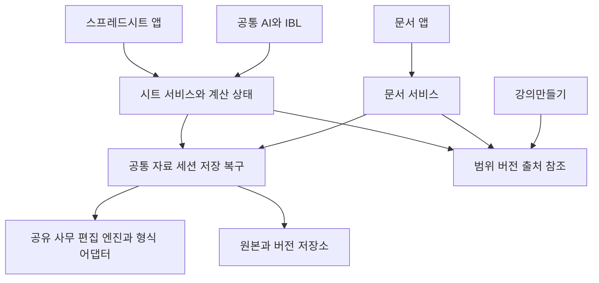

# 스프레드시트 앱 설계

작성일: 2026-10-02

상태: 구현 진행 중. §3~§13은 전체 출시 계약이며, 실제 구현·검증과 남은 범위는 §14에 기록한다. 전체 출시 완료는 아직 아니다.

indiebizOS에 **독립 스프레드시트 앱**을 만든다. 장부·견적·정산·재고·일정·통계 자료를 사람이 직접 편집하고, 수식으로 계산하고, 피벗과 차트로 분석하며, AI에게 같은 자료의 정리와 수정을 맡기는 앱이다. 셀 편집 화면, 계산, 파일 저장까지 하나의 작업으로 완결한다.

**문서·스프레드시트·강의만들기는 별도 앱으로 유지하고 자료·버전·AI 접근을 공유한다.** 문서 앱은 글과 페이지, 스프레드시트는 셀과 계산, 기존 강의만들기는 강의 구성과 슬라이드 제작을 담당한다. 앱을 합쳐야 AI가 자료를 함께 볼 수 있는 것은 아니다. [문서 앱 설계](DOCUMENT_APP_DESIGN_2026_10_02.md)와 함께 읽는다.

자주 쓰는 기능을 가벼운 표 편집기 다음으로 미루지 않는다. 아래의 직접 편집·주요 함수·피벗·차트·가져오기·인쇄·AI·저장 복구를 모두 출시 범위로 잡는다. 개발 단계는 의존 순서이며 필수 항목을 제외한 상태를 완성으로 선언하지 않는다. 판단 기준은 [IBL 진화 목적](IBL_EVOLUTION_PURPOSE.md)에 따른 실제 결과 품질·완료 시간·전체 토큰 비용이다.

## 1 제품의 경계와 설계 결정

- 런처에 **스프레드시트** 아이콘과 독립 창을 둔다. 통합문서 탭, 여러 창, 최근 파일·템플릿, 파일 연결을 지원한다. 통합문서 안의 시트 탭과 파일 탭은 구분한다.
- 성숙한 스프레드시트 엔진을 내장한다. 그리드·수식 계산·차트·피벗을 각각 다른 라이브러리로 조립해 Excel 호환성을 처음부터 재구현하지 않는다.
- 기본 작업 형식은 XLSX다. 원본 파일, 엔진의 편집 상태, AI가 읽는 범위 투영을 구분한다. 모든 파일을 값만 있는 JSON이나 CSV로 바꾸어 정본으로 삼지 않는다.
- 활성 통합문서의 **편집·계산 권위는 한 엔진**에 둔다. 파일 저장·버전·복구의 권위는 indiebizOS 공통 서비스에 둔다. 두 계산기가 같은 통합문서의 최신값을 서로 주장하지 않게 한다.
- 직접 편집과 계산은 AI 모델 없이 가능해야 한다. AI는 계산기를 대신하지 않고 구조화된 수정 요청을 만들며, 합계와 통계의 근거는 엔진 결과에서 가져온다.
- 원격 접속에서도 권한이 있는 같은 세션을 사용한다. 브라우저별 파일 사본을 몰래 만들어 각기 저장하지 않는다. 동시 편집을 보장하지 못하는 엔진 구성은 한 작성 세션과 나머지 열람 세션으로 동작한다.

## 2 현재 기반과 메워야 할 공백

2026-10-02의 코드·가이드를 확인했다. 아래는 현재 기능이며 새 앱이 이미 존재한다는 뜻은 아니다.

| 현재 기반 | 재사용할 부분 | 이번에 추가할 부분 |
| --- | --- | --- |
| [sheet_ops.py](../data/packages/installed/tools/system_essentials/sheet_ops.py), [시트 가이드](../data/guides/sheet.md) | `self:sheet`의 헤더 기반 find·append·update, 경로 검사 | 직접 그리드 편집, 세션 인식, 복잡한 차트·이미지 보존. 기존 openpyxl 저장은 완전 보존 경로가 아님 |
| [sheet_range_ops.py](../data/packages/installed/tools/system_essentials/sheet_range_ops.py) | A1 범위 조회, 파일 해시, 비대상 OOXML 파트 보존, 새 파일 생성 | 병합·배열 수식·보호 상태를 이해하는 편집. 현재 범위 쓰기는 최대 10,000셀과 제한된 서식이며 복잡한 구조를 거절함 |
| 같은 모듈의 `calculate` | LibreOffice 격리 재계산 후 셀 캐시만 이식 | 실시간 계산, 계산 세대, 피벗·차트 캐시의 일관성. 현재 경로는 XLSX 제한이며 차트 캐시까지 갱신하지 않음 |
| [office_ops.py](../data/packages/installed/tools/system_essentials/office_ops.py) | `self:read`, PDF 표 추출, `table:spreadsheet` 새 XLSX 생성 | 셀 타입·수식·오류·계산 상태를 분리한 읽기, 가져오기 미리보기. 값 중심 생성으로 기존 파일을 덮어쓰지 않음 |
| [기존 문서와 시트 연결 구현](DOCUMENT_SHEET_TRANSIT_IMPLEMENTATION_2026_09_15.md) | 범위·출처·해시 기반 처리 계약 | 열린 앱의 미저장 범위 읽기, 편집 가능한 차트와 문서 표의 버전 연결 |
| [파일 색인](../backend/datastore/file_index.py), [자료 저장](../backend/datastore/record_assets.py), [작업 수명](../backend/base/runtime_work.py) | 파일 발견·자료 참조·긴 작업 관리 | 통합문서·시트 식별자, 편집 임대, 복구 스냅샷, 가져오기와 계산 작업 원장 |

현재 `range`의 값은 저장된 수식 캐시이므로 최신 계산값과 다를 수 있다. `range_write`는 계산 캐시를 무효화한다. 기존 `engines:render`의 LibreOffice 재계산 결과도 새 앱의 편집 엔진 결과와 자동으로 동일시하지 않는다. 기존 경로의 제약을 해제하는 대신 세션·엔진 경로를 추가한다.

## 3 파일 형식별 지원 계약

**같은 형식 저장**은 해당 확장자의 올바른 파일을 생성하는 경로이며 무손실의 보증이 아니다. **변환 편집**은 원본을 남기고 작업 사본을 만든다. 기능 손실·미확인 항목이 있으면 저장 전 파일별 보고서를 제공한다.

| 형식 | 열기와 편집 | 저장과 출력 계약 |
| --- | --- | --- |
| XLSX | 주 편집 형식. 셀·수식·표·피벗·차트·서식·인쇄 설정 | XLSX 왕복 저장, PDF·CSV·이미지 출력. 대상 밖 구조의 보존 검사 |
| XLSM | 시트 편집, VBA 존재·실행 의존성 표시 | VBA 파트와 관계 보존을 검증한 XLSM 저장. VBA 실행은 별도 환경. 보존 불가이면 원본 덮어쓰기 금지, XLSX 변환 사본 선택 |
| XLSB | XLSX 작업 사본으로 변환 편집 | XLSX 저장 및 XLSB 내보내기. 바이너리 구조·VBA·외부 연결 손실 확인. XLSB 원본 직접 편집으로 표시하지 않음 |
| XLS | 구형 파일을 XLSX로 변환 편집 | XLSX 저장과 명시적 XLS 내보내기. 구형 형식의 행·열·기능 한계를 검사하고 초과를 조용히 자르지 않음 |
| ODS, FODS | ODF 입력의 구조·수식·스타일을 변환해 편집 | ODS 왕복, FODS 내보내기와 XLSX 변환. ODF 전용 수식·기능의 의미 차이 검사 |
| CSV, TSV, 구분자 TXT | 인코딩·구분자·따옴표·헤더·열 타입을 선택해 열기 | 선택 시트의 값만 저장. 다중 시트·수식·서식이 필요하면 XLSX로 저장. 원래 인코딩·줄바꿈 선택 가능 |
| XLTX, XLTM, OTS | 템플릿 미리보기와 새 통합문서 생성 | 템플릿 만들기·저장. XLTM의 VBA 보존은 XLSM과 같은 기준 |
| Numbers | 변환 결과를 확인하고 XLSX 사본 편집 | XLSX·PDF 출력. `.numbers` 원형 저장은 제공하지 않음 |
| CELL, NXL | 한셀 호환 변환 어댑터로 XLSX 작업 사본 생성 | 원본 보존, XLSX·PDF 출력. 문서용 HWP 엔진이 한셀까지 처리한다고 가정하지 않음. 공급 가능한 변환기와 배포 조건 확보가 의존성 |
| HTML 표, JSON, 기존 원장·DB 조회 결과 | 표 선택·열 매핑·타입 지정으로 시트 가져오기 | XLSX 저장, 선택 범위의 HTML/JSON 내보내기. 임의 웹페이지 스크립트 실행 없음 |
| PDF·스캔·이미지 속 표 | 표/페이지 선택, OCR과 행·열 교정 후 가져오기 | 새 범위로 저장하고 원본 페이지·좌표·교정 이력 연결. PDF 자체 편집은 문서 앱 |
| Google Sheets | 인증된 내보내기 또는 사용자가 받은 XLSX/CSV 사본 가져오기 | 로컬 사본 편집과 별도 업로드·원본에서 다시 가져오기. 구글 원본의 실시간 공동편집·동기 저장으로 표시하지 않음 |

ONLYOFFICE의 공식 형식 문서는 편집 시 XLSX로 내부 변환하며 여러 형식으로 내보내는 경로를 설명한다. 따라서 ODS·XLSB 등을 열 수 있다는 사실만으로 원본 구조 보존을 단정하지 않는다. XLS/FODS 출력 등 주 엔진 외 경로는 LibreOffice 변환 어댑터를 두고 별도 검증한다. [공식 형식 지원](https://helpcenter.onlyoffice.com/docs/userguides/spreadsheet_editor/supportedformats.aspx)

암호 입력은 세션에서만 취급하며 대화·로그·일반 DB에 남기지 않는다. 통합문서/시트 보호, 잠긴 셀, 암호화 파일은 서로 구분한다. 암호화하여 저장하기와 시트 편집 제한을 각각 제공한다. 지원하지 않는 암호 방식·손상 파일은 사유와 원본 보존 상태를 보여준다.

## 4 직접 사용하는 핵심 기능

### 셀과 시트 편집

한글 IME, 키보드 이동과 범위 확장, 이름 상자와 수식 입력줄, 다중 범위 선택, 찾기·바꾸기, 자동 채우기, 실행 취소·다시 실행을 제공한다. 값·수식·서식만 붙여넣기, 행열 전환, 연속 데이터 채우기, 클립보드의 다중 행·줄바꿈·탭을 처리한다. 행·열 삽입/삭제/이동/크기 조정, 숨기기, 그룹과 윤곽, 틀 고정·분할, 확대를 지원한다.

시트 생성·복제·이름 변경·순서 변경·숨김·삭제와 통합문서 간 범위 복사를 제공한다. 구조 변경은 셀 주소뿐 아니라 수식·이름·표·차트·조건부 서식·유효성 검사·인쇄 범위의 참조를 함께 갱신한다. 병합 시 값이 사라지는 범위를 보여준다. 필터된 표에서는 전체 행과 보이는 행만 대상으로 하는 편집을 명시적으로 구분한다.

글꼴·정렬·줄바꿈·들여쓰기·회전·테두리·채우기·숫자/백분율/통화/회계/날짜/사용자 형식, 셀 스타일, 조건부 서식과 색조·데이터 막대·아이콘을 지원한다. 데이터 유효성 검사·드롭다운·입력 설명·오류 메시지, 이름 정의·이름 관리자, 표 스타일·합계행·구조화 참조를 포함한다.

댓글·답글·해결, 셀 메모, 하이퍼링크·그림·기본 도형을 다룬다. 변경 이력은 값·수식·서식·행열 구조의 차이를 보여주며 사람과 AI의 작성자를 구분한다. 앱의 이력을 Excel의 모든 변경 추적 형식과 동일하다고 표시하지 않는다.

### 수식과 계산

함수 자동완성·인자 설명·함수 마법사, 수식 표시, 상대/절대/혼합 참조, 시트 간 참조, 이름과 표 참조, 오류 셀 탐색과 참조 추적을 제공한다. 아래는 **필수 함수군과 검증할 대표 함수**다. 공급자 전체 지원을 확인했다는 목록이 아니며 실제 채택 버전의 계산 결과로 통과시킨다.

| 함수군 | 필수 검증 예 |
| --- | --- |
| 산술·조건 집계 | SUM, AVERAGE, MIN, MAX, COUNT, COUNTA, ROUND, SUMIF/SUMIFS, COUNTIF/COUNTIFS, SUBTOTAL, AGGREGATE |
| 논리·오류 | IF, IFS, AND, OR, NOT, IFERROR, ISBLANK, ISNUMBER |
| 조회·참조 | VLOOKUP, HLOOKUP, XLOOKUP, INDEX, MATCH, OFFSET, INDIRECT |
| 문자열 | LEFT, RIGHT, MID, LEN, TRIM, SUBSTITUTE, TEXT, VALUE, CONCAT, TEXTJOIN |
| 날짜·시간 | DATE, YEAR, MONTH, DAY, TODAY, NOW, EDATE, EOMONTH, NETWORKDAYS, WORKDAY |
| 배열·재사용 | FILTER, SORT, UNIQUE, SEQUENCE, TRANSPOSE, SUMPRODUCT, LET; 스필과 기존 배열 수식 |
| 통계·금융 | MEDIAN, STDEV.S, VAR.S, CORREL, RANK.EQ, PMT, NPV, IRR |

지원되지 않는 함수·사용자 정의 함수는 원문과 마지막 캐시를 보존하고 미지원 상태로 표시한다. 이름만 비슷한 함수로 바꾸거나 오류를 0으로 치환하지 않는다. FILTER는 공식 기능이지만 동적 배열의 충돌·참조·저장까지 별도로 시험해야 한다. [FILTER 문서](https://helpcenter.onlyoffice.com/functions/filter.aspx)

자동/수동 계산, 전체/선택 계산, 계산 중 취소, 순환 참조 안내와 명시적 반복 계산 설정을 제공한다. 목표값 찾기와 여러 입력값을 비교하는 시나리오 표를 포함한다. 시나리오는 원본 입력을 몰래 바꾸지 않고 별도 결과 범위와 사용 조건을 남긴다. 목표값 찾기는 주 엔진 기능을 우선 사용한다. [공식 목표값 찾기](https://helpcenter.onlyoffice.com/docs/userguides/spreadsheet_editor/GoalSeek.aspx)

### 정리와 분석

다중 열 정렬·필터·검색·중복 제거·빈값 처리·공백 정리·텍스트 나누기·열 합치기·타입 변환을 제공한다. 열 선택, 행 이어붙이기, 키 기반 표 결합, 그룹 집계, 열을 행으로 펼치기와 반대 변환을 지원한다. 일대다 결합이나 중복 키는 결과 행 수와 원인을 미리 보여준다.

피벗 테이블은 만들기·행/열/값/필터 편집·집계 방식·날짜/숫자 그룹·정렬·소계·총계·원본 행 보기·새로고침을 제공한다. 표와 피벗에 슬라이서를 제공하며 같은 데이터의 차트와 함께 갱신한다. 피벗 결과 숫자를 일반 셀처럼 덮어써서 다음 갱신에 사라지게 하지 않는다. 주 엔진은 표·피벗 슬라이서 기능을 공개하고 있으나 API 조작과 왕복 저장은 인수 대상이다. [슬라이서 문서](https://helpcenter.onlyoffice.com/docs/userguides/spreadsheet_editor/Slicers.aspx)

세로/가로 막대·꺾은선·원/도넛·영역·산점도·복합 차트와 스파크라인을 지원한다. 데이터 범위·계열·축·보조축·범례·레이블·색상·제목을 다시 편집할 수 있어야 한다. 통합문서에는 편집 가능한 차트를 저장하고 보고서/강의용 SVG·PNG·PDF 출력은 별도 산출물로 만든다. 이미지 한 장을 붙인 결과를 차트 편집 지원으로 세지 않는다.

### 가져오기와 반복 작업

CSV/TSV는 UTF-8/BOM·UTF-16·CP949/EUC-KR, 구분자와 인용 부호, 줄바꿈 포함 셀, 헤더 유무·중복 헤더·빈 헤더를 미리보기에서 처리한다. 날짜·소수점·천 단위 기호·통화·백분율과 텍스트 열을 사용자가 지정할 수 있어야 한다. 전체를 표본에서 추정한 타입으로 강제하지 않고 뒤쪽 행의 불일치와 처리 건수를 보고한다.

DB·원장·HTTP 자료는 기존 연결과 읽기 권한을 재사용하고 가져오기 단계·열 매핑·정리 규칙을 재실행 가능한 작업으로 저장한다. 원본 해시/조회 시각·파라미터·출력 범위를 기록한다. 갱신은 이전 가져오기 영역만 교체하고 사람이 수정한 셀과 충돌하면 비교한다. 원본 DB에 쓰는 동작은 별도 계약이며 시트 저장으로 자동 발생하지 않는다.

PDF 표는 가장 큰 표만 자동 선택하지 않고 전체 표 목록·페이지·범위를 보여준다. OCR의 낮은 신뢰도 숫자, 병합 머리글·다단 표는 교정 후 반영한다. 연락처·정산표의 `=`, `+`, `-`, `@` 시작 문자열은 입력 타입에 따라 텍스트로 가져오며 임의 수식으로 실행하지 않는다. CSV 출력에는 외부 프로그램의 수식 해석 위험을 알려 텍스트 안전 출력과 원문 유지의 차이를 선택할 수 있게 한다.

### 인쇄와 일상 양식

인쇄 영역·반복 제목행/열·수동 페이지 나누기·용지·여백·방향·가로 맞춤·머리말/꼬리말·쪽 번호·눈금선, 시트 선택·통합문서 전체 인쇄와 PDF를 지원한다. 미리보기와 최종 파일의 잘림·빈 페이지·한글 글꼴을 검사한다. 견적서·청구서·수입지출·재고/입출고·근태·일정·프로젝트 예산 템플릿을 제공한다. 병합·로고·서식·합계가 있는 실제 양식을 수정하고 다시 저장하는 것까지 포함한다.

## 5 화면과 작업 흐름

기본 화면은 상단 파일 탭과 메뉴, 수식 입력줄, 중앙 그리드, 아래 시트 탭·선택 범위 통계, 접을 수 있는 오른쪽 **AI와 변경 검토** 패널로 구성한다. 엔진의 표준 편집 UI를 우선 활용하고 indiebizOS는 파일·자료 연결·AI·저장 상태를 일관되게 감싼다. 좁은 화면에서는 AI 패널을 겹쳐 열어 셀 공간을 확보한다.

처음에는 새 통합문서·파일 열기·템플릿·최근 파일을 보여준다. 파일을 열면 형식 판별 → 호환성/보호 검사 → 엔진 준비 → 시트 표시 순으로 진행 상태를 알린다. 빈 창에 머무르지 않고 변환 실패·엔진 연결 실패·복구 초안 발견을 각각 처리한다.

AI 패널에서 “이번 달 거래를 분류하고 거래처별 합계를 만들어줘”라고 하면 입력 범위와 분류 기준, 새 시트·수식·피벗의 변경 미리보기를 제시한다. 사용자가 직접 수정 요청한 범위 안의 통상 작업은 기존 권한 정책에 따라 실행할 수 있으며 매 셀마다 재승인을 요구하지 않는다. 모호한 분류, 원본 삭제, 외부 전송은 필요한 선택만 묻는다. 실행 결과는 해당 셀로 이동할 수 있는 변경 묶음으로 남긴다.

저장 상태와 계산 상태는 따로 표시한다. 예를 들어 **파일 저장됨 · 외부 데이터는 어제 기준**, **작업 복구본 저장됨 · 원본 저장 중**, **수식 변경됨 · 계산 필요**가 구별되어야 한다. 숫자가 보인다는 이유로 최신 계산 완료로 표시하지 않는다.

## 6 셀 값과 계산의 계약

공통 자료의 `resource_id`가 통합문서의 `workbook_id`를 가리킨다. 파일은 `source_uri`, `source_format`, `source_sha256`, `revision_id`를 가진다. `sheet_id`는 이름과 별개이며 이름 변경에 유지한다. 시트 복제에는 새 ID를 부여한다. 외부 저장으로 내부 ID가 재작성되면 구조를 대조해 매핑하고 모호하면 기존 참조를 미해결로 남긴다.

범위 투영은 다음 정보를 분리한다. 이 모델은 원본 파일을 대체하지 않는다.

| 정보 | 의미 |
| --- | --- |
| `entered_value`, `value_type`, `formula` | 사용자가 넣은 리터럴/명시 타입과 수식 원문. 빈 셀·빈 문자열·0·false를 구분 |
| `effective_value`, `error_code` | 엔진이 계산한 값 또는 오류. 마지막 캐시와 현재 계산값을 구분 |
| `display_text`, `number_format` | 화면 표현. 통화 기호·반올림 표시를 원래 값으로 오인하지 않음 |
| `session_revision`, `snapshot_id` | AI가 읽은 미저장 편집 상태의 정확한 버전 |
| `calc_revision`, `calc_status` | 계산 대상 세션 버전과 완료 상태. fresh/stale/pending/error/unsupported/external_unresolved |
| `engine_id`, `engine_version`, `locale`, `date_system` | 계산·해석 환경. 결과 재현에 필요한 설정 |
| `external_dependencies`, `provenance` | 연결 통합문서·가져온 데이터의 버전/시각, 원본 범위와 변환 과정 |

계산 완료는 해당 `session_revision`과 의존 데이터 버전에 대해 필요한 셀·피벗·차트가 일치할 때만 선언한다. 값이 오래됐으면 마지막 값은 보여주되 상태를 붙인다. AI도 이 상태를 받으며 미확인 값을 최신 합계로 보고하지 않는다. 읽기 API는 값과 수식 중 하나를 생략해서 다른 것으로 대신하지 않는다.

긴 계좌번호·상품코드·우편번호·전화번호는 텍스트로 보존한다. 숫자형으로 입력할 때에는 정밀도 한계를 알린다. Excel의 공개 숫자 정밀도는 15자리이며, 형식상 한 시트는 1,048,576행·16,384열이다. 이는 이 앱의 성능 보장이 아니다. [Excel 사양](https://support.microsoft.com/en-gb/excel/excel-specifications-and-limits?nochrome=true)

날짜는 1900/1904 체계와 원래 시리얼 값을 유지하고 문자열·날짜·타임스탬프를 구분한다. 두 체계는 1,462일 차이가 나므로 통합문서 간 복사에 변환 검사가 필요하다. 1900년 윤년 호환 동작과 시간대 없는 셀 날짜도 기준 파일로 검사한다. [Microsoft 날짜 체계](https://support.microsoft.com/en-us/excel/date-systems-in-excel)

수식의 타입 변환·오류 전파는 채택한 스프레드시트 엔진이 소유한다. IBL의 행 비교·정렬·집계는 기존 `common/value_semantics.py`를 사용한다. 두 의미를 같다고 간주하지 않고 가져오기/내보내기 경계에서 타입을 명시한다. 기존 find의 숫자 동치를 셀 문자열 식별자에 무조건 적용하지 않는다.

NOW/TODAY/RAND류는 계산 시각·환경·결과 스냅샷을 기록한다. 엔진이 난수 시드 고정을 보장하지 않으면 재계산의 완전한 재현을 약속하지 않는다. 외부 통합문서 링크는 발견·목록·수동 갱신·연결 해제/값으로 고정을 제공한다. 연결 파일이 없거나 새 버전을 읽지 못하면 캐시가 남아도 최신으로 표시하지 않는다.

## 7 편집 엔진과 공통 기반

**우선 채택안은 문서 앱과 같은 로컬 또는 소유자 지정 서버의 ONLYOFFICE Docs 스프레드시트 엔진이다.** 문서 앱과 별도 서버를 하나씩 띄우지 않는다. 설치 판본·라이선스·엔진 버전·폰트·지원 능력을 한 서비스가 관리한다. 맥의 컨테이너/가상화 환경과 Windows 배포, 오프라인 사용, 콜드 시작은 문서 앱의 배포 검증과 함께 수행한다.

기본 편집 기능은 엔진 UI, AI 연결은 공식 플러그인 API의 메서드·명령·이벤트를 사용한다. 외부 Automation API는 별도 유료 기능이므로 기본 가정에 넣지 않는다. 필요한 선택·계산 확정·대량 변경·피벗/차트 조작이 플러그인 API로 가능한지는 실제 통합 실험으로 확정한다. 부족하면 지원되는 SDK/계약 또는 다른 엔진을 검토하고 필수 기능을 없애지 않는다. [플러그인 API](https://api.onlyoffice.com/docs/plugins/interacting-with-editors/overview/), [Automation API 조건](https://api.onlyoffice.com/docs/docs-api/usage-api/automation-api/)

LibreOffice는 레거시 형식 변환·독립 호환 검사·기존 비대화형 작업에 사용한다. 활성 통합문서의 값을 몰래 다시 계산해 화면과 다른 PDF를 만들지 않는다. 다른 계산기를 거쳐야 하는 변환은 새 산출물로 구분하고 수식 결과 차이를 보고한다. openpyxl은 구조 검사·단순 새 파일 생성 등 검증된 범위로 제한한다.

ONLYOFFICE의 매크로는 JavaScript 방식이며 VBA를 그대로 실행하는 환경이 아니다. **XLSM 지원은 VBA 보존과 실행을 구분한다.** VBA/UDF에 의존한 계산은 미지원으로 표시한다. VBA·Power Query M·Power Pivot/DAX·ActiveX·특정 Excel 추가 기능의 실행 호환은 제품의 기본 엔진 범위에서 제외한다. 일반 데이터 결합·정리·갱신·피벗은 4절의 자체 작업 흐름으로 제공한다. 자동 번역한 매크로를 동등하다고 실행하지 않는다. [공식 매크로 FAQ](https://api.onlyoffice.com/docs/macros/more-information/faq/)

엔진 선정 관문은 실제 XLSX/XLSM/ODS와 수식·피벗·차트를 열기 → 직접 수정 → 미저장 상태 읽기 → AI 수정 → 계산 → 저장 → 독립 프로그램에서 재열기다. VBA·외부 연결·슬라이서 등의 보존을 검출하지 못하면 `unknown`으로 기록한다. 형식 목록이나 API 함수 존재만으로 관문을 통과하지 않는다.

## 8 저장과 동시 편집과 복구

[문서 앱의 세션·저장 계약](DOCUMENT_APP_DESIGN_2026_10_02.md)을 공통 구현으로 사용한다. 문서/시트별로 같은 파일의 잠금·저장·버전 DB를 따로 만들지 않는다. 한 자료에 하나의 활성 쓰기 권한과 증가하는 세션 버전, 엔진 재시작을 구분하는 `engine_epoch`를 둔다.

1. 편집/IME가 확정되는 엔진 경계에서 스냅샷을 얻는다. 계산 대상 버전과 계산 의존성이 그 스냅샷에 속하는지 확인한다. 계산 중 입력이 생기면 최신 상태와 이전 계산 결과를 혼합하지 않는다.
2. 수식·값·차트·피벗 상태를 내보내고 결과 파일을 검사한다. 편집 엔진 내부의 저장 표시만으로 디스크 저장 성공을 선언하지 않는다.
3. 공통 저장 서비스가 예상 원본 해시를 확인하고 임시 파일 → 동기화 → 원자 교체 → 버전 확정과 복구 원장 기록을 수행한다. 외부 수정이면 충돌 사본과 비교 화면을 제공한다.
4. 콜백은 세션·엔진 세대·저장 순번·작업 ID로 검증한다. 중복·역순·재시작 전 콜백은 최신 파일을 덮어쓰지 못한다. 완료 응답 유실 때 같은 작업 ID로 결과를 회수한다.

앱 내부 쓰기는 임대와 버전 검사로 직렬화한다. 외부 프로그램은 이 잠금을 따르지 않을 수 있으므로 OS의 파일 조정/잠금, 교체 직전 파일 식별·해시 재확인, 교체 전 내용 보존과 변경 감시를 함께 사용한다. 단순 해시 확인과 rename만으로 비협조적 외부 편집기까지 원자적 비교 후 저장을 보장한다고 주장하지 않는다. 동시 외부 쓰기를 감지하면 충돌 사본을 유지하고 원본 덮어쓰기 대신 별도 저장으로 전환한다.

엔진 안의 `saved`, 복구 가능한 작업 스냅샷, 원본 파일 저장 완료를 구분한다. 저장 시 재계산에 실패해도 작업 내용을 잃지 않게 초안/파일을 보존할 수 있지만, **계산 미완료**를 명시한다. 최신 계산을 요구하는 보고서·차트 출력은 완료를 기다리거나 사용자가 오래된 값임을 확인한 스냅샷으로만 진행한다.

프로세스 종료·백엔드 재시작·엔진 재시작·디스크 부족·원격 단절 후 마지막 확정 파일과 복구 스냅샷을 비교해 복원한다. 복구본 보존 정책은 저장 공간과 기간을 설정하고 사용자가 선택한 과거 버전을 임의로 삭제하지 않는다. 서버에 도달하기 전 입력까지 복구한다고 약속하지 않으며 마지막 확인 시각과 아직 전달되지 않은 편집을 표시한다.

같은 자료를 앱 두 창, AI, 기존 `self:sheet`가 동시에 고치더라도 공통 쓰기 권한을 거쳐야 한다. 열린 파일에 대한 구형 직접 쓰기는 세션 경로로 보낼 수 있을 때만 전환하고, 불가능하면 명시적 충돌 오류를 반환한다. 기존 `range_write`의 새 파일 생성·원본 보존 계약을 몰래 inplace 저장으로 바꾸지 않는다.

## 9 AI 편집과 다른 앱 연결

AI 요청은 현재 선택 범위 또는 사용자가 지정한 표·시트·통합문서를 대상으로 한다. 통합문서 개요 → 필요한 범위 → 계산/변경 결과 순으로 읽는다. 대량 집계는 엔진/기존 데이터 연산이 수행한다. 표본만 본 경우 전체를 검토했다고 보고하지 않고 읽은 범위·전체 건수·잘림 여부를 남긴다.

수정은 타입이 있는 `set_values`, `set_formulas`, `format_range`, `insert_rows`, `rename_sheet`, `create_table`, `create_pivot`, `create_chart`, `refresh_data` 등의 **제안 작업**으로 표현한다. 이 이름들은 새 IBL 낱말이 아니라 서비스 내부 연산이다. 임의 Python·JavaScript 생성 실행을 기본 셀 수정 경로로 삼지 않는다.

제안은 기준 `snapshot_id`, `session_revision`, 대상 시트 ID/범위, 읽은 의존 범위, 쓰는 범위, 구조 변경, 예상 영향 셀 수와 수식 결과를 가진다. 행 삽입·정렬로 주소가 이동하면 안정적인 표/이름과 구조 버전을 확인한다. A1 주소만 같다는 이유로 다른 레코드에 적용하지 않는다. 의존 범위 추적이 불가능한 수식은 통합문서 버전 전체를 충돌 기준으로 삼는다.

적용 직전에 버전과 읽기/쓰기 대상을 검증한다. 비중첩 변경만 검증 후 재배치하며 애매하면 다시 계산·제안한다. 배열 수식·스필 영역은 기준 셀과 전체 확장 범위, 병합은 전체 병합 범위로 검증한다. 보호된 셀을 포함한 변경을 일부만 성공시켜 전체 완료로 보고하지 않는다.

원자적 묶음 API가 없으면 쓰기 권한과 입력 잠금 아래 사전 스냅샷·검증·적용·사후 검사를 수행한다. 실패 시 복원하고 복원이 확인될 때까지 세션을 복구 중으로 둔다. 다중 작성자의 입력을 멈출 수 없다면 단일 작성 모드를 사용한다. 실행 취소는 AI 묶음만 되돌리며 이후 사람 변경과 겹치면 역방향 변경안을 비교한다. 과거 파일 통째 복원으로 사람의 뒤이은 작업을 지우지 않는다.

앱 간 참조는 `resource_id + revision_id + selector + provenance`를 공유한다. 시트 선택자는 `sheet_id`, 범위/표/차트 ID, 수식·계산값·계산 세대를 포함한다. 미저장 데이터를 넘기면 `snapshot_id`와 미저장 상태를 함께 기록한다. 기본은 **고정된 버전의 사본**, 사용자가 원본 연결을 선택하면 변경 알림과 갱신 버튼을 제공한다.

예를 들어 시트의 거래처별 집계와 차트를 문서 보고서에 넣고, 그 보고서와 차트를 강의만들기의 재료로 전달한다. 원본이 바뀌면 사용자가 갱신을 선택한다. 문서에서 손본 표와 시트가 모두 바뀌었으면 비교하고, 연결 끊기·원본 이동·권한 회수·시트 삭제도 처리한다. 강의만들기를 일반 PPTX 완전 편집기로 간주하지 않는다.

여러 앱에 걸친 작업은 파일별 성공·실패·재개 정보를 남긴다. 보고서 생성이 실패해도 완성된 시트 분석은 유지한다. AI는 닫힌 자료도 권한 안에서 읽을 수 있고 열린 자료의 최신 내용은 활성 세션에서 가져온다. 창을 하나로 합치거나 화면을 매번 캡처해야만 연결되는 구조를 피한다.

## 10 내부 구조와 IBL 연결

아래 경로와 API는 **제안**이다. 문서 앱 설계의 공통 기반을 구체화하며 두 앱의 서비스 중복을 막는다. 새 backend 모듈은 층 검사기에 등록하고 파일 1500줄 제한·패키지 모듈명 충돌 검사를 지킨다.

| 위치 | 책임 |
| --- | --- |
| `frontend/src/components/SpreadsheetWorkspace.tsx`, `spreadsheets/` | 파일/시트 표면·AI 변경 검토·가져오기·복구 |
| `frontend/src/lib/api-spreadsheets.ts` | 시트 서비스 API와 사건 구독 |
| 기존 런처·navigation·Electron 창/파일 연결 | 앱 등록, 독립 창, XLSX/ODS/CSV 열기, 원격 화면 |
| `backend/surface/api_spreadsheets.py` | 인증·범위 읽기·수정·계산·가져오기 HTTP 경계 |
| `backend/services/spreadsheet_workspace.py`와 형제 모듈 | 시트 세션 조정, 셀 투영, 계산 상태, AI 연산·인수 검증 |
| `backend/services/office_resources.py`, `office_sessions.py` | 문서/시트 공통 자료 ID·쓰기 권한·스냅샷·저장·복구 |
| `backend/datastore/office_store.py` | 공통 자료·버전·세션·작업 원장. 시트별 메타데이터는 확장 테이블 |
| `backend/services/office_engines/` | 공유 엔진 수명과 문서/시트 어댑터. 형식 내부 모델은 어댑터가 소유 |
| `backend/services/resource_links.py` | 앱 간 참조와 갱신 상태. 계산/편집 구현을 넣지 않음 |
| 기존 system_essentials 시트 모듈 | IBL 진입·레거시 호환·검증된 파일 작업 재사용 |

문서 앱의 `document_workspace.py`는 문서 전용 조정을 맡고 공통 저장은 `office_resources`/`office_sessions`를 호출한다. 문서 설계의 `document_store.py`와 `document_engines/`는 위 공통 기반과 문서 어댑터로 배정하며 독립된 중복 저장소/엔진 서버를 만들지 않는다.

시트 API는 `/spreadsheets/open`, `/{id}/snapshot`, `/range`, `/proposals`, `/apply`, `/calculate`, `/imports`, `/exports`를 제공하고 저장·버전·복구는 공통 서비스로 위임한다. 범위 읽기는 페이지/상한·수식과 값·계산 상태를 반환한다. 큰 결과는 자료 참조로 반환한다. 작업 생성은 ID와 진행 상태, 재접속은 마지막 사건 순번 이후를 반환한다.

변경에는 `expected_revision`과 멱등 `operation_id`가 필요하다. 충돌은 409와 기준/현재 버전, 보호/미지원은 구체적 능력 사유, 계산 오류·엔진 단절은 별도 상태로 반환한다. 원격 클라이언트가 임의 호스트 경로를 읽거나 쓸 수 없게 자료 ID에서 허용 경로를 해소한다.

AI는 기존 `self:sheet`에 세션 기반 op를 확장하여 같은 서비스를 사용한다. 제안 op는 `open`, `snapshot`, `propose`, `apply`, `save`, `export`, `versions`, `restore`, `capabilities`다. 기존 `find/append/update/range/range_write/calculate`의 인자·결과·원본 보존 계약은 유지한다. 세션 대상 재계산과 기존 파일 재계산을 구별한다. `table:spreadsheet`는 새 파일 생성 책임을 유지하고 결과를 자료로 등록한다.

새 코어 노드·문법을 만들지 않는다. 반복 데이터 정리는 기존 `table` 연산과 저장된 스크립트/워크플로우를 재사용한다. 기능 추가 시 소스 YAML·가이드·핸들러 도움말·용례·파생 빌드를 함께 갱신한다. 기존 API 사용자의 열린 파일 충돌 처리도 호환 인수 대상이다.

## 11 운영과 성능과 호환성

엔진 프레임·메시지·콜백은 origin·세션·짧은 수명의 토큰·스키마를 검증한다. 파일과 셀 속 지시문은 AI 권한 부여가 아니다. 외부 링크·이미지·데이터 연결·매크로는 자동 실행하지 않는다. 가져오기 연결은 기존 인증 저장소를 사용하고 자격 증명은 통합문서나 AI 문맥에 넣지 않는다. 엔진/변환 워커에는 허용된 자료만 노출하고 압축 해제·메모리·시간·네트워크 범위를 제한한다.

UI 렌더는 보이는 범위 중심, 데이터 조회는 페이지 단위, 큰 계산·가져오기·출력은 진행률과 취소가 있는 작업으로 수행한다. 파일 크기보다 사용 셀 수·수식 의존성·서식 폭증·그림·피벗 크기를 함께 본다. 100만 행 CSV를 조용히 자르지 않고 한계 초과 시 원본 보존, 필터·집계·시트 분할 또는 기존 데이터 처리에서 요약 후 가져오기 경로를 제공한다.

제안 성능 목표는 **Apple Silicon/메모리 16GB/SSD에서 다른 대형 작업 없이**, 엔진이 준비된 상태로 1만 행×20열·수식 2천 셀 파일 첫 표시 3초, 통상 입력 반응 100ms 이내다. 10만 행×20열·수식 5만 셀·차트 5개 파일은 첫 표시 10초, 명시적 전체 계산 30초를 목표로 한다. 콜드 시작·변환·PDF 출력은 따로 측정한다. 이는 미측정 목표이며 사용 기종·엔진 버전·데이터 분포·최대 메모리·p95 반응 시간을 인수 기록에 남긴다.

호환성은 **형식 × 기능 × 읽기/수정/계산/저장/출력** 행렬로 관리한다. 셀 값·수식·이름·표·피벗·차트·VBA·외부 연결·유효성·조건부 서식·인쇄 구조를 비교한다. ZIP 바이트 전체가 달라졌다는 이유만으로 실패로 보지 않되, 보존 대상 바이너리 파트와 관계는 별도로 검증한다. 화면 비교만으로 숫자/수식 보존을 판정하지 않는다.

기준 파일은 Excel과 LibreOffice 등 독립 소비자에서 재열기해 값·구조·차트·인쇄를 확인한다. 실제 프로그램 접근이 없으면 미검증으로 기록한다. 엔진 업그레이드 시 기준 파일군 전체를 재검사하고, 일상 저장에는 해당 변경의 구조·형식·계산 버전 검사를 적용한다. 한글 IME·키보드 탐색·스크린리더·고대비·확대와 원격 재연결도 제품 품질에 포함한다.

## 12 구현 순서와 필수 인수

다음은 모두 이번 앱의 구현 범위다. 설치/엔진 적합성을 먼저 증명하고 편집·분석 기능이 저장·AI와 결합되도록 구현한다.

| 순서 | 수행 | 통과 증거 |
| --- | --- | --- |
| 1 엔진·형식 검증 | 설치·라이선스·공식 API, XLSX/XLSM/ODS·배열·피벗·차트와 레거시 변환 | 실제 열기→직접/AI 수정→계산→저장→독립 재열기. 한셀 변환 공급 경로와 조건 확인 |
| 2 공통 파일 기반 | 자료 ID·세션·버전·계산 세대·쓰기 권한·콜백·복구 | 역순 저장·외부 변경·종료·두 창·구형 도구 충돌에서 원본 보존 |
| 3 직접 편집 완성 | 그리드·수식·표·서식·검토·템플릿·인쇄 | 장부·견적·정산·일정 실제 작업을 모델 없이 완료 |
| 4 분석과 형식 공백 | 피벗·차트·목표값·가져오기/정리/갱신·호환 출력 | CSV 타입·PDF 교정·표 결합·피벗/차트 갱신과 파일 왕복 |
| 5 AI와 앱 연결 | 미저장 읽기·제안/적용·되돌리기·문서/강의 참조 | 버전 충돌 방지, 근거 범위 회수, 실패한 산출물만 재개 |
| 6 제품 인수 | 배포·성능·접근성·원격·회귀·호환 행렬 고정 | 아래 시나리오 통과와 실제 지원 범위 공개 |

### 필수 시나리오

1. **견적서:** 로고·병합 셀·수식·드롭다운·잠긴 셀·인쇄 영역이 있는 XLSX에 품목 행을 추가한다. 합계/참조/인쇄 영역을 갱신하고 XLSX/PDF에서 한글·로고·쪽 나눔을 확인한다.
2. **월별 장부:** 여러 시트·이름 범위·표 참조에서 행 삽입/정렬/시트 이름 변경을 수행한다. SUMIFS·XLOOKUP·날짜 합계가 기준값과 같고 숨긴 행/필터 범위의 처리도 선택대로여야 한다.
3. **타입과 CSV:** CP949 CSV의 `00123`, 18자리 ID, 전화번호, 인용된 쉼표·줄바꿈, 수식처럼 보이는 텍스트를 가져와 재출력한다. 빈 셀/빈 문자열/0/false와 오류를 혼동하지 않는다.
4. **날짜와 정밀도:** 1900/1904 통합문서 간 날짜 복사, 월말·윤년·휴일·시간대 없는 시간값, 표시 반올림과 실제 계산값을 확인한다. 숫자 정밀도 손실을 숨기지 않는다.
5. **배열과 계산:** FILTER/UNIQUE/SEQUENCE의 스필, 막힌 스필, 기존 배열/공유 수식, 순환 참조, 수동 계산, 미지원 UDF를 처리한다. 잘못된 값이 정상 0으로 바뀌지 않는다.
6. **분석:** 원본 표→정리/결합→피벗→슬라이서→편집 가능한 복합 차트를 만들고 데이터 추가 후 갱신한다. 셀·피벗·차트·PDF가 같은 계산 버전을 사용한다.
7. **가져오기 반복:** CSV/PDF 여러 표/원장 조회에서 열 매핑·OCR 숫자 교정·중복 키·타입 오류를 처리한다. 재실행의 입력/출력/실패 건수와 사람이 고친 셀의 충돌을 확인한다.
8. **호환 파일:** XLSX·XLSM·ODS 왕복, XLS/XLSB/FODS 변환과 출력, 템플릿 생성, Numbers·한셀 변환을 각각 검사한다. VBA/외부 연결/차트의 보존·손실·미확인을 구분하고 원본을 지킨다.
9. **AI 최신 상태:** 저장 전 셀 수정 후 AI에게 합계/이상값 분석을 요청한다. AI가 현재 스냅샷을 읽고 엔진 계산 결과·범위·계산 상태를 근거로 응답한다.
10. **충돌과 취소:** AI 제안 후 사람의 같은 셀 수정·행 삽입·시트 이동·필터 변경을 주입한다. 틀린 셀에 적용하지 않고 AI 묶음 취소가 이후 사람 편집을 지우지 않는다.
11. **저장 경쟁:** 두 창, 구형 `self:sheet`, 외부 Excel 수정, 중복/역순 콜백, 동일 operation 재시도를 시험한다. 미저장 스냅샷과 원본 저장 버전의 관계가 유지된다.
12. **장애 복구:** 저장/계산 도중 앱·백엔드·엔진 종료, 디스크 부족, 원격 단절을 각각 재현한다. 복구 가능한 초안과 마지막 확정 원본을 보존하고 미계산 상태를 정직하게 표시한다.
13. **다른 앱:** 집계 표/차트를 문서에 연결하고 강의 재료로 전달한다. 원본 갱신·이름 변경·삭제·권한 회수·보고서 수동 편집 후 출처 회수와 선택 갱신을 검사한다.
14. **규모와 접근:** 11절의 두 크기 파일, 한계 초과 CSV, 통합문서 5개 동시 열기에서 시간·메모리·취소를 측정한다. 한글 IME·키보드·스크린리더와 원격 화면도 실제 조작한다.

구현 시 프론트엔드는 `npx tsc -p tsconfig.app.json`과 실제 Electron/브라우저 조작, backend는 변경 영향에 따른 회귀 및 엔진·저장 계약 검사를 수행한다. 서비스 health 응답이나 XLSX 생성 성공은 편집 앱 인수의 대체물이 아니다. 이 설계 작성에서는 앱 코드 변경이나 위 인수 시험을 수행하지 않았다.

## 13 완료 범위와 외부 의존성

확정한 방향은 **독립 앱, 전문 엔진, XLSX 중심의 명시적 형식 호환, 일관된 계산, 원본/초안 복구, 세션을 이해하는 AI, 세 앱의 공통 자료 연결**이다. 일반 셀 편집·주요 수식·피벗·차트·자료 정리·인쇄와 일상 파일 호환을 “나중 기능”으로 남기지 않는다.

착수 단계에서 해결할 외부 조건은 엔진의 재배포/상업 이용/동시 접속/SDK 라이선스, 실제 설치와 자원 요구, 한셀 변환 공급 수단, 독립 소비자 시험 접근이다. 유료 계약을 체결하거나 프로그램을 설치했다는 뜻은 아니다. 조건 미충족으로 지원표의 필수 경로가 빠지면 해당 의존성과 미완료 범위를 공개하며 앱 전체 완성으로 선언하지 않는다.

완전한 Excel VBA·Power Query·DAX 실행, 임의 추가 기능 호환, Numbers/한셀 원형 저장, Google Sheets 실시간 공동편집, 무제한 데이터 분석 엔진은 이 앱의 기본 범위 밖이다. 해당 파일의 원본·지원되지 않는 구조를 보존하고 가능한 변환/열람/외부 편집 경로를 제공한다. 이 경계를 일반 장부·수식·피벗·차트 지원을 줄이는 이유로 사용하지 않는다.

## 14 구현 상태 — 2026-10-02 격리 검증

아래는 `repair-task_sysai_7cd32dec`에서 작성·검증한 구현의 기록이다. 라이브 적용·재기동·커밋은 수리 원장의 별도 영수증으로 확인한다. §3~§13의 전체 출시 범위를 유지하며 남은 항목을 과제에서 제외하지 않는다.

### 구현한 연결

- 독립 런처 아이콘·Electron 창/브라우저 경로, 통합문서 탭·최근 파일·업로드·일상 템플릿과 ONLYOFFICE 표준 편집기.
- 문서/시트 공통 `OfficeStore`, `OfficeResources`, `OfficeSessions`. 작성 권한·원본 해시·멱등 저장·복구·버전 이력과 공유 엔진 콜백을 사용한다.
- 셀 타입/수식/저장 캐시/계산 상태를 분리한 범위 투영. 계산 상태는 고정된 스냅샷에 붙는다. 오류·미계산 캐시·미검증 배열 구조를 정상 최신값으로 표시하지 않는다.
- 공식 플러그인의 고정된 명령으로 범위 값·수식 변경안을 적용한다. 모델이 임의 실행 코드를 생성하지 않는다. 적용 직전 엔진 상태 비교와 적용 후 값 확인, 실패 복원·복구 필요 상태를 둔다.
- `self:sheet`의 세션 op와 편집창 요청/영수증 연결. snapshot/save/apply의 접수와 완료를 구분한다. 기존 append/update는 공통 잠금과 읽은 파일 해시를 검사해 활성 창·낡은 읽기의 직접 덮어쓰기를 차단한다.
- 순서가 없는 엔진 종료 콜백은 마지막 확인 초안을 덮지 않고 복구 후보와 함께 보존한다. 버전 이력에서 마지막 확인 초안 또는 종료 복구 후보를 선택한다.
- CSV/TSV 인코딩·구분자·열 타입 미리보기와 전체 행 검사. 식별자·18자리 ID·전화·인용된 쉼표/줄바꿈·수식처럼 보이는 텍스트를 XLSX 사본에 보존한다. 오류 행이 있으면 생성하지 않는다.
- 고정된 시트 스냅샷의 표를 Markdown 문서 보고서로 만들고 공통 참조 원장에 원본 버전·범위·계산 상태·미저장 여부를 남긴다. 문서에서 기존 강의 재료 전달 경로를 사용할 수 있다. 차트의 앱 간 연결은 남아 있다.

### 실제 확보한 엔진 증거

로컬 Colima `indiebiz-office`의 `onlyoffice/documentserver:9.3.1`, LibreOffice `26.8.0.3`을 확인했다. `test_spreadsheet_engine_live.py`는 합성 XLSX에 공식 플러그인으로 SUM/SUMIFS/XLOOKUP·피벗·편집 가능한 차트를 만들고 값을 수정한 뒤, 저장된 XLSX를 LibreOffice에서 재열어 기준값을 확인한다. 별도 유료 Automation API는 사용하지 않는다.

`test_spreadsheet_browser_live.py`는 실제 빌드한 앱·Chromium·로컬 엔진으로 범위 스냅샷→수정 제안→적용→원본 저장과 편집창 요청 영수증을 검사한다. 사용자 원본은 시험하지 않는다. 실제 AI 제공자의 자연어 응답 품질, 전체 함수군과 모든 인수 시나리오를 이 시험의 통과에 포함하지 않는다.

ONLYOFFICE 9.3.1의 `RecalculateAllFormulas`는 설치 코드에서 void 반환이며 logger가 저장 캐시와 재계산 결과 차이를 보고한다. 공개 문서의 불리언 반환 설명만으로 계산 완료를 판정하지 않고 차이·저장 캐시·오류/배열 구조를 확인한다.

- 공식 플러그인: https://api.onlyoffice.com/docs/plugins/interacting-with-editors/overview/
- 피벗 예제: https://api.onlyoffice.com/docs/office-api/samples/spreadsheet-editor/creating-pivot-table-by-categories/
- 차트 예제: https://api.onlyoffice.com/docs/office-api/samples/spreadsheet-editor/creating-spreadsheet-chart/
- 라이선스 안내: https://helpcenter.onlyoffice.com/docs/faq/docs-community.aspx

로컬 개발 설치를 사용했다. 상업 재배포·브랜딩·동시 접속 계약은 별도 확인 대상이며 유료 계약은 체결하지 않았다. 한셀 CELL/NXL 변환 공급자·설치·배포 조건은 아직 확보하지 못했다. 검색 결과가 없다는 이유로 변환기가 존재하지 않는다고 단정하지 않는다.

### 14개 인수 항목 추적

| 번호 | 현재 증거와 남은 항목 | 판정 |
| --- | --- | --- |
| 1 견적서 | 선행 인쇄는 main 7304df36·활성 검사 통과. 후속 실제 UI 보호 해제→품목 행 삽입→인접 행 복사→새 값 입력→저장으로 번호 1~16·합계66,000·수식/잠금·드롭다운·인쇄 영역 확장 확인. 전체 통합문서 2쪽 및 수동 나눔 3쪽 PDF의 한글·로고·반복 제목·현재쪽과 LibreOffice 독립 재열기 통과(22:54 격리). 공식 ApiRange.Insert의 유효성 범위 미갱신과 &N 총쪽수 엔진 결함은 별도 미해결 | 로컬 시나리오 통과·정본 57242cba 및 활성 검사 확인 |
| 2 월별 장부 | SUMIFS/XLOOKUP 기준값 시험. 여러 시트·이름·표 참조의 구조 변경 시험 필요 | 부분 |
| 3 타입/CSV | CP949·긴 ID·인용된 줄바꿈·수식 텍스트·후반 오류 행 검사. 고정 스냅샷 CSV/TSV 출력·5종 인코딩·원문/수식 오인 방지 선택·타입 있는 JSON을 검증. CSV의 빈 셀/빈 문자열 및 소비자 타입 추론 손실은 명시. 전체 타입/오류 소비자 왕복은 남음 | 부분 |
| 4 날짜/정밀도 | 원본 1900/1904 체계 투영, CSV 긴 숫자 거절. 날짜 복사·윤년·표시값 검증 필요 | 미완료 |
| 5 배열/계산 | 대표식 63개 중 62개가 ONLYOFFICE 저장·LibreOffice 재열기에서 기준값 일치. LET은 #NAME? 실패. 배열의 첫 값 외 전체 스필·막힌 스필·순환·수동 계산 시험 필요 | 부분·LET 미충족 |
| 6 분석 | 엔진 피벗·차트 저장 및 독립 재열기. 결합·슬라이서·복합 차트·동일 세대 PDF 시험 필요 | 부분 |
| 7 반복 가져오기 | CSV 기록 타입 재사용·영역 축소·문자 ID 보존·원본 저장을 실제 앱에서 확인. 후속 편집 충돌 단위 시험. PDF/OCR 교정·DB/원장 연결·열 매핑은 남음 | 부분 |
| 8 호환 파일 | XLSX↔ODS 및 XLTX/OTS 사본은 main 73aa2880에 반영. 후속 격리에서 FODS 왕복·불리언 상수 타입 보존·실제 앱 후속 편집/저장 검증. 수식·차트·한글·2시트·원본 보존 확인. ODS 원본 직접 저장·전체 무손실 보존, XLSM·XLSB·XLS·Numbers·한셀은 미완료 | 부분·a2a75a3d 적용 확인 |
| 9 AI 최신 상태 | 편집창에서 고정된 최신 스냅샷·제안·적용·IBL 요청 회수. 실제 자연어 AI 응답 인수 필요 | 부분 |
| 10 충돌/취소 | 영향 셀 역변경을 실제 앱에 적용·저장해 이후 다른 셀 입력과 수식 보존 확인. 같은 셀·행·시트·필터 충돌은 서버 회귀 통과. 모든 구조 경쟁의 실조작 인수는 남음 | 부분 |
| 11 저장 경쟁 | 공통 작성자·외부 파일 해시·멱등 저장·역순/종료 콜백 보호. 실제 외부 Excel 경쟁 시험 필요 | 부분 |
| 12 장애 복구 | 후속 격리에서 브라우저 프로세스 강제 종료→새 창의 명시적 권한 회수→초안 재열기·계산·저장·LibreOffice 재열기, 브라우저 offline/online 복구 통과. 저장 서비스 별도 프로세스는 원본 교체 전/후 SIGKILL 후 재기동 회수 검증. ENOSPC는 시스템콜 오류 주입이며 실제 볼륨 고갈 아님. 전체 백엔드/공유 엔진 종료·계산 도중 종료·실제 원격망 및 복구 보존 정책 인수는 남음 | 부분·복구 후속 적용 전 |
| 13 다른 앱 | 스냅샷 표→문서 보고서·공통 출처. 후속 격리에서 원본 연결 선택·열린 시트의 최신 스냅샷 요청·문서 선택 갱신 제안/검토/적용/저장 및 해설·시트 원본 보존 실인수 통과. 동일 참조 갱신·계산 상태·미저장 출처 보존. 차트·연결 끊기·권한 회수·강의 통합 인수는 남음 | 부분·연결 갱신 정본 8097b1e0 및 활성 검사 확인 |
| 14 규모/접근성 | arm64/24GB에서 두 규모 첫 표시 1.324초·6.411초 실측(아래 조건). 16GB·5파일·IME·스크린리더·원격 재접속 및 계산 완료/입력 페인트 측정은 남음 | 부분 |

현재 파일 상한은 25MB, AI 스냅샷은 통합문서 20,000셀, 범위 읽기·변경은 10,000셀이다. CSV 입력은 2,000,000셀까지 전체 검사하며 초과 시 원본을 보존하고 실패한다. 이 상한은 §11의 출시 성능 목표를 충족했다는 뜻이 아니다. XLSX의 VBA/외부 연결·자동 외부 자원은 편집을 차단하며 원본을 보존한다. 앱의 능력 응답은 `release_complete:false`를 유지한다.

검사 범위: 신규 시트 서비스/CSV/저장 경쟁, 기존 문서 서비스/편집 엔진/문서-시트 계약, TypeScript, 프론트엔드 빌드, 실제 엔진·브라우저 시험, IBL 파생/층/파일 크기·수리 안전 관문. 전수 backend 회귀와 실제 Excel·한셀·Windows·스크린리더 시험은 아직 실행하지 않았다.

최종 격리 결과: 관련 서버 회귀 101개, 실제 엔진/브라우저 시험 3개, 수리 안전 검사 30개 통과. TypeScript와 Vite 빌드, 실행된 IBL 파생·층·파일 크기 검사가 통과했다. 격리 사본에 실행 코퍼스/파서 자료가 없어 코퍼스 연동 검사는 건너뛰었으며 이를 전수 통과로 세지 않는다. Vite는 설치된 Node 20.15에 대해 지원 버전 경고를 냈지만 빌드는 완료됐다. 적용 이후 활성 검증에서 `/spreadsheets` 경로·TypeScript·Vite·관련 시험 104개·파생/층/크기 관문이 통과했다. 원장 `task_sysai_7cd32dec`의 39건은 applied이며 코드 바이트가 일치한다. 번역 파생물 3개는 활성 빌드에서 최신 sheet 도움말로 갱신됐고, 폐기한 `essentials_paths.py`는 격리·라이브 양쪽에 없다. 검증 영수증은 `data/system_ai_state/repair_check_outputs/dd4b6edf2b9345a59cb5151b3f8b14e7.json`이다. 최초 커밋 시도는 ignored `android.nodes.yaml`을 git add 대상으로 잡아 실패했고 커밋은 생성되지 않았다. 검증 스크립트는 존재 여부 대신 Git의 추적/비제외 파일 목록으로 커밋 범위를 고쳤다. 변경되지 않은 앱 시험은 이 영수증을 재사용하며 실제 커밋 결과는 git log와 과제 원장에 기록한다. 위 14개 인수의 부분·미완료 판정은 그대로 유지한다. 후속 커밋 관문에서는 CSV 미리보기의 명시된 절단 신고를 검사기가 인식하지 못했고, OOXML 파트명 보안 검사를 셀 값 비교로 분류했다. 기존 전체 검사·보안 동작을 바꾸지 않고 사유 주석으로 구분한다. 신규 시험 파일 4개에는 직접 실행 시 pytest로 위임하는 진입점을 추가한다. 격리본의 단일 러너 규약 4개 시험은 통과했다. 활성 검증 영수증을 재사용하는 `--commit-only`는 활성 경로와 커밋 관문을 확인하며 앱 인수 재실행/전체 완료를 주장하지 않는다. 이 후속 수리의 적용·커밋 완료는 별도 영수증으로 확인한다.

### 후속 격리 구현과 측정 — 2026-10-02 18:50

정본 출발 커밋은 `6f69803d`다. 아래 후속 코드는 `repair-execute_b91c291e6fadc0121483fb7bafd71b1d`에서 검증했으며, 적용·활성화·커밋 완료는 별도 영수증을 따른다. 위 14개 기준을 축소하거나 전체 완료로 바꾸지 않는다.

- `spreadsheet_changes.py`: 완료 영수증·적용 직후 스냅샷과 최신 스냅샷을 비교해 영향 셀만 취소한다. 후속 대상 셀 편집, 행/시트/필터 구조 변경, 다른 편집 세대는 충돌로 남긴다. 다른 셀의 입력·서식은 복원 대상에 넣지 않는다. 과거 파일 전체를 덮어쓰지 않는다.
- CSV 가져오기 작업은 원본 자료/버전·명시 타입·기준 영역을 보존한다. 새 CSV 사본을 선택하면 전체 행을 검사하고 이전 영역만 갱신하는 제안을 만든다. 줄어든 행을 비우고, 확장 영역을 포함해 사람의 변경이 있으면 거절한다. 제안·적용의 범위 상한은 기존 10,000셀이며 큰 가져오기의 갱신을 지원했다고 주장하지 않는다. 성공 영수증에서만 기준을 전진시키고 operation_id 중복을 제거한다.
- 적용 직전 엔진 파일을 포획해 필터·보호 등 셀 값에 드러나지 않는 변경도 세션 버전으로 검사한다. 적용 직후 포획에 다른 편집이 섞였으면 취소 기준으로 채택하지 않는다.
- ONLYOFFICE 9.3.1의 `GetValue2()`도 숫자·불리언을 문자열로 반환함을 실측했다. 실패 복원은 이를 추측 변환하지 않고 원본 스냅샷의 타입 있는 값·수식을 사용한다. `SetValue`는 입력 순간의 숫자 형식에 따라 해석하므로 타입에 맞는 입력 형식을 지정한 뒤 표시 형식을 복원한다. 텍스트 형식 `@`에 아포스트로피를 더해 실제 문자로 저장되던 결함을 제거했다. 빈 셀은 공식 `ClearContents`로 처리한다.
- 같은 파일을 열며 반복한 OOXML 검사는 파일 내용으로 구분하는 4항목 캐시로 줄였다. 각 입력은 25MB 상한이며 반환 메타데이터는 복제해 호출자 변경이 다음 조회에 번지지 않는다. 경로 캐시가 아니므로 파일 변경은 새 검사다.

실제 앱 시험(`backend/test_spreadsheet_browser_live.py`)은 B2를 7에서 원래 1로 되돌린 뒤, 이후 A2에 넣은 `=1+1` 문자열과 D2 수식이 그대로인 것을 저장 파일에서 확인했다. CSV 갱신은 `00123` 텍스트·숫자 9·줄어든 행 삭제와 작업 원장 1회 반영을 확인했다. 영수증: `data/script_runs/스프레드시트후속검증-20261002_184559-83fa9310ba4c4704b69a447c38919dfd.log`. 관련 서버 회귀는 최종 31개 통과(`184856-c33138bb92144e92a6362bdf3a72d99f`), TypeScript/Vite와 층·파일 크기·공통 값 판정 관문도 실행 범위에서 통과했다. 전수 backend 회귀를 수행한 것은 아니다.

필수 함수 대표식 63개와 피벗·차트를 공식 API로 작성·저장하고 LibreOffice로 다시 열었다. 62개 대표식의 값은 기준과 같았고 **LET은 두 소비자에서 #NAME?**였다. 배열 함수는 첫 셀 값만 이번 행렬에서 판정했으며 전체 스필 인수는 별도다. `test_spreadsheet_functions_live.py`는 이 결손 때문에 실패하며 이를 성공으로 처리하지 않는다. 영수증: `data/script_runs/스프레드시트후속검증-20261002_183613-1dbf8a661ff0407f862d53a2177e4069.log`. 입력 철자/API 경로의 문제인지 엔진의 미지원인지 추가 확인이 필요하며, 대체 계산기로 화면 값을 몰래 바꾸지 않았다.

규모 실측 환경: macOS 26.6.2 arm64, 호스트 메모리 **24GB**, ONLYOFFICE 9.3.1, 준비된 로컬 엔진·Chromium 1600×1100. 숫자는 반복되는 0~99, 수식은 행별 A+B다. 큰 파일에는 차트 5개를 포함했다. 파일 열기 클릭에서 onDocumentReady까지 측정했으며 시험 원본은 SHA-256으로 보존을 확인했다.

| 파일 | 캐시 전 첫 표시 | 캐시 적용 후 첫 표시 | 제안 목표 | 시험+브라우저 최대 RSS(bytes) |
| --- | --- | --- | --- | --- |
| 1만 행×20열·수식 2천 | 2.820초 | 1.324초 | 3초 | 1174814720 |
| 10만 행×20열·수식 5만·차트 5 | 24.641초 | 6.411초 | 10초 | 1733984256 |

각 1회 측정이며 16GB 환경 통과를 뜻하지 않는다. RSS는 시험 프로세스와 브라우저 자손만 포함하고 엔진 VM은 제외한다. 공식 플러그인 명령 20회의 p95는 1.88ms/5.52ms였지만 키보드 입력→화면 페인트 시간은 아니다. 전체 재계산 명령 반환은 0.009초/0.151초였으나 계산 완료를 검증하지 않았으므로 30초 계산 목표 통과로 세지 않는다. 성능 영수증: `data/script_runs/스프레드시트후속검증-20261002_184929-a2378aaf270b4c419ef9ea6b7dc3c364.log`; 변경 전은 `184636-80ffa11b0a3a4109896b344002ec206b`다.

형식 변환/왕복, 한글 PDF 복합 양식, 앱 간 차트·선택 갱신, 장애 주입, 5파일·접근성·원격 실인수의 미완료는 유지한다. 스크린리더·IME를 자동 플러그인 명령으로 대체해 통과시키지 않는다.

### 적용 확인과 범위 출력 후속 — 2026-10-02 19:28

선행 통합 적용은 완료됐다. 정본 main `bf1e735b`를 git log로 확인했으며 플러그인·서비스·UI가 적용 목록에 포함됐다. 재기동 후 `--activate`는 exit 0이고 영수증은 `data/system_ai_state/repair_check_outputs/fe9b89e44bb9420cbeca252db90afedb.json`이다. 이전 6개 편집 복구나 커밋을 반복하지 않는다.

아래 변경은 `repair-repair_83b9627a084aa7f736948ab99f4a3bf8`에서 준비했다. 정본 적용·활성 검증·커밋 여부는 수리 원장의 별도 결과를 따른다.

- 고정된 최신 스냅샷의 선택 범위를 CSV/TSV/HTML/JSON으로 다운로드한다. CSV/TSV는 UTF-8/BOM·UTF-16·CP949·EUC-KR, CRLF/LF, 수식 오인 방지/원문 유지 선택을 제공한다. 문자열을 수식으로 바꾸지 않으며 숫자·불리언은 값으로 출력한다. CSV는 셀 타입 및 빈 셀/빈 문자열의 차이를 표현하지 못함을 UI와 응답에 명시한다. 형식·다중 시트 왕복 저장 지원을 뜻하지 않는다.
- JSON은 셀 타입·수식·오류·스냅샷·계산 세대·미저장 여부·원본 출처를 보존한다. HTML 셀과 메타데이터는 이스케이프하며 첨부 응답에 CSP/노스니핑을 둔다. 타 자료 스냅샷은 거절하고, 미확인 계산 캐시는 명시 선택이 있을 때만 출력한다. 원본·현재 편집 상태는 변경하지 않는다. 상한은 기존 범위 10,000셀 및 출력 25MB다.
- 서버 회귀 39개 통과: `data/script_runs/스프레드시트후속검증-20261002_192717-76e73caa54794109ac00499fbeeb73da.log`. TypeScript/Vite 통과: `192445-df68305fbb7e44ab9e7c4f337109100c`. 층·크기·공통 값 관문 통과: `192257-754d07b0720c49038d720e42e53ad238`. Node 20.15의 Vite 지원 버전 경고는 남았다.
- 실제 앱·Chromium·ONLYOFFICE에서 CP949 CSV와 JSON을 다운로드해 값·텍스트·수식을 확인했고 기존 취소·반복 갱신·저장 시험도 통과했다: `data/script_runs/스프레드시트후속검증-20261002_192639-699162bd11bf44c5b3701e23cdabb8dc.log`. 첫 시도는 새 select의 정확한 접근성 이름을 찾지 못했고 명시 aria-label을 추가한 뒤 통과했다. 이것을 전체 접근성 인수로 세지 않는다.

LET 최소 재현은 3가지 입력으로 좁혔다: `=LET(x,2,x*3)`, `=LET(amount,2,amount*3)`, `=_xlfn.LET(amount,2,amount*3)` 모두 설치 ONLYOFFICE 9.3.1 저장 캐시에서 `#NAME?`였다. 공개 워크시트 함수 API의 LET도 undefined였다. OOXML 접두사가 있는 세 번째 저장 수식은 LibreOffice 독립 재열기에서 6으로 계산됐다. 따라서 유효한 LET 수식까지 현재 엔진에서 실패한다. IndieBiz 플러그인·서비스를 거치지 않는 공식 API 최소 시험이며, 다른 계산기의 값을 화면에 이식하거나 수식을 치환해 해결했다고 처리하지 않는다.

함수 시험은 이제 독립 재열기 값도 합격 조건에 포함한다. 기존 LET을 포함한 65식 중 LET 3식이 실패하므로 시험 전체는 여전히 실패다. 원래 나머지 62식은 양쪽 기준값이 일치했다. 영수증: `data/script_runs/스프레드시트후속검증-20261002_191244-c6d519af1c274193b802dde3f5df9e56.log`. 공급자 커뮤니티의 [LET 추가 요청](https://community.onlyoffice.com/t/please-add-lambda-function-byrow-bycol-and-map/19632) 본문도 확인했지만, 요청 글은 지원 계약의 대체 근거가 아니다. 설치 엔진의 실측 실패가 인수 판정 근거다.

전체 14개 인수는 계속 미완료다. XLSM/ODS·레거시/한셀 변환, 복합 인쇄 양식, 앱 간 차트·선택 갱신, 장애/5파일/IME/스크린리더/원격 인수와 LET을 지원하는 엔진 경로 확보를 계속해야 한다. 이번 활성화는 `scripts/verify_spreadsheet_followup.py --activate-exports`가 새 API 경로·실제 UI 빌드·경로 한정 커밋을 확인한다. 동시 문서앱 파일·번역 카탈로그 미커밋 작업은 커밋 목록에서 제외한다.

### 적용 후 인계 확인 — 2026-10-02

출력 변경 8개는 repair_83b9627a084aa7f736948ab99f4a3bf8.apply.json에서 applied=true, 재기동 healthy로 확인됐다. 재적용하지 않는다. active_verify 영수증 ea54cb4f5fde4cfca2e505e906d56355.json은 Vite 빌드·새 API 경로 확인 이후 커밋 관문에서 exit 1이다. 차단 항목은 별도 문서앱의 미추적 backend/test_document_hwp.py에 직접 실행 pytest 진입점이 없다는 단일 러너 검사다. 이 파일은 수정·커밋하지 않았으며 관문을 우회하지 않았다. 정본 main HEAD는 bf1e735b이고 출력 변경 8개와 이 설계 문서는 미커밋이다.

현재 재기동 제어자는 development_files 요청으로 DRAINING이며 repair-continuation 실행 루트 종료를 기다린다. 가이드 조회 2회와 과제 bind는 executed:false로 거절됐다. 강제 재기동·접수 우회·중복 apply 없이 구간을 종료한다. 상태는 PENDING_EXECUTION이며 새 적용 예약이나 전체 완료가 아니다. 기존 repair_continuations/repair_83b9627a084aa7f736948ab99f4a3bf8.json에 적용 목록·활성 검증 실패·전체 미달 기준이 보존돼 있음을 확인했다. 새로운 자동 재개 등록 성공을 확인한 것은 아니다.

접수 회복 후 현재 파일·git log·예약 상태를 먼저 대조하고, 보존된 실패 출력으로 커밋 관문과 작업 소유 경로를 구분한다. 이미 통과한 빌드·회귀 39개·브라우저 시험은 코드·입력·의존성이 바뀌지 않았다면 재사용한다. 필요한 활성 확인과 경로 한정 커밋을 마친 뒤 LET 지원 엔진 경로, 형식 호환·앱 연결·장애 복구·접근성 등 §12의 14개 인수를 이어간다. LET 최소 3종의 설치 엔진 실패와 독립 재열기 차이 증거는 유지한다.

### 현재 대조와 형식 변환 보완 — 2026-10-02 20:40

위 DRAINING·커밋 차단은 당시 기록이다. 이번에는 도구 접수가 정상이며 문서앱의 단일 러너 문제가 별도 main 커밋 `e8950374`로 정리돼 있었다. 기존 `--activate-exports`를 수행해 활성 범위 출력 경로·Vite·커밋 관문을 확인했고, 출력 변경 9파일을 정본 main `db566aa6`에 커밋했다. 이전 출력 기능의 단위·브라우저 영수증은 재사용했다.

새 형식 보완은 `repair-task_sysai_3818fcbd`의 격리 구현이다. 아래 시험 통과와 정본 적용·재기동·새 커밋은 별개이며 적용 원장을 따른다.

- `spreadsheet_formats.py`와 API·변환 UI를 연결했다. XLSX·XLTX·ODS·OTS에서 명시한 형식의 **새 자료 사본**을 만들며, 활성 파일은 최신 초안을 포획하고 원본 버전·작성자·세션 세대·초안 해시를 고정한다. 변환 중 세션이 바뀌면 결과 등록을 거절한다. 원본 덮어쓰기나 ODS 원본 직접 저장은 제공하지 않는다.
- 변환 전에 매크로·외부 연결·스크립트·암호화·OLE를 거절한다. 압축 크기·파일 크기·변환 시간 제한을 유지하고 토큰으로 요청한 입력만 전달한다. ODF 내부 차트가 부모 통합문서를 가리키는 상대 참조는 패키지 안에서 해소한다.
- ONLYOFFICE 9.3.1 ODS→XLSX 변환은 `numFmts formatCode="0"`라는 잘못된 XML을 만들었고 독립 openpyxl 재열기가 실패했다(203333 전 시험, 최초 영수증 `202924-796075ed23614362bfb2e5a3e143b4f9`). 이를 정상 파일로 세거나 서식 속성을 지워 덮지 않았다. ODS/OTS 경계는 설치된 LibreOffice의 독립 임시 프로필·매크로 차단 변환 사본으로 처리하고, 사용 엔진 및 별도 재계산 가능성을 UI·출처에 기록한다. XLSX/XLTX는 ONLYOFFICE 변환 경로다. 활성 편집·계산 권위는 계속 ONLYOFFICE다.
- LibreOffice는 불리언 상수를 `=FALSE()` 수식으로 바꿀 수 있다. 값은 false이나 원래 입력 타입은 같지 않다. 실제 입력/출력의 불리언 상수·수식 기록 수와 알려진 손실을 파일별 보고서에 남기고 후속 변환에서도 이전 손실을 보존한다. **타입 무손실 인수는 미충족**이다. 모든 피벗·이름·유효성·서식·인쇄·날짜 구조 보존 역시 미검증으로 유지한다.
- 실제 빌드 앱·Chromium·ONLYOFFICE 편집/저장/취소/CSV 갱신/다운로드를 재검증했다. UI에서 XLSX→ODS→XLSX를 만들고 재열었으며 XLTX/OTS도 사본 생성→XLSX 재열기를 확인했다. 별도 인수 파일의 텍스트 `00123`·`=1+1`, 수식 `B2*C2`와 값 234.5, 편집 가능한 차트, 한글·2시트, 원본 바이트 불변을 검사했다. 불리언 표현 변화는 손실 보고가 유지되는지를 검사한 것이며 타입 보존 통과로 세지 않는다.

최종 격리 영수증: 관련 서버 회귀 **51개 통과** `data/script_runs/스프레드시트후속검증-20261002_203906-2fcc6e5e561343638e86c0c8886f1ed9.log`; TypeScript/Vite 통과 `203906-6af3b5e96cb0469ebc6b8bb5ec17b9cf`; 실제 앱 및 변환 인수 **1개 통과** `203938-8073dc3450d840b3907551e35eb12b29`; 층·크기·공통 값 관문 통과 `203715-2d8806a8533a41ad8056f0c1681946f2`. 격리 최초 빌드는 node_modules 부재로 실패했고 정본에 설치된 의존성을 연결한 후 검사했다. Node 20.15의 Vite 지원 버전 경고는 남았다. 전수 backend 회귀·실제 Excel·한셀·Windows·스크린리더를 실행하지 않았다.

§12의 14개 인수는 전부 전체 시나리오 기준으로 아직 부분/미완료다. 특히 LET 3식 실패(기존 영수증 재사용), XLSM/XLSB/XLS/FODS/Numbers/한셀, 복합 인쇄, 앱 간 차트·선택 갱신, 실제 강제 종료·디스크 부족·원격 단절, 5파일·IME·스크린리더는 남는다. 한셀 공급/배포 조건·엔진 상업 재배포 조건·독립 Excel 접근은 외부 의존성으로 유지한다. 새 적용 후 `--activate-formats`는 활성 convert 경로·재빌드한 앱의 실제 동작·경로 한정 main 커밋을 검사한다. 완료 영수증 전에는 PENDING_APPLY, 전체 과제는 PENDING_EXECUTION이다.

### 불리언 보존·FODS·파일 전환 경쟁 보완 — 2026-10-02 21:13

이전 형식 보완은 정본 main `73aa2880`으로 확인했다. 활성 검증 영수증 `data/system_ai_state/repair_check_outputs/4b035d4de4424f25830a44b690b7630d.json`은 exit 0이며 재기동 healthy다. 이를 재적용하지 않는다. 아래 새 코드는 `repair-repair_83bda84d35d1836e55fc182dac869fd4`에 격리돼 있으며 정본 반영·활성화·커밋은 별도 적용 영수증으로 확인한다.

- 변환기의 불리언 상수→TRUE()/FALSE() 수식 변경을 `spreadsheet_conversion_types.py`에서 원본 타입·시트 이름·논리 셀 좌표·결과 캐시와 대조한다. 모두 일치하는 상수만 타입을 복원한다. 원래 수식은 유지하고 값 불일치·누락·모호한 반복 범위·공유/배열 수식은 거절한다. Boolean 보존 검사 상한은 100,000셀이다. ODF 반복 압축의 XML 노드 수를 실제 셀 수로 간주하지 않으며 이전 변환의 손실 기록은 지우지 않는다. 이것은 모든 타입·구조의 무손실 보증이 아니다.
- XLSX/XLTX/ODS/OTS에 FODS 입력·사본 출력을 연결했다. FODS는 외부 패키지 파일 없이 완결되는 XML로 검사한다. 실측으로 발견한 빈 Basic 라이브러리는 코드·연결·자식 없이 비어 있을 때만 허용하고, 내장 차트의 부모 통합문서 참조는 실제 포함 관계를 확인한다. 차트 내부 표 행을 본문 시트 행으로 세던 좌표 오류도 수정했다. 매크로 실행이나 외부 참조 허용을 추가하지 않았다.
- 파일 전환 중 이전 파일의 변환 버튼을 누르면 이전 통합문서의 사본이 만들어지는 경쟁을 실제 브라우저에서 재현했다. 파일 전환·변환의 작업 상태를 공유하고 전환 중 활성 편집 영역과 변환 제어를 잠가 대상 혼선을 막았다. FODS 파일 선택도 연결했다.
- 실제 앱에서 XLSX→FODS→XLSX를 UI로 수행하고 다른 셀을 다시 수정·저장했다. 불리언 false 상수, `00123`·`=1+1` 텍스트, 편집 가능한 차트와 한글 보조 시트가 보존됐으며 수식 결과는 수량 수정에 따라 234.5→268로 갱신됐다. 원본 바이트는 불변이다. XLSX↔ODS, XLTX/OTS/FODS 사본과 LibreOffice 독립 재열기도 통과했다.

최종 관련 회귀 63개 통과: `data/script_runs/스프레드시트후속검증-20261002_210914-1a162b448f374846838dfa622518aeef.log`. TypeScript·Vite: `211129-58b90f83d32c415a8fd44be0d3fd7769`. 실제 앱·형식 왕복·후속 편집 인수: `211146-c9f29198b356420892bb10f231f73f15`(1개 통과). 별도 FODS 변환기 인수: `210451-0766a1b78e0845bf94bd0e4387a1eb90`. 층·크기·공통 값 관문: `210914-6403ddc752bc45e8a257afe82955b961`. 초기 실패 출력도 보존했다. 격리 첫 빌드는 node_modules 부재로 실패해 정본 의존성을 연결했으며 Node 20.15의 Vite 지원 버전 경고는 남는다. 전수 backend·Excel·한셀·Windows·IME·스크린리더 검증은 수행하지 않았다.

전체 14개 인수의 부분/미완료 판정은 유지한다. 다음 구현은 복합 인쇄·앱 간 차트/선택 갱신·실제 장애 복구 인수로 이어가고, LET 지원 엔진 경로·XLSM/XLSB/XLS/Numbers/한셀·5파일/접근성/원격 인수도 전체 목표에 남긴다. 이번 수정은 적용 전이며 `--activate-formats`에 활성 앱 검증과 경로 한정 main 커밋을 맡긴다. 적용 예약과 전체 완료는 구분한다.

### 형식 보완 적용 확인과 인쇄 양식 — 2026-10-02 21:51

이전 8파일은 적용 원장의 applied=true, healthy 재기동, 활성 검증 `48130eec7f4a49519f4dc5d59d398c37.json` exit 0, 정본 main `a2a75a3d`로 확인했다. 출력/형식 보완을 재적용하거나 이전 검사를 반복하지 않았다. 전체 14개 시나리오의 부분·미완료 판정은 유지한다.

이번 격리 `repair-repair_16b23e03db26b3dc2beca9843b104792`는 다음 부족분을 보완한다. 적용·활성 검증·커밋은 별도 영수증을 따른다.

- `spreadsheet_templates.py`에 인쇄용 견적서와 청구서를 추가했다. A4·가로 맞춤·반복 제목·쪽 번호, 거래처/공급자/날짜 입력, 품목·단위 드롭다운, 금액·세액·합계 수식, 잠긴 수식/풀린 입력 셀, 암호 없는 보호 해제 안내를 제공한다. 세율은 기본 0%이며 사용자가 거래 조건에 맞게 지정한다. 기존 간단 견적과 다른 템플릿의 셀 계약은 유지한다. 템플릿 선택의 접근성 이름도 명시했다.
- 합성 로고를 넣은 견적서를 실제 빌드 앱·Chromium·ONLYOFFICE에서 수정한 후 앱의 원본 저장 버튼으로 저장했다. 합계 60,500, 한글, 수식, 이미지, 병합, 보호, 드롭다운 규칙과 대상 범위를 저장 파일에서 확인했다. 엔진 PDF 설정 창에서 저장 및 다운로드를 눌러 선택 양식 한 장을 출력했다. 실제 PDF 시그니처·텍스트·인라인 로고·쪽 수를 검사하고 화면에서 서식·한글·쪽 번호와 잘림 없음을 확인했다. LibreOffice 독립 사본 재열기에서도 합계·로고·보호·유효성 검사가 유지됐다. 독립 소비자는 앱 저장 파일을 변경하지 않았다.
- 시험을 보완하며 확인한 경계: 등록된 파일을 fixture 준비 중 외부 수정하면 저장 경쟁 관문이 정확히 차단하므로 완성된 합성 파일을 새로 등록한다. ONLYOFFICE는 유효성 검사를 x14 확장에 저장해 openpyxl 읽기 모델에서는 빠지므로 원본 XML과 독립 소비자를 대조한다. PDF 이미지에는 인라인 이미지도 있어 xref 목록만으로 손실을 판정하지 않는다. `downloadAs`는 문자열 형식과 PDF 설정 확인이 필요하며 파일 확장자가 PDF라는 이유로 성공 처리하지 않는다. 초기 실패 영수증은 보존했다.

검증 영수증: 관련 회귀 63개 통과 `data/script_runs/스프레드시트후속검증-20261002_214852-6377a9b8aa80484d837c3fedefb480c0.log`; 양식 2개+실제 앱/PDF/독립 재열기 1개 통과 `215047-84ab0a4db009450e9e99da5028b2ebba`; TypeScript/Vite 통과 `213905-9b4356c53fca4b12a3b0de26950dab8a`; 층/크기/값 관문 통과 `214852-e4205d1377ae41e79058e2e221c9f2c3`. Node 20.15의 Vite 지원 버전 경고는 남았다. 전수 backend·실제 Excel·한셀·Windows·스크린리더는 미실행이다. 이미지 판독 도구의 모델 설정 오류로 자동 critic은 실패했고, 로컬 이미지 직접 판독으로 확인했다.

행 추가·인쇄 영역 자동 갱신, 여러 쪽 반복 제목/수동 나눔, 전체 통합문서 PDF, 앱 간 차트/선택 갱신, 장애/원격/5파일/IME/스크린리더 인수는 남는다. LET 엔진 미지원, 나머지 형식 및 한셀 공급/재배포 조건도 해결되지 않았다. 새 활성 검증은 `scripts/verify_spreadsheet_followup.py --activate-print`에 앱 재빌드·실제 인쇄 인수·경로 한정 main 커밋을 맡긴다. 전체 과제는 PENDING_EXECUTION이며 적용 예약은 완료가 아니다.

### 인쇄 롤백 복구와 여러 쪽 인수 — 2026-10-02 22:28

이전 인쇄 6파일은 적용 후 `live_derived` 실패로 롤백됐다. 원장 상세는 동시 수정된 system_essentials의 감사 지문 불일치 4건이며, 활성 인수와 인쇄 커밋은 실행되지 않았다. 제어자 `rollback_digest_mismatch`와 현재 ACTIVE 상태는 구분한다. 현재 빌드 검증은 `빌드검증-20261002_221941-57d6a622ad7b407ea2665e0f703bd6c8`에서 통과했고 별도 작업의 정본 커밋 `2bdca263`이 스크립트 판정 수정·감사 지문을 반영했다. 해당 변경을 이 인쇄 수리에 포함하거나 다시 고치지 않았다.

공용 `verify_spreadsheet_followup.py`의 동시 수정은 그대로 보존했다. 이전 격리본의 인쇄 변경 5파일만 현재 정본과 대조해 새 격리 `repair-repair_3043674b66190e222d8e7dde98439089`에 이어받고, `verify_spreadsheet_print.py`로 활성 검증·경로 한정 커밋을 분리했다. 등록 실행기에는 `suite:print` 선택만 추가했다. 원본 격리본과 과거 영수증은 보존한다.

여러 쪽 PDF 인수에서 실제 결함을 발견했다. ONLYOFFICE 9.3.1은 XLSX에 `&P / &N`을 그대로 저장하지만 PDF에서 3쪽을 `1/1, 2/2, 3/3`으로 출력한다. 엔진의 총 쪽 수 구현은 미해결이다. 새 양식은 거짓 총계를 출력하지 않도록 `1 쪽, 2 쪽, 3 쪽`의 현재 쪽 번호를 사용한다. 이 변경을 엔진 결함 해결이나 총 쪽 수 지원으로 세지 않는다.

현재 격리 양식 2건 및 실제 앱의 1쪽·3쪽 편집→저장→PDF→LibreOffice 독립 재열기 2건, 총 4건 통과: `data/script_runs/스프레드시트후속검증-20261002_222723-156414b34d5740b183f9c541dae6410e.log`. 각 쪽의 반복 제목·정확한 쪽 번호·합계 60,500·한글·로고·보호·유효성·원본 바이트 보존을 확인했고 3쪽 파일의 첫·마지막 쪽 이미지를 직접 판독했다. TypeScript/Vite 통과: `222525-11b9ba4d55bb46b8a2a5879cad1ab13c`. 처음 빌드는 새 격리본의 node_modules 부재로 실패해 정본 의존성을 연결했다. Node 20.15 지원 경고는 남는다. 기존 관련 회귀 63개 영수증은 재사용하며 전수 회귀를 새로 실행하지 않았다.

재적용 뒤 `scripts/verify_spreadsheet_print.py --activate`가 활성 앱 인쇄 인수·정본 main 경로 한정 커밋을 소유한다. 실제 적용·활성 성공 영수증 전까지 완료가 아니다. §12의 14개 전체 시나리오는 계속 부분/미완료이며 구조 행 추가·수동 나눔·전체 통합문서 출력, LET 지원 엔진, 잔여 형식/한셀, 앱 간 차트·선택 갱신, 실제 장애·5파일·IME·스크린리더·원격·배포 인수를 계속한다.

### 행 삽입과 통합문서 인쇄 인수 — 2026-10-02 22:55

선행 적용은 repair_3043674b66190e222d8e7dde98439089.apply.json의 applied=true, healthy 재기동, 활성 검사 a8b972f52f5e4bc590ce2dce57defd84.json exit 0, 정본 main `7304df36`으로 확인했다. 이전 검사·커밋을 반복하지 않았다. 아래 후속 변경은 `repair-repair_2ed76751f540cc7d68b74b2317ccf8e8`의 격리 검증이며 정본 적용·활성 검증·커밋은 별도 영수증을 따른다.

- 견적·청구 양식의 고정 번호를 `ROW()-9` 수식으로 바꿨다. 품목 행을 삽입하고 인접 행의 A~F를 복사하면 번호와 금액 수식·입력 서식을 이어받으며 이후 행 번호도 갱신된다. 안내 시트는 실제 UI의 보호 해제·전체 행 삽입·복사·입력·보호 재설정 선택과 PDF 범위를 설명하고 줄바꿈·행 높이를 지정했다. 사용자 기존 파일은 수정하지 않는다.
- 실제 빌드 앱·Chromium·ONLYOFFICE 9.3.1에서 보호 탭으로 보호를 해제하고 삽입 대화상자의 전체 행을 선택했다. 행 복사/입력은 공식 플러그인 API를 사용했다. A1:F31→A1:F32 인쇄 영역, SUM(F10:F24)→SUM(F10:F25), 단위 목록 C10:C25, 1~16 번호, 합계66,000, 한글·로고·잠금 속성·드롭다운을 저장 파일에서 검사했다. 보호를 해제한 시트 상태는 명시적으로 유지했다. 전체 통합문서는 양식+안내 2쪽이며 레이아웃 메뉴의 A20 앞 수동 나눔은 양식2쪽+안내1쪽으로 출력됐다. 수동 나눔 위치·합계·인쇄 영역·드롭다운·번호는 LibreOffice 독립 재열기에서도 유지됐다. PDF 이미지도 직접 판독했다.
- 공식 `ApiRange.Insert`만 쓰면 수식·인쇄 영역은 갱신되나 데이터 유효성 범위는 C10:C24에 남았다. 직접 편집 UI에서는 갱신됐다. API 결함을 고쳤다고 주장하거나 검사 범위를 줄여 성공으로 바꾸지 않았다. API 구조 편집을 추가할 때 해결해야 하는 설치 엔진의 별도 결함이다. `&N` 총쪽수 및 LET 실패도 그대로 남는다.
- 처음 시험의 수식 반환 표기, 메뉴 접근성 이름, 분할된 OOXML 유효성 범위는 시험의 가정 오류였다. 수식 본문과 실제 대상 셀 전체를 유지한 채 반환 표기·범위 포함 검사로 수정했다. 실제 유효성 누락 실패 로그와 UI 통과 로그는 각각 보존했다.

최종 관련 검사 **6개 통과**(양식2·실제 앱4): `data/script_runs/스프레드시트후속검증-20261002_225449-3f6d64a01b70457faa7c9df59b94154d.log`. 층·파일 크기·공통 값 관문 통과: `225502-9c6d980110a4443fbe623b1f9b60dd18`. 프론트엔드 코드·의존성은 변경하지 않아 선행 TypeScript/Vite 영수증을 재사용했고 격리에서 정본의 의존성과 빌드 산출물을 링크해 실제 화면을 시험했다. 전수 backend·독립 Excel·한셀·Windows·IME·스크린리더는 이번에도 미실행이다.

추적표 1번의 이 로컬 견적서 시나리오는 통과했으나 나머지 13개는 부분/미완료를 유지한다. 전체 출시 완료가 아니다. 다음은 앱 간 차트·선택 갱신과 실제 장애 복구, 나머지 함수·형식·배포·접근성 인수다. 적용 후 활성 검증은 `scripts/verify_spreadsheet_print.py --activate`가 소유하며 이번 3개 코드 파일·설계·필요한 파생물로 커밋 경로를 한정했다.

### 원본 연결과 미저장 시트의 보고서 갱신 — 2026-10-02 23:22

선행 행 삽입·인쇄 변경은 repair_2ed76751f540cc7d68b74b2317ccf8e8.apply.json의 applied=true, 활성 검사 2d9cfcdd0593428996aa8cdbdfb44e50.json exit 0, 정본 main `57242cba`로 확인했다. 기존 인쇄 검사·적용·커밋을 반복하지 않았다. 1번 로컬 인수는 정본 적용 상태이며 나머지 전체 시나리오는 계속 부분·미완료다.

이번 격리 `repair-repair_3f3b45ceb8572e39947e719e2cf73c5c`에서 확인한 연결 공백을 보완했다. 정본 적용·재기동·후속 커밋은 별도 영수증으로 확인한다.

- 시트의 표 보고서는 기본 고정 사본을 유지하며, 사용자가 **보고서에 원본 연결 유지**를 선택할 수 있다. 기존 사본 생성의 멱등 서명은 유지한다.
- `ResourceLinks.refresh_sheet_proposal`이 연결 원본·대상 문서·고정된 선택을 검증한다. 열린 시트는 편집창에 최신 스냅샷을 요청하고 완료 영수증을 받은 뒤 읽는다. 닫힌 시트는 명시적으로 갱신한 저장 버전을 사용하며 저장 캐시의 최신성 미확인을 숨기지 않는다. 미확인 계산값은 사용자가 별도 선택해야 한다. 시트 ID가 있는 참조는 이름 변경 뒤에도 같은 시트를 찾는다. ID가 없는 구형 참조는 이름이 사라지면 거절한다.
- 갱신은 선택한 문서 구간의 **제안**이다. 검토·적용 전에는 문서와 참조를 바꾸지 않으며 적용은 기존 문서 스냅샷/선택 해시/세션 세대의 조건부 쓰기를 따른다. 같은 연결 ID를 유지하고 이전 원본 버전·새 스냅샷·계산 세대·미저장 여부를 남긴다. 문서 수동 편집 후 적용 거절, 다른 자료 스냅샷, 고정 사본 갱신, 열린 원본의 디스크 캐시 대체를 검사했다.
- 실제 빌드 앱 두 창·Chromium·ONLYOFFICE에서 원본 연결을 선택해 보고서를 생성했다. 저장된 시트 금액 10을 편집기에서 25로 바꾸고 저장하지 않은 채 문서에서 선택 갱신→검토→적용→원본 저장했다. 보고서 파일의 25·사람이 덧쓴 해설·동일 참조·fresh 계산 상태·미저장 출처를 확인했고 시트 원본은 바이트 불변/금액10이었다. 시험의 Electron 창 열기 한 부분만 실제 브라우저 팝업으로 연결하며 엔진·API·편집·저장은 대체하지 않았다. 초기 시험 실패는 이 창 어댑터의 API origin 설정과 입력칸/정규식 탐색 가정이었다. 출력은 보존했다.

검증: 관련 서버 **66개 통과** `data/script_runs/스프레드시트후속검증-20261002_232016-bff18d4adcdf40c98e4057e29f1a3ed1.log`; 실제 앱 연결 인수 **1개 통과** `232110-ec144d28d7fb4aa2ba72197dce68da96`; TypeScript/Vite 통과 `231450-48ffc328062143a2a99f53ec01d1ef53`; 층·파일 크기·공통 값 관문 통과 `232016-42164793516e4eb5b20d6ff6ce185149`. Node 20.15의 Vite 지원 버전 경고는 남았다. 전수 backend·독립 Excel·한셀·Windows·IME·스크린리더는 이번 변경에서 실행하지 않았다.

이번 범위는 표의 연결 갱신이다. 차트 연결·연결 끊기·권한 회수·강의까지의 통합 인수, 실제 장애 복구·원격/5파일/접근성, 날짜·배열·분석·반복 가져오기와 잔여 형식 인수는 미완료다. LET·총쪽수 엔진 결함, 한셀 공급/재배포·독립 소비자 접근 등의 외부 의존성도 유지한다. 전체 출시 완료가 아니며 `release_complete:false`를 유지한다. 후속 활성 검증은 `scripts/verify_spreadsheet_links.py --activate`가 라이브 새 API·앱 빌드·연결 인수와 경로 한정 main 커밋을 수행한다. 동시 세션의 문서·번역·시스템 문서는 커밋 목록에서 제외한다.

### 중단된 창과 저장의 복구 — 2026-10-02 23:51

선행 연결 변경은 repair_3f3b45ceb8572e39947e719e2cf73c5c.apply.json의 applied=true, 활성 검증 41cc6bf3d1814715b21f5ed5756d0df9.json exit 0, 정본 main `8097b1e0`으로 확인했다. 이전 검사·커밋을 반복하지 않았다. 전체 14개 시나리오 중 견적서 로컬 인수만 통과이며 나머지 전체 시나리오는 부분·미완료다.

이번 `repair-repair_27ddfa3532b2124e051a45f3d76206e9`는 복구의 서버/화면 연결을 보완했다. 아래는 격리 검증이며 실제 적용·활성 검증·새 커밋은 별도 영수증을 따른다.

- 기존 서버의 reclaim/recover는 화면에서 접근할 수 없었고 버전 복구는 먼저 고장 난 편집기의 capture를 요구했다. 새 `SpreadsheetRecovery`는 편집기 없이 미완료 저장 결과를 회수하고, 확인 시각·확정 원본 버전·종료 복구 후보를 보여준다. 새 창에서 작성자가 다르거나 복구 선택이 필요한 세션은 자동 덮어쓰기 없이 이 화면으로 연결한다. 현재 창에서도 연결·저장 복구를 열 수 있다.
- 사용자가 이전 창의 작성 권한 종료와 선택한 초안 사용을 명시적으로 선택하면 epoch와 확인 당시 session_revision을 검사해 권한을 회수한다. 그 사이 새로운 초안이 들어오면 다시 확인하게 한다. 원본은 이 동작으로 저장하지 않으며, 미전달 입력은 복구 불가와 계산 재확인 필요를 표시한다. 원본 저장은 재연결 뒤 별도로 수행한다.
- 공통 OfficeSessions.restore는 다른 버전으로 이동하기 전 미저장 초안을 선택 가능한 `복구 직전 초안`으로 보존한다. recover는 기록 전 실패로 원본 해시가 그대로인 경우를 `not_written`으로 구분하며, 원본이 외부에서 변경되면 conflict로 보존한다. 원본 쓰기를 재실행하는 자동 복구는 없다.
- 실제 빌드 앱·Chromium·ONLYOFFICE에서 금액10을 25로 바꿔 작업 초안만 저장했다. 시험용 브라우저 프로세스 트리를 SIGKILL하고 새 브라우저에서 명시적으로 회수했다. 금액25·수식 결과50·문자00123·불리언false를 확인했으며 원본은 값10/바이트 불변이었다. 이전 작성자의 저장은 거절됐다. 브라우저 네트워크 offline 상태에서 복구 조회 실패를 확인하고 online 복귀→다시 확인→재연결→원본 저장까지 통과했다. 저장 파일은 LibreOffice 독립 사본에서도 같은 값으로 재열렸고 앱 저장 파일은 변경하지 않았다.
- 별도 저장 서비스 프로세스를 원본 교체 직전/직후에 실제로 SIGKILL한 뒤 새 서비스 인스턴스로 열었다. 교체 전은 not_written, 교체 후는 saved로 확정하며 회수 자체는 원본 바이트를 쓰지 않고 두 번째 회수는 빈 결과임을 확인했다. 임시 파일 할당/원본 게시 경계에 ENOSPC를 주입한 시험도 초안·원본 보존과 명시적 재시도, 외부 변경 보존을 검사했다. 실제 디스크를 가득 채우거나 사용 중인 공유 백엔드·엔진 서버를 종료한 시험은 아니다.

검증: 관련 서버 회귀 **69개 통과** `data/script_runs/스프레드시트후속검증-20261002_234107-582e4dd98b2847e4b3934e2e5149ca42.log`; TypeScript/Vite `234107-14e1e0e8904045119d60aa0978781c68`; 층/크기/공통 값 관문 `234602-22950f32896c40a2bec5c5d889e1b2fe`; 실제 앱·독립 재열기 인수 **1개 통과** `235019-84e8ab4b16174849a6a8e63d03f1b430`. 최초 CDP Page.crash 호출이 반환되지 않아 시험 프로세스를 종료했고, 후속 프로세스 선택 검사의 중복 탐지는 부모 관계로 수정했다. 두 실패/중단 영수증은 보존했으며 성공으로 세지 않았다. Node 20.15 Vite 지원 경고는 남는다.

실제 전체 백엔드/공유 엔진 재시작·계산 중 종료·미전달 입력·복구 보존 정책·원격망 인수는 계속 남는다. LET·잔여 형식/한셀·차트/강의·날짜/배열/분석·5파일/IME/스크린리더·배포 라이선스와 독립 Excel 인수도 전체 목표에 유지한다. 전수 backend 회귀는 이번에 실행하지 않았다. 활성 검증·정본 main 경로 한정 커밋은 `scripts/verify_spreadsheet_recovery.py --activate`가 수행한다. 적용 예약은 완료가 아니며 `release_complete:false`를 유지한다.

