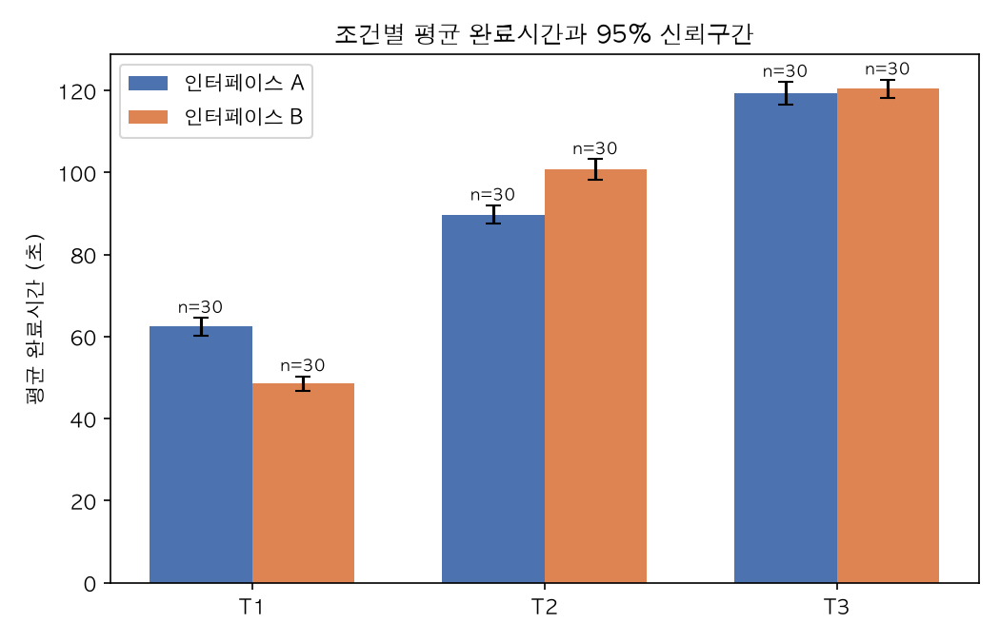
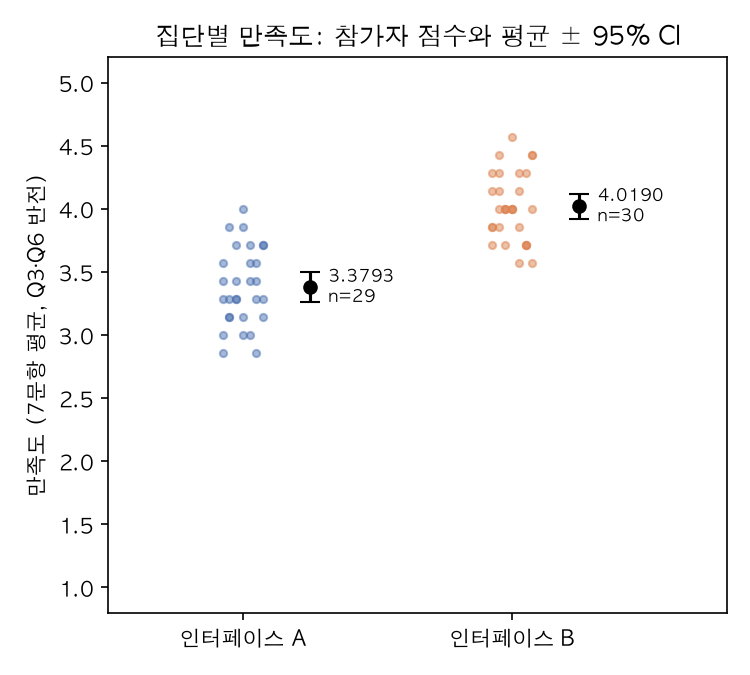

# 인터페이스 A/B 사용자 실험 — 연구 보고서

실행 식별자: `20261009T032342-53daec0dff26` · 수치 출처: `stats.json`, `quality.json` (소수 4자리 반올림 값)

## 초록

60명(A 30명, B 30명)이 인터페이스 A 또는 B로 과제 T1~T3을 각 4회 수행했다. 전체 719개 trial 중 4개를 사전등록 제외 규칙으로 제외하고 715개를 분석했다. Bonferroni 보정 유의수준 α=0.0125에서 Welch t 검정을 수행한 결과, H1는 지지(t=-10.1752, df=56, 임계값 2.5809, d=-2.6272); H2는 불지지(반대 방향 유의)(t=6.6565, df=57, 임계값 2.5794, d=1.7187); H3는 불지지(차이 없음 입증 아님)(t=0.6415, df=55, 임계값 2.5825, d=0.1656); H4는 지지(t=8.4674, df=55, 임계값 2.5825, d=2.2101). 지지된 가설: H1, H4.

## 방법

- 설계: 참가자 간 2집단(인터페이스 A/B) × 과제 3종(T1·T2·T3), 과제당 4회 반복. 집단 배정은 `participants.csv` 의 group.
- 제외 규칙(design.json): 완료시간 ≤ 0초 또는 > 600초, errors 가 수가 아님(수치가 아닌 문자열·null·불리언 포함), 같은 파일 안 중복 trial_id 는 첫 trial 만 유효. 여러 사유가 겹친 trial 은 한 번만 세고 첫 사유(중복→완료시간→errors 순)로 분류했다. 완료시간이 수가 아닌 trial 도 완료시간 규칙으로 제외한다. `completed` 필드는 제외 규칙에 없어 사용하지 않았다.
- 분석 단위: 참가자×과제별 유효 trial 평균. 조건당 최소 n=8.
- 기술통계: n, 평균, 표본 표준편차(n−1), 95% CI = 평균 ± t(p05, n−1)·sd/√n. 임계값은 `t_critical.json` 에서 조회.
- 검정: Welch t = (m_B − m_A)/√(s_A²/n_A + s_B²/n_B), 자유도 Welch–Satterthwaite 내림, 양측 임계값 `t_critical.json` p0125 (α=0.05, Bonferroni 4회 → 0.0125). |t| > 임계값이면 유의.
- 방향: H1~H3 은 'B<A'(B 가 더 빠름)이므로 t<0 이 방향 일치, H4 는 'B>A' 이므로 t>0 이 방향 일치.
- 효과크기: Cohen's d = (m_B − m_A)/s_pooled, s_pooled = √(((n_A−1)s_A² + (n_B−1)s_B²)/(n_A+n_B−2)). 부호는 t 와 같다.
- 판정: 유의하고 방향 일치=지지 / 유의하지만 반대=불지지(반대 방향 유의) / 비유의=불지지(차이 없음 입증 아님) / 어느 집단이든 n<8=검정 불가.
- 만족도: Q3·Q6 을 6−x 로 반전한 뒤 Q1~Q7 평균. 설문 응답이 없는 참가자(또는 7문항 중 결측·범위 밖 값이 있는 참가자)는 H4 에서 제외.
- 사용자 지시와 design.json 사이에 규칙 차이는 발견되지 않았다.

## 결과

### 자료 품질

전체 trial 719개 = 유효 715개 + 제외 4개. 설계상 기대 trial 은 720개이며, 파일에 기록 자체가 없는 결측 trial 은 1개다: P23.json T3 rep 4(제외 건수에 넣지 않음).

| 제외 사유 | 건수 |
|---|---|
| duplicate_trial_id | 0 |
| duration_not_numeric | 0 |
| duration_le_0 | 1 |
| duration_gt_600 | 1 |
| errors_not_numeric | 2 |

| 파일 | trial_id | 과제 | 사유 | duration_s | errors |
|---|---|---|---|---|---|
| P05.json | P05-03 | T1 | duration_le_0 | 0 | 0 |
| P12.json | P12-08 | T2 | duration_gt_600 | 650.0 | 1 |
| P31.json | P31-05 | T2 | errors_not_numeric | 98.1 | "NA" |
| P48.json | P48-11 | T3 | errors_not_numeric | 116.7 | "NA" |

참가자별 유효 trial 수(전체 12개 중; 12개 미만인 참가자만 표기, 나머지는 12개 전부 유효):

| 참가자 | 집단 | 유효/전체 | 과제별 유효 |
|---|---|---|---|
| P05 | A | 11/12 | T1:3, T2:4, T3:4 |
| P12 | A | 11/12 | T1:4, T2:3, T3:4 |
| P23 | A | 11/11 | T1:4, T2:4, T3:3 |
| P31 | B | 11/12 | T1:4, T2:3, T3:4 |
| P48 | B | 11/12 | T1:4, T2:4, T3:3 |

유효 trial 12개 전부인 참가자: 55명. 전체 목록은 `quality.json` 의 per_participant.
- 특정 과제의 유효 trial 이 0개여서 그 조건의 분석 단위에서 빠진 참가자: 없음.
- 설문 응답 없는 참가자: P17 (1명).
- n<8 인 조건: 없음.

### 조건별 기술통계 (완료시간, 초; 분석 단위 = 참가자별 유효 trial 평균)

| 조건 | n | 평균 | sd | t(p05, n−1) | 95% CI 하한 | 95% CI 상한 |
|---|---|---|---|---|---|---|
| A-T1 | 30 | 62.4197 | 5.7092 | 2.0452 | 60.2879 | 64.5515 |
| A-T2 | 30 | 89.7608 | 5.9543 | 2.0452 | 87.5375 | 91.9842 |
| A-T3 | 30 | 119.3519 | 7.3386 | 2.0452 | 116.6117 | 122.0922 |
| B-T1 | 30 | 48.5408 | 4.8186 | 2.0452 | 46.7416 | 50.3401 |
| B-T2 | 30 | 100.7108 | 6.7623 | 2.0452 | 98.1858 | 103.2359 |
| B-T3 | 30 | 120.4542 | 5.8925 | 2.0452 | 118.2539 | 122.6544 |

### 만족도 기술통계 (Q3·Q6 반전 후 7문항 평균)

| 집단 | n | 평균 | sd | t(p05, n−1) | 95% CI 하한 | 95% CI 상한 |
|---|---|---|---|---|---|---|
| A | 29 | 3.3793 | 0.3085 | 2.0484 | 3.262 | 3.4966 |
| B | 30 | 4.019 | 0.2698 | 2.0452 | 3.9183 | 4.1198 |

### 가설 검정 (Welch t, α=0.0125)

| 가설 | 방향 | n_A | m_A | sd_A | n_B | m_B | sd_B | t | df(내림) | 임계값 p0125 | Cohen d | 판정 |
|---|---|---|---|---|---|---|---|---|---|---|---|---|
| H1 | B<A | 30 | 62.4197 | 5.7092 | 30 | 48.5408 | 4.8186 | -10.1752 | 56 | 2.5809 | -2.6272 | 지지 |
| H2 | B<A | 30 | 89.7608 | 5.9543 | 30 | 100.7108 | 6.7623 | 6.6565 | 57 | 2.5794 | 1.7187 | 불지지(반대 방향 유의) |
| H3 | B<A | 30 | 119.3519 | 7.3386 | 30 | 120.4542 | 5.8925 | 0.6415 | 55 | 2.5825 | 0.1656 | 불지지(차이 없음 입증 아님) |
| H4 | B>A | 29 | 3.3793 | 0.3085 | 30 | 4.019 | 0.2698 | 8.4674 | 55 | 2.5825 | 2.2101 | 지지 |

### 그림

- 그림 1 `fig1_duration_by_condition.png`: 조건별 평균 완료시간과 95% 신뢰구간(오차막대).

- 그림 2 `fig2_satisfaction_by_group.png`: 집단별 만족도 — 참가자 점수(점)와 평균 ± 95% CI.

## 가설별 결론

- **H1** (과제 T1 완료시간은 B 가 A 보다 짧다): m_B − m_A = -13.8789, t=-10.1752, df=56, |t| > 임계값 2.5809, d=-2.6272 (방향 일치). 판정: **지지**.
- **H2** (과제 T2 완료시간은 B 가 A 보다 짧다): m_B − m_A = 10.95, t=6.6565, df=57, |t| > 임계값 2.5794, d=1.7187 (방향 반대). 판정: **불지지(반대 방향 유의)**. 가설과 반대 방향의 차이가 보정 유의수준에서 유의했다.
- **H3** (과제 T3 완료시간은 B 가 A 보다 짧다): m_B − m_A = 1.1022, t=0.6415, df=55, |t| ≤ 임계값 2.5825, d=0.1656 (방향 반대). 판정: **불지지(차이 없음 입증 아님)**. 보정 유의수준에서 차이를 검출하지 못했다는 뜻이며, 두 인터페이스가 같다는 증거는 아니다.
- **H4** (만족도는 B 가 A 보다 높다): m_B − m_A = 0.6397, t=8.4674, df=55, |t| > 임계값 2.5825, d=2.2101 (방향 일치). 판정: **지지**.

## 한계

- p 값은 계산하지 않고 t_critical.json 임계값과의 비교로만 유의성을 판정했다(사전등록 규칙).
- 분석 단위를 참가자별 평균으로 접어 반복 측정 내 변동과 학습 효과(rep)는 모형화하지 않았다. 제외로 참가자마다 평균에 들어간 trial 수가 다르다.
- errors·completed·age_band·experience 는 사전등록 가설에 없어 분석하지 않았다. completed=false 인 trial 도 제외 규칙에 해당하지 않으면 포함했다.
- 비유의 결과는 차이가 없다는 것을 입증하지 않는다(동등성 검정 미수행). Bonferroni 보정은 보수적이어서 검정력이 낮아질 수 있다.
- 만족도는 설문 응답자만으로 계산했으며 미응답이 무작위가 아니면 편향될 수 있다.
- 이전 실행의 out 폴더가 주어지지 않은 첫 실행이어서 changelog.md 는 만들지 않았다.
